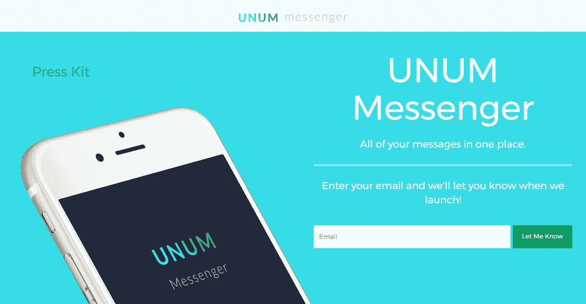
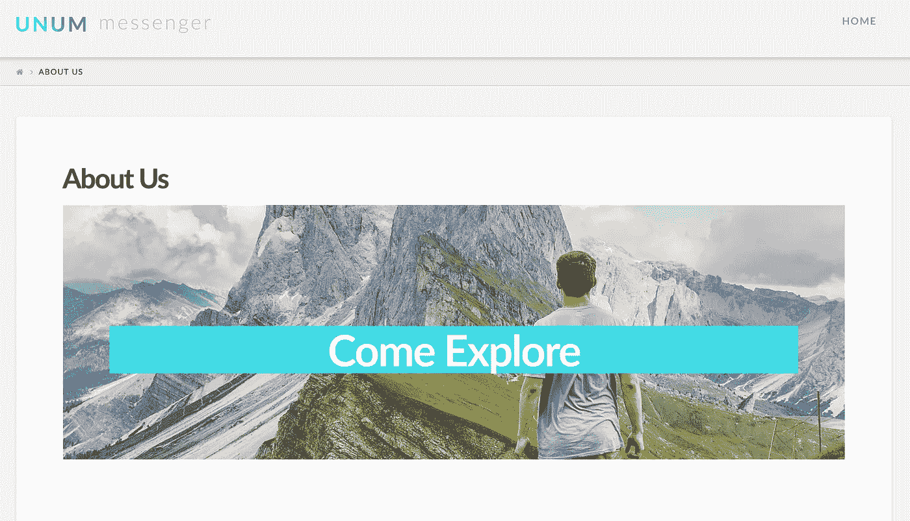
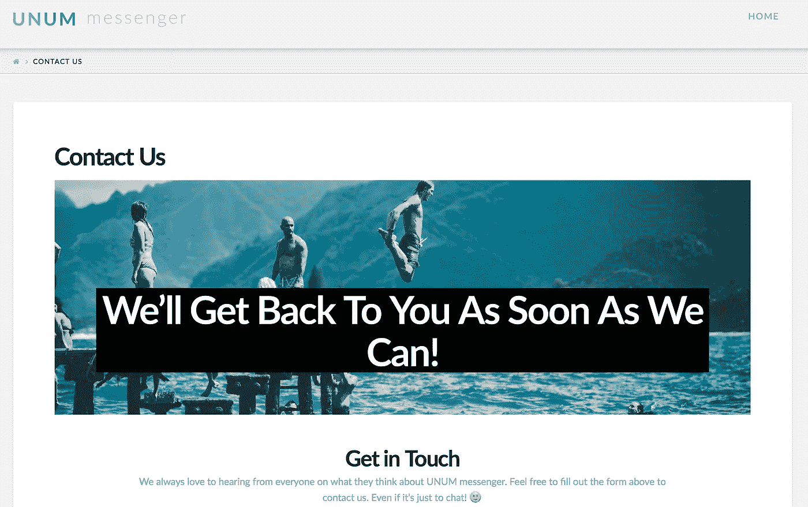
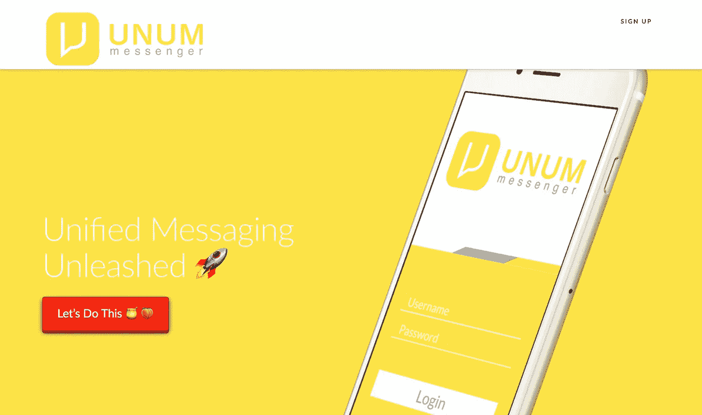
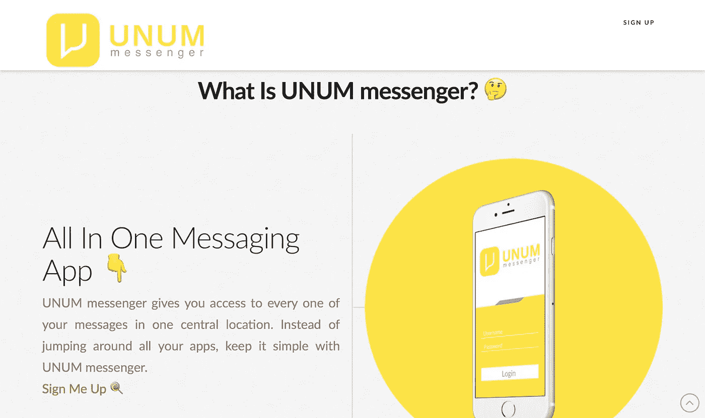
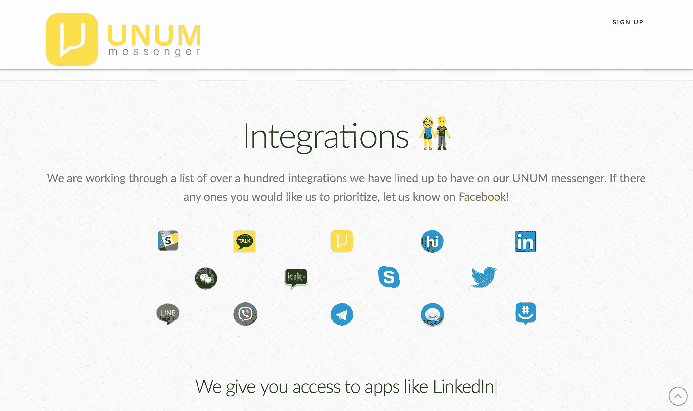
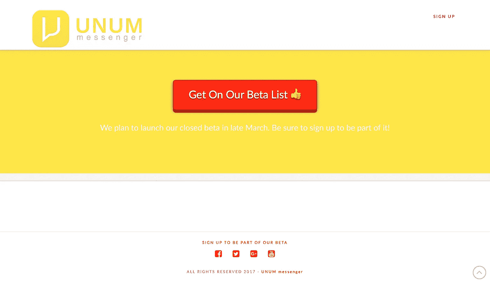

# 建立一个经验有限的网站

> 原文：<https://medium.com/hackernoon/building-a-website-with-limited-experience-d595bd4e3128>

我是如何把这个过程分成三个阶段的。

有很多方法来切这块蛋糕，但我只想分享一点我是如何决定着手建立一个网站的。

每个人都有变数，这取决于他们的现状，他们想去哪里，他们的目标是什么。出于这个原因，我会给你一个快速的背景故事，然后解释我的 3 个阶段。

我是 [UNUM messenger](https://unummessenger.com/) 的联合创始人，你可以在这里了解更多关于[的信息。不管怎样，我们已经进行了四个月的开发，计划在大约 40 天内发布我们的封闭测试版。](https://unummessenger.com/)

根据我们收到的反馈，我们将计划我们的行动路线，并为硬启动设定一个日期。

**现在你已经有了一点背景知识，以下是我目前开发网站仍在经历的 3 个阶段。**

# 第 1 阶段—启动页面

我一有了想法，就想在网上找些东西开始传播。最简单的方法是建立一个启动页面(登陆页面。)

这个概念在这一点上仍然是未经证实的，所以我希望页面尽可能简单。为此，我去了 [Launchrock](https://www.launchrock.com/) 。

我知道我可以从一个超级简约的设计开始，所以我花了几个小时模拟这个页面。

我所做的就是购买一个域名(你可以免费使用 Launchrock 域名)，选择一个模板，创建一个基本的图像概念，添加一些副本，并添加一个注册表单。(我后来添加了新闻资料袋。)

*注意*:我使用的图像是用 [Canva](https://www.canva.com) 创建的。

这是最终的结果—

这可能是有史以来最基本的启动页面之一，但它达到了它的目的。这个登录页面的结果是在一个多月的时间里有超过 500 个预发布注册。

对于我们所在的地方，这个网站做了它需要做的一切。**它让我们能够将时间和精力集中在其他领域，同时仍然保持网站的功能。**

[点击此处查看我们的 Launchrock 网站。](http://unummessenger.launchrock.com/)

# 第二阶段——Wordpress 网站

当我们的 Launchrock 网站运行时，我能够开始开发一个 Wordpress 网站。

由于我们已经有了自己的 Launchrock 网站，所以能够在这个网站上从容不迫是一件令人欣慰的事情。

这个过程相对简单。我从 Envato 购买了 X 主题并上传到我的 Wordpress 网站。

从那时起，这是一个非常简单的过程。我所做的就是创建一个主页，关于我们，和联系我们的页面。与之前的启动页面相比，这三个页面提供了丰富的信息。

这是我们发布 Wordpress 网站时的样子

Home Page

About Us Page

Contact Us Page

我必须做的另一件事是将我们的预发布注册列表从 Launchrock 迁移到 [MailChimp](https://mailchimp.com/) 。这只花了几分钟就完成了。

我们能够滚动这个网站，直到 4 约 3 个月，而我们可以在品牌和最终确定我们的应用程序的概念布局更多的工作。

# 第三阶段——统治世界

当我们启动时，我们希望做好开始快速增长的准备。这意味着将我准备的所有最终更新发布到网站上。

这些更新将包括:
-最终徽标&配色
-应用程序和谷歌 Play 商店的链接(作为明确的行动号召)
- SEO 更新
-移动友好更新
-展示应用程序内显示的功能页面

这里有一些最终网站的截图。

我们最终用一个页面来展示我们所有的信息。这有助于我们保持事情简单，而不是过于复杂。

该网站还更新了最终的品牌。

我们发现极简设计是我们的最佳选择。人们不需要阅读你网站上的一个字就能理解你做了什么。不要把太多的注意力放在文案上，而是像画画一样来建立你的网站。

想知道结果如何，请访问 http://www.unummessenger.com

# 摘要

我在网页开发/设计方面的经验非常有限，到目前为止我所做的一切都是通过任何人都可以学习的模板服务来完成的。

最大的救命稻草是 [LaunchRock](http://launchrock.com/) 、 [X Theme](https://theme.co/x/) (Wordpress 主题)、 [Canva](https://www.canva.com) (设计)、 [Wordpress](http://wordpress.com) (托管)、 [Mailchimp](http://mailchimp.com) (注册)、 [InVision](http://invisionapp.com) (应用原型)、以及 [MockuPhone](http://mockuphone.com/) (手机模型)。

当你在做某事时，你需要走出你的舒适区去实现它。你需要做的事情之一是学习新的东西。

不要试图一次解决一件新的事情，试着把它分成几个阶段。

这将帮助你开始、改进和完善手头的任务。

> 如果你喜欢这篇文章，如果你能分享它，推荐它，或者在评论中告诉我，我会非常感激！
> 
> 此外，如果你有兴趣了解更多我们正在做的事情，请在这里[注册了解详情](http://www.unummessenger.com)！

> [黑客中午](http://bit.ly/Hackernoon)是黑客如何开始他们的下午。我们是 [@AMI](http://bit.ly/atAMIatAMI) 家庭的一员。我们现在[接受投稿](http://bit.ly/hackernoonsubmission)并乐意[讨论广告&赞助](mailto:partners@amipublications.com)机会。
> 
> 如果你喜欢这个故事，我们推荐你阅读我们的[最新科技故事](http://bit.ly/hackernoonlatestt)和[趋势科技故事](https://hackernoon.com/trending)。直到下一次，不要把世界的现实想当然！

