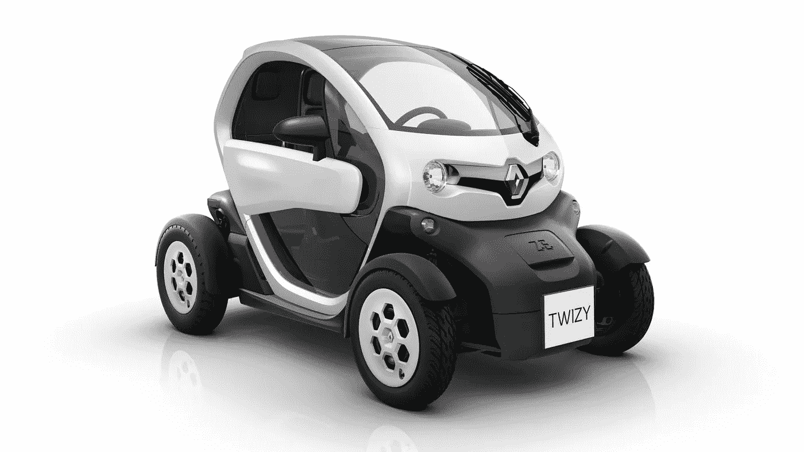
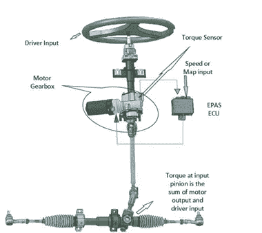
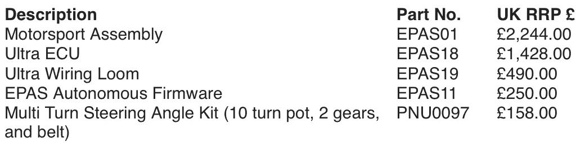
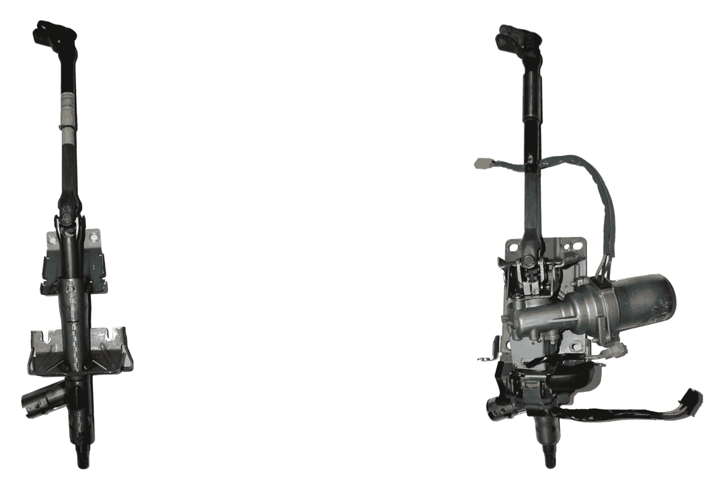
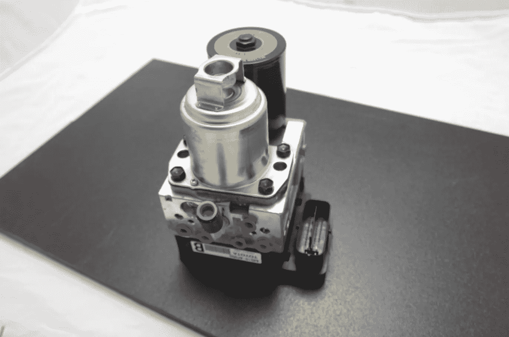

# 构建负担得起的自动驾驶汽车开发平台

> 原文：<https://medium.com/hackernoon/building-an-affordable-self-driving-car-development-platform-b02c6d7828ab>

Renault Twizy — a good candidate for affordable self-driving car development platform

# 介绍

我已经计划写这篇文章很久了。在做了这方面的研究后，我最初的想法是在一个真正的硬件上工作，并在博客上记录进展。但是由于个人原因(我很快就要从斯德哥尔摩搬到柏林了)，我决定以这篇关于当前挑战和建立负担得起的[自动驾驶](https://hackernoon.com/tagged/self-driving)汽车开发[平台](https://hackernoon.com/tagged/platform)的潜在解决方案的帖子开始。

# 目标

这篇文章的目标是探索一种可能性**在 10K**美元下建立一个负担得起的自动驾驶汽车平台。雷达、激光雷达等附加传感器的成本。不包括在最终价格中。努力的范围应该只是线控系统，而不是自动驾驶汽车的实际大脑。

最终结果应该类似于:

基本上，你应该可以用你的 Xbox 操纵杆控制汽车。

# 背景

自动驾驶汽车行业的主要挑战之一(除了技术本身、政策更新、道德问题等其他因素之外。)是进入的**关卡。**如果你是一家建立本地自主送货服务的小型初创公司，或者是一名工程师，正在尝试最新的深度学习方法来检测汽车/交通标志，那么在现实世界中启动并测试你的解决方案是非常困难的(有时甚至是不可能的)。

有些人会说模拟已经足够好了，但是如果你想进行下一步呢？目前，这个行业只为大联盟保留，有强大的资金支持，这在游戏一开始就把小玩家挤出去了。

当前状态的另一个副作用是，这项显然对整个社会有很多好处的技术将首先在世界上少数几个国家开发和部署。这使世界其他地方处于不平等的地位，我们需要从大玩家那里获得技术许可，并经历更深的技术和经济鸿沟。

目前，自动驾驶汽车行业的发展是大型风险投资基金的一个大型科学项目。在这一领域，产品和服务成本的话题通常不会被公开讨论。这就是为什么当我偶然发现优步大学先进技术小组现任负责人拉克尔·乌尔塔森(Raquel Urtasun)的这个有趣视频时，我感到很惊讶，她在视频中讲述了一些关于如何构建更经济的自主系统的想法:

# 那么成本到底是多少呢？

很少有供应商公司( [AutonomousStuff](https://autonomoustuff.com) 等)专门改装具有线控驱动、线控转向和线控制动系统的汽车。他们的服务费用在 **7 万到 10 万美元之间，在**以上，这取决于你是要电动车还是内燃机车。当然，如果你想增加先进的传感器组(即激光雷达单元)，价格就会上涨。这些改装公司大多位于美国。因此，我需要一些替代品，因为我在欧洲工作。我联系了德国的一家公司，这家公司正在为残疾人改造汽车(因为是同样的线控系统)，但最终的价格也差不多。

最近我看到一家英国公司试图闯入这个市场， [StreetDrone](http://www.streetdrone.com) 。但是他们解决方案的价格仍然太高(**超过 6 万美元**)。此外，他们的主要客户似乎是教育市场。

还有一些其他先进的概念，如来自 OSVehicle 的 [EDIT](https://www.osvehicle.com/editselfdrivingcar/) ，但我找不到任何关于发布日期或价格范围的细节。

# 汽车

在经历了许多制造商和模型后，我最终选择了雷诺 Twizy 作为这个项目的理想候选人。你可以很容易地买到一辆几年前的二手汽车，标价为 5000 美元。你可能会考虑看看它的货物版本，因为你会有额外的空间在汽车的后面，为必要的计算能力。

# 引导

改装汽车的转向柱通常是这个过程中最麻烦的部分。在为雷诺 Twizy 做研究时，我想到了两种不同的方法。

## 更昂贵的方法

我在[autonomous stuf](https://autonomoustuff.com)网站上偶然发现了 [DC 电子 EPAS](http://www.dcelectronics.co.uk/Products/EPAS/) 系统。我想他们是在用这个供应商来改造他们自己的电动汽车。

Source: [DC Electronics](http://www.dcelectronics.co.uk/Products/EPAS/)

这个系统的好处是它取代了 Twizy 的整个转向柱。也可以用 CAN 信息控制转向轴，我觉得这很有用。通过阅读它的文档，我发现支持驾驶员应该收回车辆控制权的场景是很简单的。

这种方法的缺点当然是价格。这是我从公司得到的报价:

所以，这并不是最便宜的设置，因为新转向柱的价格很容易超过汽车本身的价格。

## 更便宜的方法

经过一段时间寻找更便宜的方法后，我发现了 HTW·德累斯顿(德累斯顿应用科学大学)的工作。基本上，他们解决这个问题的方法是用雷诺 Clio 2 的转向柱替换雷诺 Twizy 的转向柱。在下面的视频中，他们展示了他们的解决方案，其中转向柱作为一个 RC 单元进行控制。

您可以在这里找到相关的 Power Point 演示文稿[，您也可以在这里阅读他们的](https://www.htw-mechlab.de/wp-content/uploads/2016/06/dies-academicus_2016.pdf)[论文](http://www.htw-mechlab.de/wp-content/uploads/2017/01/Diplomarbeit.pdf)，并了解详情(不过是德语版本)。

Renault Twizy and Renault Clio 2 steering columns side-by-side

您可以在易贝找到售价高达 [**65 美元的二手雷诺 Clio 2 动力转向柱**](http://www.ebay.co.uk/itm/2014-RENAULT-CLIO-MK4-TCe90-POWER-STEERING-COLUMN-488109257R-6700003021A-/322320275248?hash=item4b0bc91730:g:oeAAAOSwB09YIFHj) 。

# 喉咙

将油门暴露为线控系统似乎是这辆车改装中最简单的部分。根据荷兰大学集团网站[自主埃因霍温](http://autoehv.com/twizy.html)(最近被撤下)，向发动机控制模块(ECM)发送原始的 0-5 电压信号将使您能够控制油门。他们还在试验雷诺特威奇作为他们的研究工具。这种方法与福特 Fusion 上使用的[航次基本相同。](https://news.voyage.auto/under-the-hood-of-a-self-driving-car-78e8bbce62a6)

电压本身可以用 Arduino 板控制，或者如果你想要更新奇的东西，你可以选择[基于 can 的电压电位计](http://www.axiomatic.com/distributed-control/1-analog-signal-output/)。

# 刹车

Reanult Twizy 上的制动器基于液压系统。解决这个问题的一个方法是安装一个全新的制动执行器。我已经联系了 [Polysync](https://polysync.io) 的人寻求帮助，因为他们已经为他们的起亚 Soul 设置解决了这个问题。你可以在这里找到更多关于[的信息。但本质上，他们使用了丰田普锐斯的电子控制制动系统(在易贝大约 100 美元](https://github.com/PolySync/oscc/wiki/Hardware-Brake))。根据 Polysync 的说法，这种方法非常通用，应该适用于大多数带有液压制动系统的汽车。

Source: [Polysync Wiki](https://github.com/PolySync/oscc/wiki/Hardware-Brake)

# 结论

我们已经探索了改装雷诺 Twizy 用于线控方案的不同方案。这远不是一个完整的指南，但它让你看到了为有兴趣在自动驾驶汽车领域推出自己的产品/服务的开发者和初创公司建立一个负担得起的平台所需的工作。

下一步将是决定汽车的大脑。对于一些基本场景 [NVIDIA Jetson TX2](http://www.nvidia.com/object/embedded-systems-dev-kits-modules.html) 将是一个好的开始，因为它具有低功耗规格。你可以考虑把 ROS 放在上面，把方向盘、油门和刹车作为 ROS 节点暴露出来。如果你对包括传感器在内的更高级的场景感兴趣，你应该检查其他选项，如 [Apollo](http://apollo.auto) 或 [Autoware](https://github.com/CPFL/Autoware) ，它们是开源的，免费供你实验。

如果有人有兴趣在一个真正的 Twizy 上做这个，请联系我！你可以很容易地在推特上找到我。