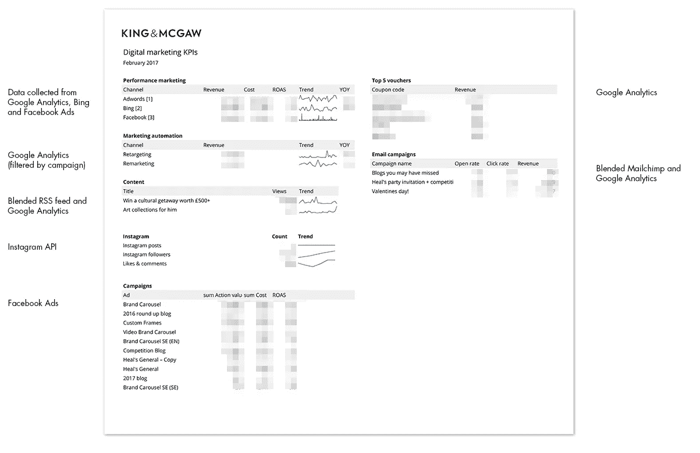
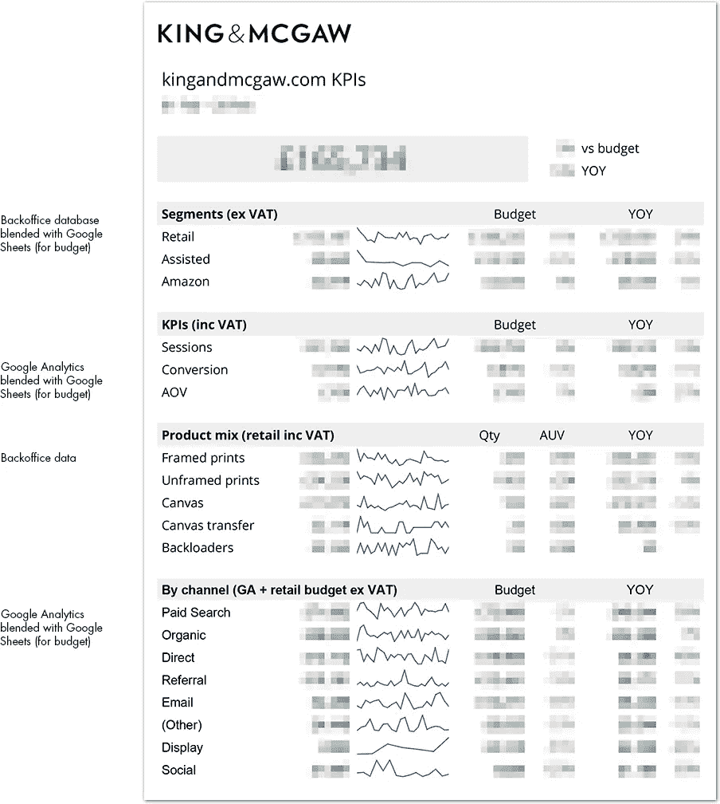
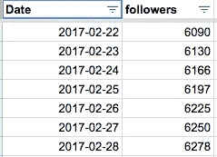
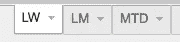
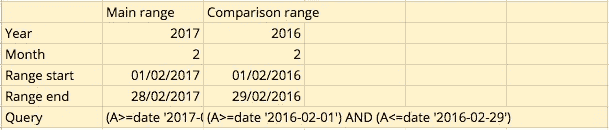
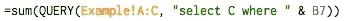
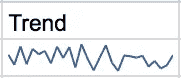
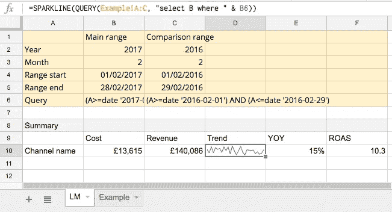

# 使用 Google Sheets 构建自动化仪表板(带示例)

> 原文：<https://medium.com/hackernoon/building-an-automated-dashboard-with-google-sheets-with-example-a9b8eb963d0a>

## 廉价的 KPI 报告

今年 1 月，我集中了大量精力重新定义 kingandmcgaw.com 的 KPI，并构建仪表板，使数据对负责交付数据的团队透明。

我决定在 Google Sheets 中构建这些仪表板，使用 Supermetrics 插件来自动导入来自各种来源的数据(Google Analytics、Bing、Mailchimp、脸书、Instagram 和我们的后台)。尽管有许多其他可用的强大工具，但我们已经广泛使用了 Sheets，所以熟悉程度是一个重要因素。

我们将涵盖的内容

*   自动化数据收集
*   从汇总表中查询数据
*   汇总、制图和分发

## 但是首先，举几个例子

下面是一个展示营销活动 KPI 的示例:

这是另一个，显示交易关键绩效指标

不完全是赏心悦目，但他们很好地服务于他们的目的。那么它们是如何工作的呢？让我向你展示我的秘密武器——超级矩阵和 Google Sheets 查询功能。

## 使用 Supermetrics 自动收集数据

我们使用[超级矩阵](https://supermetrics.com/)自动从各种来源收集数据。这其中有许多微妙之处(它可能有自己的帖子)，但关键是为每个数据源创建一个表，日期在第一列，这样我们就可以在不同的时间段查询它。下面是我们的 Instagram 粉丝数(我在之前的文章中写了如何自动化这个[)。](/@nickboyce/how-to-track-your-instagram-followers-over-time-with-google-sheets-scripts-bd9f5acf5ede#.xfigb76dm)

Instagram followers over time

使用这种技术，我们最终会在我们的文档中得到许多特定于我们所跟踪的每件事情的工作表。这是我们在活动仪表板上的一些快照。

我们将 Supermetrics 设置为每晚导入所有数据，这意味着它总是与每天的活动保持同步。对于半手工版本，也可以从其他来源复制/粘贴这些值。

## 从汇总表中查询数据

一旦我们有了原始数据，我们需要建立汇总表。我发现上周(LW)、上月(LM)和本月至今(MTD)非常符合我们的需求。

Summary sheets per time period

每张工作表都有一个隐藏部分，我在其中隐藏了用来建立日期范围的公式。这里有一个例子，它使用各种公式来确定上个月的日期，以及上一年的相同时期。

Hidden rows to configure date ranges and query

注意到“查询”部分了吗？我们可以将它传递到 Google Sheets 的[查询](https://support.google.com/docs/answer/3093343?hl=en)函数中，从我们的数据表中提取相关数据。因为我们查询的数据总是在列 A 中有一个日期，所以我们可以通过引用它所在的单元格，自由地将相同的查询传递到我们的汇总表上的所有内容中。

如果您想查看相关时间段的趋势(有助于了解性能是稳定还是波动)，只需将 SUM 更改为迷你图，瞧！

Trendy sparklines

## 分配

这些报告以 pdf 格式每周和每月通过电子邮件发送。我们使用 Supermetrics 来完成这项工作，但你也可以使用 Google Apps 脚本轻松完成，或者下载并以 pdf 格式发送。在相关的团队会议上，我们也会在屏幕上显示这些内容。

## 用一个例子把所有的东西结合起来

我整理了一个例子，你可以查看和复制。数据是随机的，日期范围也不是动态的，但希望这足以证明一些你需要自己制作的技术。

[查看示例仪表板](https://docs.google.com/spreadsheets/d/1yIZB4mjMF2GloYtGQWklR_67YdvxqN4OVeft-JStfnY)。

## 概括起来

*   使用日期作为第一列，为每个数据源收集数据。如果可能的话，自动执行。
*   为您感兴趣的每个时间段配置一个摘要表

**我希望这篇文章对你有用。如果您喜欢它，请推荐，如果您有任何问题，请添加评论！**

> [黑客中午](http://bit.ly/Hackernoon)是黑客如何开始他们的下午。我们是 [@AMI](http://bit.ly/atAMIatAMI) 家庭的一员。我们现在[接受投稿](http://bit.ly/hackernoonsubmission)并乐意[讨论广告&赞助](mailto:partners@amipublications.com)机会。
> 
> 如果你喜欢这个故事，我们推荐你阅读我们的[最新科技故事](http://bit.ly/hackernoonlatestt)和[趋势科技故事](https://hackernoon.com/trending)。直到下一次，不要把世界的现实想当然！

