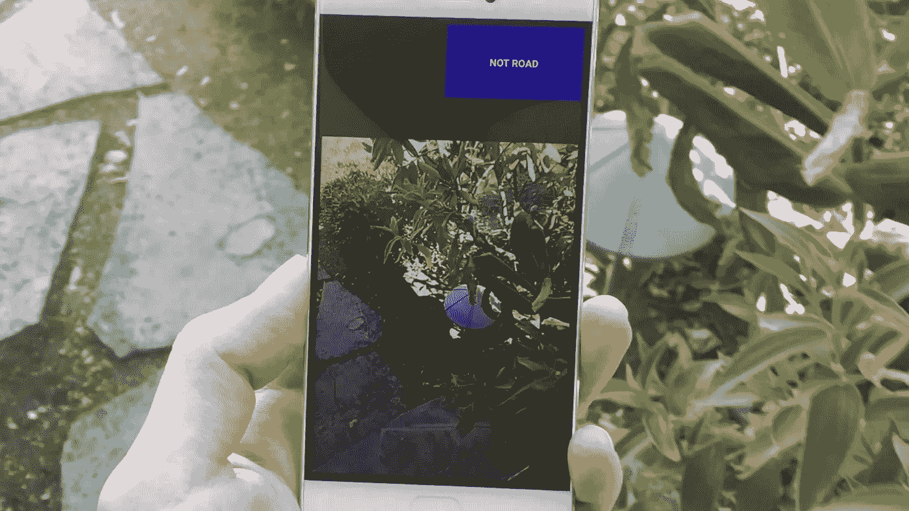
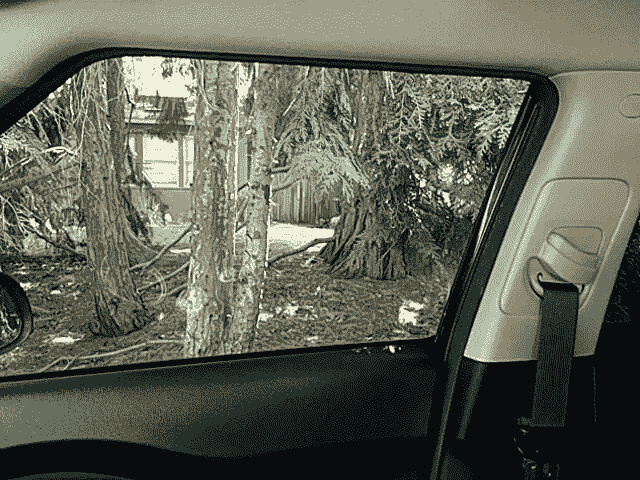
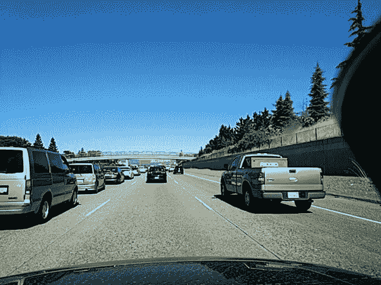
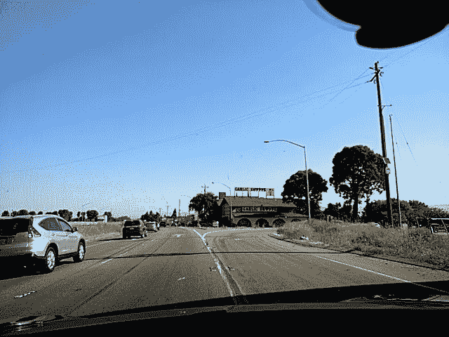
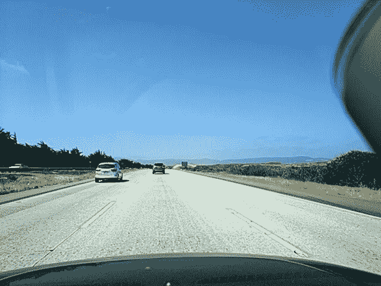
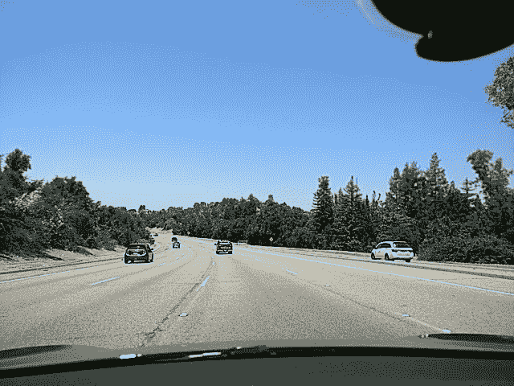
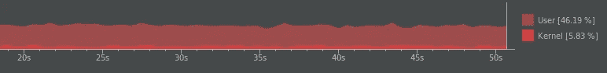
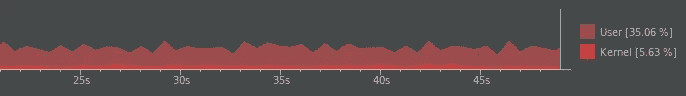
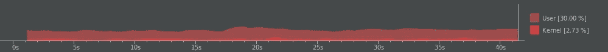
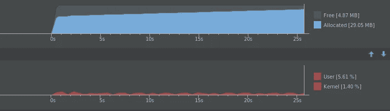

# 用 TensorFlow 中的 MobileNets 在 Android 上构建一个超快的图像分类器

> 原文：<https://medium.com/hackernoon/building-an-insanely-fast-image-classifier-on-android-with-mobilenets-in-tensorflow-dc3e0c4410d4>

## 两部分系列的第二部分:这就像热狗不是热狗，而是为道路

在第 1 部分中，[在 TensorFlow](https://hackernoon.com/creating-insanely-fast-image-classifiers-with-mobilenet-in-tensorflow-f030ce0a2991) 中使用 MobileNet 创建速度惊人的图像分类器，我们介绍了如何在新的数据集上重新训练一个 [MobileNet](https://hackernoon.com/tagged/mobilenet) 。具体来说，我们训练了一个分类器，在笔记本电脑上以每秒超过 400 帧的速度检测道路或非道路。

移动互联网是为移动设备制造的。所以，让我们把我们的 road not road 模型转移到一个 [Android](https://hackernoon.com/tagged/android) 应用程序上，这样我们就可以看到它的实际应用了。



# 目标和计划

让我们设定一些限制，这样我们就有具体的目标了。我们将尝试:

*   在非常少量专门构建的数据上重新训练 MobileNet
*   在保留测试集上达到 95%的分类准确率
*   在运行推理时，使用不到 5%的 300 美元设备的 CPU

为此，我们将遵循以下步骤:

1.  生成新的训练数据集
2.  训练几个 MobileNet 配置，以找到将达到我们的精度目标的最小网络
3.  通过在 Android 上运行 Inception V3 获得性能指标评测
4.  更新 TensorFlow Android 示例应用程序以使用我们的 MobileNet 模型
5.  在野外试试吧
6.  将其调整到低于 5%的 CPU 使用率

# 构建数据集

在之前的帖子中，我们将道路/非道路*统称为*，所以我们从几个来源提取了图像。现在我们要更深入地研究这个问题。如果你还记得，这个项目的目的是为了用户隐私:在[海岸线](http://coast.ai)，我们正在为使用摄像头的移动设备建立驾驶安全功能。因此，当有人打开应用程序时，我们希望验证我们看到的是一条道路。如果不是，我们将禁用记录。

因此，为了建立我们的训练集，我将在录制视频的同时做一些日常的事情:在我的房子周围，在我的车外，在我的车内摆弄收音机，抚摸猫，等等。这将是我们的“非路”训练数据。



Some “not road” examples.

对于我们的“道路”数据，我将从海岸线驾驶数据集中随机采样，这些数据来自面向汽车前方的摄像头。



“Road” examples. Notice each image has a mount in view. We need to be careful that the network doesn’t simply learn to recognize that object. We’ll take care of that through data augmentation.

每组有 3000 个样本，我们就可以开始训练了。

# 在我们的自定义数据集上训练 MobileNet

下一步是看看我们可以从不同的 MobileNet 配置中获得什么样的精度。我们先来训练最宽的一个:MoileNet 1.0 @ 128。因为我们将把它放在移动设备上，我们将使用量化权重，这将进一步减少模型内存占用。

*关于如何在自己的数据上重新训练 MobileNet 的详细信息，请务必查看我的* [*之前的帖子*](https://hackernoon.com/creating-insanely-fast-image-classifiers-with-mobilenet-in-tensorflow-f030ce0a2991) *。*

从根 TensorFlow 文件夹，我们将运行:

```
python tensorflow/examples/image_retraining/retrain.py \
  --image_dir ~/ml/blogs/road-not-road/data/ \
  --learning_rate=0.0005 \
  --testing_percentage=15 \
  --validation_percentage=15 \
  --train_batch_size=32 \
  --validation_batch_size=-1 \
  --flip_left_right True \
  --random_scale=30 \
  --random_brightness=30 \
  --eval_step_interval=100 \
  --how_many_training_steps=1000 \
  --architecture mobilenet_1.0_128_quantized
```

经过 1000 个训练步骤后，我们达到了 99.7%的准确率。哇！显然手机用户非常擅长道路分类。

这里有一些它误分类的图片:


**Left**: A “not road” image classified as road. I’d say that’s an acceptable failure. It’s clearly a road, just not the type of road we’re looking for. **Right**: A “road” image classified as “not road”. I think this is because there were no bridges in the training set. Could be fixed with more data.

现在我们做同样的事情，但是用最小的 MobileNet: 0.25 @ 128，量化。经过 1000 步的训练，我们达到了 92.6%。不符合我们的精度目标。

宽一点的怎么样，比如 0.5？

95.0%!最终的模型只有 1.6 MB。看起来我们的钱打光了，如果只是勉强。(*应该注意的是，这整个模型是在以 10fps 捕获的仅仅 10 分钟的视频上训练的。通过堆积数据，有很大的改进空间。)*

让我们快速尝试一下，以确保它按预期工作:

```
python tensorflow/examples/label_image/label_image.py \ 
  --graph=/tmp/output_graph.pb \
  --labels=/tmp/output_labels.txt \
  --image=/home/harvitronix/ml/blogs/road-not-road/test-image.jpg \
  --input_layer=input \
  --output_layer=final_result \
  --input_mean=128 \
  --input_std=128 \
  --input_width=128 \
  --input_height=128
```



Road: 0.99023 confidence. Looks good!

由于我们的标题中有“快得惊人”的字眼，我们在笔记本电脑上运行 NVIDIA GeForce 960m GPU 能有多快？它可以在 3.36 秒内浏览 1000 张图片。也就是每秒 297.6 帧！

# 在 Android 应用中使用我们的 MobileNet 模型

现在我们有了一个足够小、足够快、足够准确的模型，让我们将它加载到 Android 应用程序中，以便我们可以在现实世界中测试它。

*还没有训练好的模特？* [*下载我根据上述数据训练的模型*](https://s3-us-west-1.amazonaws.com/coastline-automation/demo/mobilenet-road-not-road.tar.gz) *。它包含了。pb 和标签文件。提取并遵循以下说明。*

坚持我们的主题，使用 TensorFlow 提供的工具(顺便说一句，这有多棒？)，我们将利用 Android 示例项目来快速运行这个东西。

## 获取和构建项目

如果您还没有，请继续克隆 TensorFlow repo:

```
git clone [https://github.com/tensorflow/tensorflow.git](https://github.com/tensorflow/tensorflow.git) --depth 1
```

你会在`tesnorflow/examples/android`文件夹中找到一个现成的 Android 项目来完成这类任务。在 Android Studio 中打开文件夹，构建它，在手机上加载 APK，你就有了一个图像分类器，它使用在 ImageNet 上训练的 Inception V3 模型，准备区分你的猫和鸭嘴兽。

*如果你在构建 app 时遇到了问题，一定要看看* [*TensorFlow Android 自述*](https://github.com/tensorflow/tensorflow/tree/master/tensorflow/examples/android) *中的说明。我最大的挑战是 NDK 版本。降级到*[*r12b*](https://developer.android.com/ndk/downloads/older_releases.html)*解决了我的问题。*

## 初始速度基准

因为我们已经在应用程序上运行了 Inception，所以让我们进行一些测量，以便我们可以将其与我们的 MobileNet 进行比较。

示例项目附带的初始模型是 53.9 mb。相比之下，我们的 MobileNet 只有 1.6 mb！它的运行速度约为 240 毫秒/推理，即每秒 4 帧(fps)。它使用了大约 40%的 CPU。



Inception V3 running at 4fps.

让我们以每秒 1 帧的速度尝试一下:



Inception V3 running at 1fps.

仍然上涨了 35%以上。希望我们的 MobileNet 可以做得更好，否则我们将无法接近我们的最高 5%使用率的目标。

## 切换到 MobileNet

现在让我们对 Android 项目做一些小的修改，以使用我们定制的 MobileNet 模型。

首先，将您的模型和标签复制到项目的`assets`文件夹中。我的分别在`/tmp/output_graph.pb`和`/tmp/output_labels.txt`。

接下来，打开 ClassifierActivity，它位于:

```
tensorflow/examples/android/src/org/tensorflow/demo/ClassifierActivity.java
```

您需要更新文件顶部的常量来定义新模型的设置。第一次打开时，它看起来是这样的:

```
private static final int *INPUT_SIZE* = 224;
private static final int *IMAGE_MEAN* = 117;
private static final float *IMAGE_STD* = 1;
private static final String *INPUT_NAME* = "input";
private static final String *OUTPUT_NAME* = "output";

private static final String *MODEL_FILE* = "file:///android_asset/tensorflow_inception_graph.pb";
private static final String *LABEL_FILE* =
    "file:///android_asset/imagenet_comp_graph_label_strings.txt";
```

将其更改为:

```
private static final int *INPUT_SIZE* = 128;
private static final int *IMAGE_MEAN* = 128;
private static final float *IMAGE_STD* = 128;
private static final String *INPUT_NAME* = "input";
private static final String *OUTPUT_NAME* = "final_result";

private static final String *MODEL_FILE* = "file:///android_asset/output_graph.pb";
private static final String *LABEL_FILE* =
    "file:///android_asset/output_labels.txt";
```

点击 run 构建项目并将 APK 加载到您的设备上，您就拥有了自己的道路/非道路分类器！

# 结果呢

这里有一个我的道路/非道路应用程序的视频。我对 UI 做了一些调整，以便更容易看到正在发生的事情:

那么它有多快呢，CPU 使用率呢？

在我的小米米 5 上，这个东西会飞。它在 55ms 左右做推理，也就是每秒 18 帧！就一个 [$300 的小米 Mi5s](http://www.gearbest.com/cell-phones/pp_602057.html?wid=81) ！


不过，这是相当 CPU 密集型的，全速运行时使用 25–30%。有道理，因为我们正以最快的速度运行它。



MobileNEt CPU monitor, running at 18fps.

我们希望降低到 5%以下，我们将通过降低它运行的频率来做到这一点，因为我们的用例不需要连续运行推理来实现我们上面讨论的隐私目标。将它改为每 18 帧分类一次(大约每秒一次)会将平均使用率降低到大约 5.5%！



MobileNet running at 1fps.

所以我们的 MobileNet 模型只有 Inception 的 1/30 大。每帧运行速度提高了 3 倍以上。而且它使用的 CPU 资源要少得多。

可以肯定地说，我和 MobileNets 将会像这样:


> *喜欢这篇文章吗？通过点击小❤.帮助其他人找到它感谢阅读！*