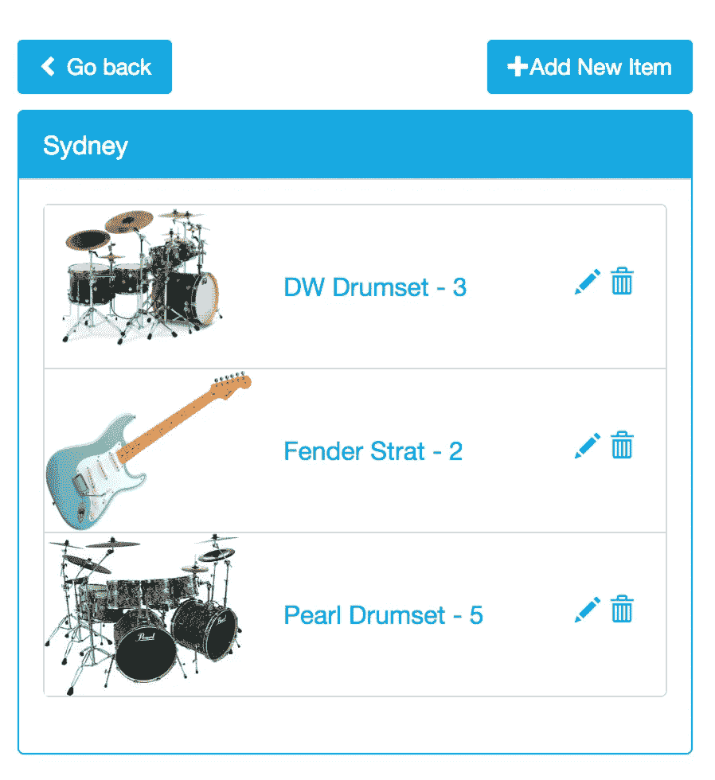

# 使用 Vue.js 和 Laravel 构建库存管理应用程序

> 原文：<https://medium.com/hackernoon/building-an-inventory-management-app-using-vue-js-and-laravel-1abc492d95d7>



这篇文章最初出现在宇宙 JS 博客上。

在本教程中，我们将使用 Laravel 和 Vue.js 创建一个简单的库存管理应用程序作为我们的前端。本教程假设您对面向对象的 php 和 javascript 有基本的了解，尽管我们将会学习 Laravel 和 Vue.js 的基础知识，但建议您对它们的概念有基本的了解。现在我们已经清楚了，启动你的 php 服务器，让我们来构建一些东西。

# TL；速度三角形定位法(dead reckoning)

[查看演示](http://inventory-app.cosmicapp.co/)
[查看 GitHub 上的代码](https://github.com/cosmicjs/inventory-app)

# 开始使用:

由于这是一个 laravel 应用程序，您需要创建一个新的 laravel 项目，确保您的服务器满足 laravel 的要求，如这里所述 Laravel Servrer 要求，并确保您的服务器上安装了 Composer。一旦你安装了 composer，打开你的命令行和 cd 进入你的服务器根目录，然后简单的运行

```
composer create-project --prefer-dist laravel/laravel inventory
```

一旦成功运行，这将在目录清单中设置一个新的 laravel 项目。

设置好新项目后，您将运行 npm install 或 NPM install——如果您是在 windows 上开发，没有 bin 链接。这将下载并设置我们所有的 javascript 依赖项。为了能够查看我们的空 laravel 项目，只需从我们的项目目录运行 php artisan serve，这将从我们的项目根目录启动一个 php 服务器，然后您可以在浏览器 url 中键入 [http://127.0.0.1:8000](http://127.0.0.1:8000) ，您应该会看到默认的 laravel 屏幕。

# 设置 Cosmic JS php 库

我们将使用 Cosmic JS php 库中的一些函数，将 repo 下载到一个单独的文件夹中，我们将不得不编辑它一点，以便与 laravel 一起工作。在 inventory/app/ folder 中，创建一个/Vendor/cosmicjs 文件夹，并将 cosmicjs-php 库的所有内容复制到其中，例如，cosmicjs.php 的路径变成 app/Vendor/cosmicjs/cosmicjs . PHP。然后将 app/Vendor/cosmicjs/curl 类重命名为 app/Vendor/cosmicjs/cosmiccurl，并更改代码的顶部:

```
class Curl {
  ...
  }
```

到

```
namespace App\Vendor\cosmicjs;class CosmicCurl {
  ....
}
```

我们所做的是向 cosmiccurl 文件添加一个名称空间，这样我们就可以导入到 laravel 中，并更改类名以匹配文件名。之后，替换 cosmicjs.php 的这一部分

```
include("curl.php");
$curl = new Curl;
class CosmicJS {
  function __construct(){
    global $curl;
    global $config;
    $this->curl = $curl;
    $this->config = $config;
    $this->config->bucket_slug = $config->bucket_slug;
    $this->config->object_slug = $config->object_slug;
    $this->config->read_key = $config->read_key;
    $this->config->write_key = $config->write_key;
    $this->config->url = "https://api.cosmicjs.com/v1/" . $this->config->bucket_slug;
    $this->config->objects_url = $this->config->url . "/objects?read_key=" . $this->config->read_key;
    $this->config->object_url = $this->config->url . "/object/" . $this->config->object_slug . "?read_key=" . $this->config->read_key;
    $this->config->media_url = $this->config->url . "/media?read_key=" . $this->config->read_key;
    $this->config->add_object_url = $this->config->url . "/add-object?write_key=" . $this->config->write_key;
    $this->config->edit_object_url = $this->config->url . "/edit-object?write_key=" . $this->config->write_key;
    $this->config->delete_object_url = $this->config->url . "/delete-object?write_key=" . $this->config->write_key;
  }
```

随着

```
namespace App\Vendor\cosmicjs;use App\Vendor\cosmicjs\CosmicCurl;class CosmicJS { private $config;
    private $curl;
    function __construct($bucket_slug, $type_slug,$object_slug = "", $read_key = "", $write_key = "") {
        $this->curl = new CosmicCurl();
        $this->config = new \stdClass();
        //$this->config = $config;
        $this->config->bucket_slug = $bucket_slug;
        $this->config->object_slug = $object_slug;
        $this->config->type_slug = $type_slug;
        $this->config->read_key = $read_key;
        $this->config->write_key = $write_key;
        $this->config->url = "https://api.cosmicjs.com/v1/" . $this->config->bucket_slug;
        $this->config->objects_url = $this->config->url . "/objects?read_key=" . $this->config->read_key;
        $this->config->object_type_url = $this->config->url . "/object-type/" . $this->config->type_slug . "?read_key=" . $this->config->read_key;
        $this->config->object_url = $this->config->url . "/object/" . $this->config->object_slug . "?read_key=" . $this->config->read_key;
        $this->config->media_url = $this->config->url . "/media?read_key=" . $this->config->read_key;
        $this->config->add_object_url = $this->config->url . "/add-object?write_key=" . $this->config->write_key;
        $this->config->edit_object_url = $this->config->url . "/edit-object?write_key=" . $this->config->write_key;
        $this->config->delete_object_url = $this->config->url . "/delete-object?write_key=" . $this->config->write_key;
    }
```

这一点变化是，它使用其名称空间导入 cosmiccurl，并使我们能够在 laravel 内快速创建 cosmicjs 对象的多个实例，只需使用构造函数参数进行初始化，而不必设置一些配置变量，这些变量在用于大型应用程序时会变得混乱。最后将下面的函数添加到 cosmicjs.php 的文件中。

```
public function getByObjectSlug($key,$slug)
    {   
        $this->config->object_by_meta_object = $this->config->url ."/object-type/" . $this->config->type_slug ."/search?metafield_key=" . $key ."&metafield_object_slug=" .$slug;
        $data = json_decode($this->curl->get($this->config->object_by_meta_object));
        return $data;
    }
```

# 构建我们的应用

现在，我们已经在 app/Vendor 文件夹中设置了 cosmicjs 库，是时候实际构建一些东西了。因为所有请求都将由 app/Http/Controller/index Controller . PHP 文件处理，所以打开它，复制并粘贴这段代码。

```
<?phpnamespace App\Http\Controllers;use Illuminate\Http\Request;
use App\Vendor\cosmicjs\CosmicJS;
use GuzzleHttp\Client;class IndexController extends Controller { private $locations_cosmic;
    private $items_cosmic;
    private $bucket_slug = '';
    private $read_key = '';
    private $write_key = ''; public function __construct() {
        //initialize cosmicjs php instance for fetching all locations
        $this->bucket_slug = config('cosmic.slug');
        $this->read_key = config('cosmic.read');
        $this->write_key = config('cosmic.write');
        $this->locations_cosmic = new CosmicJS($this->bucket_slug, 'locations');
        $this->items_cosmic = new CosmicJS($this->bucket_slug, 'items', $this->read_key, $this->write_key);
    } public function index($location = null) { //get objects with cosmic-js php
        $locations = $this->locations_cosmic->getObjectsType(); //set locations and bucket_slug variable to be passed to view
        if (property_exists($locations, 'objects')) {
            $data['locations'] = $locations->objects;
        }
        else
        {
            $data['locations'] = [];
        } $data['bucket_slug'] = $this->bucket_slug; //if location slug was passed in url, pass it to view as well
        if ($location) {
            $data['location_slug'] = $location;
        } else {
            $data['location_slug'] = '';
        } //load view
        return view('index', $data);
    } //fetch items for location based on slug
    public function itemsByLocation($slug) {
        //fetch items using the cosmicjs library's custom function
        $items = $this->items_cosmic->getByObjectSlug('location', $slug); //if the returned value has "object" property, pass it 
        if (property_exists($items, 'objects')) {
            //returning arrays in laravel automatically converts it to json string
            return $items->objects;
        } else {
            return 0;
        }
    } public function newLocation(Request $request) {
        //get passed input
        $title = $request->input('title');
        $address = $request->input('address');
        $picture = $request->input('image'); //set data array
        $data['title'] = $title;
        $data['type_slug'] = "locations";
        $data['bucket_slug'] = $this->bucket_slug;
        $metafields = array();
        $address_data['key'] = "address";
        $address_data['type'] = 'textarea';
        $address_data['value'] = $address;
        if ($picture != '') {
            $picture_data['key'] = "picture";
            $picture_data['type'] = 'file';
            $picture_data['value'] = $picture;
            array_push($metafields, $picture_data);
        }
        array_push($metafields, $address_data);
        $data['metafields'] = $metafields; //create a new guzzle client
        $client = new Client();
        //create guzzle request with data array passed as json value
        $result = $client->post('https://api.cosmicjs.com/v1/' . $this->bucket_slug . '/add-object', [
            'json' => $data,
            'headers' => [
                'Content-type' => 'application/json',
            ]
        ]);
        //flash message
        $request->session()->flash('status', 'The location"' . $title . '" was successfully locations');
        //return result body
        return $result->getBody();
    } //create a new item
    public function newItem(Request $request) {
        //get data
        $name = $request->input('name');
        $count = $request->input('count');
        $location_id = $request->input('location');
        $picture = $request->input('image'); //create data array to be passed
        $data['title'] = $name;
        $data['type_slug'] = "items";
        $data['bucket_slug'] = $this->bucket_slug;
        $count_metafield['key'] = "count";
        $count_metafield['value'] = $count;
        $count_metafield['type'] = "text";
        $location_meta['key'] = "location";
        $location_meta['object_type'] = "locations";
        $location_meta['type'] = "object";
        $location_meta['value'] = $location_id;
        $metafields = array(); //set picture if passed into request
        if ($picture != '') {
            $picture_data['key'] = "picture";
            $picture_data['type'] = 'file';
            $picture_data['value'] = $picture;
            array_push($metafields, $picture_data);
        }
        array_push($metafields, $count_metafield);
        array_push($metafields, $location_meta);
        $data['metafields'] = $metafields; $client = new Client();
        $result = $client->post('https://api.cosmicjs.com/v1/' . $this->bucket_slug . '/add-object', [
            'json' => $data,
            'headers' => [
                'Content-type' => 'application/json',
            ]
        ]);
        //flash message
        $request->session()->flash('status', 'The Item "' . $name . '" was successfully created');
        //return result body
        return $result->getBody();
    } public function editItem(Request $request) {
        $name = $request->input('name');
        $count = $request->input('count');
        $slug = $request->input('slug');
        $location_id = $request->input('location_id'); $data['title'] = $name;
        $data['slug'] = $slug;
        $count_meta['key'] = "count";
        $count_meta['value'] = $count;
        $count_meta['type'] = "text";
        $location_meta['key'] = "location";
        $location_meta['object_type'] = "locations";
        $location_meta['type'] = "object";
        $location_meta['value'] = $location_id;
        $metafields = array();
        //set picture if passed into request
        if ($request->input('image')) {
            $picture_data['key'] = "picture";
            $picture_data['type'] = 'file';
            $picture_data['value'] = $request->input('image');
            array_push($metafields, $picture_data);
        }
        array_push($metafields, $count_meta);
        array_push($metafields, $location_meta);
        $data['metafields'] = $metafields; $client = new Client();
        $result = $client->put('https://api.cosmicjs.com/v1/' . $this->bucket_slug . '/edit-object', [
            'json' => $data,
            'headers' => [
                'Content-type' => 'application/json',
            ]
        ]);
        //flash message
        $request->session()->flash('status', 'The Item was successfully edited!');
        //return result body
        return $result->getBody();
    } public function deleteItem(Request $request, $slug) {
        //create new client and delete item
        $client = new Client();
        $result = $client->delete('https://api.cosmicjs.com/v1/' . $this->bucket_slug . '/' . $slug, [
            'headers' => [
                'Content-type' => 'application/json',
            ]
        ]); //flash message
        $request->session()->flash('status', 'The Item was successfully deleted!');
        return $result;
    }}
```

上面的代码是不言自明的，包括注释

# 需要注意的事项:

1.  我们创建一个新的 Cosmic JS 实例来检索位置
2.  我们正在设置我们的 vuejs 前端将与之交互的所有功能
3.  $client = new CLient()创建一个新的 guzzle 实例，我们用它来调用 cosmic api

接下来，我们将在 routes/web.php 文件中创建我们的路由。打开文件，将这段代码复制并粘贴到其中。

```
<?php
Route::get('/{location?}', 'IndexController@index');
Route::get('items/{slug}', 'IndexController@itemsByLocation');
Route::post('locations/new','IndexController@newLocation');
Route::post('items/new','IndexController@newItem');
Route::post('items/edit','IndexController@editItem');
```

# 我们在做什么

我们正在将所有的 IndexCOntroller 函数注册到 routes 中，这样前端就可以访问它们。

# 构建前端

记住我们 IndexController 返回视图中的这段代码(' index '，$ data)；？现在是时候创建将要加载的视图了。打开/resources/views 文件夹，打开 master.blade.php 的，然后复制并粘贴到其中。

```
<html lang="{{ config('app.locale') }}">
    <head>
        <meta charset="utf-8">
        <meta http-equiv="X-UA-Compatible" content="IE=edge">
        <meta name="viewport" content="width=device-width, initial-scale=1">
        <!-- Set Csrf token on all pages -->
        <meta name="csrf-token" content="{{ csrf_token() }}">
        <!-- Load Bootstrap-->
        <link rel="stylesheet" href="https://maxcdn.bootstrapcdn.com/bootstrap/3.3.7/css/bootstrap.min.css" integrity="sha384-BVYiiSIFeK1dGmJRAkycuHAHRg32OmUcww7on3RYdg4Va+PmSTsz/K68vbdEjh4u" crossorigin="anonymous">
        <link href="https://cdnjs.cloudflare.com/ajax/libs/limonte-sweetalert2/6.6.2/sweetalert2.css" rel="stylesheet" type="text/css">
        <title>Inventory Manger</title> <!-- Fonts -->
        <link rel="stylesheet" href="{{ asset('css/font-awesome/css/font-awesome.min.css')}}"/>
        <link href="https://fonts.googleapis.com/css?family=Raleway:100,600" rel="stylesheet" type="text/css">
        <script src="https://use.fontawesome.com/682442a8be.js"></script> <!-- Set Csrf token to be used by javascript and axios-->
        <script>
window.Laravel = <?php
echo json_encode([
    'csrfToken' => csrf_token(),
]);
?>
        </script>
        <!-- Styles -->
        <style>
            .location-tab{
                height:104px;
                padding-left: 150px;
            }

            .location-tab > img{
                position: absolute;
                left: 0;
                top: 0;
                height: 100%;
                width: auto;
                max-width: 130px;
            }

            .text-primary{
                color: #29ABE2 !important;
            }

            .panel-heading{
                background-color: #29ABE2 !important;
                color: white !important;
            }

            .panel{
                border-color: #29ABE2 !important;
            }

            .btn-primary{
                background-color: #29ABE2 !important;
                color: white !important;
                border-color: #29ABE2 !important;
                border-radius: 3px;
                margin: 10px 0;
            }
        </style>
    </head>
    <body>
        <div class="container">
            <div id="wrapper">
                @yield('content')
            </div>
        </div>
        <!-- Load Jquery and bootstrap js-->
        <script src="https://code.jquery.com/jquery-3.2.1.min.js" integrity="sha256-hwg4gsxgFZhOsEEamdOYGBf13FyQuiTwlAQgxVSNgt4=" crossorigin="anonymous"></script>
        <script src="https://maxcdn.bootstrapcdn.com/bootstrap/3.3.7/js/bootstrap.min.js" integrity="sha384-Tc5IQib027qvyjSMfHjOMaLkfuWVxZxUPnCJA7l2mCWNIpG9mGCD8wGNIcPD7Txa" crossorigin="anonymous"></script>
        <script src="https://cdnjs.cloudflare.com/ajax/libs/limonte-sweetalert2/6.6.2/sweetalert2.min.js"></script>
        <script src="{{ asset('/js/app.js')}}"></script>
        @yield('scripts')
    </body>
</html>
```

master.blade.php 的[将作为一个可扩展的布局，我们可以用它作为所有其他视图的父布局。现在在同一个文件夹中创建一个](https://cosmicjs.com/blog/master.blade.php)[index.blade.php](https://cosmicjs.com/blog/index.blade.php)文件，并将它粘贴到这个文件夹中。

```
@extends('master')@section('content')
<div class="row">
    <div class="col-md-12">
        <div style="float:left">
            <h1>Inventory Management</h1>
        </div>
        <div style="float:right;padding-top: 20px">
            <a class="btn btn-default"><i class="fa fa-github"></i> View on Github</a>
        </div>
    </div>
</div><div class="row">
    <div class="col-md-12">
        <div style="float: right; margin-bottom: 15px;"><a href="https://cosmicjs.com" target="_blank" style="text-decoration: none;"><span style="color: rgb(102, 102, 102); position: relative; top: 3px;">Proudly powered by Cosmic JS</span></a></div>
    </div>
</div><div class="row" style="font-size: 16px">
    <!-- Display vue component and set props from given data  -->
    <inventory message="{{Session::get('status')}}" :initial-locations="{{ json_encode($locations) }}" slug="{{ $bucket_slug }}" location-slug="{{ $location_slug }}"></inventory>
</div>
@endsection@section('scripts')
<script>
</script>
@endsection
```

# 注意事项

1.  我们创建了一个主布局，其中包含内容、脚本和样式的可用部分，我们的其他视图可以扩展这些部分。
2.  我们添加了 vue 组件(将在下一节中创建)，由控制器将 props 作为数据提供给视图

# 创建我们的控制器

本节假设你对 Vuejs 有基本的了解，如果没有，我建议你复习一下，因为解释一些 vue 函数是如何工作的超出了本教程的范围。现在开始，打开命令提示符和 cd 到应用程序的文件夹，然后运行 npm run watch 来启动 laravel mix，这将在我们的任何文件发生更改时编译我们的资产，或者您可以在需要自己编译资产时键入 npm run dev。打开/resources/assets/js/app.js 文件并对其进行更改

```
Vue.component('example', require('./components/Example.vue'));
```

到

```
Vue.component('inventory', require('./components/Inventory.vue'));
```

这里我们用一个名为 inventory 的组件替换默认的示例组件，我们将[创建这个组件。在](https://cosmicjs.com/blog/creating.In)的/resources/assets/js/components 文件夹中创建和 [Inventory.vue](https://cosmicjs.com/blog/Inventory.vue) 文件来存放我们的组件。在新创建的文件中，复制并粘贴以下代码

```
<template>
    <div>
        <!---- ADD LOCATION FORM -->
        <div v-if="add_location">
            <button class="btn btn-primary" v-on:click="add_location=false"><span class="glyphicon glyphicon-chevron-left" aria-hidden="true"></span> Go back</button>
            <div class="panel panel-default">
                <div class="panel-heading">Add New Location</div>
                <div class="panel-body">
                    <form id="location_form" name="location">
                        <div class="form-group">
                            <label for="name">Name</label>
                            <input type="text" class="form-control" name="title" required="">
                            <label for="address">Address</label>
                            <input type="text" class="form-control" name="address" required="">
                            <label for="image">Image</label>
                            <input type="file" class="form-control media" name="media"/>
                        </div>
                        <button type="submit" class="btn btn-primary" :class="{disabled: isDisabled}" v-on:click.prevent="addLocation">Submit</button>
                    </form>
                </div>
            </div>
        </div>
        <div v-else>
            <!---- LOCATIONS LIST -->
            <div v-if="unselected">
                <button class="btn btn-primary pull-right" v-on:click="add_location = true"><span class="glyphicon glyphicon-plus" aria-hidden="true"></span>Add New</button>
                <ul class="list-group">
                    <button type="button" class="list-group-item location-tab text-primary" :class="{disabled: list_disable}" v-for="location in locations" v-on:click="fetchItems(location)">{{ location.title }} - {{ location.metadata.address}}</button>
                </ul>
            </div> <div v-else>
                <!---- ADD ITEM FORM -->
                <div v-if="add_item">
                    <button class="btn btn-primary" v-on:click="add_item=false"><span class="glyphicon glyphicon-chevron-left" aria-hidden="true"></span> Go back</button>
                    <div class="panel panel-default">
                        <div class="panel-heading">Add New Item</div>
                        <div class="panel-body">
                            <form id="item_form">
                                <div class="form-group">
                                    <label for="name">Name</label>
                                    <input type="text" class="form-control" name="name">
                                </div>
                                <div class="form-group">
                                    <label for="count">Count</label>
                                    <input type="number" class="form-control" name="count">
                                </div>
                                <div>
                                    <label for="image">Image</label>
                                    <input type="file" class="form-control media" name="media"/>
                                </div>
                                <button type="submit" class="btn btn-primary" :class="{disabled: isDisabled}" v-on:click.prevent="addItem">Submit</button>
                            </form>
                        </div>
                    </div>
                </div> <!---- EDIT ITEM FORM -->
                <div v-else-if="edit_item">
                    <button class="btn btn-primary" v-on:click="edit_item=false"><span class="glyphicon glyphicon-chevron-left" aria-hidden="true"></span> Go back</button>
                    <div class="panel panel-default">
                        <div class="panel-heading">Edit {{ selected_item.title }}</div>
                        <div class="panel-body">
                            <form id="edit_item">
                                <div class="form-group">
                                    <label for="name">Name</label>
                                    <input type="text" class="form-control" name="name" :value="selected_item.title">
                                </div>
                                <div class="form-group">
                                    <label for="count">Count</label>
                                    <input type="number" class="form-control" name="count" :value="selected_item.metadata.count">
                                </div>
                                <button type="submit" class="btn btn-primary" :class="{disabled: isDisabled}" v-on:click.prevent="editItem">Submit</button>
                            </form>
                        </div>
                    </div>
                </div>
                <div v-else>
                    <!---- ITEMS LIST -->
                    <button class="btn btn-primary" v-on:click="unselected=true"><span class="glyphicon glyphicon-chevron-left" aria-hidden="true"></span> Go back</button>
                    <button class="btn btn-primary pull-right" v-on:click="add_item = true"><span class="glyphicon glyphicon-plus" aria-hidden="true"></span>Add New Item</button>
                    <div class="panel panel-default">
                        <div class="panel-heading">{{ selected_location.title }}</div>
                        <div class="panel-body">
                            <ul class="list-group">
                                <button type="button" class="list-group-item text-primary location-tab" :class="{disabled: isDisabled}" v-for="item in items">{{ item.title }} - {{ item.metadata.count }} <div class="pull-right"><span class="glyphicon glyphicon-pencil" aria-hidden="true" v-on:click.prevent="openEdit(item)"></span><span class="glyphicon glyphicon-trash" aria-hidden="true" v-on:click.prevent="deleteItem(item)" style="padding: 0 5px;"></span></div></button>
                            </ul>
                        </div>
                    </div>
                </div>
            </div>
        </div>
    </div></template><script>
    export default {
        mounted() {
            var self = this;
            //If location slug was passed show items for that location
            if(this.message)
            {
                swal(this.message);
            }
            if (this.locationSlug)
            {
                this.unselected = false;
                //find location with slug
                var item = this.locations.filter(function (obj)
                {
                    return obj.slug === self.locationSlug;
                }); this.selected_location = item[0];
                this.fetchItems(this.selected_location);
            }
        },
        props: ['initial-locations', 'slug', 'location-slug','message'],
        data: function () {
            return {
                edit_item: false,
                locations: this.initialLocations,
                isDisabled: false,
                list_disable: false,
                unselected: true,
                items: [],
                add_location: false,
                selected_location: [],
                selected_item: [],
                add_item: false
            };
        },
        methods: {
            fetchItems(location)
            {
                //disable the list and fetch items from laravel
                var self = this;
                this.list_disable = true;
                axios.get('items/' + location.slug).then(response => {
                    if (response.data.constructor === Array)
                    {
                        self.items = (response.data);
                        self.selected_location = location;
                        self.unselected = false;
                    } else {
                        self.selected_location = location;
                        self.items = [];
                        self.unselected = false;
                    }
                    self.list_disable = false; });
            },
            addLocation()
            {
                //disable button
                this.isDisabled = true;
                var image = '';
                var form = $("#location_form")[0];
                var data = new FormData(form);
                //Check if image is selected then upload image first
                if ($("#location_form .media").val() !== '')
                {
                    //delete X-csrf-token default header as it is not accepted by cosmic api
                    delete axios.defaults.headers.common["X-CSRF-TOKEN"];
                    axios.post('https://api.cosmicjs.com/v1/' + this.slug + '/media', data).then(function (response)
                    {
                        //set x-csrf-token again
                        window.axios.defaults.headers.common['X-CSRF-TOKEN'] = window.Laravel.csrfToken;
                        //get image name, append to formdata and send form data to laravel to add location
                        image = response.data.media.name;
                        data.set('image', image);
                        axios.post('locations/new', data).then(response => {
                            location.reload(true);
                        });
                    });
                } else {
                    window.axios.defaults.headers.common['X-CSRF-TOKEN'] = window.Laravel.csrfToken;
                    //send form data to laravel without image
                    axios.post('locations/new', data).then(response => {
                        location.reload(true);
                    });
                } },
            //set selected item and open edit item section
            openEdit(item)
            {
                this.selected_item = item;
                this.edit_item = true;
            },
            addItem() {
                var self = this;
                this.isDisabled = true;
                var form = $('#item_form')[0];
                var data = new FormData(form);
                data.append('location', this.selected_location._id);
                //Check if image is selected the upload image first
                if ($("#item_form .media").val() !== '')
                {
                    //delete X-csrf-token default header as it is not allowed by cosmic api and post
                    delete axios.defaults.headers.common["X-CSRF-TOKEN"];
                    axios.post('https://api.cosmicjs.com/v1/' + this.slug + '/media', data).then(function (response)
                    {
                        //set x-csrf-token again
                        window.axios.defaults.headers.common['X-CSRF-TOKEN'] = window.Laravel.csrfToken;
                        //get image name, append to formdata and send form data to laravel to add location
                        var image = response.data.media.name;
                        data.set('image', image);
                        axios.post('items/new', data).then(response => {
                            //refresh page BUT pass location_slug, which then makes the app load into the passed location
                            window.location.href = "./" + self.selected_location.slug;
                        });
                    });
                } else {
                    //add header back after post
                    window.axios.defaults.headers.common['X-CSRF-TOKEN'] = window.Laravel.csrfToken;
                    //send form data to laravel without image
                    axios.post('items/new', data).then(response => {
                        window.location.href = "./" + self.selected_location.slug;
                    });
                }
            },
            editItem()
            {
                //edit item, by sending data to IndexController's editItem() function
                var self = this;
                var form = $("#edit_item")[0];
                var data = new FormData(form);
                this.isDisabled = true;
                data.append('slug', this.selected_item.slug);
                if(this.selected_item.metadata.hasOwnProperty('picture')){
                    data.append('image',this.selected_item.metafields[0].value);
                }

                data.append('location_id', this.selected_location._id);
                axios.post('items/edit', data).then(response => {
                    //refresh page BUT pass location_slug, which then makes the app load into the passed location
                    window.location.href = "./" + self.selected_location.slug;
                });
            },
            deleteItem(item)
            {
                var self = this;
                swal({
                    title: 'Are you sure?',
                    text: 'You will not be able to recover this item!',
                    type: 'warning',
                    showCancelButton: true,
                    confirmButtonText: 'Yes, delete it!',
                    cancelButtonText: 'Nope, still need it'
                }).then(function(){
                    axios.get('item/' + item.slug + '/delete').then(response => {
                    window.location.href = "./" + self.selected_location.slug;
                });
                })

            } }
    }
</script>
```

# 最大的问题是，这里(很多)发生了什么？

在我们的 vue 组件中发生了很多事情，因为这是大部分前端所在的地方，为了保持教程的简单性，将陈述部分和变量的主要目标，代码中的注释也解释了该部分代码要完成的任务

1.  我们首先设置几个布尔值(编辑项，添加项，添加位置，未选择)，这些有助于在变量改变时切换应用程序的视图，例如，当编辑项为真时，视图切换到编辑项形式
2.  isDisable 和 list_disable 用于禁用一些 ui 元素，如按钮，方法是将它们的值绑定到 bootstrap 按钮的“disabled”类
3.  mounted 函数中的代码只是检查是否传递了一个 location slug，如果传递了，就将视图切换到该位置的项目
4.  所创建的方法在采取动作时执行调用，它们的主要逻辑在注释中陈述
5.  我们用 axios 给 laravel 后端打电话
6.  对于图像上传，我们首先检查是否选择了一个文件，首先上传选择的文件，然后创建一个新项目，将其图片元数据设置为返回的图片名称。

# 注意

1.  确保在做出更改后成功编译了资产，如果您想要手动编译，只需运行 npm run production 以编译到 production in 模式。
2.  我们创建一个 self 变量，并在大多数函数的开始将它设置为 this，因为如果我们在一些嵌套函数调用中使用它，我们就开始失去 this 变量的上下文。更多信息可以在这个堆栈溢出帖子中找到

# 设置铲斗段塞

现在我们要设置我们的桶蛞蝓。我们希望能够通过运行 artisan 命令来设置它，所以运行 php artisan make:命令 SetSlug。现在导航到 app/console/Commands/SetSlug，复制并粘贴到其中:

```
<?phpnamespace App\Console\Commands;use Illuminate\Console\Command;class SetSlug extends Command { /**
     * The name and signature of the console command.
     *
     * @var string
     */
    protected $signature = 'bucket {slug} {read?} {write?}'; /**
     * The console command description.
     *
     * @var string
     */
    protected $description = 'Set the bucket slug'; /**
     * Create a new command instance.
     *
     * @return void
     */
    protected $files;
    protected $read;
    protected $write; public function __construct(\Illuminate\Filesystem\Filesystem $files) {
        parent::__construct();
        $this->files = $files;

    } /**
     * Execute the console command.
     *
     * @return mixed
     */
    public function handle() {
        $this->read = $this->argument('slug');
        $this->write = $this->argument('slug');
        $config_path = base_path() . "/config/cosmic.php";
        $content = "<?php\n\treturn [\n\t\t'slug' => '" . $this->argument('slug') . "',\n\t\t"
                . "'read' => '" . $this->argument('read')."',\n\t\t"
                ."'write' => '" . $this->argument('write')."',\n\t];";
        $this->files->put($config_path, $content);
        echo "Bucket variables set";
    }}
```

我们正在做的是在 config/cosmic.php 中打开/创建一个配置文件，并保存命令中的变量，现在可以用 PHP artisan bucket bucket _ slug read _ key write _ key 设置 bucket slug。现在在您的 app/console/kernel.php 中的命令部分用

```
protected $commands = [
        Commands\SetSlug::class
    ];
```

# 结论

我们能够使用 vue、cosmic Js php 库、一点点 guzzle 和许多 axios 来创建和更新项目。你可以随意修改代码，做出你自己的修改，删除项目，移动到新的位置，你能想到的，记住我们只是触及了 Laravel 使用 Cosmic JS 的惊人之处。所以继续努力，创造一些令人惊叹的东西。

[](http://bit.ly/HackernoonFB)[](https://goo.gl/k7XYbx)[](https://goo.gl/4ofytp)

> [黑客中午](http://bit.ly/Hackernoon)是黑客如何开始他们的下午。我们是 [@AMI](http://bit.ly/atAMIatAMI) 家庭的一员。我们现在[接受投稿](http://bit.ly/hackernoonsubmission)，并乐意[讨论广告&赞助](mailto:partners@amipublications.com)机会。
> 
> 如果你喜欢这个故事，我们推荐你阅读我们的[最新科技故事](http://bit.ly/hackernoonlatestt)和[趋势科技故事](https://hackernoon.com/trending)。直到下一次，不要把世界的现实想当然！

