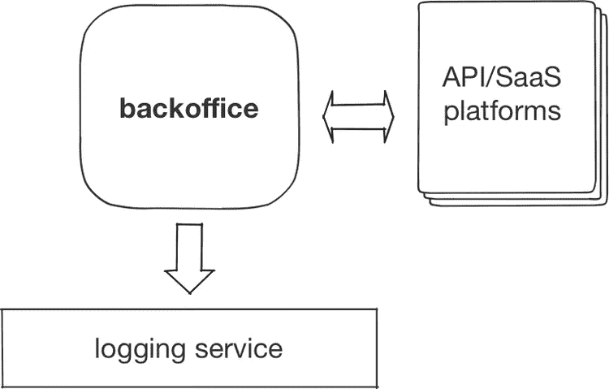

# 从零开始建立在线市场—简介

> 原文：<https://medium.com/hackernoon/building-an-online-marketplace-from-scratch-introduction-738839e4e76>

本系列文章描述了设计和构建电子商务应用程序的现代方法之一**。它重点展示了如何快速发布与 CRM 相关的特性***，从而使业务能够及时上市。如果你想和商务人士相处，或者你正在考虑* ***成为一名 CTO*** *，那么这个系列很值得一读。***

**这是一系列帖子的第一部分，在这里你可以快速跳转到其他部分:**

*   **[**订单处理**](/voucherify/building-an-online-marketplace-from-scratch-order-processing-a65c7bfab490)**
*   **[**API 集成**](https://hackernoon.com/building-an-online-marketplace-from-scratch-the-dark-side-of-salesforce-limits-6834c2d5d71e)**
*   **[**较少的单元测试较多的日志**](https://hackernoon.com/less-unit-tests-more-logs-8acbfedc24a0)**
*   **[**与 API 优先提供商的程序化邮件**](/@msedzielewski/programmatic-emails-with-api-first-providers-c8671c91fd72)**

**最近 Gartner 关于数字商务趋势的研究强调了市场整合和基于 API 的商务平台。这篇论文将这些概念与“旨在帮助他们(数字商务公司)在没有大量前期投资的情况下灵活地提供出色体验的策略”联系在一起。听起来很严重，对吧？如果你经营一家电子商务企业，并且对如何将这些战略转化为技术和运营感到好奇，那么你来对地方了。**

> ***“提供卓越的客户体验，无需大量前期投资”***

**在这一系列的文章中，我们想把重点放在技术的角度上，并向你展示如何将高层次的概念映射到工作的软件架构中。我们将尝试通过从头开始设计一个在线市场架构来做到这一点。**

****

# **让我们从一些定义开始**

**我们的工作定义——在线市场是一个虚拟的地方，卖家和买家可以在这里交换商品或服务。交易通常采取由市场经营者管理的交易形式。**

**运营商通过买卖双方的交易数量来衡量市场的整体成功率。这是因为他们通常从每笔交易中获得佣金。因此，为了创收，运营商的职责是营造一个友好的环境，鼓励:**

*   **卖方参展**
*   **买家…购买**

**(通常按此顺序)。**

**有许多利基市场，你可以用在线市场为目标。除此之外，还有许多类型的市场。到目前为止，市场上已经出现了 B2B，B2C，服务，或 C2C 类型。然而，任何市场平台的核心机制都大同小异。换句话说，一个运转良好的市场应该具备以下特征:**

*   **不断增长的流量承诺——吸引新的卖家，**
*   **脱颖而出的产品目录——并产生流量，**
*   **买方-卖方-运营商沟通和销售工具——激发购买信心**
*   **一个法律框架和透明的支付系统——最终完成销售，保证质量，让买家回来，重新开始这个循环**

**可以想象，这些要素对平台上运行的软件的[设计](https://hackernoon.com/tagged/design)有着巨大的影响。更重要的是，它们经常会随着时间而变化。尽管我们很想这样做，但我们不能预先涵盖所有的情况。这就是为什么，在我们深入平台架构的具体细节之前，让我们稍微谈一下背景和关键假设。**

# **假设**

**在这个故事中，我们假设我们将设计一个**早期**市场。此外，这将是一家在竞争激烈的市场中起步的公司。你可以称之为[创业](https://hackernoon.com/tagged/startup)。**

**这两个假设意味着风险商业模式不会经过战斗考验。这反过来又对底层软件提出了特殊的要求。换句话说，为了获得良好的上市时间，平台应该是:**

*   **开放以快速处理新的、意想不到的业务场景**
*   **每天都非常容易更换**
*   **准备好让内部和外部开发人员快速**

**但是它还应该能够:**

*   **从数据中学习**
*   **当意外流量到达平台时，合理扩展**
*   **连接不同的部门**

**同样，文章标题的事实引入了一个严肃的假设；我们想从零开始构建市场软件**但是“从零开始”到底是什么意思呢？****

# ****从“零开始”重新定义****

****通常，当我听到这个术语时，一些积极的东西会突然出现在我的脑海中。为什么？因为我立即想象了一个可以自由选择软件实践和工具包的绿地项目。我认为拥有这种自由应该让我以正确的方式构建正确的软件。****

> *****“为今天而建造，为明天而设计”*****

****但是，这难道不与我们认为是我们主要关心的发展速度相矛盾吗？单靠自己的力量实现市场的每一部分注定是缓慢的吗？我们真的不知道。这取决于很多因素，我们不想过早下结论。****

****相反，我们想要展示的是一种构建电子商务软件的不同方法。我们已经两次在快速增长的互联网业务中成功地看到了这一点；实际上，我们参与了这两个项目。****

****它将开发需求的速度视为优先事项，同时，给予开发团队足够的自由度来推广他们自己的软件架构实践。****

****我们的建议是，通过混合**现代但经过验证的** API 优先的平台，组装一个早期市场平台。我们将特别关注:****

*   ****CRM 和其他销售支持工具****
*   ****营销和电子商务 API****
*   ****SaaS 客户服务部****

****在接下来的帖子中，我们将概述如何实际创建这样的设置，以及如何保持它的运行，直到业务变得足够成熟，可以重新思考并可能内包系统的某些部分。特别是，我们将描述:****

*   ****整体架构，****
*   ****集成最佳实践，****
*   ****实施提示，****
*   ****最后，第三方 API 平台的优点和缺点****

****所有这些都是为了改善在线市场的上市时间。****

****最后但同样重要的是，虽然这种设置已被证明对我们是有效的，但我们也了解了它的缺点。我们也很乐意分享它们。****

****不幸的是，我们没有为这个设置想出任何花哨的名称。如果你有想法，请通过 [@voucherifyio](https://twitter.com/voucherifyio) 告诉我们。然而，我们在整篇文章中随机散布了一些俗气但有望准确的流行词汇，以吸引浏览者的注意。****

> *****“敏捷模型驱动开发:扩展敏捷软件开发的关键”*****

# ****你真正想建造的是什么？****

****事不宜迟，我们要建立一个市场，将硬件设计师和硬件制造商匹配起来。这就像 tindie.com/biz 一样，但它不是一个推荐委员会，而是监督交易。让我们称我们的平台为 Manufaktura(这是一个波兰语单词，意为“[工艺生产](https://en.wikipedia.org/wiki/Craft_production)”)****

****商业模式如下:想象你已经设计了一个原型，你的 Kickstarter 活动运作良好，现在你正在寻找一个值得信赖的供应商。这就是 Manufaktura 开始发挥作用的时候。你描述你的需求并提交申请，然后制造商就可以投标了。****

****此外，管理层还注意到了另一个相关的利基市场。他们预测该平台可以成为一个周期性支持和维护合同的代理机构。这不是第一阶段要考虑的，而是你应该记住的。****

****还有一件事要记住。这个行业开始于激烈的竞争。已经有另外两家公司想要占领类似的市场。我们必须抓紧时间，因为市场领导者很可能会把它全拿走。所以，言归正传。****

> ****免责声明:建立这样一个市场有许多未知因素。找出“正确的方法”需要大量的工作。所以，我们不知道这个行业是否可以持续，我们也不能说我们的任何商业假设都是正确的。尽管如此，我们还是想向您展示 Manufaktura 是如何工作的，以及如何克服一些虚构但潜在的商业障碍。****

# ****市场的组成部分****

****市场是复杂的动物。有很多事情你必须考虑。更糟糕的是，平台的各个部分经常是交织在一起的，很难精确定位清晰的组件。更糟糕的是，给事物命名很难。因此，当某些类别与您所学的惯例不符时，请耐心等待。****

****我们发现了以下支柱。这一细分将被映射到即将发布的帖子中:****

*   ******订单管理** —如何通过平台以允许多人/部门协作的方式处理订单****
*   ******平台基础设施&监控&恢复** —部署监控和警报措施、错误处理指南、手动和自动恢复****
*   ******电子邮件&短信营销** —在营销渠道中使用电子邮件和短信 API****
*   ******支付&发票** —不同的支付选项和网关、定期支付、计费和发票操作****
*   ******客户服务** —为客户入职创建电子邮件活动，组织支持和案例管理****
*   ******客户跟踪** —如何在线跟踪营销渠道和用户，A/B 测试****
*   ******报告** —收集和可视化数据****
*   ******促销** —如何产生更多流量并重新吸引现有客户****
*   ******运输** —自动化运输****

****为了让你先睹为快，我们可以说我们将使用许多 SaaS/API 平台和一个托管在 Heroku 上的小型后勤系统。整体架构如下所示:****

********

# ****第一个帖子****

****第一篇文章不是关于准备开发者环境的。没有詹金斯，没有 Docker，没有 AWS，没有数据库模式设计在这个时候。目前没有时间做那些事。Excel 订单在维护方面变得越来越差，并延迟了 Manufaktura 的投标过程。让我们用一个合适的订购系统来代替它吧！****

*****原载于*[*www . voucherify . io*](https://www.voucherify.io/blog/2017/5/12/building-an-online-marketplace-from-scratch-introduction)*。*****