# 从零开始建立在线市场—订单处理

> 原文：<https://medium.com/hackernoon/building-an-online-marketplace-from-scratch-order-processing-a65c7bfab490>

本系列文章描述了设计和构建**电子商务应用程序的现代方法之一。它重点展示了如何快速发布与 CRM 相关的特性***，从而使业务能够及时上市。如果你想和商务人士相处，或者你正在考虑* ***成为一名 CTO*** *，那么这个系列很值得一读。***

**这是一系列帖子的第二部分，在这里你可以快速跳转到其他部分:**

*   **[**简介**](/voucherify/building-an-online-marketplace-from-scratch-introduction-738839e4e76)**

# **欢迎回来！**

**在本帖中，我们将描述如何为 Manufaktura(我们的在线市场业务)设计和实现**订单管理**功能。**

**正如你在上一篇文章中读到的，Manufaktura 是一项早期业务。这意味着订单是手动处理的，电子邮件来来回回，客户和制造商希望了解最新状态，每天都有新的“例外”出现。在这种情况下，建立一个订单管理系统就像拆除一个炸弹。你需要一个短期和长期的解决方案。短-关闭定时器，长-拿走炸药，否则问题没有解决。**

**将此转化为软件世界，这意味着您需要尽快弄清楚如何自动化订单处理。否则，你的团队会陷入手工作业中。与此同时，你需要牢记业务规模，并计划如何规划长期数据分析。如果没有后者，您的快速而肮脏的解决方案将开始在运营中产生越来越多的问题，并将阻碍从数据中获得洞察力。**

****那么，您到底是如何利用第三方 SaaS & API 平台来实现订单管理的呢？****

****认识 Salesforce 及其 API 平台。****

**我们将向您展示早期企业如何利用 SaaS 巨人来:**

*   **为软件平台建立基础，**
*   **响应不断变化的需求，**
*   **缩短上市时间。**

**但是在我们进入架构之前，让我们先了解一下业务需求是什么。这对于了解 Salesforce 将如何帮助我们解决问题以及了解是什么使其成为同类中的领导者至关重要。**

# **简而言之的需求**

**有几项任务使这个项目具有挑战性。我们有几个人参与这个过程，他们每个人都带来了他们的必需品。尽管这是一项早期业务，但如果不考虑以下几个方面，订单处理将不会有效率:**

*   **销售线索/联系人管理—营销**
*   **订单数据验证—操作**
*   **营销渠道跟踪—营销**
*   **状态跟踪和渠道管理—销售/运营**
*   **负责代理人—客户服务**
*   **报告—销售/运营/财务**

**除了这些基本的 CRM 功能，我们还需要报价管理来涵盖订单工作流。说到这里，这里有一个我们希望与平台对应的订单流程的草图:**

****角色:****

*   **硬件设计师(HD) —想要制造他们的产品**
*   **Manufaktura (M) —我们的业务，在线市场**
*   **制造商(MS) —合同投标**

****工作流程:****

1.  **房屋署提交建议书**
2.  **m 审查 RFP，并要求 HD 预付部分款项**
3.  **m 开始招标**
4.  **MS 提交他们的建议**
5.  **m 根据当前策略选择获胜者**
6.  **制造开始，并将经历几个阶段(见下面的方案)**
7.  **产品验证测试完成，大规模生产开始**
8.  **首批发货，M 收取高清全价**
9.  **HD 运行一个 QA 会话——如果一切正常，MS 将从 M 处获得报酬**

**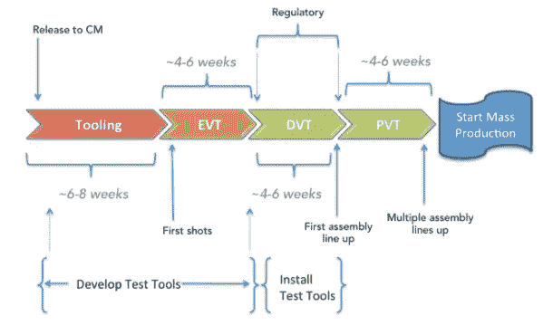**

**The process of mass manufacturing takes several steps and usually takes months. If you’re interested in details, read a fantastic [article](http://mindtribe.com/2016/08/how-long-does-it-take-to-manufacture-a-hardware-product/) from Andrew Dupree.**

**你可以想象，在现实中，这个过程在每一步都有很多死角和潜在的问题。作为开发人员，我们的职责是用软件来解决这些问题，所以，我们去参加规划会议！让我们设计数据库方案，选择数据库供应商，在 JIRA 计算故事点，就前端框架进行辩论，并就如何解决一个超级特殊的情况进行两次长达一小时的讨论。**

**这是一种方法，但是在你召集你的团队到白板前之前，花一分钟时间来回顾这些要点:**

*   ****首先**，虽然这种方法通过让开发人员适应彼此并提高他们的社交技能(如推理和辩论的艺术)来实现价值，但这需要时间。商业人士等不了那么久。他们非常渴望订单自动化。**
*   ****其次**，记住这是一个新行业，有很多理论，因此，需求还没有得到市场的验证。公司的组织结构也还不清楚。所有这一切带来的风险是，你的设计和估计在一个月左右的时间内将不再有效。**
*   ****第三**，在业务的这个阶段，一些具体的、很少发生的案例，可以由非技术人员手工完成。或者，至少您可以使用一些智能旁路，如神奇的 Excel 公式或必要时调用的 10 行 bash 脚本。有了小规模，就没有必要对每一项繁琐的工作进行全面自动化。**

**如果这些要点对您的情况有效，让我们推迟一次大型计划会议，并想一个更快的方法来启动和运行订单管理系统。**

# **优先级和迭代**

**要获得合适的上市时间，你应该做三件事:**

*   **缩小真正的业务痛点**
*   **可以解决这些棘手问题并适应您的环境的研究工具**
*   **用最少的代码解决问题**

**因此，与其为您梦想的技术堆栈手工挑选工具，并与 Jenkins 一起构建应用程序的框架，一键构建，三层测试网络，不如让我们概括出最重要的部分，将其分解为真正迫切需要自动化的部分，并计划下一次迭代。**

**在接下来的部分中，我们将向您展示如何拥抱“优先化和迭代”过程，以及如何快速实现业务的关键元素。**

**我们将关注 Manufaktura 流程的第一个也是最麻烦的部分，因此:**

*   **验证和存储来自 HDs 的请求详细信息**
*   **处理投标**
*   **宣布获胜者并委托制造过程**

**(我们将该流程的某些部分留给下一篇文章，例如支付、客户支持、促销)**

**但首先，我们需要替换 orders.xlsx，因为它变得越来越难以由运营和营销人员来维护。**

**好了，让我们回顾一下—业务需求出现了，现在我们可以了解问题的核心，让我们看看可以帮助我们的工具。如果您的情况听起来类似(您需要用软件构建一个订单管理流程)，**给 Salesforce 一个机会**。**

****让我们参观一下 Salesforce 平台，了解它的特性，并最终了解为什么它是快速软件开发中值得考虑的工具。****

# **Salesforce —强大的平台**

**好了，现在您可能已经谈够了业务需求。但是我们必须至少完成基本的步骤，以向您展示 Salesforce 为您提供了多少现成的东西。**

**如果你(就像我 3 年前一样)很少关注 Salesforce 在过去十年中的成果，你可能会认为它们只是一个软件即服务的 CRM 应用程序。另一个你必须处理的应用程序，因为销售副总裁注册了它。但现在已经不是这样了。Salesforce 已经发展成为一个用于构建业务应用程序的大型软件平台。**

**如果你愿意花一些时间[了解他们的来龙去脉，这会让你的软件技术团队变成一个生产力怪兽。例如，我认识的几乎所有参与实现商业应用程序的人都抱怨大量单调乏味的工作:](https://hackernoon.com/tagged/learning)**

*   **将应用程序用户界面连接到 DBs**
*   **用户数据验证**
*   **数据库模式改变的过程**
*   **处理用户、角色和配置文件**
*   **控制对记录和字段的访问，使用户界面适应不同的角色**
*   **处理并发和事务**
*   **允许最终用户重新配置**

**同时，这些平凡的问题对公司来说非常重要，因为数据完整性是良好业务的支柱之一。我们在这里建立的在线市场也不例外。**

**现在想象一下，您可以实现所有这些，为您的团队节省大量的时间和精力。怎么会？Salesforce 团队已经为您解决了这些问题。正如 Dan Appleman 在第[篇文章](https://www.red-gate.com/simple-talk/opinion/opinion-pieces/the-salesforce-platform-the-return-of-the-citizen-programmer/#.VGd7Db8P9OZ.linkedin)中指出的，为什么 Salesforce 可能成为另一个 VB:**

*   *****当您将表或字段*** *添加到 Salesforce 平台数据库时，它们在语言中显示为具有属性的对象，已经与正确的数据类型紧密关联。***
*   ***I* ***如果您在任何地方引用那些对象和属性*** *，则基础表和字段不能被删除或更改为不兼容的类型。该平台创建并实施数据完整性。***
*   *****当字段显示在用户界面上*** *时，无需编程即可轻松定制，验证和字段的正确用户界面会自动发生。***
*   ****这适用于表单和报告(报告和图表也是内置的)。****

**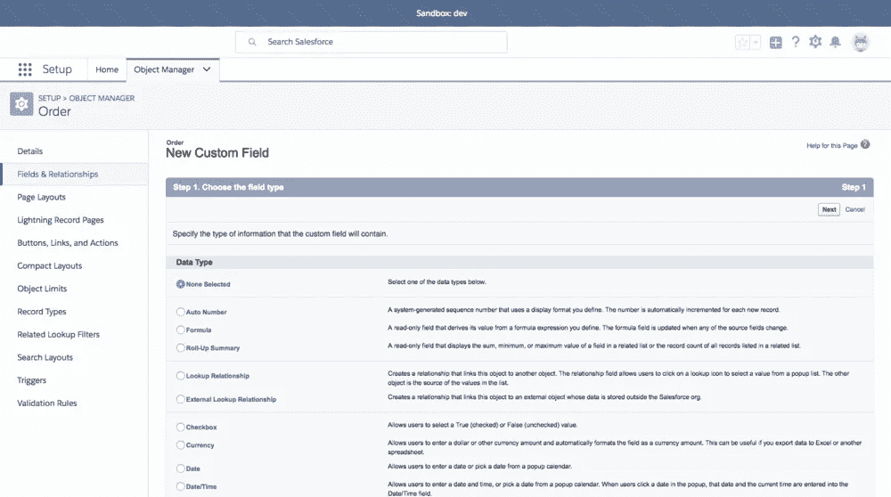**

**Adding a custom field**

**Salesforce 映射定制的、更高级的业务流程的方法也非常有效。大多数复杂的场景都可以用交互式流程构建器来构建。想设计一个输入有效的多屏表单吗？没问题，打开构建器，使用拖放向导定义您的场景。无编码…**

**…除非迫不得已。如果你需要更多的灵活性或定制功能，那么有一个内置的类似 Java 的编程语言(Apex)和通过 API 连接到第三方应用程序的能力。在下一篇文章中会有更多的介绍。让我们回到 Salesforce 为 Manufaktura 的开箱即用要求提供了什么。**

# **Salesforce —盒子里有什么**

**就 Manufaktura 而言，Salesforce 提供了强大的内置订单管理功能。我们得到的是一系列标准 CRM 功能，包括:**

*   **联系人、客户和订单管理**
*   **订单状态跟踪**
*   **销售渠道可视化**
*   **商业报告**
*   **代理管理**

**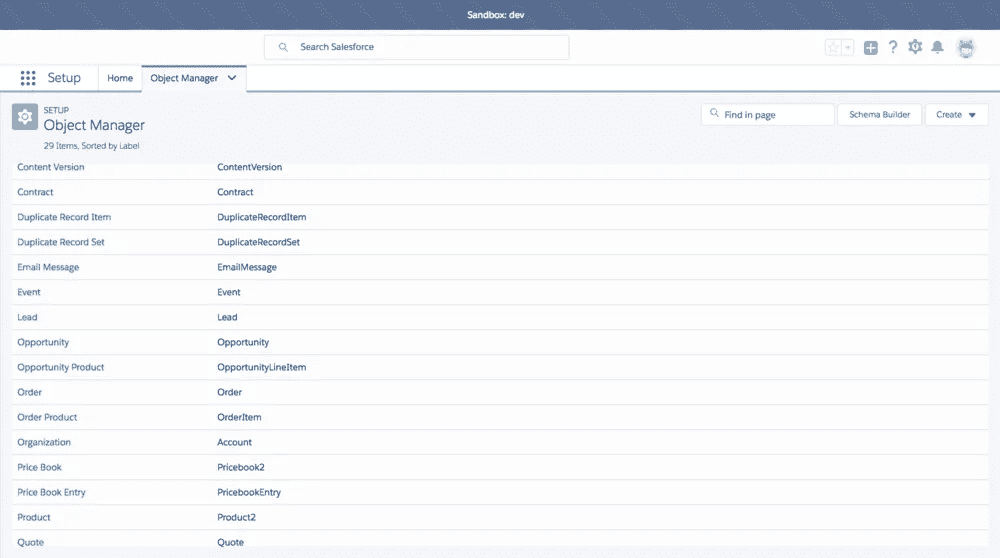**

**Salesforce offers almost 30 built-in objects which help you model your entire business**

**如果你没有注意到的话，这份清单涵盖了我们的利益相关者为 Manufaktura 要求的几乎所有项目。正如我们在上一段中了解到的，这些内置特性无需编码就可以定制。您可以添加/修改/删除字段，链接不同的实体，限制对特定记录的访问，创建自定义仪表板，并最终在此基础上构建自定义报告。**

**有了这些功能，您可以绘制 Manufaktura 的工作流程图，并在一天结束前准备好处理新订单。这将包括:**

*   **配置内置对象以满足需求**
*   **根据流程定义订单状态**
*   **自动化制造商选择流程**

**重要提示:即使您的组织中没有 Salesforce 专家，这也非常容易。旧金山还在 https://trailhead.salesforce.com 提供了一个极好的教育资源网站。通过阅读这些模块，您可以从用户和管理员的角度快速了解基本和半高级主题。**

**让我们看看如何为我们的流程准备一个真实的基于 Salesforce 的软件架构。我们将为以下步骤创建一个半自动订单管理流程:**

*   ****硬件设计师请求一份订单，该订单处于等待验证状态** —投标生效日期应至少提前 3 天，以便有时间提交报价。**
*   ****运营团队核实订单后，进入等待提案阶段。**制造商可以开始提交他们的提案。**
*   ****每天早上，我们的引擎会选择最优惠的价格，订单最终会选择一家制造商，或者取消无提案状态**如果没有发送提案。**

**这是关系和流程的简化可视化(方括号中的实体名称代表内置的 Salesforce 对象)**

**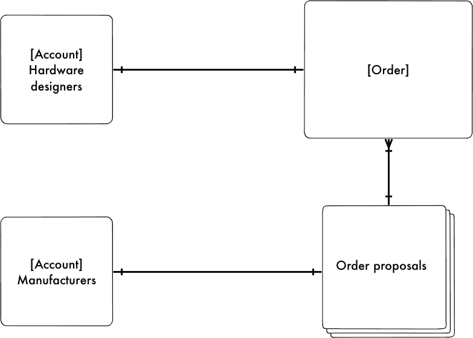**

**Relationships**

**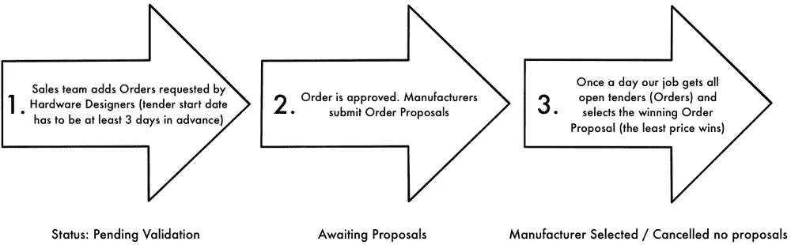**

**Order workflow**

**我们将首先为我们的市场添加两种账户类型:硬件设计者和制造商。**

1.  **转到配置帐户(设置->对象管理器->帐户):**
2.  **添加帐户记录类型:制造商和硬件设计者。**

**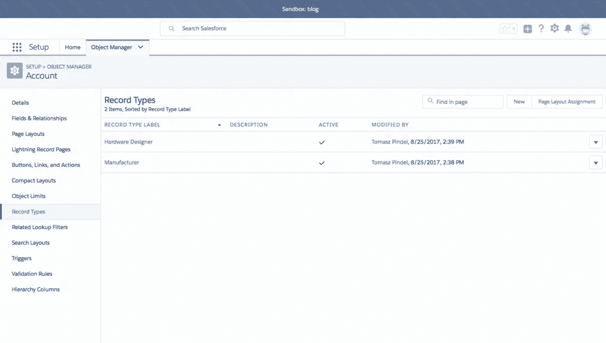**

**第二步是勾画出流程的工作流程；初始阶段将如下所示:**

*   **等待验证，**
*   **等待提案，**
*   **选定的制造商，**
*   **未取消任何提议。**

**以下是如何做到这一点:**

****转到配置订单(设置- >对象管理器- >订单)并定义草稿类别中的状态。****

****

**现在，让我们创建一个字段，用于将订单链接到获胜的制造商。我们将通过定制对象订单提案来实现这一点。这是一种常规的“一对多”关系——制造商提交特定订单的订单建议书。这是创建它的方法:**

****转到对象管理器- >创建自定义对象并:****

**1.使用以下模式将名称定义为自动编号:OP-{0000000000}**

**2.启用以下功能:允许报告、允许活动、跟踪字段历史和允许搜索结果中的对象。我们还可以允许添加注释和附件，以供将来参考。**

**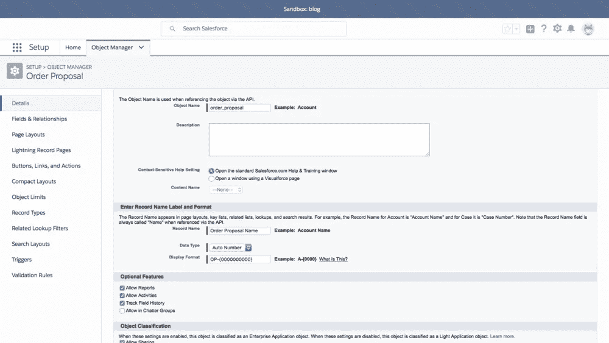**

**3.向创建的对象添加新字段:**

*   **订单作为客户订单的必需查找关系**
*   **制造商作为必需的查找关系，以说明并定义“等于制造商”记录类型的过滤器**
*   **作为长文本字段的描述**
*   **价格作为必需的货币字段**

**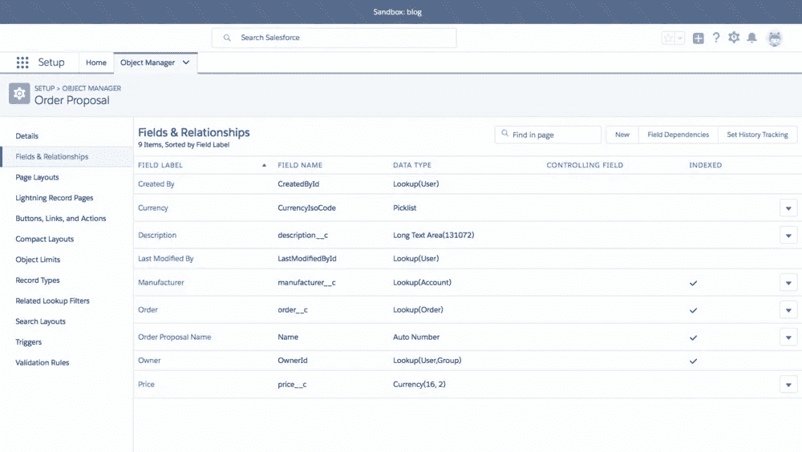**

**现在让我们从订单的角度来建立这个关系。添加以下字段(见下面的截图):**

*   **建议作为订单建议的查找关系，并在建议中为订单 ID 定义过滤器(它必须与当前订单 ID 匹配)**
*   **制造商作为帐户的查找关系，并为等于制造商的记录类型定义过滤器**
*   **制造商选择的日期作为日期时间字段**

**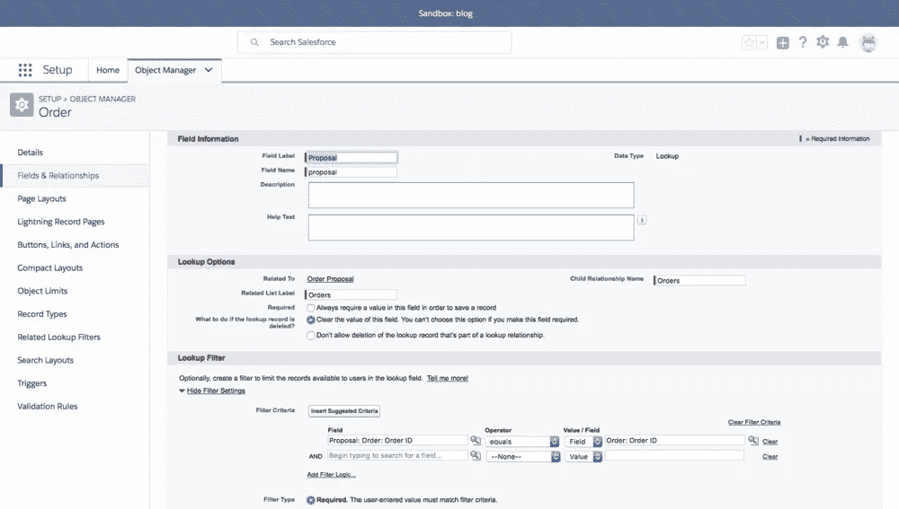****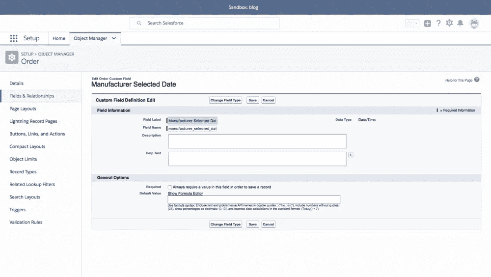****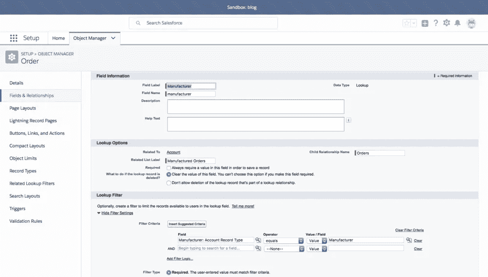**

****太好了，我们刚刚建立了基本的关系模型。**现在，让我们添加一些约束条件，使我们的流程更加健壮，更不容易出错。首先，为具有等待建议状态的订单添加一个验证规则，该规则强制订单生效日期必须至少是未来 3 天。这样，我们可以避免向制造商发送过时的 RFP。**

**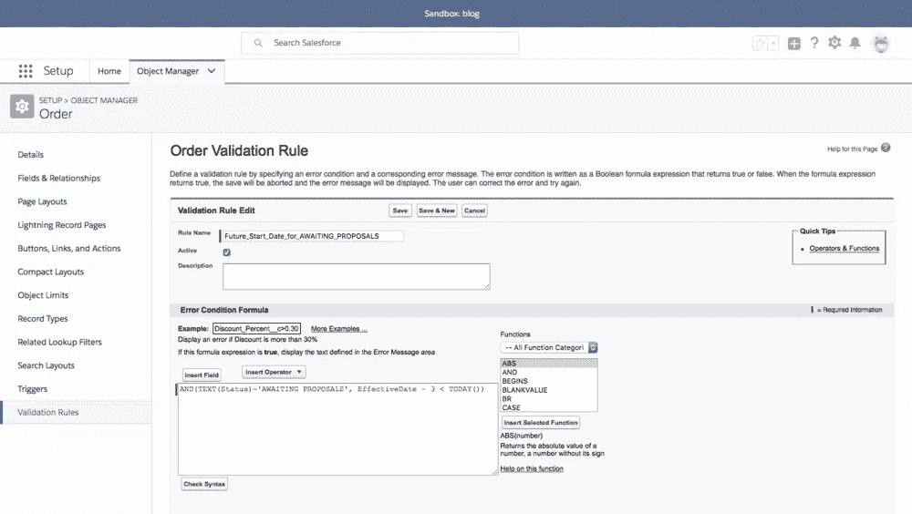**

**然后，添加一条规则:**当订单处于制造商选择状态时，必须选择制造商和建议。**这一次，如果运营部门的某人忘记填写必要的信息，系统也不会打扰 HDs。这只是一点额外的验证措施，以减少通信混乱。**

**除了快速业务逻辑开发之外，Salesforce 还让您能够很好地控制对象如何向用户呈现信息。强大的布局设计器允许您为同一对象配置多个布局。您可以通过显示/隐藏不同用户角色的不同信息来提高 UX。最重要的是，它提供了十几个内置的小工具，预览为…选项，甚至撤销/重做功能。**

**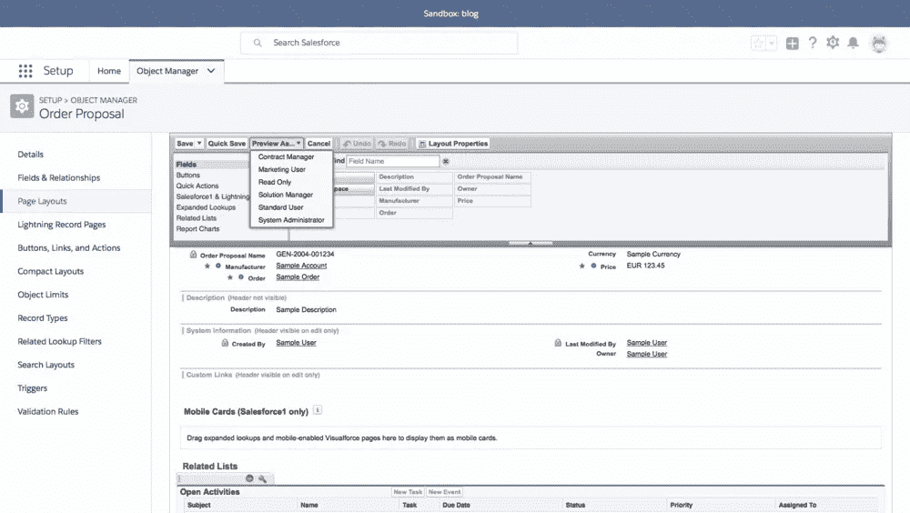**

**基本结构和约束已经建模好了，现在让我们动动针吧。下一节将描述如何选择获胜的制造商。该过程如下所示:**

1.  **选择过程在每天早上 7 点运行。**
2.  **该脚本检查所有等待的建议订单，并选择具有最佳价格的建议(这是目前的业务标准)。**
3.  **没有得到任何关注的订单被标记为取消无提案。**

**因为这是一个稍微复杂一点的场景，所以您不能使用内置的 process builder 来完成它。我们只需要编码。如前所述，Salesforce 会在这里为您提供帮助。让我们看看指导 Salesforce 如何处理我们的流程有多简单。它实际上与大多数流行的编程环境没有什么不同(参见[本指南](https://developer.salesforce.com/docs/atlas.en-us.apexcode.meta/apexcode/apex_qs_HelloWorld.htm)了解更多)。**

**让我们在内置的 IDE 中创建一个类。**进入设置- >自定义代码- > Apex 类，并将逻辑放入:****

```
**global class ManufacturerSelectJob implements Schedulable {global void execute(SchedulableContext SC) {List<order_proposal__c> acceptedProposals =[ SELECT Id, manufacturer__c, order__cFROM order_proposal__cWHERE order__r.EffectiveDate < TODAYAND order__r.Status = 'AWAITING PROPOSALS'ORDER BY order__c ASC, price__c ASC ];List<Order> acceptedOrders = new List<Order>();Set<String> acceptedOrderIds = new Set<String>();for (order_proposal__c acceptedOrderProposal : acceptedProposals) {if (acceptedOrderIds.contains(acceptedOrderProposal.order__c)) { continue; }acceptedOrderIds.add(acceptedOrderProposal.order__c);Order acceptedOrder = new Order();acceptedOrder.Id = acceptedOrderProposal.order__c;acceptedOrder.proposal__c = acceptedOrderProposal.Id;acceptedOrder.manufacturer__c = acceptedOrderProposal.manufacturer__c;acceptedOrder.manufacturer_selected_date__c = System.now();acceptedOrder.Status = 'MANUFACTURER SELECTED';acceptedOrders.add(acceptedOrder);}update acceptedOrders;List<Order> cancelledOrders =[ SELECT Id, StatusFROM OrderWHERE EffectiveDate < TODAYAND Status = 'AWAITING PROPOSALS'AND Id NOT IN (SELECT order__cFROM order_proposal__c) ];for (Order cancelledOrder : cancelledOrders) {cancelledOrder.Status = 'CANCELLED NO PROPOSALS';}update cancelledOrders;}}**
```

**我们不会谈论太多语言细节，你可以在这里了解更多，但是一些评论指出了 Apex 的优点:**

*   **看起来像 Java/C#**
*   **它有一个类似 SQL 的带有智能感知的查询生成器**
*   **它为对象上的 CRUD 操作提供了类似 ORM 的方法**

**既然我们已经有了包含工作的课程，让我们安排一下吧。同样，Salesforce 与调度程序捆绑在一起，这使得触发变得非常容易。访问“设置”->“环境”->“作业”->“计划的作业”，单击按钮，您可以设置/计划每天触发的作业。**

**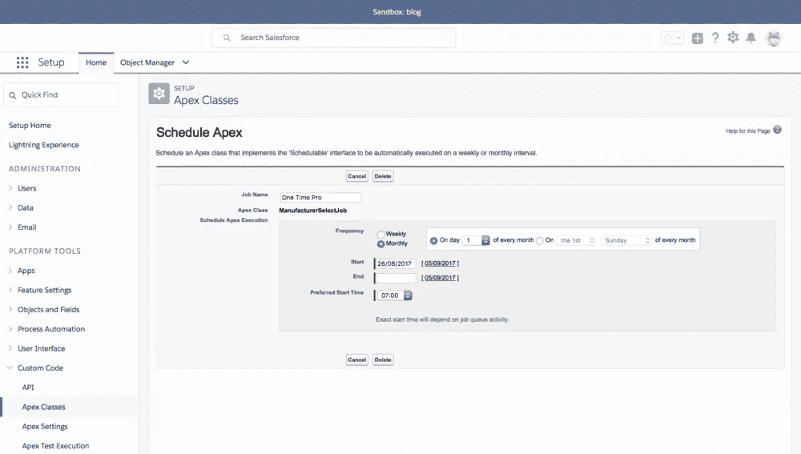**

**Salesforce 还为您提供了独立且易于使用的测试环境。这里有两个功能可以帮助我们无缝验证我们的流程:**

*   ****沙盒**——你可能已经注意到了(每个截图的顶部)，我们在本教程中采取的每个动作都是在沙盒环境中完成的。这有助于您在变更进入生产环境之前安全地对其进行测试。修改被分组到变更集中，如果您有 100%的把握，您可以部署这些变更集。**
*   ****开发者控制台** —你可以通过嵌入式控制台以编程方式访问所有对象和类。另外，您还可以在那里看到所有的调试日志。**

****现在，我们可以取消订单开始日期规则，手动添加一些测试订单:****

1.  **添加几个帐户(硬件设计者和制造商)**
2.  **添加具有昨天订单开始日期的订单，并将其状态更改为等待建议**
3.  **通过为订单创建分配订单建议，模拟制造商提交建议**
4.  **然后，转到开发人员控制台/调试/打开执行匿名窗口并键入:**

```
**new ManufacturerSelectJob ().execute(null);**
```

**我们的代码应该可以完成这项工作——订单将为制造商分配最好的价格，并且状态将更改为“选定的制造商”。如果没有建议，状态将被设置为取消无建议。**

**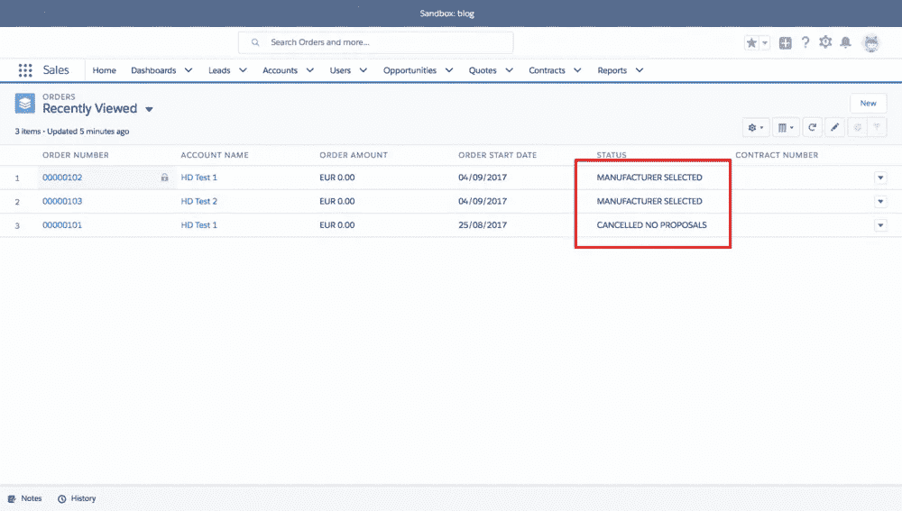**

**如果我们已经设置了基本的业务对象，我们应该最终将当前基于电子表格的订单数据库转移到 Salesforce。**

**对了，把 Salesforce 当数据大师怎么样。没有外部数据库？没错，Salesforce 的存储灵活性、性能和备份功能非常好，足以在项目早期将其设置为唯一的数据存储(我们的经验表明，这种设置可能足够在线市场使用 2 年)。但是接下来呢？不要担心，在下一篇文章中，我们将向您展示如何在规模达到时使用 [Heroku Connect](https://www.heroku.com/connect) 获取数据。**

**让我们回到迁移的话题。 [**Salesforce Business 应用商店**](https://appexchange.salesforce.com/) **提供了一些可靠的工具来帮助您设计、管理和迁移数据。以** [**数据加载器**](https://dataloader.io/) **为例。****

**这个简单的[工具](https://hackernoon.com/tagged/tool)使您能够轻松地将数据导入 Salesforce。它有一个直观的字段映射工具，并在无法导入时给出一个解释清楚的错误列表。使用 Data Loader，您可以立即重新设计数据库。只需向对象添加新的字段，将记录导出到 xlsx，修改数据使它们与新的模式匹配，然后再将它们导入回来。**

**是的，在早期阶段，当记录的数量最多是几万条时，你可以在 Excel 中完成所有工作。我们发现，当模式频繁变化时，这将极大地提高生产率。**

**为了简洁起见，我们不会展示如何通过数据加载器将 Excel 与订单一起传输，但是您可以通过[这段视频](https://www.youtube.com/watch?v=Kcut_FnM3TE)亲眼看到这是多么简单。**

**此外，SF 为您提供现成的记录历史(审计日志)。您可以看到谁更改了什么以及之前的值是什么。这些功能(带验证的自定义字段、简单的迁移和带审计日志的备份)确保了您的数据完整性，而无需在无数的模式修改和日常迁移上投入时间。**

**这一切意味着，您真的可以将 Salesforce 视为早期阶段、尚待预测的业务的核心数据存储。**

# **概述**

**主要使用 Salesforce 的开箱即用功能，我们在我们的在线市场中配置了与**订单管理相关的基本流程。orders.xlsx 已成功迁移，现在操作人员可以以简化的方式管理数据。所有字段都经过验证和监控，因此您可以始终确保数据完整性。****

**我们在没有实施或使用任何其他外部系统或应用程序的情况下实现了这一点——甚至没有必要获得外部数据库。在几个小时内，我们就对真正的业务需求做出了回应。**

**现在，营销/销售/运营/客户服务人员节省了大量时间，并将时间投入到创造性的任务中。他们也有机会使用收集到的数据来进一步改进他们的流程。**

**最后，**所有的数据模型更改和连续数据迁移都非常容易处理。**添加新字段或创建验证规则只需 1 分钟，无需编码。换句话说，系统是开放的，可以改变和扩展——这是我们将在下一篇文章中讨论的。**

# **接下来**

**我们有一个实体和工作流的基本设置。**但是如果我们想要模拟更复杂的场景呢？**假设我们想要更新选择投标获胜者的策略。如果我们想自动化一些平凡的任务，如发送电子邮件确认，该怎么办？这是 Salesforce 真正闪光的地方。**在下一篇文章中，我们将展示 Apex 和 API 的强大功能、最佳实践和注意事项。**更重要的是，我们将介绍 Salesforce 许可、成本估算和支持可能性，以便您可以学习如何与管理层沟通。**

**最后，让我们更新我们的架构图。Salesforce 已经成为一个主要的 SaaS 平台。在下一篇文章中，我们将把它连接到系统的其他部分。**

**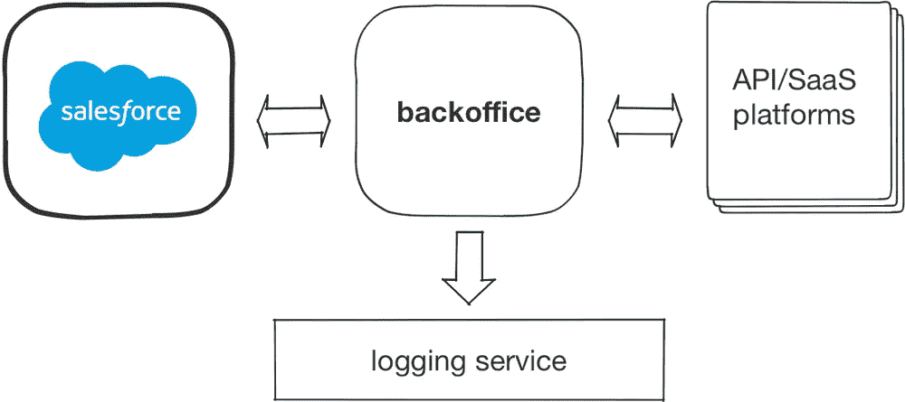**

***最初发布于*[*www . voucherify . io*](https://www.voucherify.io/blog/2017/9/8/building-an-online-marketplace-from-scratch-order-processing)*。***