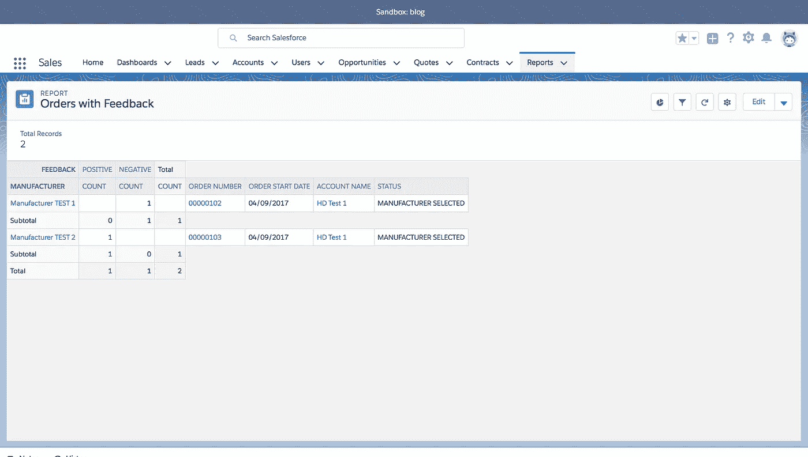
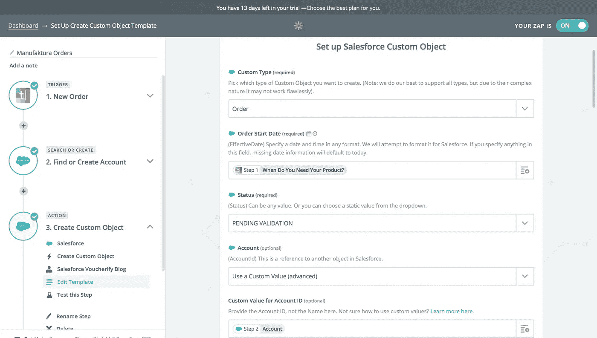
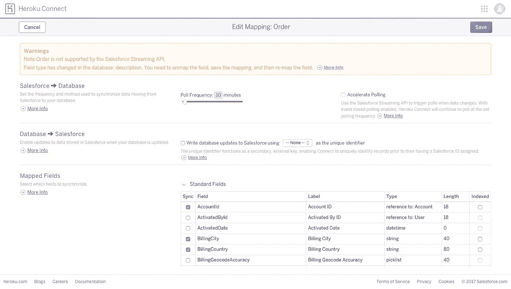

# 从零开始建立在线市场 Salesforce 限制的黑暗面

> 原文：<https://medium.com/hackernoon/building-an-online-marketplace-from-scratch-the-dark-side-of-salesforce-limits-6834c2d5d71e>

本系列文章描述了设计和构建**电子商务应用程序的现代方法之一。它重点展示了如何快速发布与 CRM 相关的特性***，从而使业务能够及时上市。如果你想和商务人士相处，或者你正在考虑* ***成为一名 CTO*** *，那么这个系列很值得一读。***

**这是一系列帖子的第二部分，在这里你可以快速跳转到其他部分:**

*   **[**简介**](/voucherify/building-an-online-marketplace-from-scratch-introduction-738839e4e76)**
*   **[**订单处理**](https://hackernoon.com/building-an-online-marketplace-from-scratch-order-processing-a65c7bfab490)**

**在[上一篇文章](https://hackernoon.com/building-an-online-marketplace-from-scratch-order-processing-a65c7bfab490)中，我们介绍了如何使用 Salesforce (SF)来拥抱 Manufaktura 中混乱且 Excel 驱动的订单[管理](https://hackernoon.com/tagged/management)流程。我们看到了 SF 如何通过维护数据完整性来自动化大量手动工作并减少错误处理的数量。但是从商业和技术的角度来看，SF 本身不足以构成一个面向速度的软件架构。在本文中，我们将向您展示为什么以及如何使用 SF API 将您的 IT 组件连接到一个运行良好的平台中。**

# **API**

**一个鲜为人知的事实是，500 亿美元的公司 SF 有 50%的收入来自其 API。一定有什么东西在里面，对吗？在接下来的章节中，我们将尝试解释是什么让它在企业中如此受欢迎，以及像“Manufaktura”这样的早期企业如何利用它来扩大经营规模。**

**事实上，REST API 将成为 Manufaktura 软件架构的核心概念，也是本系列后续文章的核心概念。它将成为 Manufaktura 赖以建立的框架的主要支柱。这种杠杆作用使得 Manufaktura 团队能够更快地交付业务成果，同时节省大量的[工程](https://hackernoon.com/tagged/engineering)时间。**

**但是在我们使用 SF REST API 之前，让我们看看如何在不使用外部服务的情况下调整您的流程系统。这应该给你更多关于在 SF 及其内部编程环境中能做什么的知识。**

# **规模的第一个问题**

**团队偶然发现的问题是最初不太成功的关系的爆发。其中一家制造商未能满足设计师的期望，因此，后者不想再与他们合作。这种情况在多个设计者-制造商配对中发生过几次，因此，记住哪个制造商应该被排除在投标之外就成了问题。开发团队被分配了一个任务来自动完成这项工作。**

**幸运的是，这个问题可以通过 SF Apex 代码快速解决。我们需要做的就是转到 ManufacturerSelectJob，您可以在我们以前的文章中找到它，并添加一个新的业务规则。**

**客户服务代理将在订单完成后收集反馈，并将数据输入到新创建的订单字段中，在一段时间内，我们将保持手动数据输入。**

**因此，在我们修改代码之前，我们必须相应地修改相关的 SF 对象。**

****1。**向“订单”对象添加一个选项列表字段“反馈”,包含以下值:正数、负数**

****2。**将名为“反馈过滤器”的隐藏公式字段添加到将在查询中使用的“订单”对象，它将连接帐户 Id 和制造商 Id**

****3。**向将在查询中使用的“Order Proposal”对象添加一个名为“Feedback Filter”的隐藏公式字段，它将连接帐户 Id(来自订单)和制造商 Id(引入以解决 SOQL 限制—SF 中不支持直接字段到字段的比较，[更多信息](https://help.salesforce.com/articleView?id=000187460&type=1)**

****4。**删除计划作业以允许代码修改(设置- >环境/作业/计划作业)**

****5。**编辑*制造商选择作业*:(修改后的行以“+”开头)**

**很快，对吗？我们改进了一项重要功能，因此整个流程在 **30 分钟**内完成。此外，通过创建总结制造商绩效的报告，您可以立即从这一变化中获得更多价值:**

****

**‍You 得到了流量？四分之一的时间到处进行配置和编写脚本，然后，业务就获得了价值。这不需要我们接入外部数据库或其他系统，我们可以在 SF 对象中轻松地存储和维护这样的数据结构。**

**最重要的是，在一个小时左右的时间里，我们帮助运营团队减少了令人痛苦的任务错误的数量，这些错误一旦积累起来，可能会对 Manufaktura 的可信度造成很大的伤害。**

**但是正如你在上面的第三点(解决方法)中看到的，SF 和它的限制并不总是允许这样的无缝体验。**

# **何时走出 Salesforce**

## **限制**

**有时你可以额外购买一包，有时限量是固定的，你必须解决这个问题。如果是后一种情况，或者支付更多费用不可行，你可以将存储/处理/计算的责任转移到外部系统，可以是你的定制模块，也可以是第三方工具。**

## **开发体验**

1.  **较差的源代码管理集成**
2.  **没有持续集成**
3.  **长期部署:**

*   **你不能立即将新代码添加到产品中，你需要等待 30 分钟。**
*   **对多开发人员/多团队环境支持不足平台限制太多(见上文)没有不需要服务器来回保存 Apex 代码的本地执行仿真器(DX 改变了这一点，见下文)**
*   **Apex 中有限的 Java API 暴露。没有二进制文件操作、图像/声音 API 或实用 API**

**这转化为繁琐的开发人员体验(DX)。开发人员不能像使用不同的技术那样进入他们的流程。这个平台在每个角落提醒他们它的局限性。糟糕的 DX 最终会导致动力下降和生产力下降。**

**好消息是，SF 听取了社区的意见，并且刚刚[发布了](https://developer.salesforce.com/blogs/2017/10/salesforce-dx-is-now-generally-available.html)sales force DX——一个解决这些问题的新工具。他们长久以来的座右铭“没有软件”是不是终于要消失了？:)**

**最后，如果你想减少你的源代码对专有语言的依赖(或者你在寻找具有 SF 技能的开发人员时遇到了问题),并且必须绕过 SF 的限制，你应该考虑实现和集成一个附带的系统。让我们来看看如何做到这一点，以便它不会扰乱我们面向速度的软件开发方法。**

# **如何连接顺丰与外界**

## **投入**

**让我们从客户服务团队的肩上卸下更多的负担。我们将用在线表格取代新订单的手工数据输入。我们有两个选择:**

*   **快速勾画一个自定义网站，通过 [JS Force](https://jsforce.github.io/) 或另一个 [SDK](https://github.com/forcedotcom?utf8=%E2%9C%93&q=sdk&type=&language=) 连接到 SF API，或者**
*   **使用表单生成器并通过 Zapier 添加新记录。**

**为了加快速度，我们将走第二条路。让我们使用 [Typeform](https://www.typeform.com/) ，它是一个流行的在线表单生成器。您可能已经猜到了，第一步是创建一个简单的表单，如下所示:【https://bandro.typeform.com/to/q2jhFL**

**接下来，我们需要将完成的表格发送给 SF。由于 SF 和 Typeform 都在 Zapier 商店上，所以配置很简单。您只需要挂钩一个新订单，并创建各自的帐户和订单对象。**

****

**‍This 设置只需要**~ 30–60 分钟**(取决于你对 Typeform 和 Zapier 的熟悉程度)。**

## **‍Notifying 外部组件**

**在这一节中，我们将向您展示当其中一个 SF 对象的状态发生变化时，如何发送自动通知。让我们创建一个触发器，将 JSON 负载推送到外部 API。**

****1。**进入设置- > RemoteSiteSettings，将您想要连接的远程地址加入白名单。**

****2。**创建一个类，比如 BackendService，它负责创建一个 HTTP 请求，@future(callout=true)批注使请求异步。**

****3。**在设置- > Apex 触发器中，添加一个简单的触发器观察订单。它比较订单状态并调用后端服务，将相关对象作为 JSON 传递。**

****4。**实现一个使用请求的服务，例如 Node.js。**

**同样，**一个开发人员的几个小时**的时间和重要的特性得到了自动化。**

## **释放数据分析**

**当流量上升到数百万个请求，SF API 变得太慢或太昂贵时，你总是可以求助于 [Heroku Connect](https://www.heroku.com/connect) (HC)。这个平台允许您将 SF 数据库镜像为一个常规的 Postgres 实例。这样，您可以将数据敏感的应用程序指向 follower 数据库。**

**HC 会在你安装插件后给你免费的 10k 唱片。如果您想要更多，您应该联系您的 SF 销售代表并协商。这里没有明确的规定，但是买的用户许可证越多，得到的 HC 记录就越多。**

**工作原理——你需要在 Heroku 市场上购买一个数据库，添加 HC 插件，最后映射哪些对象应该同步。HC 允许您在<10, 60>分钟范围内同步对象。因此，您可以运行基于 SQL 的报告，而无需利用任何 SF 限制，例如，您可以连接一个流行的 BI 工具，如 tableau。**

**关于同步，您可以配置什么:**

*   **哪些物体**
*   **哪些领域**
*   **轮询频率**

****

**此外，HC 支持双向同步，这意味着我们可以修改 postgres 实例中的数据，并且这些更改将自动应用于 SF 记录。说到同步，我还应该说 HC 负责元数据更改的传播。如果在 SF 中删除一个字段，它也会在 postgres 表中消失。注意:SF 永远是数据的主人。**

**令人惊讶的是，HC 对 SF 的每个调用也没有利用每日 API 限制！这是构建数据公开 UI 应用程序的完美工具。**

**尽管 HC 是一个成熟而强大的工具，但它仍处于开发阶段。新功能来了，也有一些去了——他们最近撤销了对公式或汇总类型的支持。所以，在你决定给它一个机会之前，先咨询一下文件。此外，当谈到定价时，这里有一个有趣的事实:协商的限制并不严格，当您超过它们时，HC 不会阻止您。总而言之，你应该和你的客户经理再讨论一下。**

# **扩展和定价**

**最后，我们想分享一些定价指南/注意事项，帮助您准备 SF 计费预测，并决定哪些功能可以外包给外部服务。**

**让我们从您应该了解的限制列表开始:**

*   **15k API 调用 starter**
*   **严格的[电子邮件限制](https://developer.salesforce.com/docs/atlas.en-us.salesforce_app_limits_cheatsheet.meta/salesforce_app_limits_cheatsheet/salesforce_app_limits_platform_email.htm)**
*   **组织中所有 Apex 代码使用的最大代码量— 3MB，参见其他[代码相关限制](https://developer.salesforce.com/docs/atlas.en-us.salesforce_app_limits_cheatsheet.meta/salesforce_app_limits_cheatsheet/salesforce_app_limits_platform_apexgov.htm)**
*   **[数据/文件存储](https://developer.salesforce.com/docs/atlas.en-us.salesforce_app_limits_cheatsheet.meta/salesforce_app_limits_cheatsheet/salesforce_app_limits_storage.htm) —例如，每个用户许可的数据存储为 1GB**
*   **[自定义报告的数量](https://developer.salesforce.com/docs/atlas.en-us.salesforce_app_limits_cheatsheet.meta/salesforce_app_limits_cheatsheet/salesforce_app_limits_analytics.htm)**
*   **4000 个字符用于数据库查询和[其他 SOQL 限制](https://developer.salesforce.com/docs/atlas.en-us.salesforce_app_limits_cheatsheet.meta/salesforce_app_limits_cheatsheet/salesforce_app_limits_platform_soslsoql.htm)**

**在决定是否应该使用 SF objects 和 APEX 进行编码或通过 API 外包给定制系统时，研究限制及其对账单的影响是一项关键工作。**

# **摘要**

**在一天左右的时间里，我们成功实现了 Manufaktura 的两个关键特性。我们的平台正在逐步自动化越来越多的流程，允许客户服务、营销和运营团队处理快速发展的公司中的其他热门话题。**

**我们还学习了何时以及如何移动到 SF 之外(使用 REST API 和 Heroku Connect ),在相关/喜爱的技术中或者/和不触及 SF 限制的情况下完成工作。**

**小代码库和灵活的架构允许我们引入超快速和大规模的变化。在此基础上，我们现在可以开始自动化后续的部门流程。几乎是，因为有一样东西是不可伸缩的，当新功能快速发布并堆积起来时，它会打击我们——它就是错误处理。在下一篇文章中，我们将建议一个解决方案，帮助你建立一个安全网，这个安全网足够紧密以保持业务运行，并且足够精简以在你的源代码库开始膨胀时可维护。**

***原载于*[*www . voucherify . io*](https://www.voucherify.io/blog/building-an-online-marketplace-from-scratch-the-dark-side-of-salesforce-limits)*。***