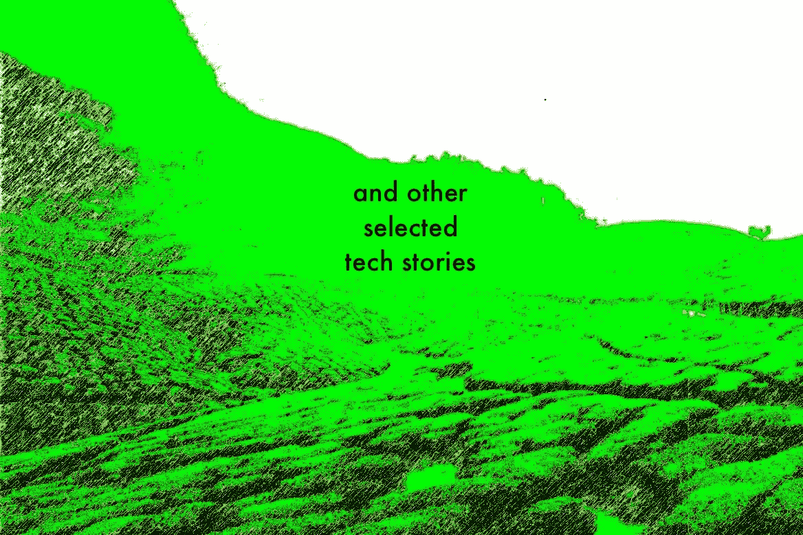
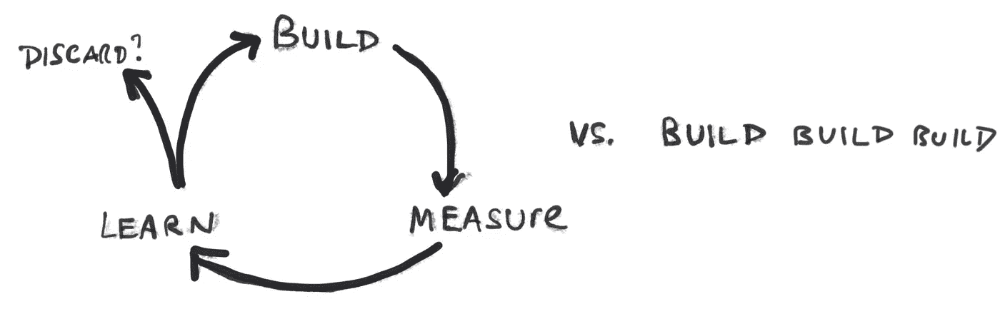

# 构建难忘的首次用户体验

> 原文：<https://medium.com/hackernoon/building-an-unforgettable-first-time-user-experience-8d1feaac2585>

# 亲爱的好奇的黑客午间读者，以下是本周末的十大科技故事:

💻💻💻💻💻💻💻💻💻💻

[**打造难忘的首次用户体验的精华指南**](https://hackernoon.com/the-quintessential-guide-for-building-an-unforgettable-first-time-user-experience-19720a7447d2)**[Wayne Chang](https://medium.com/u/fffaa52a0aa3?source=post_page-----8d1feaac2585--------------------------------)。**“***你可能会想，为什么一家初创公司会优先考虑在入职流程上花这么多时间，而不把这些时间投资在核心产品上。”***

**💻💻💻💻💻💻💻💻💻**

**[**现实世界的创业销售和营销(史诗般的自举指南第 5 部分)**](https://hackernoon.com/real-world-startup-sales-and-marketing-for-the-lost-and-the-clueless-part-5-of-the-epic-guide-to-87db07b436f5)**tam boo 创始人[克利福德·奥拉维奇](https://medium.com/u/55e9fd9a459?source=post_page-----8d1feaac2585--------------------------------)。如果你从这件事中学到了什么，一定要记住这一点:如果你没有接触到实际目标市场中的实际人群并与之产生共鸣，你只是在“玩创业游戏”。”****

****💻💻💻💻💻💻💻💻****

********

****[**速度更快。更快。更快。**](https://hackernoon.com/faster-faster-faster-231c7b3d088d) 由 Zendesk 产品经理 [John Cutler](https://medium.com/u/4c3f4fe11e6b?source=post_page-----8d1feaac2585--------------------------------) 负责。****

****💻💻💻💻💻💻💻****

****[**艾焦虑**](https://hackernoon.com/ai-anxiety-6f67810983aa) 作者[特里克劳利](https://medium.com/u/62c00a6ae513?source=post_page-----8d1feaac2585--------------------------------)。*“人类水平的智力并不是智力规模上的某个特殊的高原或高峰。尽管人类大脑令人惊叹——也许是已知宇宙中最复杂的装置——但它有一系列进化的偏见和严重的限制。无论是什么推动了人类大脑的爆炸式增长——有许多合理的理论——这种增长受到了与预先存在的结构、代谢成本、母亲健康和童年持续时间相关的严重限制和权衡。这些限制不适用于机器智能。”*****

****💻💻💻💻💻💻****

****[**律师不是你想的那样:如何(快速)完成一轮融资**](https://hackernoon.com/how-to-deal-with-lawyers-fa38e28f2531) 作者:风投交易撮合者[蒂姆·邓普西](https://medium.com/u/3c56b626b1d3?source=post_page-----8d1feaac2585--------------------------------)。*“律师不给商业建议。大多数律师都没有经营过公司，只对所涉及的任务和压力有咨询性的了解。企业家常常将协议视为机遇，而律师则将其视为债务的集合。*****

****💻💻💻💻💻****

****[**风险投资公司**](https://hackernoon.com/the-5-key-measurements-of-product-success-e53594aabb47) **[FirstMark](https://medium.com/u/30dea56d271f?source=post_page-----8d1feaac2585--------------------------------) 对产品成功的 5 个关键衡量指标** 。“你的客户对你产品的评价和他们的用户行为一样重要。在一天结束时，如果客户不愿意推荐你，那就不是产品世界的成功。通过利用客户调查，您可以将满意度等定性反应转化为可操作的定量指标。”****

****💻💻💻💻****

****从更大的角度来看,“加密泡沫”不是泡沫，而是…… 乘飞机逃离风险投资公司的合伙人[卢肯纳](https://medium.com/u/b01056393401?source=post_page-----8d1feaac2585--------------------------------)。*“20 年后，当加密技术像互联网一样颠覆了许多行业时，我们回顾以前激烈的加密价格波动，那些肯定会到来的波动将只是加密技术长期增长中的一个亮点。它们将是 crypto 巨大价值创造中的亮点。最重要的是，它们将是通往我们将要生活的更美好(分散化)星球的道路上的一点点。”*****

****💻💻💻****

****[**不要(总是)被你的跑道**](https://hackernoon.com/dont-always-be-haunted-by-your-runway-34d28430a5a2) 所困扰。大多数初创公司在融资后都有一个大约 18 个月的预期跑道，这意味着他们都有一个“死亡时间”，这可能会影响他们与潜在合作伙伴的互动****

****💻💻****

****[**创业招聘——去哪里找最优秀的人**](https://hackernoon.com/startup-recruiting-where-to-find-the-best-people-a1ac874710a5) 由斯特林路管理合伙人[灰锈](https://medium.com/u/582c1c98356d?source=post_page-----8d1feaac2585--------------------------------)。“没有一家公司是由创始人独自创立的。事实上，你需要雇佣一群才华横溢的人，才有机会实现这个目标。问题的第一部分是找到可能想在你的初创公司工作的最优秀的人。”****

****💻****

****[**脸书，新闻出版商，以及对视频的‘需求**](https://hackernoon.com/facebook-news-publishers-and-the-demand-for-video-2661580d0b8d) 由 TNW 社交媒体总监[马特纳瓦拉](https://medium.com/u/46979a673d6d?source=post_page-----8d1feaac2585--------------------------------)。“在我看来，脸书已经并仍在创造一种对视频的虚假‘需求’。视频看起来如此受欢迎只是因为脸书的算法让它如此受欢迎。它有意识地给我们展示越来越多的视频，因此视频浏览量也相应激增。现在并不是人们比以往任何时候都更需要或喜欢视频，而是脸书在他们的新闻订阅中强加给人们，这导致出版商感到有义务和压力去制作更多的视频。”****

****直到下一次，不要把世界的现实想当然。****

****诚挚的问候****

****[大卫·斯穆克](http://www.davidsmooke.net/)，[@阿米](http://twitter.com/ami)****