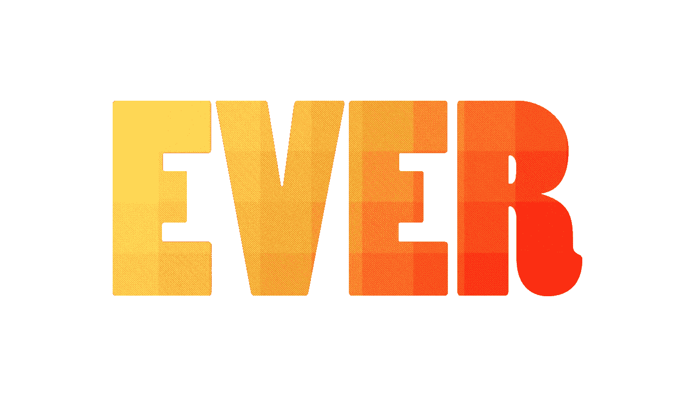
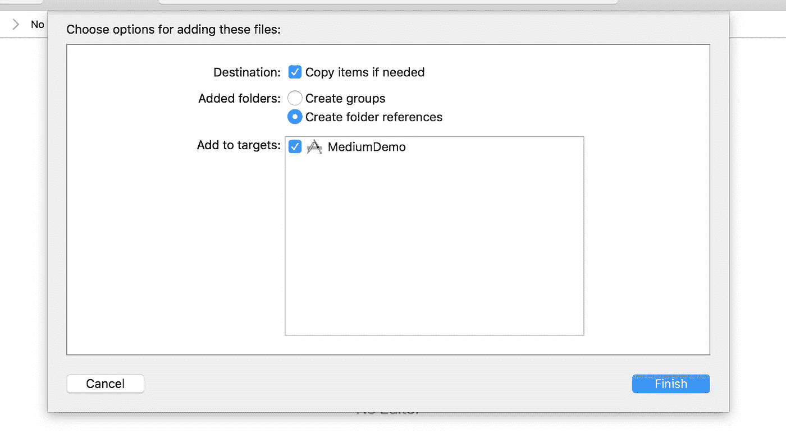
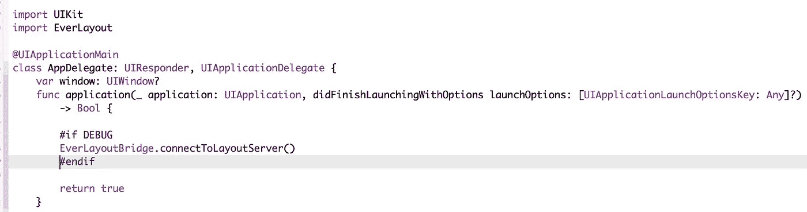
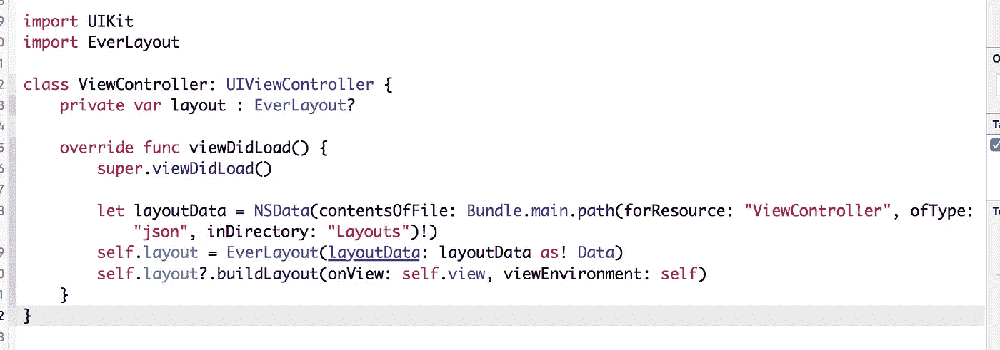
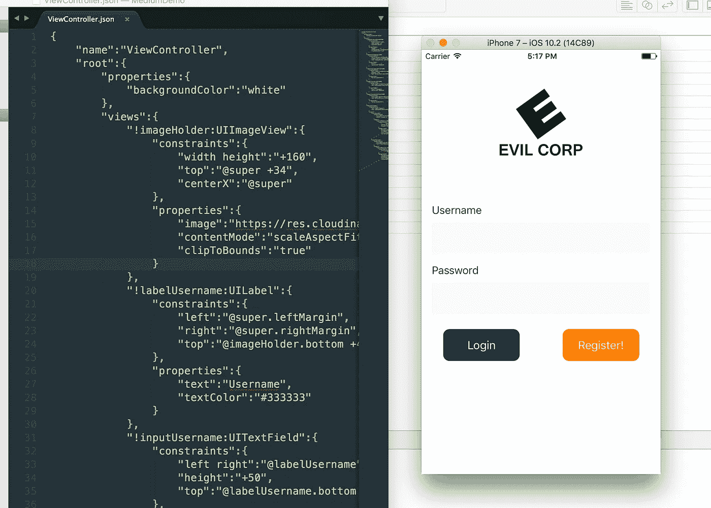
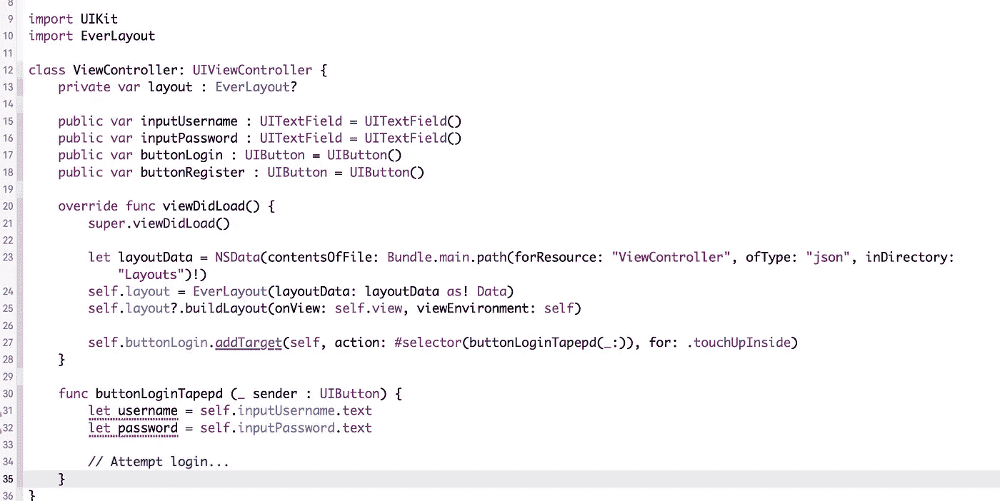

# 使用 EverLayout 构建和分发 iOS 布局

> 原文：<https://medium.com/hackernoon/building-and-distributing-ios-layouts-with-everlayout-c9ea41750f6>



EverLayout 是一个将 JSON/XML 数据转换成布局的 iOS 库。在这篇文章中，我想演示如何使用 EverLayout 为一个新的应用程序创建一个基本的登录视图。

为什么你想用 JSON 而不是 Xcode 的界面构建器来编写你的应用程序布局，或者仅仅使用普通代码？有几个原因:

*   用 [JSON](https://hackernoon.com/tagged/json) 编写的布局可以很容易地通过你的服务器分发，也可以通过你的应用程序下载。您可以根据自己的意愿随时更新应用布局，无需应用审核流程。
*   对于开发来说，EverLayout 将连接到一个本地服务器，当你更新布局文件时，这个服务器可以提供你的布局文件。这是实时布局设计/构建—您不需要重新编译您的应用程序来查看它的外观或行为。
*   用代码编写布局很笨拙。它在你的控制器和视图中占据了很大的空间，不容易阅读/可视化。数据结构中描述的布局更容易阅读，并且与控制器逻辑分开。

你可以从[文档](https://acrocat.github.io/EverLayout/)中找到更多关于使用 EverLayout 的信息。

# 入门指南

在这篇“教程”中，我将假设你知道如何创建一个新的 iOS 项目并使用 Cocoapods 安装框架。

一旦你建立了你的新项目，你可以像这样把 EverLayout 添加到你的 Podfile 中:

```
pod 'EverLayout'
```

对于实时布局构建，我将使用一个名为 [EverLayout Bridge](https://github.com/acrocat/EverLayoutBridge) 的配套工具。这个应用程序是一个基本的 node [HTTP](https://hackernoon.com/tagged/http) 服务器，它将与我们的应用程序通信，通过套接字发送布局更新。

要安装 EverLayout Bridge，请使用您的终端并运行:

```
npm install -g ever-layout-bridge
```

**注—** 如果你不熟悉 Node 或`npm`，你可能希望访问[https://nodejs.org/en/](https://nodejs.org/en/)了解更多信息(这是相当可怕的。)

# 配置应用程序

安装好一切后，我们要做的第一件事是配置我们的新应用程序与 EverLayout Bridge 对话。桥，当运行时，将监测我们的布局目录的变化，并将它们发送到应用程序。

让我们开始吧:

*   创建一个布局目录，并将其添加到您的应用程序中。

**注意—** 在我看来，Xcode 是一个非常糟糕的 JSON 编辑器，所以我建议使用其他东西。还有别的吗？然而，不是由 Xcode 创建的文件不会自动添加到应用程序的目标，除非我们创建一个指向我们的 Layouts 目录的文件夹引用。您需要将 Layouts 目录拖到项目导航器中，并将其添加为引用。



**注意—** 桥还可以通过将 GET 请求路由到 images 文件夹来为应用程序提供图像。然而，我们不需要为此费心，因为我们的示例将下载图像。

*   在您的项目目录中运行`ever-layout-bridge`来启动服务器。默认情况下，它会在端口`3000`上查找布局目录‘Layouts ’,但是这些选项可以用参数配置:`ever-layout-bridge --layouts="MyLayouts” --port=”1234”`
*   服务器现在正在监视我们的布局并等待我们的连接，这应该在我们的 AppDelegate 中启动。



```
import UIKit
import EverLayout
@UIApplicationMainclass AppDelegate: UIResponder, UIApplicationDelegate {var window: UIWindow?func application(_ application: UIApplication, didFinishLaunchingWithOptions launchOptions: [UIApplicationLaunchOptionsKey: Any]?) -> Bool {#if DEBUG
EverLayoutBridge.connectToLayoutServer()
#endif
return true
}
```

*   在这里，我正在导入 EverLayout 库，并在`applicationDidLoad`下初始化一个连接。

**注意** —只有在`DEBUG`模式下连接到网桥才有意义，这不是你在生产中想要的。

**双注** —您的 HTTP 服务器可能没有使用 SSL 证书，这意味着我们需要允许任意连接才能工作。如果你不确定如何做到这一点，请看这个 [StackOverflow 答案。](http://stackoverflow.com/questions/30731785/how-do-i-load-an-http-url-with-app-transport-security-enabled-in-ios-9)

*   编译应用程序，如果一切按计划进行，我们应该会在 Xcode 控制台和终端窗口中看到一条`connected`消息。

# 加载布局

现在我们的应用程序正在与服务器对话，我们希望在 ViewController 中加载一个布局。我知道我们实际上还没有编写布局，但这就是桥的全部目的——我们可以运行这个空白的应用程序，并在运行时构建它的布局！

*   在布局目录中创建一个`ViewController.json`文件。

```
{
 "name":"ViewController"
}
```

*   此文件包含名称属性很重要，因为它用于路由布局更新。
*   打开控制器文件，像这样加载布局:



```
import UIKitimport EverLayoutclass ViewController: UIViewController {private var layout : EverLayout?override func viewDidLoad() {super.viewDidLoad()let layoutData = NSData(contentsOfFile: Bundle.main.path(forResource: "ViewController", ofType: "json", inDirectory: "Layouts")!)self.layout = EverLayout(layoutData: layoutData as! Data)self.layout?.buildLayout(onView: self.view, viewEnvironment: self)}}
```

*   在`buildLayout`调用中，我们选择在控制器的视图上构建布局，但是使用`self`作为视图环境。这是因为控制器本身将包含我们将在布局文件中引用的属性。
*   **编译！如果一切顺利，这不会崩溃**

# 编写布局

如果您的应用程序正在运行，并且您已经看到了`connected`消息，我们可以运行一个快速测试来查看布局更新是否有效。

*   将您的`ViewController.json`更新为如下所示，然后点击保存。

```
{
 "name":"ViewController",
 "root":{
  "properties":{
   "backgroundColor":"orange"
  }
 }
}
```

这个基本布局是将橙色背景色应用到它的`root`，在我们的例子中是在控制器的视图中。您的应用程序应该如下所示:


现在，让我们创建一个真正的布局:

*   回到您的控制器，添加这 4 个属性

```
public let inputUsername : UITextField = UITextField()
public let inputPassword : UITextField = UITextField()
public let buttonRegister : UIButton = UIButton()
public let buttonLogin : UIButton = UIButton()
```

这些属性是我们的登录逻辑所必需的，其余的我们可以用 JSON 构建。

*   从[这里](http://pastebin.com/U45j1qyt)复制 JSON 布局，并粘贴到你的布局文件中。点击保存和繁荣…我们有一个应用程序！



EverLayout 在控制器中找到了文本输入和按钮视图，并对它们应用了一组属性和布局约束。然而，我们不必为 logo 甚至输入标签创建属性——它们在布局中有描述，EverLayout 可以动态创建它们！我们不太可能在任何逻辑中需要这些属性，那么为什么我们要在控制器中看到它们呢？

*   我们登录页面剩下的唯一一件事就是连接我们的按钮:



# 就这样

这就是 EverLayout 的工作方式！注意，在你启动的时候下载你的应用程序的 logo 并不是一个好的做法，但是我认为这是一个很好的展示，展示了它的强大之处。

EverLayout 仍然是一项正在进行的工作，并且在很大程度上是一项实验，如果你有兴趣了解更多关于这个项目的信息，你可以查看它的 [GitHub](https://github.com/acrocat/EverLayout) 和 [Docs](https://acrocat.github.io/EverLayout/) 。

感谢阅读！

[](http://bit.ly/HackernoonFB)[](https://goo.gl/k7XYbx)[](https://goo.gl/4ofytp)

> [黑客中午](http://bit.ly/Hackernoon)是黑客如何开始他们的下午。我们是这个家庭的一员。我们现在[接受投稿](http://bit.ly/hackernoonsubmission)并乐意[讨论广告&赞助](mailto:partners@amipublications.com)机会。
> 
> 如果你喜欢这个故事，我们推荐你阅读我们的[最新科技故事](http://bit.ly/hackernoonlatestt)和[趋势科技故事](https://hackernoon.com/trending)。直到下一次，不要把世界的现实想当然！

