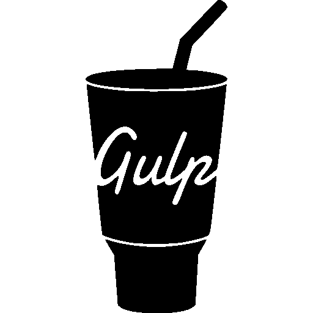
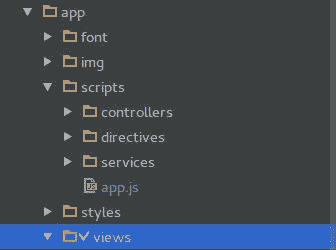
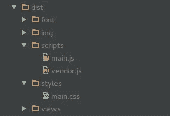

# 用大口营造角度发展环境

> 原文：<https://medium.com/hackernoon/building-angular-development-environment-with-gulp-230df2f2f6ca>



为[角度](https://hackernoon.com/tagged/angular)应用程序建立一个舒适的开发环境有时可能是一项复杂的任务。应该考虑许多问题，主要是:

*   复制 HTML 文件
*   连接、注释和最小化。js 文件
*   最小化并复制 CSS 文件
*   复制图像和字体
*   从包管理器(尤其是 bower)注入依赖性

幸运的是,[T3 可以解决上面提到的所有任务。我不会涵盖开发者通过](http://gulpjs.com/)[大口](https://hackernoon.com/tagged/gulp)和它的强大插件所能达到的所有能力，但是任何没有以前大口背景的人都可以用这篇文章来建立他的第一个开发环境。

所以，不再拖延，让我们开始吧！

## 第一步

现在，让我们创建一个新的项目文件夹，并定义我们项目的架构。我通常使用文件夹来存放脚本(带有用于角度指令、服务和控制器的子文件夹)、样式表、视图(HTML 文件，可能根据每个应用程序的功能划分为相关的文件夹——取决于项目的规模)、图像和字体，在文档根有一个**index.html**文件。基本上，结构如下所示:



Folder tree structure for a simple angular app

我们到了。从这一点上，我们需要开始了解大口是如何工作的。继续用 [**npm**](https://www.npmjs.com/) **安装。**

> **$ npm 安装大口**

在应用程序的文档根中创建一个 glut file . js 文件。让我们从一个基本的任务开始——将所有 html 文件从“views”文件夹复制到我们的“dist”文件夹(这将是我们的生产就绪(嗯，说得难听点)应用程序版本的根文件夹)，同时保留文件/文件夹结构。

```
var gulp = require('gulp'); // import the gulp module itselfgulp.task('copy-html-files', function () {
    var stream =  gulp.src('./app/views/**/*.html') *// stream source*
        .pipe(gulp.dest('./dist/views/')); *// copy to dist/views*
    return stream;
});
```

然后你就跑了

> **$大口拷贝-html-文件**

在你的终端里。

这里喝什么？它带走了所有。应用程序/视图文件夹中的 html 文件，并将它们复制粘贴到 dist 目录中，同时创建与以前结构相似的文件夹。

现在让我们深入探讨一些更复杂的任务。

## 介绍大口-用户界面

假设我们想把我们所有的。css 文件，缩小并连接成一个单一的文件。我们将使用[**gulp-useref**](https://www.npmjs.com/package/gulp-useref)**进行串联和源接，[**gulp-minify-CSS**](https://www.npmjs.com/package/gulp-minify-css)**进行缩小， [**gulp-if**](https://github.com/robrich/gulp-if) 进行条件语句。css 非常简单，你只需要用管道在流上调用它。gulp-if 也不难:它只接受一个字符串参数作为条件(过滤满足这个特定条件的文件),如果条件为真，只执行任务**和**。相反，gulp-useref 有一个非常方便而且(老实说)非常棒的用法:它允许将依赖文件注入到 html 文件中，并告诉 useref 将什么内容放入流中进行连接。让我们来看看根目录下 index.html 文件的一个示例:****

```
**<!-- build:css styles/main.css -->
<link rel="stylesheet" href="styles/custom-css-file.css">
<link rel="stylesheet" href="styles/some-plugin-css-file.css">
<!-- endbuild -->**
```

****开始和结束这一部分的注释只是告诉 gulp-useref 链接的文件将被放入一个流中，连接并复制粘贴到 dist/styles/main.css 文件中。下面是这个操作的 gulpfile.js 代码:****

```
****var** useref = require('gulp-useref');
**var** minifyCss = require('gulp-minify-css');
**var** gulpif = require('gulp-if');gulp.task('css-files', **function** () {
    **var** stream = gulp.src('./app/index.html')
        .pipe(useref()) *//take a streem from index.html comment*
        .pipe(gulpif('*.css', minifyCss())) *// if .css file, minify*
        .pipe(gulpif('*.css', gulp.dest('./dist'))); *// copy to dist*
    **return** stream;
});**
```

****这将在 dist/styles 中创建一个 main.css 文件，包括 comments 标记之间所有 css 文件的缩小版本。****

## ****不仅仅是 css:从包管理器注入依赖项****

****您不仅可以使用 useref 管理定制文件，还可以从包管理器(npm，bower…)注入依赖项。我个人更喜欢 [**鲍尔**](https://bower.io/) ，在这里我会举一个例子。****

****假设我们的项目需要[](https://angular.io/)**和 [**jQuery**](https://jquery.com/) 。继续用 bower 安装它:******

> ******$ bower 安装角
> $ bower 安装 jquery******

****bower 将在您的文档根目录下创建一个 bower_components 文件夹。现在，我们将使用 [wiredep](https://www.npmjs.com/package/wiredep) 将这些依赖项注入到我们的 index.html 文件中，并将它们连接/美化成一个 vendor.js 文件。我们会用 [**ngAnnotate**](https://www.npmjs.com/package/gulp-ng-annotate) 和[ugly](https://www.npmjs.com/package/gulp-uglify)。****

> ******$ npm 安装囫囵吞下
> $ npm 安装电线
> $npm 安装囫囵吞下******

****现在，在我们的 index.html 档案中:****

```
**<!-- build:js scripts/vendor.js --> *// concatenate to vendor.js*
<!-- bower:js --> *// tells wiredep to inject all bower dependencies*

<!-- endbower -->
<!-- endbuild -->**
```

****并为 bower 文件创建一个任务:****

```
****var** wiredep = require('wiredep').stream;
**var** uglify = require('gulp-uglify');
**var** ngAnnotate = require('gulp-ng-annotate');gulp.task('bower-files', **function** () {
    **var** stream = gulp.src('./app/index.html')
        .pipe(wiredep({
            directory: 'bower_components' *//inject dependencies*
        }))
        .pipe(useref())
        .pipe(gulpif('*.js', ngAnnotate())) *// ng-annotate if .js*
        .pipe(gulpif('*.js', uglify())) *// uglify if .js*
        .pipe(gulpif('*.js', gulp.dest('./dist'))); *// paste to dist*
    **return** stream;
});**
```

****然后跑****

> ******$一饮而尽鲍尔-files******

****所以，就这样吧！我们的 bower 依赖项被成功地包含在一个 vendor.js 文件中并被压缩。****

## ****任务太多****

****所以，当我要部署我的项目时，我必须一个接一个地运行所有这些任务。—可能是初学者显而易见的问题。你当然不知道。你只需使用 [**吞咽-运行-序列**](https://www.npmjs.com/package/gulp-run-sequence) 。它允许您在终端的一个命令上运行几个任务。****

> ******$ npm 安装吞咽运行序列******

****在 gulpfile.js 中实现一个序列:****

```
****var** runSequence = require('run-sequence');*/* some other plugins go here */**/* define our tasks here */*gulp.task('build', **function** (callback) {
    runSequence(
        'css-files',
        'bower-files',
        'copy-html-files',
        /* other tasks maybe */
    callback);
});**
```

****现在快跑****

> ******$一饮而尽建******

****这将执行作为字符串传递给 runSequence 的任务。****

******注意一件重要的事情:** run-sequence 异步执行任务*，*意味着它们将(几乎)同时开始并被并行执行。因此，如果您的任务可能依赖于要完成的其他任务，它们在按顺序运行时可能会导致意外行为。为了避免这种情况，您应该从任务函数返回流。就像这样:****

```
**gulp.task('some-task', function(){
      var stream = gulp.src('some-source') *// save the stream
      /* do some stuff here */* return stream; *// return the stream so task can be run* }); *// in queue***
```

****这将有助于您避免运行序列中的任何不愉快的问题。****

******全部去掉！******

****有时，您可能需要删除 dist 文件夹中的内容。在您正常的开发生命周期中，每当您做出更改时，您都必须这样做——就在您再次开始复制文件之前！(参见下一节)****

****[**大口-干净**](https://www.npmjs.com/package/gulp-clean) 就是你要的东西。****

> ******$ npm 安装大口清洁******

****现在定义一个简单的任务:****

```
**var clean **=** require('gulp-clean');gulp.task('clean', function () {
        var stream =  gulp.src('./dist', {read**:** false})
                      .pipe(clean());
        return stream
});**
```

****这将安全地删除您的 dist 文件夹中的所有内容。****

****来自官方文件:****

> ****选项 read:false 防止 gulp 读取文件的内容，并使这项任务快得多。如果需要在同一个流中清理文件及其内容，请不要将 read 选项设置为 false。****

## ****自动化？****

****这么说，每次我对项目文件进行更改时，我都必须运行大量任务？，可能是另一个明显的初学者问题。不，你不需要。事实上，你不应该。 [**一饮而尽——观看**](https://www.npmjs.com/package/gulp-watch) 解决问题。继续安装它:****

> ******$ npm 安装吞咽式手表******

****设置任务和其他事情一样简单:****

```
**gulp.task('watch', **function**() {
    gulp.watch('./app/**/**/*.*', **function** () {
        runSequence('task1', 'task2', ...);
    });
});**
```

****这将在您每次更改文件时，重新执行您在运行序列中定义的任何命令。****

****这是一个调用 gulp 后 dist folder 的外观示例。如您所见，文件夹结构被保留，但是。css 和。js 文件已被连接。****

********

****A look on the document-folder tree after gulp****

## ****一些提示****

****您可能会尝试为每个部署特性创建任务，按顺序运行它们，并设置一个观察器。但是要小心！每次进行更改时，连接和缩小大量文件非常耗时。在一个大规模的项目中，这有时会花费 10 到 15 秒的时间，这真的会减慢你的开发速度。为此，我更喜欢创建某种“迷你”版本的任务(只是基本的复制粘贴和/或可能是连接和依赖注入)和一个吞咽观察器，以及一个生产版本，这是缓慢的，只是缩小一切，不打开观察器。这将允许您避免减慢您的工作速度，并且有能力创建一个很酷的、微小的、生产就绪版本的开发环境。****

******总结******

****如果可以自动化的话，不要徒手做任何工作。gulp.js 是一个很好的工具，使用非常广泛，简单方便。觉得有兴趣？下面是 github 上我自己版本的 gulpfile 的链接，我每天都在使用它:****

****[](https://github.com/Armenvardanyan95/gulpfile.js) [## Armenvardanyan95/gulpfile.js

github.com](https://github.com/Armenvardanyan95/gulpfile.js)****