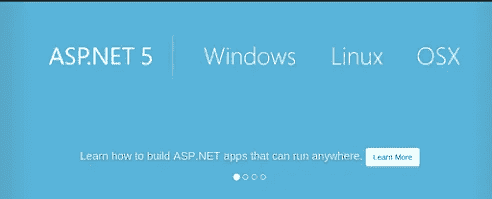
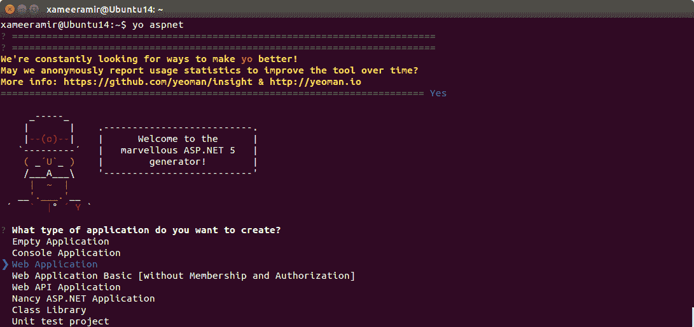
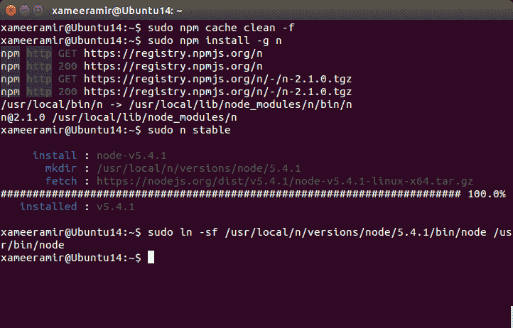
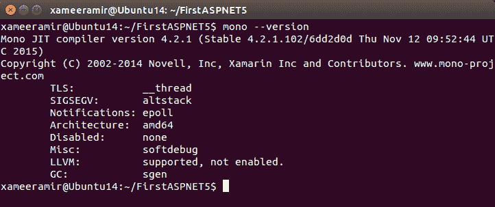
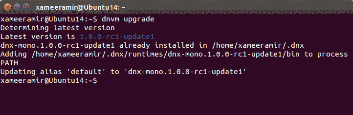

# 在 Ubuntu linux 上构建 ASP.NET 5

> 原文：<https://medium.com/hackernoon/building-asp-net-5-on-ubuntu-linux-e69837ebcf88>

在[配置后。在 Ubuntu Linux](http://xameeramir.github.io/configure-net-ubuntu-linux/) 上运行. NET 时，我在寻找开始使用 [Visual Studio 代码](https://code.visualstudio.com/docs/runtimes/ASPnet5)在 [Ubuntu 14.04 Linux](http://releases.ubuntu.com/14.04/) 上开发[ASP.NET vNext](http://www.asp.net/vnext)项目的方法。所以，让我们开始吧。

# 搭建 ASP.NET 项目

由于到目前为止[代码](https://code.visualstudio.com/)中没有**文件** - > **新项目**设施，我们可以使用 [MonoDevelop](http://www.monodevelop.com/) 或者替代方案如 [Yeoman](http://yeoman.io/) 、ASP.NET[generator](https://hackernoon.com/tagged/generetor)、bower 和 gulp。

Yeoman 是现代网络应用的脚手架工具。使用[节点](http://xameeramir.github.io/install-node/)安装 ASP.NET 发电机、bower 和 gulp，使用以下命令:

`sudo npm install -g yo generator-aspnet gulp bower`

**搭建 ASP.NET 5 项目:**

*   运行`yo aspnet`
*   选择**网络应用**

*   在**上给你的项目命名你的 ASP.NET 应用程序叫什么名字？**提示，我将其命名为`FirstASPNET5`
*   转到项目文件夹，在本例中使用`cd FirstASPNET5`
*   使用`dnu restore`安装必要的 [NuGet](https://www.nuget.org/) 包
*   使用`dnx web`运行项目

项目将[在](https://lh3.googleusercontent.com/IIl36_X3S5-bs3qkLqTH_DN8vuUkKLf3QuTuVnlhdTgFwQv9xHYl70lveYXoYN6tBgch5kjYJrQgQk7uUMbb6lrmT5xoSZuXyLJdvmnd_Ly-RkYs0TgMYwrMMKsUALUFr5OoxPKmozc_vvcyJGuODf6cA52H-CbJ1eGbi0_wMvKCDv0EVmLqX342Q2t8qXQYTNZ9Q5DZojlrk9iYQGeM-rh-pwkh83hF9JVOZlCxOmiPoZfeEf7xIc6yTWiGOEHyd4j4FRQDsZbd7fIaWm5VeJIrZmXqBlEmpKqgQMdHDHHGw-Yxj3OG7oH7vsyUDkk88c2rly56eQhQLaaE0UsbDEPAVpzS6vKDQ3QbbrkNwJyBb5lKJH2GdhvUBqJkShMSpeS3yPZF310f_kv6rJIr6fE_bKl2XcQGUYp_ANzuxPYS9Ueptq9oubNAHD5j6GJyC7mSW8cw4OAGAMXeh21XnlddqZAm5S35XlKtkp0bXqOd9e6i3vA3iRPmDwnysRrYCyeCigw9tnZt35DUjXBlY-5SlsCU_wosAGl5W7knmt8TcyA6V0WOfUeeReu6ryttseE4=w722-h462-no) [http://localhost:5000](http://localhost:5000/) 开始运行。

# 解决纷争

> *边注:用 VS 代码* *运行 ASP.NET 似乎有些* [*的问题。*](https://github.com/Microsoft/vscode/issues/2659)

如果出现错误，[升级 npm](http://askubuntu.com/a/480642/219603) 。在我的具体例子中，`<VERSION>`是`5.4.1`:

使用`mono --version`确保 Mono 是最新的:

还要检查`dnvm`(。NET 版本管理器)是最新的或者没有使用`dnvm upgrade`，如果不是就升级:

在每个部分都适合这个地方之后，类似这样的东西就会出现:

[照片](https://goo.gl/photos/GVXrTLg9ugg1h5t97)

*原载于*[*xameeramir . github . io*](http://xameeramir.github.io/building-asp-net-5-ubuntu-linux/)*。*