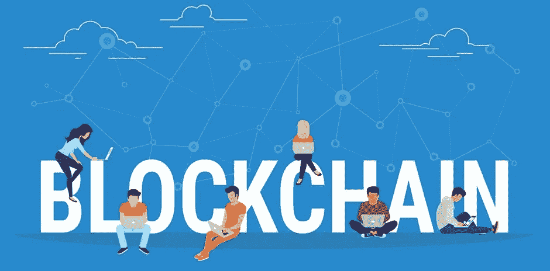
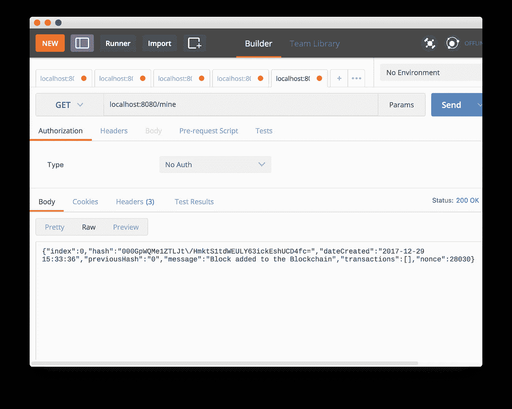
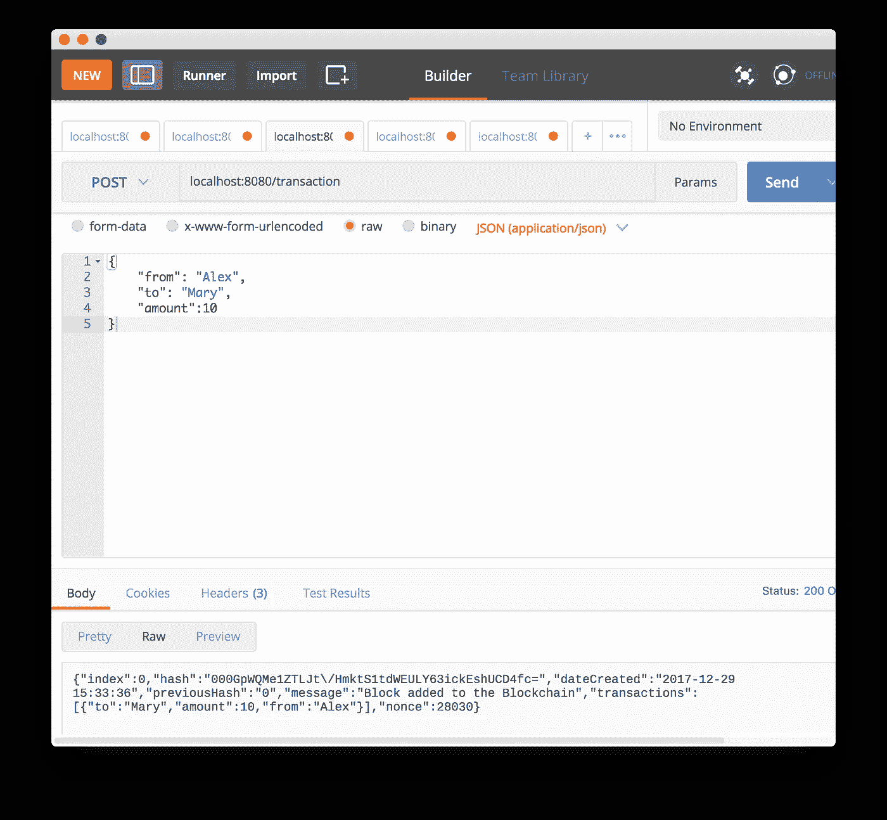
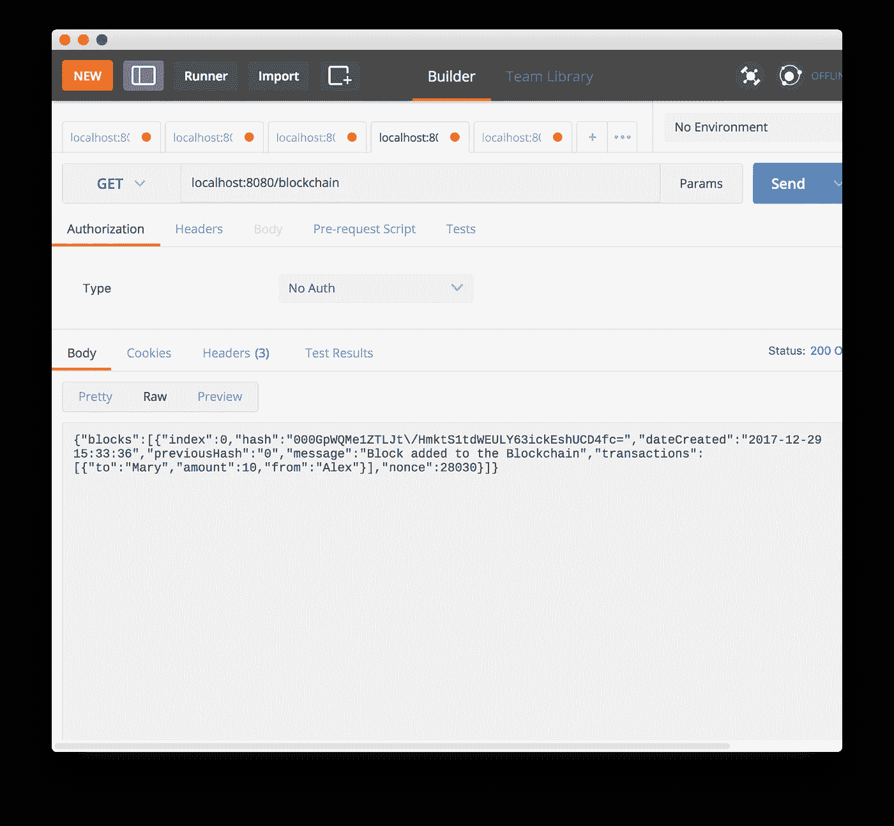
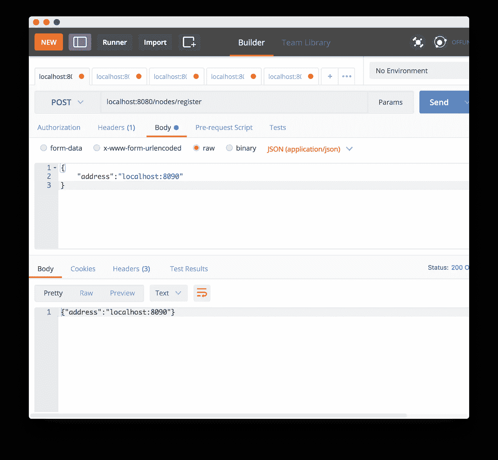
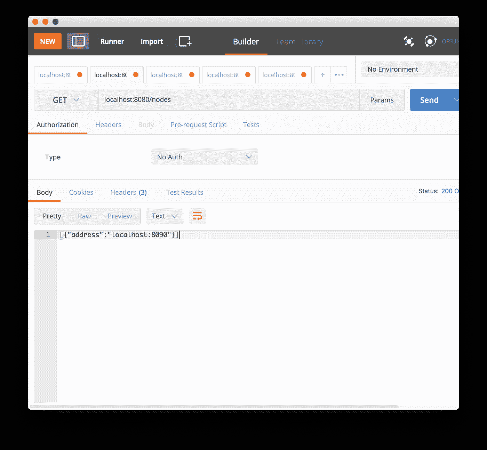
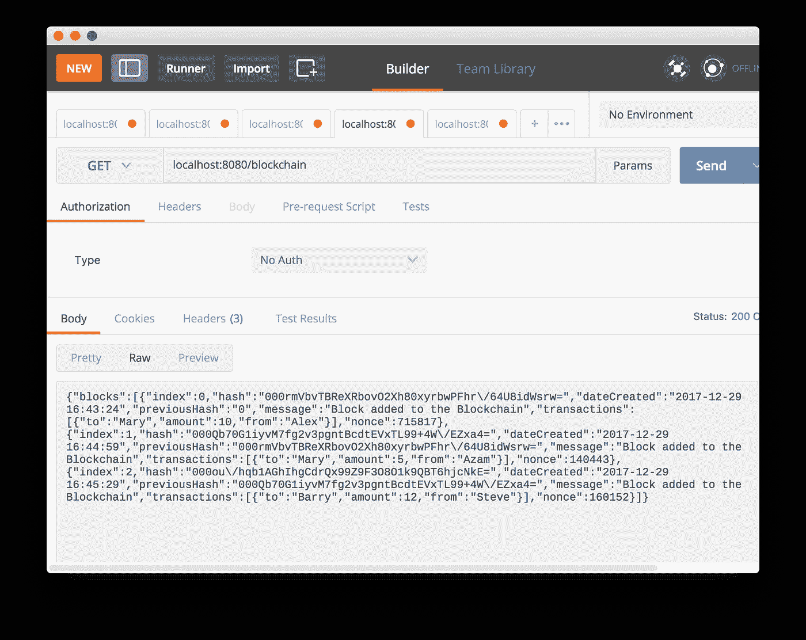
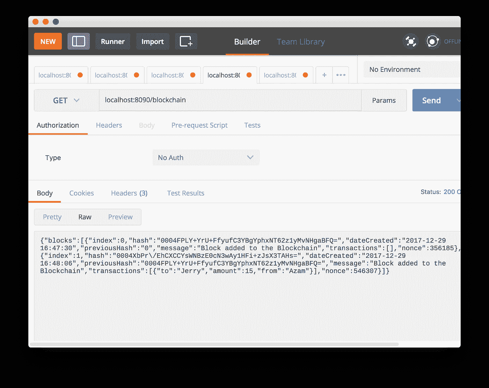
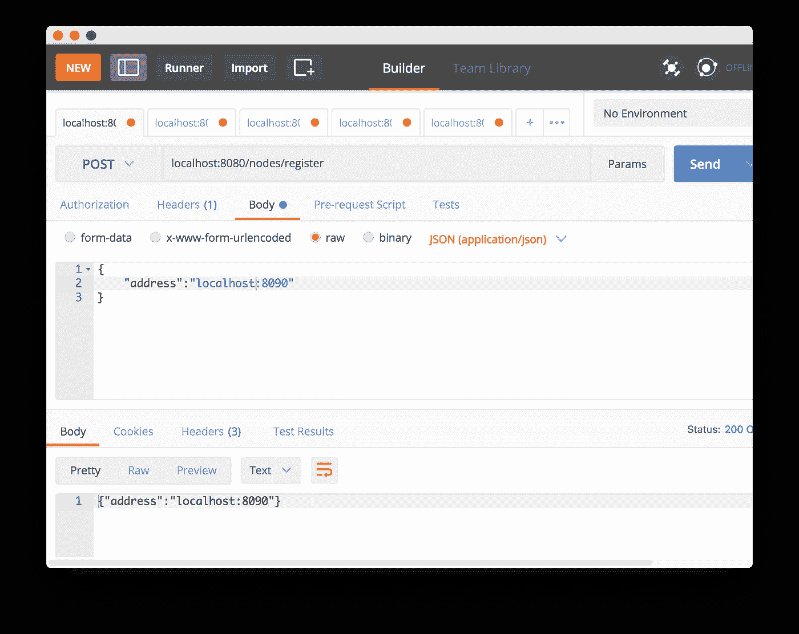
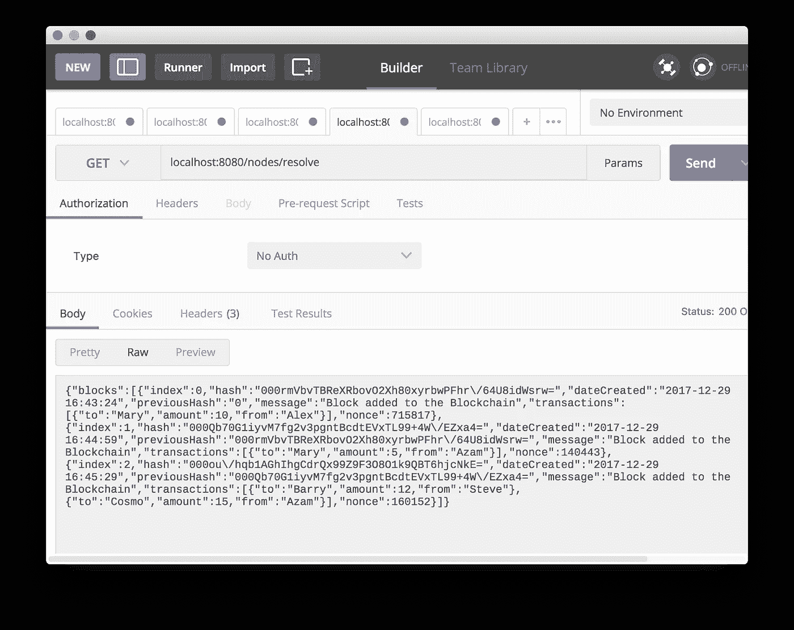

# 使用 Swift 和 Vapor 构建区块链 Web API

> 原文：<https://medium.com/hackernoon/building-blockchain-web-api-using-swift-and-vapor-2daf599c8449>



[http://media2.govtech.com/images/940*464/shutterstock_blockchain.jpg](http://media2.govtech.com/images/940*464/shutterstock_blockchain.jpg)

**更新**:我很自豪地宣布，我的新课程“[区块链](https://hackernoon.com/tagged/blockchain) [使用 Swift 在 iOS 中编程](https://hackernoon.com/tagged/programming)”现已推出。[立即注册](https://www.udemy.com/blockchain-programming-in-ios-using-swift/?couponCode=BLOCKCHAINMEDIUM)，仅需 10.99 美元。

在我的上一篇[帖子](https://hackernoon.com/blockchain-programming-in-ios-ffaff9b328cc)中，我用 Swift 语言讨论了区块链的基本实现。在这篇文章中，我将使用服务器端 Swift 框架 Vapor 将区块链实现到云中。我们将在 HTTP 协议上构建区块链 Web API，使用不同的路径提供必要的功能。这篇文章假设你已经在电脑上安装了 [Vapor](https://vapor.codes) 框架，并且具备 Swift 语言的基础知识。

## 实现模型

第一步是为区块链 Web API 创建必要的模型。这些模型将包括以下内容。

**块**:一个块类代表一个单独的块，它可以包含由事务表示的输入和输出。

块类的属性解释如下:

*   **索引—** 区块在区块链中的位置。索引为 0 意味着该块是区块链中的第一块。指数为 1 表示它是区块链中的第二个区块..你的想法是对的！
*   **创建日期** —创建块的日期
*   **previousHash** —前一个块的哈希值
*   **哈希** —块的当前哈希
*   **消息** —附在每个块上的备忘录。这只是为了我们的目的
*   **nonce** —自动递增的数字，在挖掘散列时起着重要作用
*   **事务** —事务的数组。每笔交易都代表一次货物/价值的转移
*   **关键字** —这是传递给哈希函数的计算属性

**交易**:交易由汇款人、收款人和转账金额组成。实现如下所示:

**事务**类是不言自明的。它由起始、终止和金额字段组成。为了简单起见，我们将对 from 和 to 字段使用虚拟名称，实际上这些字段将由 wallet ID 组成。

**区块链**:区块链是表示区块列表的主类。每个块都指向链中的前一个块。每个块可以包含多个交易，代表贷项或借项。

每个模型都遵循可编码协议，这使得它可以很容易地转换成 JSON 表示的对象。如果您已经阅读了[的上一篇](https://hackernoon.com/blockchain-programming-in-ios-ffaff9b328cc)文章，那么上面的实现非常相似。下一步是为我们的 Web API 配置路由，这是在新的章节中使用 Vapor 框架实现的。

## 使用 Vapor 实现 Web API

使用 Vapor 实现 Web API 有几种不同的方式。我没有在 Routes 类中添加所有代码，而是添加了一个自定义控制器来处理所有的区块链请求。**区块链控制器**的实现如下所示:

我们将从 Web API 的三个基本端点开始。

*   **挖掘**:这个端点将启动挖掘过程。挖矿会让我们满足工作证明，把区块加入区块链。
*   **事务**:该端点用于添加一个新的事务。交易将包含关于发送者、接收者和金额的信息。
*   **区块链**:这个端点返回完整的区块链。

**区块链控制器**使用**区块链服务**来执行所需的操作。BlockChainService 的实现如下所示:

让我们来看看 Web API 端点。启动 Vapor 服务器，并向“ **mine** ”端点发送请求。



Mining a New Block

工作证明算法生成一个以“ **000** ”开始的哈希值。一旦块被挖掘出来，我们就通过将它转换成 JSON 格式来返回它。这是通过使用 Swift 4.0 可编码协议来执行的。

现在，我们可以将事务添加到区块链中。这是一个简单的交易，从亚历克斯向玛丽转账 10 美元。



New Transaction

最后一步是用新添加的块检查我们的区块链。访问端点“**区块链**”查看完整的链。



Blockchain

万岁！我们的区块链 Web API 现在工作正常。

不幸的是，区块链的要点是去中心化，目前，我们没有任何机制来添加新的节点。在下一节中，我们将更新我们的区块链实现，以便它可以支持多个节点。

## 向区块链添加节点

在允许区块链添加新节点之前，我们必须定义一个节点是什么样子的。节点模型的实现如下所示:

**BlockChainNode** 类只包含一个代表节点服务器 URL 的**地址**属性。我们更新了 BlockchainController，添加了注册新节点的功能。如下所示:

BlockchainService 也会得到更新，以适应新节点的注册。

让我们继续进行测试。启动新的 Vapor 服务器并尝试注册新节点。



Register a New Node

一旦注册了节点，您就可以使用节点端点获取它，如下所示:



Fetching All Nodes

现在，我们可以注册新节点了，我们应该集中精力解决节点之间的冲突。当一个节点上的区块链比其他节点大时，就会发生冲突。在这种情况下，我们总是采用相邻节点并用较大的区块链更新它们。

## 解决节点之间的冲突

为了产生冲突，我们需要运行第二台服务器或在单独的端口上运行服务器。我们将使用后一种方法，在不同的端口上启动 Vapor 服务器。两个节点启动后，我们将在两个节点上创建事务，这将向区块链添加数据块。最后，我们将调用一个 resolve 端点来解决节点之间的冲突，并将节点更新到更大的区块链。

BlockchainController 已更新，添加了用于解决冲突的新端点。

我们使用了 Vapor 框架的异步响应特性，这将允许我们异步处理响应。BlockchainService 也已更新，以支持冲突解决。实现如下所示:

**resolve** 函数遍历节点列表并获取每个节点的区块链。如果区块链大于当前的区块链，那么它会用较大的那个替换区块链，否则它会返回当前的区块链，也是较大的那个。

为了进行测试，让我们在不同的端口上启动两个服务器，并在端口 **8080** 上添加两个事务，在 **8090** 上添加三个事务。您可以通过发出以下命令，使用终端启动 Vapor 服务器。

```
vapor run serve -— port=8090
```

我们在端口 8080 节点上添加了三个事务，如下所示:



Blockchain on Port 8080

之后，我们在端口 8090 节点上添加了两个事务，如下所示:



Blockchain on Port 8090

确保使用 8090 地址注册节点，如下所示:



Registering a Node

最后，是时候测试我们解决冲突的终点了。通过在您的 Postman 中访问“ **resolve** ”端点来调用它，如下所示:



Resolve End Point Returning Larger Blockchain

如您所见，解析端点返回较大的区块链，并更新其他节点的区块链。这就完成了我们的冲突解决场景。

[ [Github](https://github.com/azamsharp/BlockchainWebAPI) ]

这篇文章基于 Daniel Van Flymen 的一篇精彩文章“通过建造一个来了解区块链”。

我希望你喜欢这个帖子。我目前正在制作一个 Udemy 课程，主题是“iOS 中的**区块链编程”。你可以点击[这里](https://gum.co/sFOao/blockchainfree)订阅课程发布时的通知。**

如果你想支持我的写作和捐赠，请访问我的[课程](http://www.azamsharp.com/courses)页面，在 Udemy 上购买我的精彩课程。

谢谢，祝编程愉快！