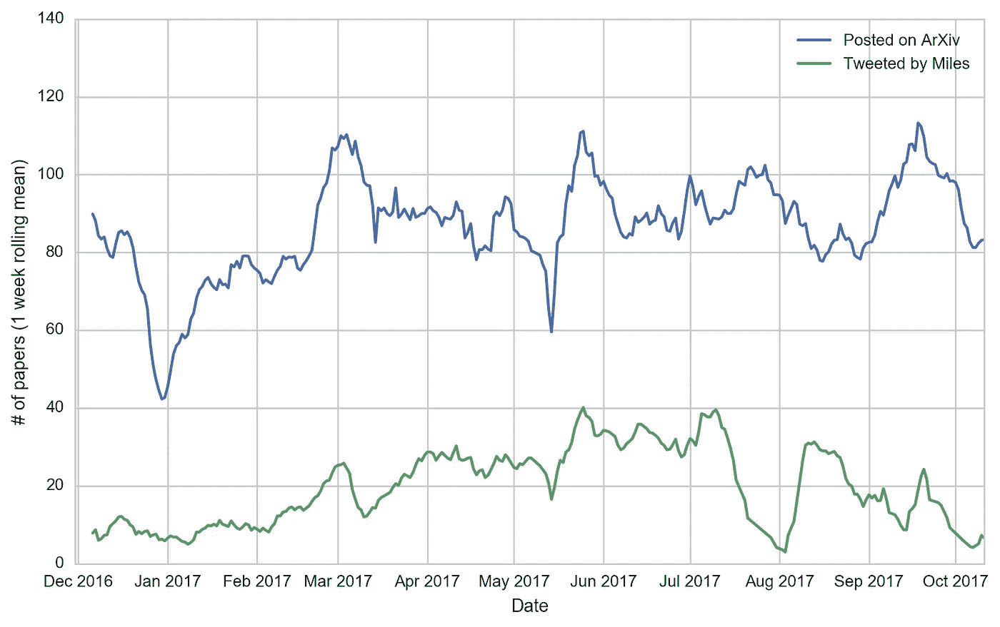

# 建筑 Brundage 机器人

> 原文：<https://medium.com/hackernoon/building-brundage-bot-10252facf3d1>

## 训练神经网络以跟上 ArXiv 上的最新 ML 论文

## TL；速度三角形定位法(dead reckoning)

我创建了一个模型来预测 Miles Brundage 会发哪些 arXiv 论文，并把它变成了一个 Twitter 机器人。它以 0.7 的精度和 0.6 的召回率预测迈尔斯的推文。代码可在[这里](https://github.com/amauboussin/arxiv-twitterbot)获得。

## 背景

随着 arXiv 越来越受欢迎，来自世界各地的研究人员一有新想法就发布预印本，而不是等待会议或同行评审。每周都有数百份与 ML 相关的预印本发表，所以浏览所有的摘要来找出哪些是与你的兴趣相关的、新颖的、没有重大方法错误的是非常耗时的。

驾驭永无止境的预印本流的最佳方式是人类策展人。我个人关注几十个 Twitter 账户，几十个 ML 社区的人，以及几封电子邮件时事通讯，这些邮件通讯发布了最近的论文(丹尼·布里兹的[人工智能中的狂野一周](https://www.getrevue.co/profile/wildml)和杰克·克拉克的[进口人工智能](https://jack-clark.net/)是我的两个最爱)。这对于找到本周最突出的预印本很有效，但是它没有抓住有趣研究的长尾。大多数人都很忙，一周不会策划超过几篇论文，这是可以理解的。

唯一的例外是迈尔斯·布伦戴奇。迈尔斯是推特 arXiv 预印本的迈克尔·乔丹。他每周几次在 Twitter 上发布 20-50 篇文章。自 2017 年初以来，他已经发布了近 6000 条 arXiv 链接。一天超过 20 个。他的推文每周都会可靠地找出一些有趣的论文，否则我是不会看到的。

过了一会儿，我开始想:迈尔斯是如何选择所有这些论文的？他的过程可能自动化吗？迈尔斯在推特上回答了第一个问题:

我创造了 Brundage Bot 来回答第二个问题。

## 收集数据集

首先，我使用 Twitter API 下载了 Miles 的所有推文，并解析了所有指向 arxiv.org 的链接。然后，我使用 arXiv API 从 Miles 提到的类别中下载每篇论文的元数据，查看:

```
cs.* (Computer Science - All subcategories)
cond-mat.dis-nn (Physics - Disordered Systems and Neural Networks)
q-bio.NC (Quantitative Biology - Neurons and Cognition)
stat.CO (Statistics - Computation)
stat.ML (Statistics - Machine Learning)
```

arXiv API 返回每篇论文的标题、摘要和作者。我通过每个 URL 中的 arXiv ID 将两个数据集连接在一起。截至今天，该数据集包含 27k 篇论文，其中约 5800 篇(21.5%)被 Miles 发布。这张图表显示了每天有多少篇论文在 arXiv 上发表，以及有多少篇论文在 tweeted 上被转发:



# 我们能预测 Miles 会发什么微博吗？

接下来，我想看看是否有可能使用来自 arXiv API 的信息(标题、摘要和作者)来预测 Miles 是否会在 tweet 上发布一篇论文。

## 基线模型

我将每篇论文的标题与其摘要连接起来，并从文本中创建了 [tf-idf](https://en.wikipedia.org/wiki/Tf%E2%80%93idf) n-gram 特征(直到三元模型)。然后，我将代表论文作者和 arXiv 类别的 one-hot-encoded 向量连接起来。我过滤掉了在训练集中出现不到 30 次的 n-grams(从大约 25k 的总摘要中)和出现不到 3 次的作者。这留下了大约 17k 个特征。

最后，我拿出随机选择的 10%的数据作为测试集，并使用 sklearn 训练逻辑回归。我添加了 L1 正则化(通过交叉验证选择参数)和类加权损失损失，以帮助处理大量的特征和类不平衡。

**结果:**

精确度是 0.71，召回率是 0.51。换句话说，基于逻辑回归的 Brundage 机器人发了 Miles 发的 51%的文章。该机器人发布的 71%的论文实际上是由迈尔斯发布的(如果这没有意义，维基百科上有一个关于精确度和召回率的很好的[视觉解释)。](https://en.wikipedia.org/wiki/Precision_and_recall)

大约 900 个特征拾取非零系数(由于 L1 正则化，大多数为 0)。以下是 n 元语法特征的最大系数:

最正的系数(迈尔斯更有可能在推特上发布论文)

```
1\. learning
2\. mdps
3\. neural
4\. adversarial
5\. training
6\. deep
7\. tasks
8\. fairness
9\. recurrent
10\. generative
11\. human
12\. answering
13\. dataset
14\. reinforcement
15\. rl
16\. artificial intelligence
17\. variational
18\. sgd
19\. neural networks
20\. dnn
21\. humans
22\. trained
23\. shot
24\. bias
25\. generate
```

大多数负系数(迈尔斯不太可能在推特上发布论文)

```
1\. investigate
2\. stereo
3\. proposed
4\. svm
5\. skin
6\. registration
7\. presented
8\. analysis
9\. lesion
10\. cameras
11\. extracted
12\. matching
13\. used
14\. regression
15\. reconstruction
16\. time series
17\. using
18\. breast
19\. nlp
20\. clustering
21\. f1
22\. 2d
23\. food
24\. events
25\. edge
```

该领域的许多热门话题都出现在正系数中:强化学习、生成式对抗网络、偏见/公平、变分自动编码器。负系数似乎是非 ML 或应用 ML 论文的指标。然而，在不知道每个 n 元语法出现的频率以及它们之间的相关性的情况下，我们不能单独对系数进行过多的解读。

## 神经网络模型

接下来，我使用相同的特性在 Keras 中实现了一个基于单词的卷积神经网络。该模型为每个单词创建嵌入，然后对它们执行一维卷积和最大池运算。卷积网络在计算上是高效的(这花费了大约与逻辑回归相同的训练时间),并且在文本分类任务中表现良好。我强烈推荐 [Denny Britz 关于主题](http://www.wildml.com/2015/11/understanding-convolutional-neural-networks-for-nlp/)的博客文章，了解这些网络如何工作以及为什么它们如此有效的细节。

数据有些小且有噪音，所以我在过度拟合方面遇到了很多麻烦。我最终使用了 64 维嵌入、宽度从 1 到 4 个字的过滤器、非常小的 12 维全连接层、丢弃以及 3 到 4 个时期后的早期停止。最终模型的精度为 0.70，召回率为 0.60(与逻辑回归的精度大致相同，但召回率要高得多)。我们如何能使模型变得更好？

该模型的一个弱点是它不能准确判断申请的 ML 论文。在 2017 年 10 月 16 日那批 arXiv 论文中， [Brundage Bot 忽略了 Miles 发推的](https://twitter.com/BrundageBot/status/919787416461938688)几篇应用 ML 的论文: [ML 应用于航空安全](https://arxiv.org/abs/1710.04749)，[预测哪些 Kickstarter 项目会按时交付](https://arxiv.org/abs/1710.04743)，以及[在人群中建模注意力](https://arxiv.org/abs/1710.04689)。

主要问题似乎是应用[机器学习](https://hackernoon.com/tagged/machine-learning)论文的质量差异较大。例如，一篇使用[深度学习](https://hackernoon.com/tagged/deep-learning)进行皮肤病学的论文可能是一个未知学生的班级项目，或者是《自然》封面上的[斯坦福论文，使用 n-grams 很难从摘要中区分出来。另一方面，研究深度学习的数学和理论基础的论文更值得在推特上发布，也更容易通过 n 元语法特征区分。例如，10 月 16 日的论文](https://www.nature.com/nature/journal/v542/n7639/full/nature21056.html)[贝叶斯超网络](https://arxiv.org/abs/1710.04759)在其摘要中使用了短语“参数间相关的复杂多模态近似后验”。真正的迈尔斯和布伦戴奇机器人都捡起来了。

一个部分解决方案是将每个作者的机构隶属关系添加到模型中。除了少数例外，每个作者在数据集中只出现几次，所以作者特征太稀疏，无法提供太多信息。但 DeepMind、谷歌或斯坦福等机构可能经常出现在数据中，足以产生重大影响，因此我认为加入作者关系可以提高准确性。然而，为了避免任何机构因其论文在过去被发布的频率而享有特权，将它们排除在外可能是值得的。

除了摘要文本之外，使用 PDF 或 LaTeX 也可能有助于找到最值得在推特上发表的论文。较高质量的论文可能平均有更多的图表和更好的排版。

(感谢 Miles 与我讨论了他的论文选择过程，并贡献了以上见解！)

## 更雄心勃勃的想法

我对使用机器学习来策划最新的 arXiv 论文特别感兴趣，因为似乎没有太多工具可用。Google scholar alerts 可以很好地工作，但是论文在发布后需要 2-3 天才能显示出来。Twitter 是一个很好的来源，但很难找到与机器学习的每个子领域相关的账户(有没有按领域组织的积极发 Twitter 的学术研究人员的目录？).

训练模型以创建关于特定主题的论文流(例如，关于贝叶斯神经网络的所有最新论文)可能是有用的。研究人员可以手动选择一些关键字/相关论文来定义提要，模型可以寻找包含类似术语的新论文。

在一个完美的世界里，我会自动拥有一份与我的兴趣相关的论文摘要。我觉得这对于用软件跟踪阅读清单的研究人员来说是可能的。我在一系列 Evernote 笔记本上记录我正在阅读的所有内容。如果可以创建一个管道，从 Evernote 中提取摘要，我就可以训练一个符合我个人偏好的模型。也有可能为 [Papers.app](https://www.readcube.com/papers/) 或谷歌学术创建扩展。我很想听听这听起来是否有用，或者是否有任何现有的解决方案——我是 Twitter 上的 [amaub](https://twitter.com/amaub) ，我的电子邮件是 andrew.mauboussin@gmail.com。