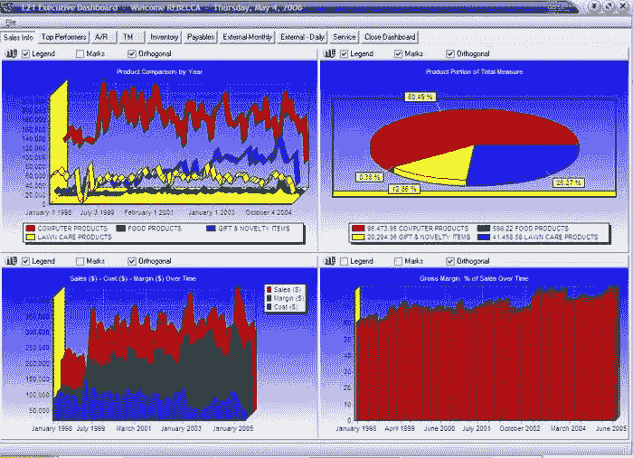

# 构建仪表板是懦弱的表现

> 原文：<https://medium.com/hackernoon/building-dashboards-is-cowardly-73a141f2b517>

盲目建造另一个仪表板是懦弱的表现。在当今的应用程序世界中，光靠仪表板不足以应对解决人们实际问题的挑战。

正如您将在 [Logi 的最新嵌入式分析报告](http://go.logianalytics.com/report-2017-state-embedded-analytics.html?utm_medium=referral&utm_source=chris-butler-medium&utm_campaign=2017-soea&cm=chris-butler-medium)中读到的，坏消息是仪表板仍然是大多数组织路线图上的首要项目。好消息是，许多组织正在考虑如何扩展[嵌入式分析](https://www.logianalytics.com/bi-trends/what-is-embedded-analytics/)的使用，以提供更好的解决方案。

最终用户不会要求仪表板，因为他们确实在使用它们。他们要求这些是出于对安全毯的需要，这给了他们(不正确的)信念，即他们将知道关于他们的业务所需要的一切。仪表板的噪音可能会令人感到安慰，但在不真正需要的时候，它可能会引发问题(向医生询问[医源性影响](https://en.wikipedia.org/wiki/Iatrogenesis))。有了仪表板，就不能保证在必要时有正确的信息来做出决策。

我曾为大型(微软、Waze、KAYAK)和小型组织工作过，在这些组织中，访问正确的数据是关键。数据的好处是，当被分析时，可以综合信息，帮助人们做出更好的决策。最能引起共鸣的是，当信息被放在上下文中，并可以转化为实现某种目的或目标的行动时。如果没有下一步，分析可能根本就不存在。

最近，产品世界一直关注于了解人们有什么问题以及如何帮助解决这些问题。正如我们在[“要做的工作”理论](https://hbr.org/ideacast/2016/12/the-jobs-to-be-done-theory-of-innovation)中发现的，只要有拼凑的解决方案，你就能找到机会。

将 CSV 导出到另一个系统是一种“拼凑”的解决方案。这是一个麻烦。使用您的应用程序的人不希望这样。他们希望能够在同一个地方进行分析和决策。

[嵌入式分析](https://www.logianalytics.com/bi-trends/what-is-embedded-analytics/)允许公司轻松整合分析信息，以解决一个人需要完成的全部工作。

在考虑将[嵌入式分析](https://www.logianalytics.com/bi-trends/what-is-embedded-analytics/)应用于您的应用时，您应该问自己的问题是，您的客户如何从有价值的信息中区分出来，从而做出决策并忽略噪音？他们如何将信息转化为实现最终目标的行动？

提供更详细的分析不会拓宽竞争的护城河。当你让某人了解如何取得成果时，你与竞争对手的距离就会增加。

展望未来，机器学习将成为许多公司的重中之重。为了能够利用它，你必须了解一个人的工作有多辛苦。首先，你需要在行动发生的同时掌握正确的信息。第二，你需要[了解信息和下一步](https://uxdesign.cc/testing-ai-concepts-in-user-research-b742a9a92e55)之间隐藏的关系。

我希望你会发现[这份报告](http://go.logianalytics.com/report-2017-state-embedded-analytics.html?utm_medium=referral&utm_source=chris-butler-medium&utm_campaign=2017-soea&cm=chris-butler-medium)和我在了解组织如何看待嵌入式分析时一样令人兴奋。您将发现向内部利益相关者说明情况的有价值的信息，以及在哪里寻找创新。

不要构建另一个仪表板。相反，用正确的信息帮助人们解决他们的问题。

*这是我为* [*Logi 的《2017 嵌入式分析报告状态:嵌入式分析趋势和策略第五次年度回顾》写的转发*](http://go.logianalytics.com/report-2017-state-embedded-analytics.html?utm_medium=referral&utm_source=chris-butler-medium&utm_campaign=2017-soea&cm=chris-butler-medium) *它提供了大量关于分析行业发展轨迹和组织实施情况的重要信息。我还会在四月晚些时候做一个关于这个主题的* [*网络研讨会*](http://go.logianalytics.com/2017-State-of-Embedded-Analytics-Webinar.html?utm_medium=referral&utm_source=chris-butler&utm_campaign=2017-soea-webinar&cm=chris-butler) *。*

[*Philosophie*](http://philosophie.is)*是一家位于洛杉矶、纽约和旧金山的软件设计和开发咨询公司。我们通过消除战略执行差距来释放创新。让我们开始工作，做些有意义的事情。*

> [黑客中午](http://bit.ly/Hackernoon)是黑客如何开始他们的下午。我们是 [@AMI](http://bit.ly/atAMIatAMI) 家庭的一员。我们现在[接受投稿](http://bit.ly/hackernoonsubmission)，并乐意[讨论广告&赞助](mailto:partners@amipublications.com)机会。
> 
> 如果你喜欢这个故事，我们推荐你阅读我们的[最新科技故事](http://bit.ly/hackernoonlatestt)和[趋势科技故事](https://hackernoon.com/trending)。直到下一次，不要把世界的现实想当然！

