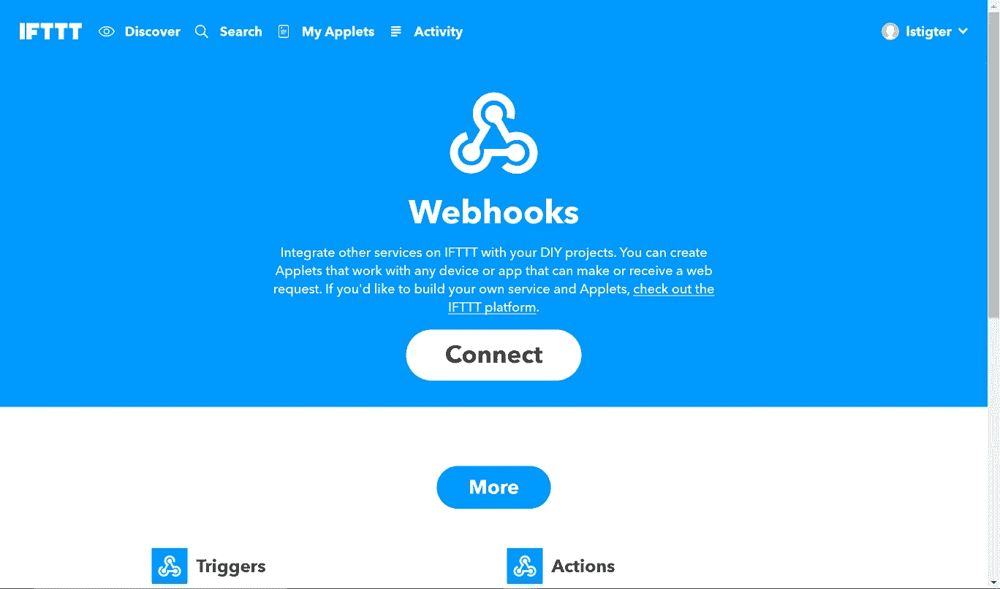
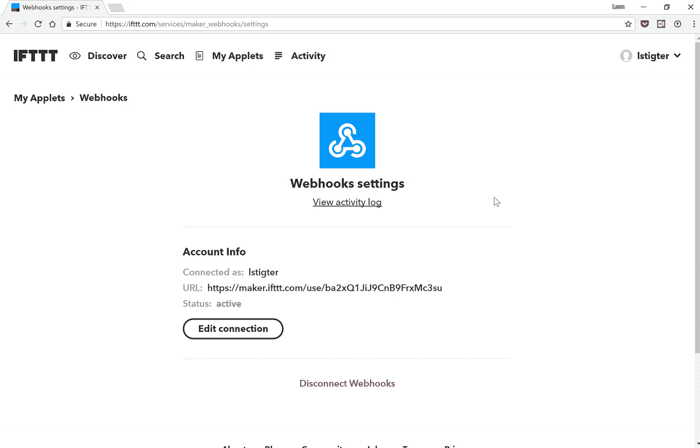
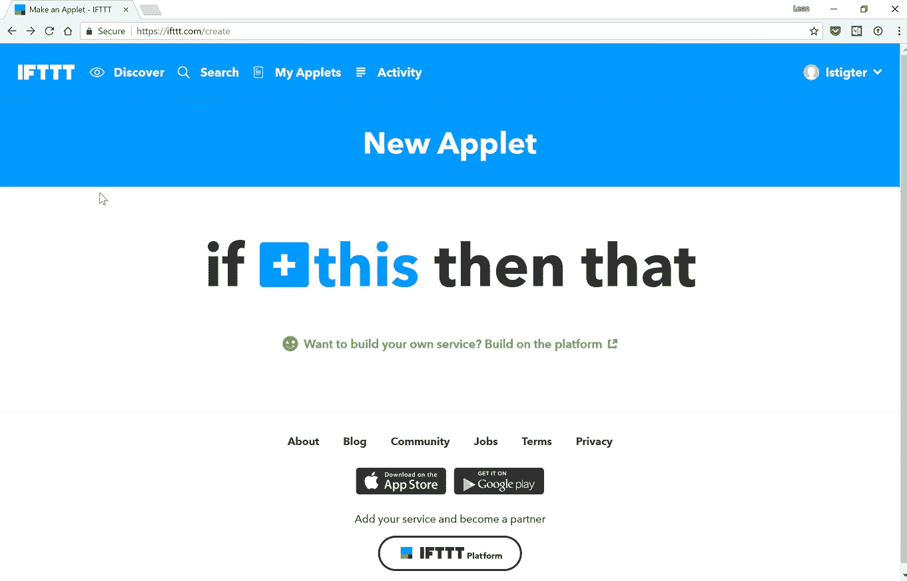
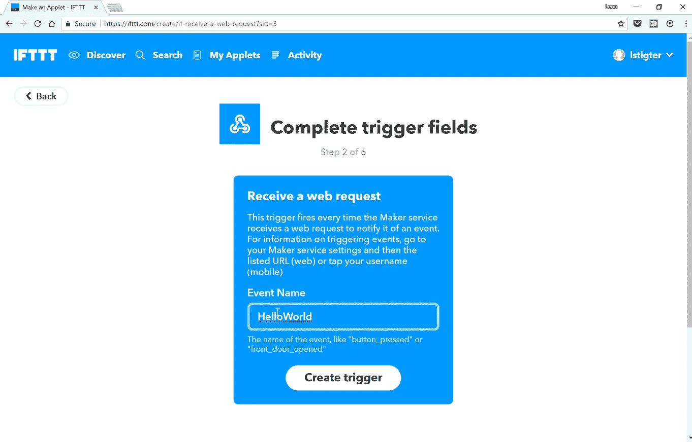
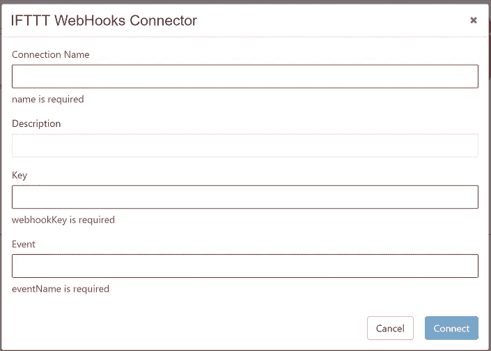

# 为 TIBCO 云集成 Web Integrator 构建扩展

> 原文：<https://medium.com/hackernoon/building-extensions-for-tibco-cloud-integration-0-web-integrator-7723f32fc8bb>

上个月 [TIBCO](https://hackernoon.com/tagged/tibco) 增加了向 [TIBCO 云集成](https://cloud.tibco.com/) — Web Integrator ( *我将使用 Web Integrator 前进*)添加定制活动的能力。Web Integrator 体验是“由 Project Flogo 驱动的”，因此当您为 Web Integrator 创建自己的扩展，并在您想要的每个流程中使用它们时，这些活动也将与 [Project Flogo](https://flogo.io/) 一起工作。在这篇博文中，我将使用 WebHooks 服务创建一个连接到 [IFTTT](https://ifttt.com/) 的新扩展。

# 为什么是 IFTTT？

IFTTT 是一个免费的基于网络的服务，人们用它来创建简单的条件语句链，称为 applets。applet 由其他 web 服务 [1](https://retgits.github.io/building-extensions-for-web-integrator/index.html#fn:1) 中发生的变化触发。

IFTTT 还有一个很棒的功能，可以使用以前称为 Maker Channel 的 WebHooks 服务来扩展这种连接。由于易于理解输入和输出，并且仍然提供巨大的价值，这是展示如何为 Web Integrator 创建自己的扩展的好方法。

# 设置 IFTTT

在 IFTTT 中，您需要激活 WebHooks 服务。你可以通过访问这个网址并点击白色大按钮`Connect`来完成。



现在转到设置屏幕，检查生成的网址。URL 的最后一个过去(在最后一个`/`之后)是 IFTTT 所称的`WebHook key`，它被用来认证进入的呼叫。我们以后需要那把钥匙！一定不要告诉任何人你的钥匙(*是的，我已经换了钥匙*)。



# 构建通知流

这篇博文的最终结果连接器和活动需要用一些好的东西来测试。由于现在几乎每个人都带着手机，IFTTT 流将以一个 WebHook 开始(这个*这个*)并发送一个通知(那个)



**事件名称**

我们的连接器需要的参数之一，也是 IFTTT 将事件路由到正确的 applet 需要的参数之一，是事件名称。在这种情况下，我将它设置为`HelloWorld`。



# 你的文件夹的结构

这个扩展的最终结果将是一个活动、一个连接器和一堆组成这两者的文件。代码可以在 GitHub 上找到，所以你可以跳过这一切去查看。包括我们将创建的文件在内的文件夹结构是:

```
wi-ifttt-extension  
├───activity
│   └───ifttt
│       ├───activity.go
│       ├───activity.json
│       ├───activity.module.ts
│       ├───activity.ts
│       ├───activity_test.go
│       └───ifttt.png
│
└───connector
    └───ifttt
        ├───connector.json
        ├───connector.module.ts
        ├───connector.ts
        └───ifttt.png
```

扩展的根文件夹叫做`wi-ifttt-extension`，这也是 GitHub 上的存储库的名称(当我们将 [Travis CI](https://travis-ci.org/) 添加到组合中时，这一点很重要)。下面是一个存储名为`activity`的活动的文件夹和一个存储名为`connector`的连接器的文件夹。从那里开始，每个活动和每个连接器都有自己的子文件夹。在上面的例子中，文件夹`ifttt`中有一个活动，文件夹`ifttt`中有一个连接器(不同的文件夹，相同的名称)

# Web Integrator 连接器

让我们更详细地看看[连接器](https://github.com/retgits/wi-ifttt-extension/tree/master/connector/ifttt)

```
└───connector
    └───ifttt
        ├───connector.json
        ├───connector.module.ts
        ├───connector.ts
        └───ifttt.png
```

一个好的扩展显然需要一个杀手级的图标，如果幸运的话，它有一个出色的图标。该文件夹中的文件`ifttt.png`显示在连接器屏幕上。这里唯一的要求是它是一个`png`文件(我建议寻找 128x128 像素)。

# 连接器. json

`connector.json`文件描述了连接器是什么，它需要什么输入以及一堆其他元数据。重要的是`name`字段没有任何特殊字符和空格(在我的例子中是`wi-ext-ifttt`)。显示部分中的类别是将为此连接器显示的类别的名称。在这种情况下，连接器将显示在`ifttt`类别中。`ref`字段是对 GitHub 存储库的引用，该字段必须是正确的 URL(尽管存储库不一定存在)。这些设置描述了用户需要提供的字段:

*   **名称**:连接的名称，以便您在活动中轻松找到它
*   描述:有用的描述总是好的，尤其是当你有多个联系人的时候
*   **webhookey**:这是来自 IFTTT 的键，注意类型是`password`，所以它会在用户界面上显示为一串球
*   **事件名称**:要触发的事件

# 连接器. ts

连接器还有一个 TypeScript 文件，该文件覆盖了字段的验证，并负责提醒 Web Integrator 何时保存数据。

当您浏览代码时，您会看到一个`validate`对象，顾名思义，它验证连接是否可以保存。在我们的案例中，有两个必需的字段需要存在，webhookKey 和 eventName。如果 webhookKey 和 eventName 都有值，则启用连接按钮，否则保持禁用状态。

`action`对象在动作发生时被触发(如点击按钮)。代码的这一部分处理“连接”按钮的点击。因为所有的细节都已经在表单中了，唯一需要做的就是保存数据。保存配置数据需要操作结果。

如果您上传连接器的所有代码并创建一个新的连接，屏幕将如下所示



# 网络集成商活动

现在连接器已经被盖住了，我们来看看[活动](https://github.com/retgits/wi-ifttt-extension/tree/master/activity/ifttt)

```
├───activity
│   └───ifttt
│       ├───activity.go
│       ├───activity.json
│       ├───activity.module.ts
│       ├───activity.ts
│       ├───activity_test.go
│       └───ifttt.png
```

就像上面一样，一个好的扩展仍然需要那个杀手级图标。该文件夹中的文件`ifttt.png`显示在活动中。

# activity.json

`activity.json`描述了您活动的元数据，看起来非常类似于`connector.json`文件。这里的重要区别在于，is 描述了活动的输入和输出，并且对于名为`iftttConnection`的字段，它有一个特殊的输入类型`object`。在 TypeScript 文件的帮助下，我们将继续讨论，这个对象确保我们可以选择一个连接并在代码中使用它。

# 活动. ts

`activity.ts`文件为活动处理一点用户界面代码。当您浏览代码时，您会看到 value 对象，它允许您指定可以为某个字段选择哪些类型的值。对于字段`iftttConnection`唯一允许的类型是作为`iftttConnector`创建的连接(在`connector.json`中指定的连接器类别必须与我们在这里指定的匹配)。

和连接器一样，`activity.ts`也有一个`validate`对象，它可以用来验证某些字段的输入。对于字段`iftttConnection`,我们需要检查连接是否已经设置好，否则会显示一条错误消息(`value`已经确保您只能选择连接，所以没有必要再次验证)。

# 活动. go

ifttt 包提供了与 IFTTT 的连接，用于 TIBCO 云集成—使用 if TTT([https://ifttt.com/maker_webhooks](https://ifttt.com/maker_webhooks))的 WebHooks 服务的 Web Integrator。在代码中，我使用了五个常量来使我的代码更容易(和更可重用)。例如

```
ivConnection = "iftttConnection"
```

意味着我可以使用一个名为`ivConnection`的字段，在运行时，该对象将指向我在活动元数据中命名为`iftttConnection`的*东西。很多话要说`ivConnection`是我将在代码中使用的连接对象。这同样适用于其他输入变量(均以`iv`开头)和输出变量(均以`ov`开头)。`payload`结构用于向 IFTTT 描述有效载荷，最多有三个值(该限制由 IFTTT 设置)。`eval`方法执行活动并向 IFTTT 发送消息。我还在代码中记录了它所采取的步骤:*

*   **步骤 1** 验证连接已经设置。连接是强制性的，而三个值是可选的，所以我们不需要检查。
*   **步骤 2** 是获取连接细节对象
*   **第三步**是构建 IFTTT WebHook URL。为了触发该事件，它将向 URL 发出 POST 请求。URL 将具有我们在 IFTTT 中指定的事件名称，以及我们从那里获得的 webhook 键(两者都是从 connection details 对象中提取的)
*   **第 4 步**是创建 JSON 有效负载。数据是完全可选的。这些内容将在 IFTTT 中传递给你的食谱中的动作。
*   步骤 5 是发送 POST 消息，并处理可能来自那里的任何错误
*   **第 6 步**是设置返回值，这样 Web Integrator 流的其余部分也可以使用它

# 测试您的活动

作为优秀的开发人员，您希望确保您正在编写的代码能够完美运行。为了确保您可以对代码进行单元测试，您可以创建一个`activity_test.go`文件。文件的布局非常简单，`TestEval`方法是 Eval 函数的单元测试，并向 IFTTT 发送一条消息(*确保在单元测试代码*时已经更新了值)。

当你更新变量时，只需从`activity`的`ifttt`子文件夹中运行`go test`，它会告诉你你的代码是否能工作。

# 加入 Travis CI

我之前写的关于[持续测试 Flogo 活动的文章](https://retgits.github.io/continuously-testing-flogo-activities/)也适用于 Web Integrator。事实上，你应该看到我在那里的文件夹布局和我在这篇文章中的布局有一些惊人的相似之处。查看关于 Travis CI 的部分，将 CI/CD 添加到 Web Integrator 的新活动组合中。

# 在 Web 集成商应用程序中使用它

要在 Web Integrator 应用程序中使用您的扩展，您需要将其上传到 [TIBCO 云集成](https://cloud.tibco.com/)。只需创建根文件夹的 zip 文件(例如`wi-ifttt-extension`，点击标题中的`Extensions`并上传 zip 文件。

现在，您可以从`Connections`菜单创建到 IFTTT 的连接，并在您的新应用程序中使用该活动


# 结论

为 Web Integrator 构建自己的活动和连接器并不太难。由于这是我在这里的第一篇文章，我希望得到您的反馈！

# 参考

1.  [https://en.wikipedia.org/wiki/IFTTT](https://en.wikipedia.org/wiki/IFTTT)t16】↩

*本文原载于本人博客*[*https://retgits . github . io/building-extensions-for-we B- integrator/*](https://retgits.github.io/building-extensions-for-web-integrator/)