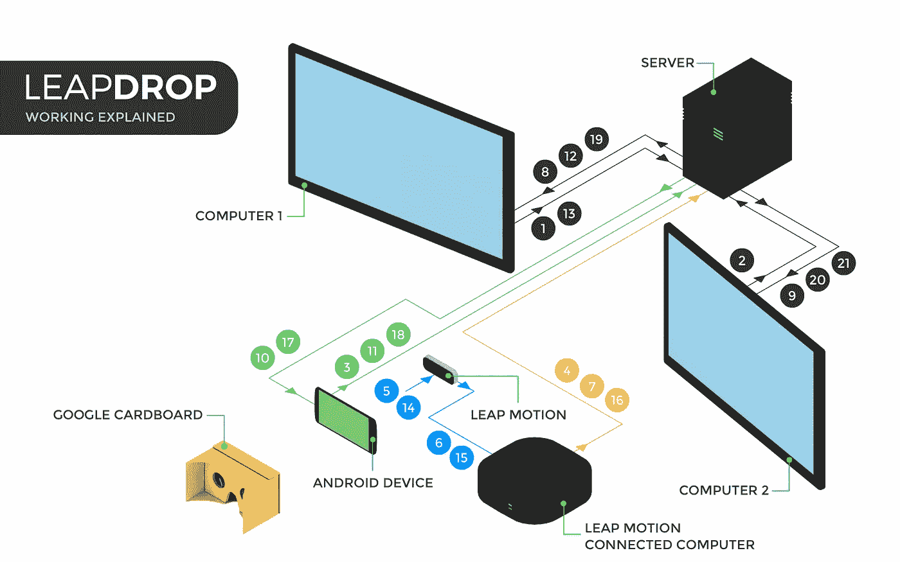

# 建筑材料

> 原文：<https://medium.com/hackernoon/building-leapdrop-f4191ff2f36d>

嗨，你好。我一直想写一篇关于我们如何在 [InOut](https://hackinout.co/) 3.0 黑客马拉松上构建 [LeapDrop](https://hackernoon.com/tagged/leapdrop) 的帖子。我们最终获得了由 [Hackster.io](https://www.hackster.io/) 赞助的最佳硬件黑客奖。

TheGeekBros 团队有三个兄弟在里面:[西达尔特·戈斯瓦米](http://siddharth.xyz/)、[索哈姆·多迪亚](https://sohamdodia.in)和[我](https://umanggalaiya.in/)。

InOut 这次有很多赛道，所以我们开始涉猎各种想法——最终决定在虚拟现实/增强现实赛道上建造一些东西——这是我们很久以来一直感兴趣的东西。

我们有几个想法:一个基于 AR 的僵尸射击游戏 FPS，一个 VR 桌面体验(有点像[这个](https://cindori.org/vrdesktop/))。我们有一个 [LeapMotion](https://www.leapmotion.com/) ，一个借来的 [Google Cardboard](https://vr.google.com/cardboard/) 仿制品，还有一些双向胶带来把它们拼凑在一起。

现在，我们中没有人真正知道如何继续这些想法。我们没有编写构建 VR/AR 体验的代码的经验——只有我们脑海中的一些想法——所有这些小时的科幻娱乐的结果。所以我们在那里坐了两个小时，讲笑话，搜索资料。在无效率地来回分享链接一段时间后，很明显，到目前为止，我们实际上不可能实现任何想法。然后它击中了我们。

我们分享链接的效率真的很低。我不记得是怎么回事了，但也许是个信使团？我们回忆起第一部钢铁侠电影中的场景，托尼·斯塔克只用双手在电脑上(并在全息图上)播放电影:

Watch 0:05 to 0:20

为什么我们不能这样共享网页呢？我们有一个飞跃，可以很好地检测手势来做这样的事情。因此，我们开始建立 LeapDrop。

> LeapDrop 允许人们通过简单的捏放手势在电脑之间共享网页。

“堆栈”包括以下内容:

*   用于与浏览器交互的 Chrome 扩展。
*   带有 socket.io [Web Sockets]的 Node.js 服务器，用于设备间通信。
*   LeapMotion 及其 JS SDK。
*   一款安卓应用。
*   许多笑话和相当多的玩笑。

最终结果看起来像这样。

当我们开始讨论这个想法并解决它应该如何工作的细节时，这似乎是一个相当简单的项目，可以在几个小时内完成——甚至可能是整个黑客马拉松持续时间的一半。有一个(n 未说出口的？)软件工程的一条规则，几乎没有东西会在开发者声称的时间内被构建出来。但我们确实设法睡了一会儿，并调整 LeapDrop 以更好地工作，所以..\_(ツ)_/

这是一次地狱般的经历——书呆子笑话、迷因、与最酷的团队一起工作，以及从事没有合适的既定路径或指南来开发的事情(这些是最好的一种)。我不会拿它换任何东西。总之，这里有一个检查点。现在接下来的内容主要是关于 LeapDrop 如何工作的，所以如果你对细节不感兴趣，如果你到目前为止喜欢这个帖子，可以通过点击这个页面上的心形按钮来点赞，祝你白天/晚上/无论如何都过得愉快。😄

我们没有一个固定的路径，也没有一个关于如何建立 LeapDrop 的指南。我们知道事物应该如何协同工作，但是没有构建这样的东西的经验——从来没有。

我早些时候构建了一个微小的(完全不相关的)Chrome 扩展，并编写了一些 socket.io 代码。西达尔特和索哈姆有开发安卓应用的经验。前一个夏天，我和西达尔特一直在玩 LeapMotion。所以我们开始工作。在理想的情况下，我会构建 Chrome 扩展，但是在我和 Soham 开始阅读文档的时候，西达尔特已经开始着手了。Soham 选择了 Android，我开始为服务器编写 JavaScript。

下面是堆栈每个部分的工作情况:

# Google Cardboard + LeapMotion

我们在谷歌纸板上贴了一个 LeapMotion。LeapMotion 可以检测手势。一部运行 Android 应用程序的手机进入了谷歌纸板。

# **带有 socket.io 的 Node.js 服务器**

服务器是各种各样的“控制器”。每个设备都将使用 Web Socket 连接到它。服务器发出并侦听事件。它告诉 Chrome 扩展显示二维码、读取网址和打开网址。它告诉 Android 应用程序解码它前面的二维码。它听 LeapMotion 的手势。

# 铬延伸

Chrome 扩展安装在所有参与的计算机上。它连接到 socket.io 服务器。它监听事件并发出它们。当被询问时，它显示一个二维码，当被询问时，它发送上一个活动标签的 URL，当被询问时，它打开一个 URL。

# 安卓应用

Android 应用程序也连接到 socket.io 服务器。(是一种模式，真的。一切都连接到 socket.io 服务器。)Android 应用程序显示相机看到的内容，偶尔会解码二维码。它应该是一个立体视图，但 Android 只允许一个资源在给定的时间访问相机，所以我们最终只在立体视图的右边部分有相机视图。这是(非常)糟糕的 UX，但那是我们当时所能想到的。安卓手机进入谷歌纸板。

# LeapMotion 及其 JS SDK

如果您现在还不明白，LeapMotion 还连接到 socket.io 服务器。然而，由于 LeapMotion 不能直接连接到除 SDK 之外的任何东西，所以 JS SDK 运行在网页上，并且网页使用 Web Sockets 连接到 socket.io 服务器。该网页监听*捏*和*释放*手势，并在它们被执行时通知服务器。

# 连接这一切

设备缩写:

*   C1——带有 Chrome 扩展的计算机 1
*   C2——带有 Chrome 扩展的计算机 2
*   PH——运行 LeapDrop 应用程序的 Android 手机
*   LMC — LeapMotion 连接计算机
*   LM — LeapMotion
*   服务器—node . js+socket . io 服务器。

Siddharth is a really great designer as well. He’s the one who created this sweet illustration.

1.  *C1* 向*服务器*注册。ID 被分配给 *C1* 。
2.  *C2* 向*服务器*注册。ID 被分配给 *C2* 。
3.  *PH* 向*服务器*注册。
4.  *LMC* 向*服务器*注册。
5.  *LM* 检测捏手势。
6.  *LM* 通知 *LMC* 关于检测到的捏手势。
7.  *LMC* 向*服务器*通知检测到的挤压手势。
8.  *服务器*要求 *C1* 出示其二维码。该 QR 码本身编码了在步骤 1 中分配给它的 ID。
9.  *服务器*要求 *C2* 出示其二维码。该 QR 码本身编码了在步骤 2 中分配给它的 ID。
10.  *服务器*要求 *PH* 检测它看到的二维码，并发送二维码编码的任何内容。[这是因为当用户在电脑前做出挤压手势时，头戴式手机摄像头会看到源电脑的二维码。]
11.  *PH* 将解码后的源计算机 ID 发送给服务器。【 *C1* 在这种情况下。]
12.  *服务器*要求 ID 所属的计算机 *C1* 发送它最近访问的网址。
13.  *C1* 将最后访问的网址发送给*服务器*。
14.  *LM* 检测释放手势。
15.  *LM* 通知 *LMC* 关于检测到的释放手势。
16.  *LMC* 向*服务器*通知检测到的释放手势。
17.  *服务器*要求 *PH* 检测它看到的[二维码](https://hackernoon.com/tagged/qr-code)，并发送二维码编码的任何内容。[这是因为当用户在电脑前做出释放手势时，头戴式手机摄像头会捕捉到目标电脑的二维码。]
18.  *PH* 将解码后的目标计算机 ID 发送给*服务器*。【 *C2* 在这种情况下。]
19.  *服务器*要求 *C1* 停止展示其二维码。
20.  服务器要求 *C2* 停止展示其二维码。
21.  *服务器*要求目标计算机 *C2* 打开在步骤 13 中获得的 URL。

我们受到了评委和我们周围的黑客同事的关注，但不幸的是没有被选中上台演示。这真是令人失望，因为直到今天，我都忍不住想，从投影仪屏幕上抓取一个网页，并把它放在房间另一边的笔记本电脑上，该有多棒。

无论如何，当宣布硬件类的奖项时，我想我们应该得到第三名。三等奖公布了，不是我们。我想也许我们是第二名，因为 LeapDrop 真的很酷。二等奖也不是我们。这次我放弃了赢得黑客马拉松奖。(*寻呼*冒名顶替综合症！)屏幕上闪现出一等奖的字样，我们愉快地乘车去了九霄云外。我也看过 InOut 的前两个版本，但是就像他们说的:*第三次是魅力*。

总之，这篇*真正的*长文到此为止。如果你还在读，谢谢你坚持这么久。😄

[针对 LeapDrop 的 GitHub 回购。](https://github.com/TheGeekBros/leapdrop)

> [黑客中午](http://bit.ly/Hackernoon)是黑客如何开始他们的下午。我们是 [@AMI](http://bit.ly/atAMIatAMI) 家庭的一员。我们现在[接受投稿](http://bit.ly/hackernoonsubmission)并乐意[讨论广告&赞助](mailto:partners@amipublications.com)机会。
> 
> 如果你喜欢这个故事，我们推荐你阅读我们的[最新科技故事](http://bit.ly/hackernoonlatestt)和[趋势科技故事](https://hackernoon.com/trending)。直到下一次，不要把世界的现实想当然！

