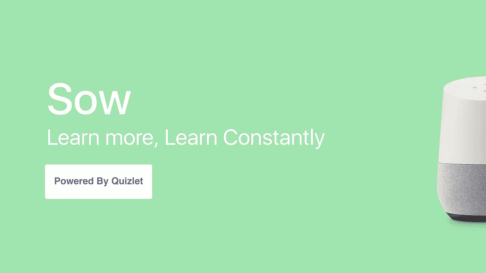
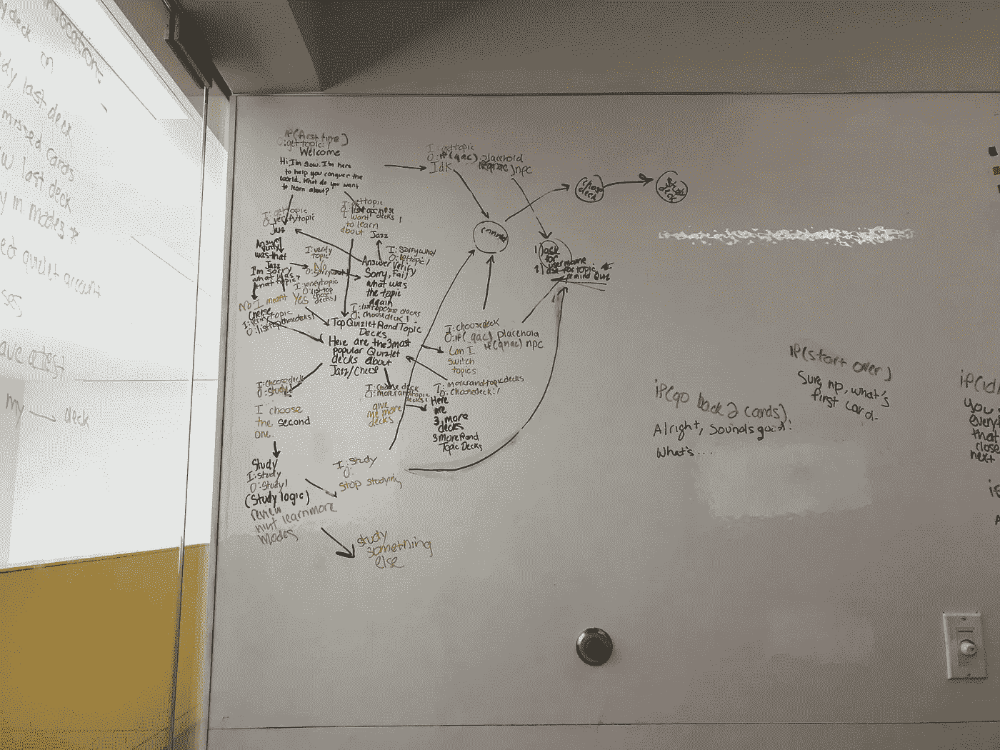

# 建造我的第一个 VUI

> 原文：<https://medium.com/hackernoon/building-my-first-vui-1a4b64a8092d>

## 从一个夏天的对话设计学习中得到的启示

**更新:**不幸的是，我们未能参加挑战赛，但我们感谢[的机会](https://hackernoon.com/tagged/opportunity)，并为我们创造的一切感到骄傲。以下是[的结果](https://developers.google.com/actions/challenge/)

今年夏天，我和约瑟夫·科克伦·布朗为谷歌挑战赛的[行动创造了](https://developers.google.com/actions/challenge/)[母猪学习辅助工具](https://assistant.google.com/services/a/id/33de6da3c59b4264/)。我们的目标是使用 Quizlet 的 API 通过对话创建一个迷人的抽认卡学习体验。在我们开始之前，我们对机器人、VUI 氏症或 API.AI 一无所知。

## 设计

我们希望我们的角色能够模拟和朋友一起学习的经历。因此，我和约瑟夫在互相帮助学习抽认卡的时候记笔记。**有几个突出的特征帮助我们了解什么是友好的学习课程。**

我们发现，主要的挑战是在研究过程中保持用户的兴趣和积极性，同时保持高效。在编写了一些演示对话的脚本后，我们能够对我们[设计](https://hackernoon.com/tagged/design)的前 3 个关键要素进行优先排序。

**1。个性**

有趣的学习课和无聊的学习课的区别在于和你一起学习的人的个性。不幸的是，这并不像把有魅力的学习伙伴的个性封闭起来那么容易。

我们制作 Sow 学习辅助工具角色的一些方法包括:根据你是否答对了卡片，添加上下文 gif 或原声片段，在对话中经常出现的地方随机插入诙谐的评论，以及使用随意或熟悉的语言来帮助营造轻松的氛围。

不幸的是，为机器人创造一个可爱的个性是非常主观的。尝试自担风险。但是，成为一个友好的学习伙伴的回报太大了，我们不能错过。

#meandjosephafterwefoundtheperfectgif

**2。条件反应**

从技术上讲，机器人对话中的每一点都是有条件的响应。对我们来说，有条件的回应意味着思考环境的可能变化会如何改变回应的语气和措辞。

最简单的例子是，当你连续错了两张卡片时，Sow 学习辅助工具偶尔会添加到响应字符串中，

> “那是连续第二次了。让我们扭转这个局面！”

这是一个非常微小的变化，似乎不像一个突破性的功能那样引人注目。但是，在整个应用程序中添加这些条件响应将极大地改善对话体验。

**3。直观意图**

我们在演示研究会议上所做的笔记，展示了一组明显的直观意图/特性，它们为我们的应用奠定了基础。一些例子包括回顾最后 4 张错过的牌，在牌组中导航，以及随时切换牌组。

学习时，有几件事是你自然而然地希望你的伴侣去做的。这些是我们致力于提供的特性，并添加了足够多的响应变量，使它们能够被自然调用。

## 履行

为了避免绞尽脑汁，我们去了图书馆，使用墙壁大小的白板来直观地绘制对话。**不必跟踪复杂背景和输入的心理地图，这让我们在如何安排对话时更有创造力。**

尽管有这么多白板，我们最初将对话分成 3 个简单的部分:介绍、主题选择和学习过程。**我们简化了对话的结构，允许我们以脚本不允许的方式分解对话的重点和最常走的路径。**

在每一部分中，我们进一步细分为意图和上下文。在意图和背景被开发出来之后，我们创造了一些变量来记录学习伙伴会在他们的大脑后面记录的东西，比如你错过的卡片。

最后，我们将这些变量存储在 Firebase 中，以便下次调用该应用程序时，可以从学生停止的地方获得上次学习的所有信息。

#proofweactuallymadesomething

#myvoiceistooquietbutItried

# 资源

如果没有我们在构建 Sow 学习辅助工具时发现的视频、文章和示例应用程序，一切都是不可能的。这是对我们有帮助的所有东西的精选清单。

 [## 对话设计:说同一种语言

### 人类对话的六个原则将会彻底改变下一代语音用户界面设计…

设计.谷歌](https://design.google/library/conversation-design-speaking-same-language/)  [## 使用 Firebase 的云功能部署您的助理应用程序 fulfillment webhook。

### 快速分析为什么您应该为您的助手应用程序使用 Firebase 的云功能，并演练部署…

medium.com](/@silvano.luciani/deploy-your-assistant-app-fulfillment-webhook-using-cloud-functions-for-firebase-da83275ee715) 

## **语音设计谷歌 I/O 会谈**

#googleio2017

[在对话中，没有错误(Google I/O’17)](https://www.youtube.com/watch?v=oOLo071Pj1U&list=PL9iaMuBbp4wJGACDOQZobMlsxiUX7Ty9_&index=2)

[为你的应用寻找合适的语音交互(Google I/O’17)](https://www.youtube.com/watch?v=0PmWruLLUoE&list=PL9iaMuBbp4wJGACDOQZobMlsxiUX7Ty9_&index=4)

[让你的助手应用被发现(谷歌 I/O’17)](https://www.youtube.com/watch?v=By972_gh9DY&index=3&list=PL9iaMuBbp4wJGACDOQZobMlsxiUX7Ty9_)

[将内置的对话技巧应用到你的语音用户界面(谷歌 I/O’17)](https://www.youtube.com/watch?v=wuDP_eygsvs&list=PL9iaMuBbp4wJGACDOQZobMlsxiUX7Ty9_&index=8)

[为谷歌助手构建应用程序(谷歌 I/O’17)](https://www.youtube.com/watch?v=Y26vvxCb3zE&index=5&list=PL9iaMuBbp4wJGACDOQZobMlsxiUX7Ty9_)

使用 API 构建丰富的跨平台对话式 UX。人工智能(谷歌输入输出 17)

## Github 示例

 [## 谷歌行动/互动小说节点

### 互动小说-nodejs -谷歌上的行动互动小说样本

github.com](https://github.com/actions-on-google/interactive-fiction-nodejs)  [## Google/apai ai 上的操作-琐事-游戏-节点

### 通过在 GitHub 上创建一个帐户，为 apiai-trivia-game-nodejs 开发做出贡献。

github.com](https://github.com/actions-on-google/apiai-trivia-game-nodejs)  [## Google/API ai-number-genie-nodejs 上的操作

### 数字精灵。谷歌上动作的人工智能示例

github.com](https://github.com/actions-on-google/apiai-number-genie-nodejs) 

## 声音设计媒体文章

 [## 每个设计师都应该了解的声音

### 语音界面的兴起将改变我们设计一切的方式。

medium.com](/@markcwebster/what-every-designer-should-know-about-voice-d46948cc0dec)  [## SSML 对谷歌采取行动

### 为 Google Assistant 设计出色的对话动作的一个重要部分是考虑你希望它们如何…

medium.com](/google-developers/ssml-for-actions-on-google-946117f97fd1)  [## 谷歌助手问答游戏

### 今天，我们为谷歌助手开源了一个琐事游戏应用，有 3 个角色，750 个提示和 43 种声音。

medium.com](/@leonnicholls/google-assistant-trivia-game-742f38cae5de)  [## 互动小说行动(上)

### 谷歌在谷歌上推出了动作，允许你为谷歌助手编写自己的对话动作，这…

medium.com](/@leonnicholls/interactive-fiction-actions-part-1-ca022b4d088d) 

## 有任何反馈请随时联系我，谢谢！

**TL；DR:** 我和一个朋友在夏天制作了我们的第一个机器人。对话设计很酷，这里有一些链接可以帮助你构建东西。