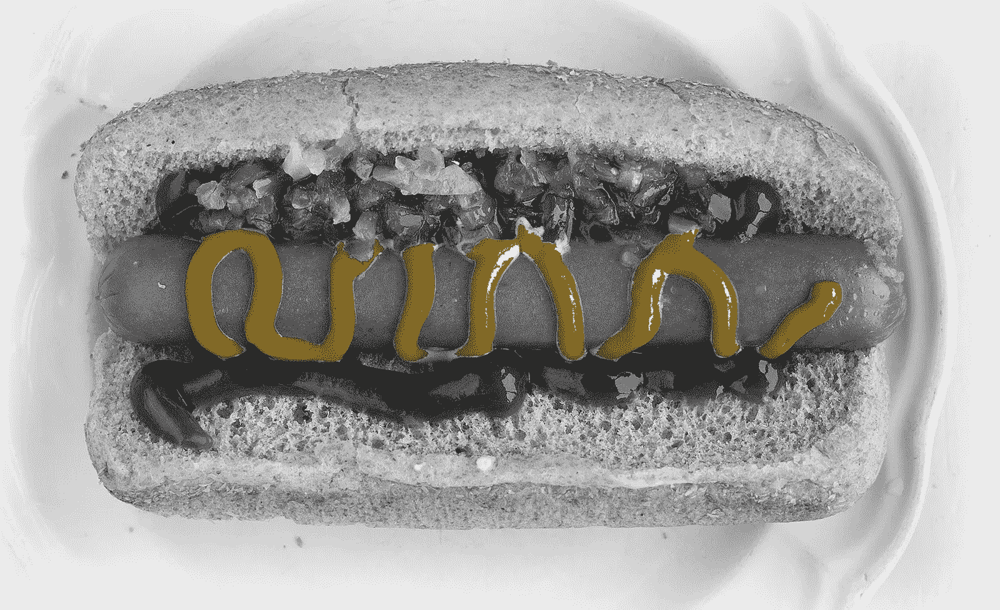
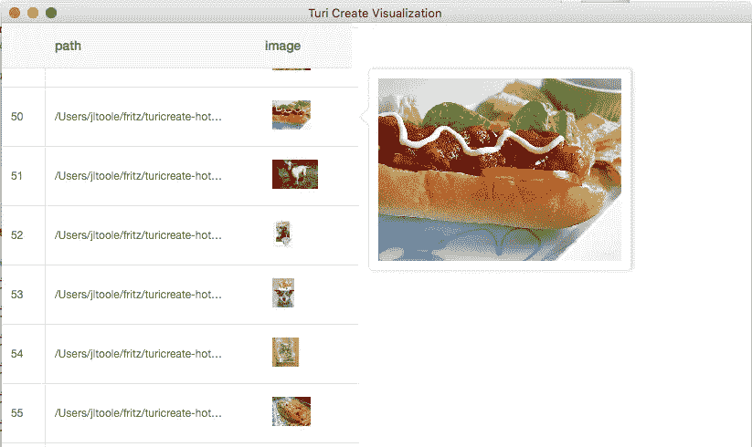
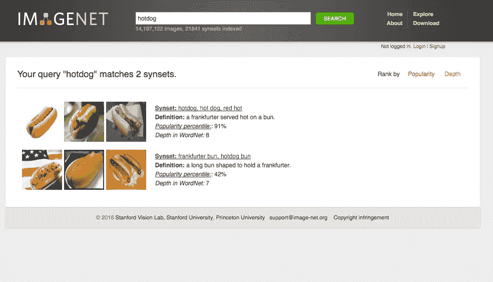
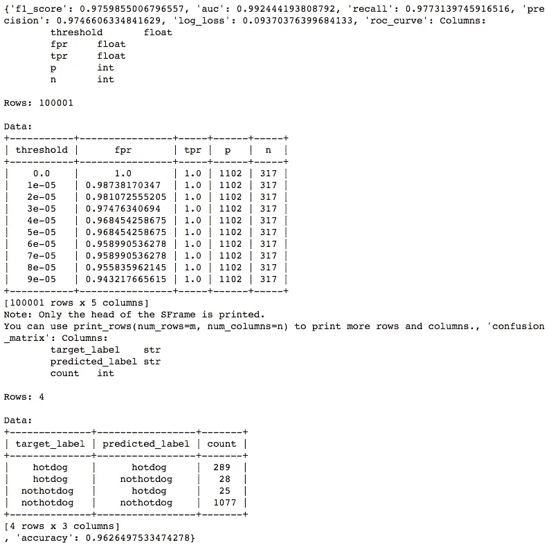
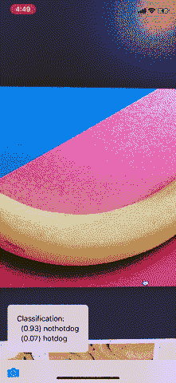

# 用 Turi Create 和 Core ML 在一个下午构建非热狗

> 原文：<https://medium.com/hackernoon/building-not-hotdog-with-turi-create-and-core-ml-in-an-afternoon-231b14738edf>



Hotdog. Original image by [watts_photos](https://www.flickr.com/photos/watts_photos/26066899296)

来自 HBO 硅谷的 Not Hotdog 应用程序已经成为科技界最具标志性的笑话应用程序之一。就像节目中的大多数事情一样，这个虚构的应用程序有一点真实性，让它看起来似乎真的有道理。HBO 的《不是热狗》更进一步，他们真的做了这个东西。如果你需要帮助来判断某样东西是不是热狗，那就去 app store 吧。

蒂姆·安格拉德是该节目的软件开发人员，负责开发该应用程序，他在一篇精彩的博客文章中分享了自己的经历。在短短几个小时内，他得到了一个使用谷歌视觉 API 的快速原型，但出于各种原因，他希望一切都可以在设备上运行。基本上，它必须在飞行模式下工作。这个看似简单的要求让他经历了几个月的迂回旅程，其中包括 TensorFlow 创造者的帮助。

蒂姆的帖子已经过去 6 个月了。今天下午，使用苹果新的开源工具 [**Turi Create**](https://github.com/apple/turicreate) ，我能够在大约 3 个小时内制作一个简单的非热狗。我经常听说[机器学习](https://hackernoon.com/tagged/machine-learning)的惊人速度，但今天我感受到了。如果你是一个一直在等待合适时机加入的开发人员，门槛从未如此之低。

在这篇文章的其余部分，我将向您展示如何在几个小时内，编写不到 100 行代码，构建 Not Hotdog。你所需要的是 Turi Create 和你的笔记本电脑。

# 图里创造的是什么？

Turi Create 是一个用于创建定制机器学习模块的高级库。如果你对机器学习框架有点熟悉，Turi Create 感觉比 [Keras](http://www.keras.io) 简单一个数量级，Keras 感觉比 raw [TensorFlow](http://tensorflow.org) 简单一个数量级。

在 Turi Create 的引擎盖下是 Apache 的 MXNet，尽管你真的不能访问它。苹果让你选择使用一些预先训练好的模型和架构，但是几乎所有的参数都是不可访问的。

最后，苹果实现了一些准系统数据结构，反映了熊猫数据框架的大部分功能。我不知道他们为什么决定从头开始重新实现这些，但是他们对方法名做了很好的选择，如果你使用过 Pandas，这感觉很自然。一个很好的附加功能是一个交互式 GUI，用于可视化通过调用`explore()`方法激活的数据。下面显示的是我用来检查这个项目图像的交互式浏览器。如果您正在执行一项任务，如对象检测，可视化工具甚至会在可用时绘制注释，如边界框。



Turi Create comes with some nice interactive GUIs to explore data.

# 装置

与许多机器学习工具一样，python 是首选语言。苹果在该项目的自述文件中有易于遵循的说明。我将创建一个干净的 virtualenv 并用`pip install turicreate`安装。我从未使用过 MXNet，但似乎所有的依赖项都安装得很好。我还没有尝试过安装 GPU 支持，但这似乎也很容易。

# 数据收集

在开始训练模型之前，我需要数据。我考虑过写一个 scraper 从谷歌图片中抓取几千个结果，但是后来我发现 [kmather37](https://github.com/kmather73/NotHotdog-Classifier) 关于使用 ImageNet[探索和下载特定类别的图片](http://image-net.org/explore_popular.php)的建议。

只需输入搜索词，点击适当的 Sysnet 类别，然后在**下载**选项卡中点击**下载 Sysnet 中图像的 URL**。我将把 URL 列表保存在一个文本文件中，以备后用。



ImageNet Explorer results for HotDogs

我需要两类图像:“热狗”和…嗯…“不是热狗”。

对于热狗，我使用了**热狗**和**法兰克福香肠**类别，总共产生了 2311 张图片。除了热狗，我还使用了分类**植物、宠物、建筑、**和**披萨、**，总共产生了 8035 张图片。图像 URL 保存在两个文本文件中，每行一个。

接下来，我需要遍历 URL 并下载实际的图像。有一些边缘情况和故障模式需要解决，但我不会告诉你细节。你可以看看我在[这个要诀](https://gist.github.com/jamesonthecrow/00a5c7ce4ba93a088152de07c40a38d2)里最后写的函数。这里很重要的一点是将每个类别的图片下载到各自的文件夹中，这样 Turi Create 就可以为每个类别制作标签。我正在使用的两个文件夹是`hotdog`和`nothotdog`。

# 数据预处理

任何数据科学家都会告诉你，数据准备和清理是每个项目中最耗时的部分。每个图像识别模型通常采用稍微不同的图像格式、大小和预处理。我原本期望写一堆关于数据准备的技巧和诀窍。没有。苹果已经将所有这些步骤融入了训练中。我需要做的就是把数据加载到 Turi Create 中。

```
import turicreate as tcdata = tc.image_analysis.load_images(
    'path/to/images',
    with_path=True
)
```

我下载的一些图像文件损坏了，Turi Create 抛出了警告，但这没什么好担心的。参数`with_path=True`向结果数据框添加一个`path`列，其中包含每个图像的绝对路径。我现在可以使用一个聪明的技巧来为每个训练图像创建标签:

```
data['label'] = data['path'].apply(
    lambda path: 'hotdog' if '/hotdog/' in path else 'nothotdog'
)
```

就是这样。培训数据已清理和加载。只是为了好玩，我决定在数据框上测试一下`groupby`方法:

```
data.groupby('label', [tc.aggregate.COUNT])Result:
label    Count
hotdog    1586
nothotdog 5651
```

我丢失了大约 25%的图片。这个训练集可以很容易地通过创建随机噪声，模糊和变换的变体来增强，但现在让我们继续。

# 培养

我想做的第一件事是将数据分成训练集和测试集进行验证。Turi Create 为此提供了一个很好的功能:

```
train_data, test_data = data.random_split(0.8)
```

现在该训练了。通过调用`classifier.create()`进行训练。这最初让我感到困惑，因为大多数 ML /深度学习框架将使用随机权重初始化模型，并需要单独的步骤来编译、训练和评估。有了 Turi Create，Create 函数可以做任何事情。相同的功能预处理图像，提取特征，训练模型，并对其进行评估。这样工作真的让人耳目一新。与 Keras、TensorFlow 或 Caffe 相比，它的配置选项不多，但更容易使用。

默认情况下，Turi Create 将使用 [ResNet-50](https://github.com/KaimingHe/deep-residual-networks) 作为它的图像分类器。虽然 ResNet 的大小提供了很好的性能，但它的大小略超过 100mb，这对移动应用程序来说很重。我将切换到 [SqueezeNet](https://github.com/DeepScale/SqueezeNet) ，它只有 5mb，但牺牲了一点准确性。经过一些试验，我最终得到了这个创建函数:

```
model = tc.image_classifier.create(
    train_data,
    target='label',
    model='squeezenet_v1.1',
    max_iterations=50
)
```

这在我的 2015 款 15 英寸 MacBook Pro 上运行了大约 5 分钟。我真的很惊讶训练的速度有多快。我的猜测是，苹果公司在这里使用迁移学习，但我需要看看来源，以证实这一点。Turi Create 从预训练的 SqueezeNet 模型开始。它会分析您的标注并重新创建输出图层以获得适当数量的类。然后，它调整原始权重，以更好地适应您的数据。

我希望增加的一点是从任意模型开始的能力。例如，我开始训练默认的 10 次迭代，然后决定增加到 25 次。我需要从头开始，重做前 10 个。从第一次培训的模型开始，简单地从我停止的地方继续就好了。

我打算尝试用 GPU 运行东西，但老实说，这是如此之快，我决定我不需要。

以下是培训的结果:


Output from model training.

# 测试

早些时候，我创建了一组 20%的图片用于测试。Turi Create models 有一个方便的`model.evaluate()`来测试完整数据集上的准确性。结果相当令人鼓舞:



最后一个数字是需要关心的:测试数据的 96.3%的准确率。下载图片一个小时，训练 5 分钟，还不错！

# 出口

Turi Create 可以保存两种模型格式:`.model`和`.mlmodel`。前者是 Turi Create 可读的二进制格式(我怀疑这可能只是一个 MXNet 文件)，后者是一个核心 ML 文件，可以放入 XCode 项目中。这再简单不过了:

```
model.export_coreml('HotdogNotHotdog.mlmodel')
```

最终的`.mlmodel`文件只有 4.7mb。

# 创建非热狗应用程序

是时候启动 XCode 并把我的模型放到一个实际的 iOS 应用程序中了。我不是 Swift 开发人员，所以这部分最让我害怕。我可以通过改变苹果图像分类示例应用程序中的一行来让事情正常运行([下载到这里](https://developer.apple.com/documentation/vision/classifying_images_with_vision_and_core_ml))。

解压缩示例项目并将导出的`HotdogNotHotdog.mlmodel`文件复制到`Model/`文件夹中，然后将其添加到项目的编译源列表中。也许有一种方法可以让 XCode 自动做到这一点，但我总是手动完成。


Don’t forget to add your model to the Compile Sources list of your XCode project or else it won’t be able to compile your model during the Build phase.

现在我需要把我的模型换成原来的。将`ImageClassificationViewController.swift`文件的第 30 行改为:

```
let model = try VNCoreMLModel(for: HotdogNotHotdog().model)
```

就是这样！是时候构建并测试它了。



“Not Hotdog” working on my iPhone X

# 最后的想法

苹果正在改变…几十年来，他们一直专注于高端硬件，通过严格控制的软件来区分。他们几乎完全避开了云服务，他们给开发者提供的最好的东西是单片 6gb XCode，它在我的机器上似乎从来都不是最新的。机器学习的兴起，以及现在的深度学习，似乎正在推动变革。

苹果的第一个也是唯一一个博客是一个[机器学习日志](https://machinelearning.apple.com/)。他们最近的两个开源项目是 [coremltools](http://github.com/apple/coremltools) 和现在的 [Turi Create](http://github.com/apple/turicreate) 。两者都使得开发人员更容易将模型应用到应用程序中。这些工具仍然有点粗糙，因为苹果在这方面没有太多的实践，但我对完成这个项目如此容易感到震惊。

如果你是一名移动开发人员，想要为你的用户提供利用深度学习的神奇用户体验，这从未如此简单。你不再需要一个人工智能的博士学位或者一本数学教科书来开始。我能够在一个下午用不到 100 行代码来创建一个“不是热狗”的克隆体。苹果公司所有开发这些工具的人都值得称赞。

*如果你有一个在边缘使用机器学习或人工智能的出色项目，请在下面评论或发送电子邮件至****heart beat @ fritz . AI***