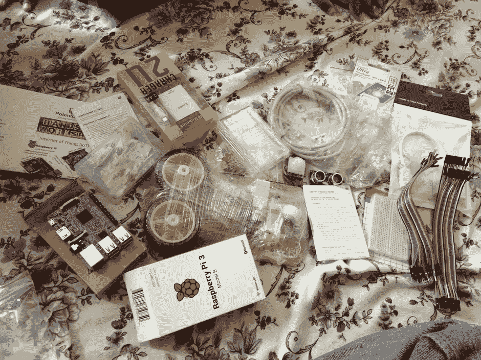
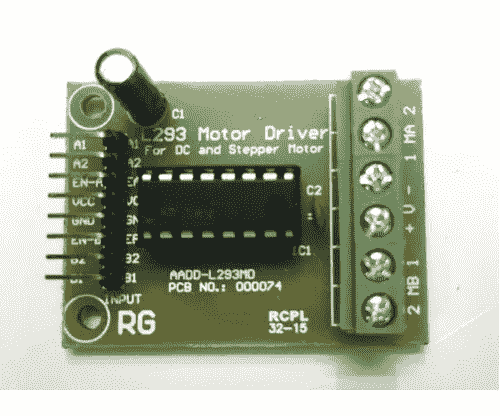
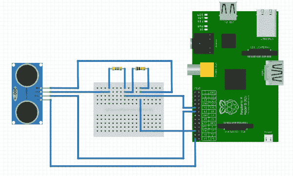
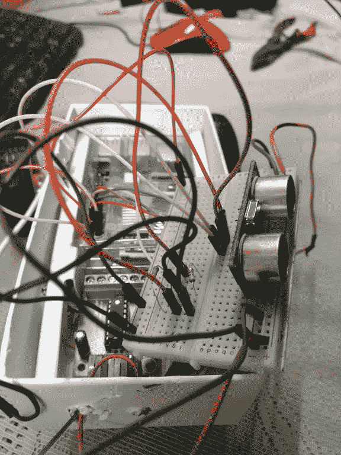
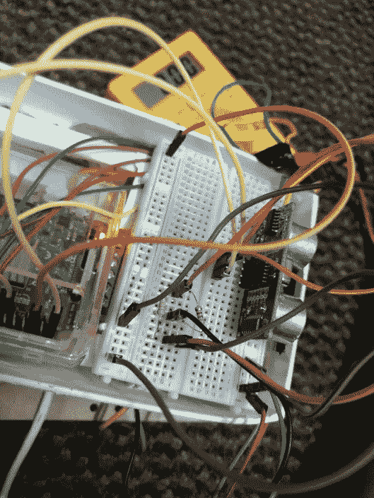
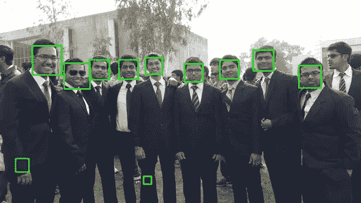

# 使用 Raspberry PI 构建避障机器人(第 1 部分)

> 原文：<https://medium.com/hackernoon/building-obstacle-avoiding-bot-using-raspberry-pi-part-1-4f930d1fa6f8>

*   *我对* [*学习*](https://hackernoon.com/tagged/learning) *硬件、构建一些很酷的 IOT 项目以及在* [*学习*](https://hackernoon.com/tagged/machine-learning) *机器有着巨大的兴趣。*

***Obstacle Avoiding Test*** , That White Wire is Cable to Supply power to Raspberry PI using Power Bank in Hand.

*要求:*

*   树莓 Pi 3 B
*   网络摄像头或摄像头模块(用于使用 OpenCV 对 ***系列*** 的第 2 部分进行实时图像检测)
*   L293D 电机驱动器(正向和反向步进)
*   超声波距离传感器(主要用于避免障碍物碰撞)
*   两轮驱动底盘或四轮驱动底盘，带两个 DC 马达
*   中号收纳盒(我拿的是手机盒:P)
*   跳线 M-F F-F M-M
*   电源组(输出为 5 伏和 2.2 安培以运行 Raspberry PI 3 的任何电源组)
*   半块试验板。
*   330 欧姆电阻器(用于降低电压)
*   PIR 传感器(可选:主要用于运动检测)



Requirement’s



**L293d Motor Driver Module**

*   *电子电路中的 H 桥，它能使电压沿两个方向加到电机上。这些电路通常用于机器人和其他应用，以允许 DC 电机向前或向后运行。大多数 DC-交流转换器(功率逆变器)、大多数交流/交流转换器、DC-DC 推挽转换器、大多数电机控制器和许多其他类型的电力电子器件都使用 H 桥。特别是，双极步进电机几乎总是由包含两个 H 桥的电机控制器驱动。大部分 H 桥电路是由 4 个晶体管组成的~维基定义*

这里，***单片机=树莓派*** ，

A1、A2 —来自电机 1 微控制器的输入
B1，B2 —来自电机 2 微控制器的输入
ENA —启用电机 1，
ENB —启用电机 2。
如果 ENA 和 ENB +5v —电机全速，
如果 ENA 和 ENB +2.5v —电机半速，依此类推。
如果 ENA 和 ENB 为 0v——电机停止。
ENB ENA—来自微控制器的 PWM 输入

*   ***例如*** :

A1 A2 ENA 功能
高高低逆时针转动(反转)
高低高顺时针转动(正转)
高高高停止
高低低停止
低 X X 停止

2 MB 1 =用于连接电机 2
+ v — =电机电源“+”和“-”
1ma 2 =用于连接电机 1

*   ***记下上面的笔记，输入让我们将 L293D 电机与 Raspberry PI GPIO 引脚匹配:***

*VCC - > 5V 电压
GND - >接地
A1 - >方向控制信号
A2 - >方向控制信号
En-B - > PWM 控制(用于速度控制或电机启用/禁用)
B1 - >来自控制器
B2 - >来自控制器*

*   ***连接 GPIO 管脚号的*** :

*motor a1 = 18
motor a2 = 16
motor 1ea = 22*

*马达 1 = 19
马达 2 = 21
马达 2EB = 23*

*GND =至线路—在试验板上(负极/接地)，应该是 btw —跳线(6 个接地引脚)和—电池端子*

*VCC =连接到试验板中+ve 线上电池的+ve 端子*

*   ***检查电机:***
*   检查正向和反向

```
import RPi.GPIO as GPIO
from time import sleep

GPIO.setmode(GPIO.BOARD)

Motor1A = 16
Motor1B = 18
Motor1E = 22B1 = 19
B2 = 21
BE = 23

GPIO.setup(Motor1A,GPIO.OUT)
GPIO.setup(Motor1B,GPIO.OUT)
GPIO.setup(Motor1E,GPIO.OUT)GPIO.setup(B1,GPIO.OUT)
GPIO.setup(B2,GPIO.OUT)
GPIO.setup(BE,GPIO.OUT)

print "Turning motor on"
GPIO.output(Motor1A,GPIO.HIGH)
GPIO.output(Motor1B,GPIO.LOW)
GPIO.output(Motor1E,GPIO.HIGH)GPIO.output(B1,GPIO.HIGH)
GPIO.output(B2,GPIO.LOW)
GPIO.output(BE,GPIO.HIGH)
sleep(20)

print "Stopping motor"
GPIO.output(Motor1E,GPIO.LOW)
GPIO.output(BE,GPIO.LOW)
GPIO.cleanup()
```

***超声波传感器:***

***我已经在 hackster.io 上写了一个使用超声波传感器*** 的小项目

> [***https://www . hackster . io/arbazhussin/distance-calculation-with-ultrasonic-sensor-26 d63e***](https://www.hackster.io/arbazhussain/distance-calculation-with-ultrasonic-sensor-26d63e)

*   *这里可以使用相同的指令，来自上面的 url 项目。*



**Setup on Breadboard**



**Zoom View for Connection’s**

*   *如果传感器检测到≥ 15 cm 范围内的任何物体，它将前进，否则将后退，这将有助于车轮避免碰撞到物体*

```
#!/usr/bin/python
import time
import RPi.GPIO as GPIO
from time import sleepGPIO.setmode(GPIO.BOARD)GPIO_TRIGGER = 11
GPIO_ECHO    = 13Motor1A = 16
Motor1B = 18
Motor1E = 22Motor2A = 19
Motor2B = 21
Motor2E = 23GPIO.setup(Motor1A,GPIO.OUT)
GPIO.setup(Motor1B,GPIO.OUT)
GPIO.setup(Motor1E,GPIO.OUT)GPIO.setup(Motor2A,GPIO.OUT)
GPIO.setup(Motor2B,GPIO.OUT)
GPIO.setup(Motor2E,GPIO.OUT)print "Ultrasonic Measurement"GPIO.setup(GPIO_TRIGGER,GPIO.OUT)  # Trigger
GPIO.setup(GPIO_ECHO,GPIO.IN)      # EchoGPIO.output(GPIO_TRIGGER, False)def measure():
  time.sleep(0.333)
  GPIO.output(GPIO_TRIGGER, True)
  time.sleep(0.00001)
  GPIO.output(GPIO_TRIGGER, False)
  start = time.time()

  while GPIO.input(GPIO_ECHO)==0:
    start = time.time()while GPIO.input(GPIO_ECHO)==1:
    stop = time.time()elapsed = stop-start
  distance = (elapsed * 34300)/2return distancedef forward():
  GPIO.output(Motor1A,GPIO.HIGH)
  GPIO.output(Motor1B,GPIO.LOW)
  GPIO.output(Motor1E,GPIO.HIGH)
  GPIO.output(Motor2A,GPIO.HIGH)
  GPIO.output(Motor2B,GPIO.LOW)
  GPIO.output(Motor2E,GPIO.HIGH)
def turn():
  GPIO.output(Motor1A,GPIO.LOW)
  GPIO.output(Motor1B,GPIO.HIGH)
  GPIO.output(Motor1E,GPIO.HIGH)
  GPIO.output(Motor2A,GPIO.LOW)
  GPIO.output(Motor2B,GPIO.HIGH)
  GPIO.output(Motor2E,GPIO.HIGH)try:while True:distance = measure()
    print "Distance : %.1f" % distance
    time.sleep(0.5)if distance >= 15:
     forward()
    else:
     turn()except KeyboardInterrupt:GPIO.cleanup()
```

[***Obstacle Avoiding***](https://www.youtube.com/watch?v=AJLdyEmLKlE) ***Demo***

*   ***现在是时候给树莓派 3 添加网络摄像头或者摄像头模块了。***

***下载编译 OpenCV 与 Python3 协同工作:***

*   确保创建单独的虚拟环境，以避免乱七八糟的东西。

> [*http://www . pyimagesearch . com/2016/04/18/install-guide-raspberry-pi-3-raspbian-Jessie-opencv-3/*](http://www.pyimagesearch.com/2016/04/18/install-guide-raspberry-pi-3-raspbian-jessie-opencv-3/)

```
pip install numpy
pip install tensorflow-cpu
pip install PIL
pip install matplotlib.pyplot
pip install pandas
```

*   现在我们用的是***Haar cascode _ frontal face _ default . XML****只是检测人脸。*



**Example of face haarcascade of OPENCV Library**

```
import cv2
import sys
import logging as log
import datetime as dt
from time import sleepcascPath = "haarcascade_frontalface_default.xml"
faceCascade = cv2.CascadeClassifier(cascPath)
log.basicConfig(filename='webcam.log',level=log.INFO)video_capture = cv2.VideoCapture(0)
anterior = 0while True:
    if not video_capture.isOpened():
        print('Unable to load camera.')
        sleep(5)
        pass# Capture frame-by-frame
    ret, frame = video_capture.read()gray = cv2.cvtColor(frame, cv2.COLOR_BGR2GRAY)faces = faceCascade.detectMultiScale(
        gray,
        scaleFactor=1.1,
        minNeighbors=5,
        minSize=(30, 30)
    )# Draw a rectangle around the faces
    for (x, y, w, h) in faces:
        cv2.rectangle(frame, (x, y), (x+w, y+h), (0, 255, 0), 2)if anterior != len(faces):
        anterior = len(faces)
        log.info("faces: "+str(len(faces))+" at "+str(dt.datetime.now()))# Display the resulting frame
    cv2.imshow('Video', frame)if cv2.waitKey(1) & 0xFF == ord('q'):
        break# Display the resulting frame
    cv2.imshow('Video', frame)# When everything is done, release the capture
video_capture.release()
cv2.destroyAllWindows()
```

*   ***将在下一部分介绍用于实时图像数据提取的网络摄像头模块、Opencv Lib 和 Numpy，以创建自动驾驶机器人。***
*   *如果你已经使用过 opencv、numpy、tensorflow，那么*
*   *github 上已经有使用流行的机器学习库 Tensorflow 训练的数据。向@hamuchiwa 致敬*

> [**https://github.com/arbazkiraak/AutoRCCar**](https://github.com/arbazkiraak/AutoRCCar)**by @**[hamuchi wa](https://github.com/hamuchiwa)

*   *如果你想学习如何使用神经网络训练数据。*
*   *我会推荐****send ex 图坦卡蒙并在 GTA 5 :D*** 中练习

***未完待续。***