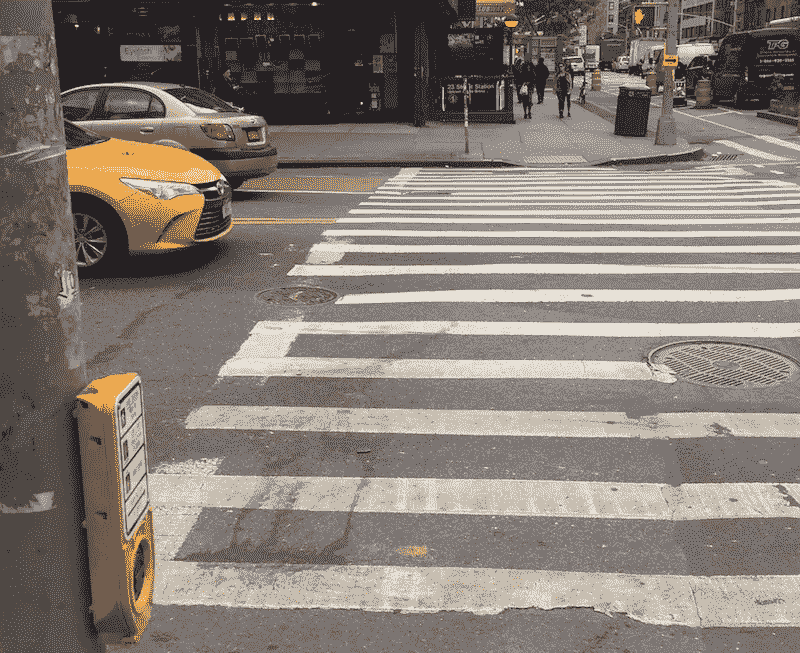
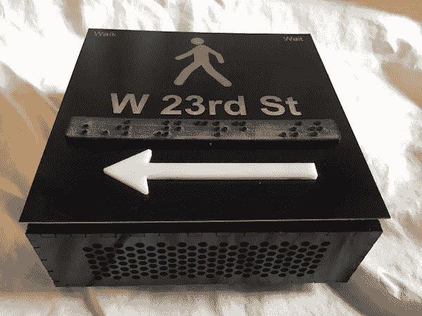
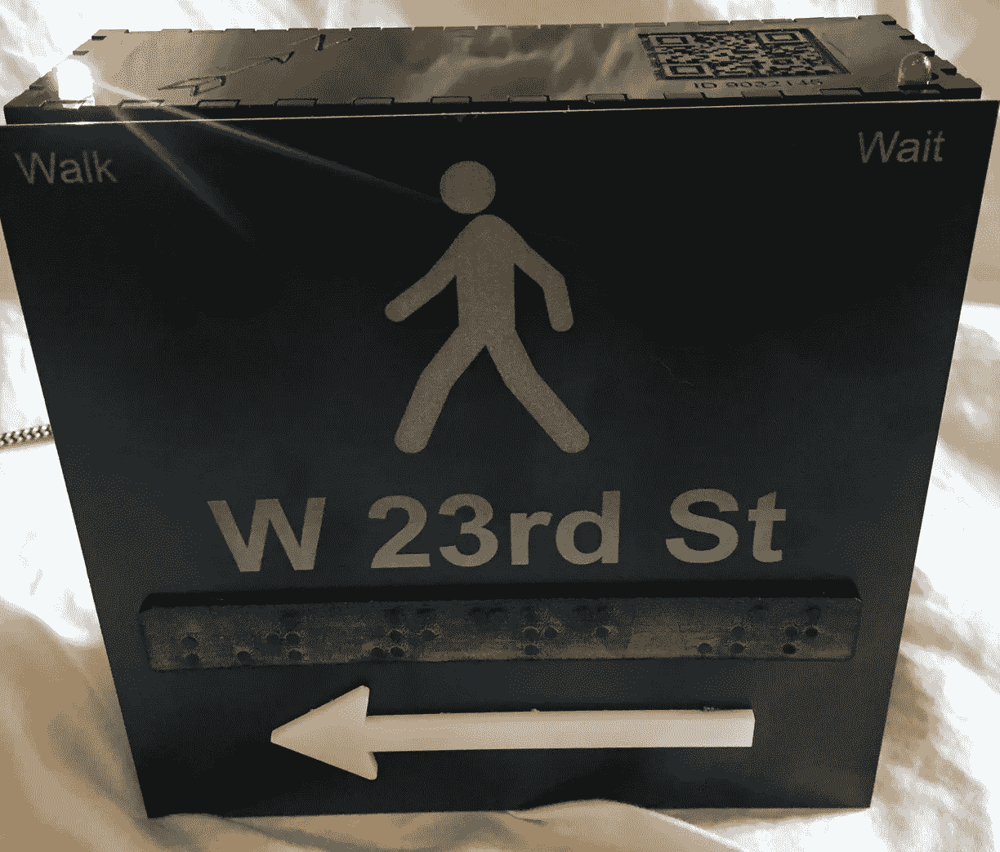
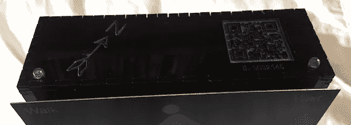
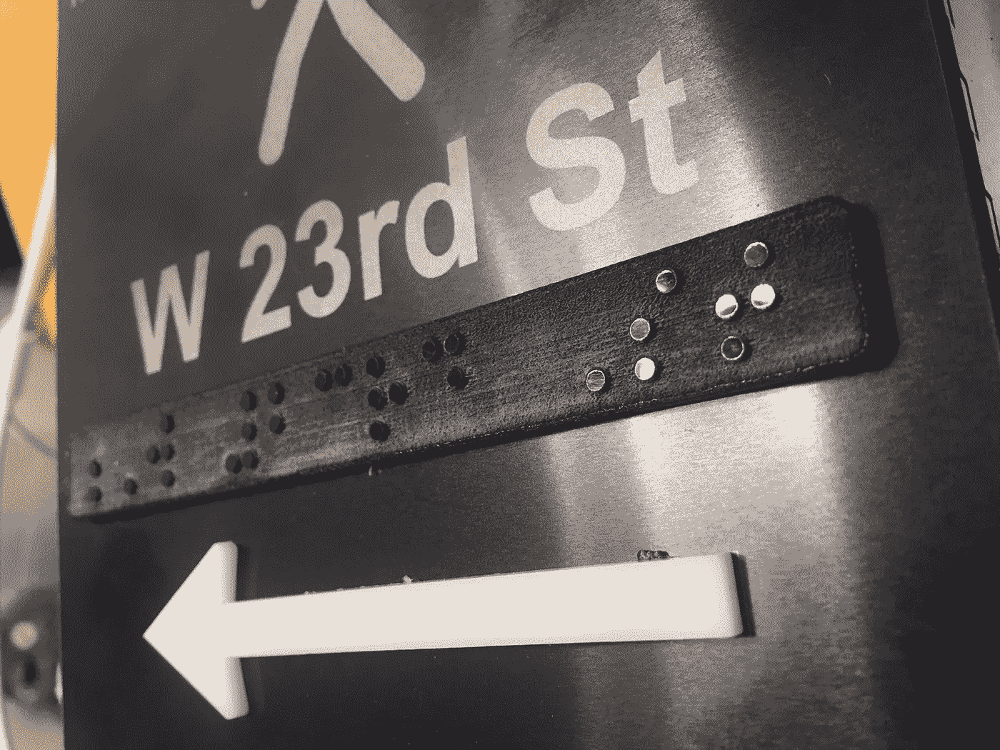
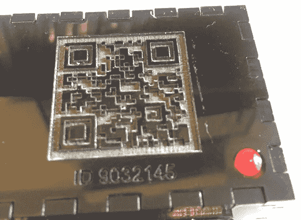
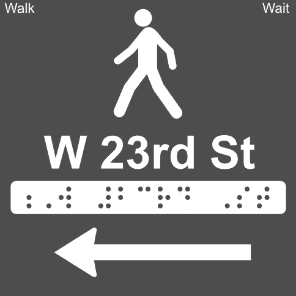
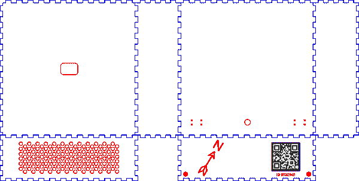
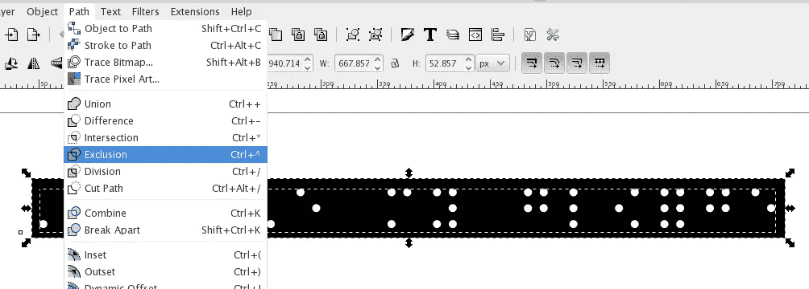
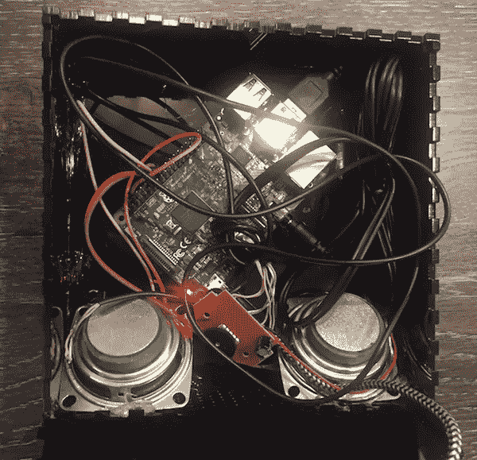

# 构建开放式 APS:使用 Glowforge 和 Raspberry Pi 为弱视和失明行人提供低成本交通信号

> 原文：<https://medium.com/hackernoon/building-open-aps-a-low-cost-traffic-signal-for-low-vision-and-blind-pedestrians-using-a-glowforge-84e18d10f3aa>

在这篇文章中，我将讨论原型设备的设计考虑因素和技术方法，并提交纽约市/巴塞罗纳挑战赛 [*的创新呼吁——提高盲人和弱视行人的流动性*](http://www.nyc.gov/html/cfi/html/DOT/index.html) *。*

我和托马斯·洛根(我的妹夫)一起工作；无障碍咨询公司 [Equal Entry](http://equalentry.com/) 的创始人)来论证建造[无障碍](https://hackernoon.com/tagged/accessible)行人信号(“APS”)是可能的；这些是你在一些人行横道上发现的哔哔声盒子)，比当前纽约市的实现具有更大的功能，而成本只是当前的一小部分。我们的 [Open APS](http://openaps.nyc/) 设计使用了[公共数据](https://opendata.cityofnewyork.us/)、一种[开源](https://hackernoon.com/tagged/open-source)方法和商品消费工具——我们使用 [Glowforge 激光切割机](/@cgroom/glowforge-first-thoughts-and-impressions-8793b2eb9d5)和[树莓派](https://www.raspberrypi.org/)制作了我们的原型。

今天，[纽约市在每个路口平均花费 43，060 美元](http://www.nyc.gov/html/dot/downloads/pdf/2016-aps-program-status-report.pdf)用于 8 个 APS 设备(每个角落 2 个)。安装费用为 985 美元/杆；这意味着剩余的单位成本为 **$4465** 。相比之下，我们的商品成本仅为 66 美元。通过将每个路口的铺设成本降低几个数量级，我们希望这个城市能够更快地让每个人的街道变得更安全。

在这篇文章中，我将介绍我们的建议；无障碍设计考虑因素(弱视、失明、色盲和聋哑人)；使用 Glowforge 激光切割机进行可访问性原型制作的技巧；并附上树莓酱。

免责声明:我是 Glowforge 的小天使投资人。

# 打开 APS 建议

纽约市的各个十字路口都有无障碍行人信号(APS)。这里有一个:

The yellow box is an APS. When the crosswalk is green, it vibrates and makes a beep. It emits a different locator beep when the light is red.

毫无疑问，这些信号帮助盲人和弱视者更安全地过十字路口。虽然我们为纽约市安装这些设施而喝彩，但我们有两点批评:

1.  他们很少。这是因为该市每年只能负担 75 个十字路口的新增费用。我们相信更低的成本将转化为更大规模的部署。
2.  他们做的不多。他们告诉你什么时候是绿灯；就是这样。**我们相信这些设备可以通过改进的视觉标志、触觉标志和语音提供额外的导航和安全指导。**

托马斯和我提议提供一个免费和开放的服务来生成所有必要的资产(标志、音频、软件)，以创建一个适合任何特定人行横道的 APS 因此得名“开放接入点”像数控铣床这样的硬件可以用来创建定制的标志，软件和音频可以包含在 Raspberry Pi(或任何廉价计算机)的即用型 flash 图像中。

为了证明这一点，我们用 66 美元的零件和 Glowforge 激光切割机制作了一个工作原型。

Prototype Open APS for the North-East corner of 7th Ave and W 23rd St, crossing W 23rd St.

我们设想的工作流程如下:

1.  一位城市工程师访问我们的网站，输入他们感兴趣的十字路口和人行横道。
2.  我们将使用公共的[街道中心线数据集](https://data.cityofnewyork.us/City-Government/NYC-Street-Centerline-CSCL-/exjm-f27b)来查找关于人行横道的信息(街道宽度、自行车道等等)。
3.  工程师验证这些数据，然后单击继续。
4.  我们生成一个. zip 文件，其中包含生产这个 APS 设备所需的所有资产。这包括用于 CNC 机器的 SVG 文件，以及用于 Raspberry Pi 的 ISO 图像，该图像包括预先生成的文本到语音的音频和必要的软件。
5.  商用硬件用于生产和组装这些设备。

开放式接入点需要电源(约 3 瓦)和步行信号的硬连线连接(为了确保安全，实际的信号灯应该是真实的来源)。如果硬连线不可用或不必要(例如在公园中)，该设备可以在功能减少的“仅定向”模式下运行。不需要上网。

# 辅助功能

## 显示交叉的街道名称

*   使用大的、高对比度的无衬线字体
*   保持视觉上的简单——不要展示十字路口
*   名字下面的盲文；细胞高 0.4 英寸

## 箭头指向交叉方向

*   高调
*   触觉的

## 按下时设备发声

信号盒的整个正面是一个按钮，当按下时会触发音频。

*   **短按**:人行横道状态(走，不走)，正在穿越的街道名称。
*   **长按**:附加信息，包括十字路口、街道宽度、危险警告，如自行车道、中央分隔带、交通方向和公交专用道。

这是红灯亮时长按音频的一个例子。

需要认真考虑到底应该说什么以及以什么顺序说。我们的主要目标是安全，所以我们想通过使用不同的词序来清楚地消除行走/不行走的暗示:

*   **步行:**“西 23 街步行标志亮了。穿过西 23 街。"
*   **不要走:**“等过了西 23 街。等等。”

## 标准 APS 行走/禁止行走信号

像现有的 APS 设备一样，当人行横道为绿色时，我们的设备会振动(目前，我们使用压电)并发出“行走”蜂鸣音。当十字路口不是绿色的时候，我们会发出一个“定位器”的声音。

## 步行/不步行灯

弱视的人可能很难看清远处的人行横道灯；此外，在纽约市，公共汽车和卡车经常阻塞信号。为了解决这个问题，我们还在设备顶部添加了明亮的“行走”和“不行走”LED 灯。请注意，“行走”指示灯不是稳定的绿色，以避免红/绿色盲问题。

## 唯一 ID、二维码和信标

虽然这不是*直接*的一个辅助功能，但我们建议为每个设备分配一个自己唯一的 ID，以及自己的查找 URL。该 URL 显示为设备顶部的二维码，并作为 BLE 信标(约 2 米/6 英尺范围)进行广播。

Top of device, with walk / don’t walk LEDs and etched QR code.

这有几个潜在的好处:

*   使用智能手机应用程序，盲人或弱视者可以使用信标获得精确的位置信息和人行横道的实时更新(例如附近的建筑)。
*   使报告特定设备的维护问题变得容易。
*   加载二维码或 beacon URL 的任何人都可以了解更多有关城市无障碍项目和其他资源的信息。

# 用 Glowforge 构建一个可访问性原型

整个原型是在我布鲁克林的公寓里建造和组装的。该标志和围栏是在 Inkscape 设计的，并使用 Glowforge 进行蚀刻和切割。请注意，虽然 Glowforge 是一个很棒的原型开发工具，但它不是我推荐的最终开放 APS 设备；这些将需要耐候围栏和铣削标志。

APS 正面的标志被蚀刻成一块 6 英寸×6 英寸的黑色阳极氧化铝。我粘上了一个白色的丙烯酸箭头，还有蚀刻成黑色丙烯酸的盲文(0.4 英寸的字母，在 5.3 英寸 x 0.66 英寸的纸上)。

外壳是一个 6 英寸 x 6 英寸 x 2 英寸的黑色亚克力盒子。

*   它使用由“激光切割框”创建的标签。
*   盒子的顶部是蚀刻的 QR 码位图图像。还有发光二极管的孔，和一个指向北方的蚀刻方向箭头。
*   底部有一个网格状的声音孔。
*   前面有小孔，正好适合按钮式引线。
*   背面有一个孔，用于 Raspberry PI USB 电源线。

源图形文件看起来像:

这是格洛福特切割外壳的视频:

## 提示和技巧

*   激光蚀刻铝看起来很棒，但是很挑剔。你想炸开顶部的黑色层，但不要让激光花太多时间在干净的铝上。否则，金属会变热变形。我使用 0.02 英寸厚的手动设置，雕刻设置为 1000 速度，30%功率，340 DPI，2 遍。
*   我对二维码的效果很满意。黑色亚克力在蚀刻处变成浅灰色，提供一些自然的对比。
*   剪下白色丙烯酸形状，然后把它们粘在黑色背景上，这绝对是“砰！”

## Glowforge 上的盲文

虽然 Glowforge 非常适合制作高质量的丙烯酸盲文文字，但有几个注意事项:

*   盲文需要将点抬高。这意味着你需要蚀刻掉凸起点周围*的所有材料。深入蚀刻，以获得最大的触觉效果。*
*   细胞大小有标准的预期尺寸。我们使用 0.4 英寸高。
*   标牌应使用[二级盲文](https://en.wikipedia.org/wiki/English_Braille)印刷。这不是一对一的书面英语转录，因为它包括许多缩写和缩写。使用在线翻译。

这是我在 Inkscape 中制作盲文矢量图像的过程。我的目标是生成一个填充的矩形，用圆形*切掉它的*，这样我就可以告诉 Glowforge 将它雕刻成一个单一的矢量对象，其中填充区域被移除，非填充区域保留。

1.  下载盲文字体([我用的是卡尔·亨德森的盲文](http://www.fontspace.com/category/braille)
2.  使用二级盲文将您的文本输入到盲文翻译网站[；复制并粘贴 Unicode 结果。](https://www.branah.com/braille-translator)
3.  在 Inkscape 中，绘制一个黑色矩形。然后，使用盲文字体和白色前景选择字体工具，并粘贴您的盲文。
4.  选择文本及其后面的矩形。进入路径菜单>排除。这将字母从矩形中“雕刻”出来。

我用最深的蚀刻设置把这个印到了 Glowforge 上。

# 树莓派的“内脏”

在外壳内部，有一个树莓 Pi 连接到 USB 供电的扬声器，GPIO 引脚连接到按钮和 led。出于原型目的，我们模拟了交通灯信号定时，但将它连接到有线信号会很简单。

原型软件非常简单。我们运行股票 Raspbian Stretch Lite，并启动我们的 Python 脚本。我们有一个驱动所有应用程序行为的 JSON 配置文件；和音频资产(mp3 文件)的文件夹。每个打开的 APS 安装之间的唯一区别是这个配置文件和音频文件。

音频是使用 Google TTS 通过 gTTS Python 实用程序预先生成的。我们用 mpg123 播放声音(不要用 omxplayer 它切断音频的最后半秒)。

我们按照这些简单的指令建立了 BLE 埃迪斯通灯塔。

# 后续步骤

我们于 2017 年 11 月 1 日向创新挑战征集活动提交了这份提案。如果我们的提议被接受，我们将在几个方面开展工作:

1.  建立一个更耐用的概念验证，并在第 7 大道和西 23 街的交叉口进行现场部署；观察并收集反馈。
2.  与当地盲人、弱视者和无障碍社区合作，获得反馈和意见。
3.  建立一个工作网站，利用开放数据自动创建标牌和软件资产。
4.  与当地的数控铣削车间合作，试切一批定制标牌。
5.  与硬件供应商合作，构建一个具有集成扬声器、计算机和布线的全天候机箱，这样，您只需插入一个微型 SD 卡，连接电源和人行横道布线即可安装设备。

# 最后的想法

这个项目的大部分时间都花在了物理交互模型和设计的迭代上；相比之下，软件和布线相对简单。当您考虑不同的模态和能力时，决定传递多少信息以及如何传递的设计问题变得更加复杂。托马斯和我重复了很多次，直到我们确定了我们的原型设计。拥有 Glowforge 这样的内部制作工具让这个过程变得更快更有趣，因为我们可以在一起的时候不断尝试各种想法。

非常感谢 [Chancey Fleet](https://twitter.com/ChanceyFleet) 对现有 APS 解决方案和待改进领域的意见；感谢 [PASS](http://www.passcoalition.org/) 的 Karen Gourgey 和巴鲁克学院视障人士计算机中心为她提供的行人安全咨询。