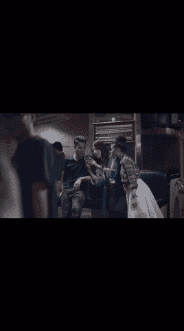
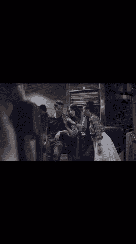
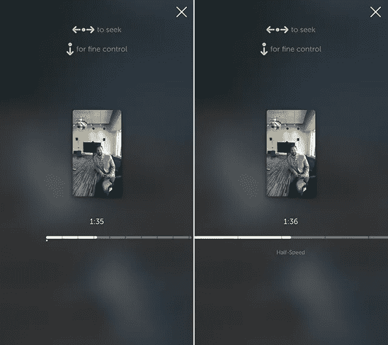
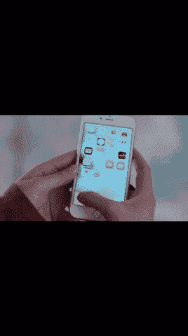
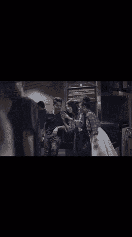
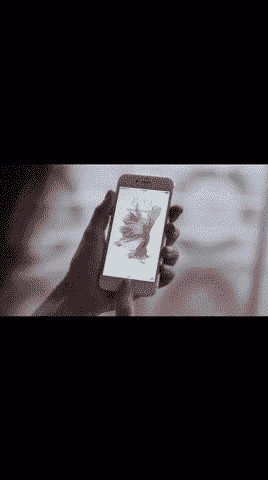
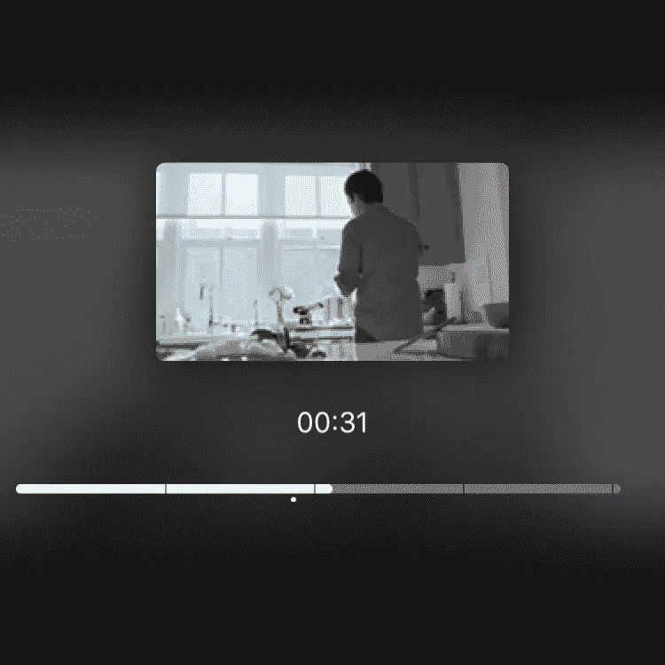
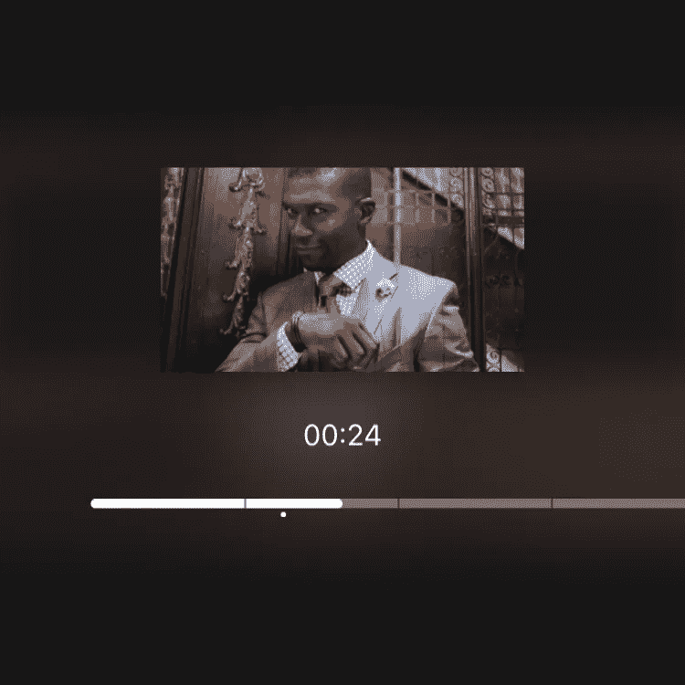
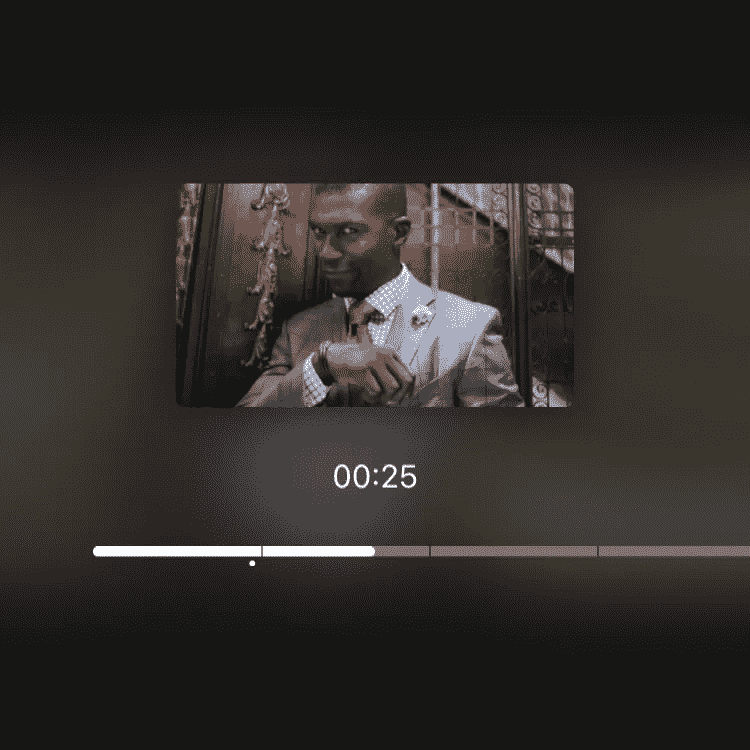

# 为 iOS 建立潜望镜快速倒带控制

> 原文：<https://medium.com/hackernoon/building-periscope-fast-rewind-control-for-ios-5cb6801db0fd>

圣诞节结束了。除夕也过完了。我希望每个人都过得很愉快，并且你已经准备好开始努力工作和学习新的东西了！

我想从今年的一篇精彩文章开始——关于如何创建类似于 [**潜望镜**](https://itunes.apple.com/us/app/periscope/id972909677?mt=8) 快速倒带控件的教程。

## 要求

1.  Xcode 7+
2.  [iOS](https://hackernoon.com/tagged/ios) 8+
3.  至少基本的 Swift 知识
4.  对 iOS 和开发充满热情

## 高层解释

为了构建这个组件，我们必须使用视频播放器— [AVPlayer](https://developer.apple.com/library/ios/documentation/AVFoundation/Reference/AVPlayer_Class/) 。我们将添加[UILongPressGestureRecognizer](https://developer.apple.com/library/ios/documentation/UIKit/Reference/UILongPressGestureRecognizer_Class/)来开始倒带和计算手指平移——它将帮助我们改变倒带速度和计算时间。在倒带过程中，我们将使用 [UIVisualEffectView](https://developer.apple.com/library/tvos/documentation/UIKit/Reference/UIVisualEffectView/index.html) 模糊视频，使用 [AVAssetImageGenerator](https://developer.apple.com/library/mac/documentation/AVFoundation/Reference/AVAssetImageGenerator_Class/) 生成预览缩略图。

好的。不说了， [**就这么办**](https://www.youtube.com/watch?v=ZXsQAXx_ao0) 。

创建单视图应用程序并创建新类**video view controller**—uiview controller 的子类。导入 **AVFoundation** 并将这段代码放入类声明中:

我们在这里做的一切都很简单:

1.  声明了所有与 AVPlayer 相关的变量，我们将在未来使用这些变量；
2.  用 videoURL 创建了自定义初始化器，其中我们设置了 URL 并初始化了所有—avurlasse、AVPlayerItem、AVPlayer 和 AVPlayerLayer
3.  在 **loadView** 中，我们添加玩家来查看子层；
4.  在 **viewDidLoad** 中，我们简单地开始播放视频；
5.  在 **prefersStatusBarHidden** 中，我们返回**true**——如果我们的状态栏基于视图控制器，它会隐藏状态栏(可以在 *Info.plist* 文件中更改)。
6.  只需将 playerLayer 的框架设置为 view.bounds —我们支持纵向和横向。

好的。我们的视频查看控制器已准备好进行早期测试。为了测试它，我们必须做两个简单的步骤:

1.  [下载这个 ZIP 文件](http://www.filedropper.com/resources)，解压**资源**文件夹并添加到您的项目*(不要忘记选择需要的目标)*；
2.  打开 **ViewController.swift** 文件，将以下代码放入其中:

现在，在您的设备或模拟器上运行 project，并确保视频视图控制器存在，视频正在播放，并且所有方向都受支持。

我们的下一步是识别触摸和模糊内容。

在 **VideoViewController** 中声明这两个变量:

将此代码粘贴到 **loadView** 方法的末尾:

将此代码添加到**viewlllayoutsubviews**方法的末尾:

实现此功能:

此功能的目的是当触摸开始时暂停视频并淡出视觉效果视图，当触摸取消、结束或失败时恢复视频并淡出视觉效果视图。将来我们会给这个方法添加更多的逻辑。

运行项目并测试长按。

这就是它在我的设备上的工作方式:

下一步是创建时间轴视图并实现倒带功能。但是让我们快速浏览一下[潜望镜](https://hackernoon.com/tagged/periscope) UI 来理解我们的时间线到底应该是什么样的，以及它应该如何工作。

如您所见，时间轴从视图控制器的左侧延伸到右侧。它有一个白点，指示当用户开始倒带时视频停止的位置。如果你比较截图，你会注意到，间隔宽度是不同的——这是因为倒带速度(在我们的项目中，我们称之为**缩放**)值不相等。最后要注意的是，当前时间总是在时间轴的中间。

创建 **TimelineView** 作为 UIView 的子类，并声明这些变量:

每个变量的目的都很明显，但让我们确保每个人都明白:

1.  **时长** —一段视频的总时长，单位为秒；
2.  **initialTime** —倒带开始的秒数；
3.  **当前时间** —以秒为单位的当前时间；
4.  **_zoom** —存储缩放值的私有变量；
5.  **zoom** —在 _zoom 变量的顶部换行，这样当新值被赋值时，我们可以检查它是否在可接受的范围内；
6.  **minZoom** 和 **maxZoom** —这两个变量都定义了缩放的可接受范围；
7.  **intervalWidth** —代表时间线上特定时间间隔的线条宽度。如果缩放不等于 1，则实际间隔宽度等于**间隔宽度*缩放**。计算时将在倒回过程中使用该值—例如，如果 zoom 为 1，intervalWidth 为 30，intervalDuration 为 15，则当用户向左或向右移动 10 个像素时，我们将倒回+5 或-5 秒；
8.  **intervalDuration** —以秒为单位的间隔持续时间。如果视频是 55 秒，间隔是 15 秒，那么我们将有 3 个完整的间隔和一个不完整的间隔。值将在倒带期间用于计算。

minZoom、maxZoom、intervalWidth 和 intervalDuration 可以是常量，但我决定将它们设为变量——如果您想在不同的视频中重用此视图控制器，您可能需要调整这些值。

实现这些功能:

1.  **currentIntervalWidth** —根据缩放值计算间隔宽度；
2.  **time interval from distance**—计算从通过宽度开始的时间间隔，单位为秒。会被用来按距离倒带；
3.  **distance from time interval**—根据给定的时间间隔计算距离。将用于计算经过的间隔宽度；
4.  **rewindbyddistance**—获取距离，计算时间间隔，并将该值添加到当前时间。

实现绘制矩形:

不要害怕。这里的一切都很简单:)我将只解释那些我认为可能需要解释的事情:

1.  正如你之前可能注意到的——当我们在潜望镜中倒带时，时间线从左向右移动。为了实现这种移动，我们计算出 **originX** 值，并应用到我们所有的绘图中；
2.  我们画第一条线，表示完整的时间线；
3.  我们画第二条线，表示经过的时间；
4.  我们画点表示初始时间；
5.  最后，我们在区间之间画分隔符。

时间轴视图的最后一位——实现新的初始化器并将 **opaque** 设置为 **false** :

我感觉我们的时间线结束了。下一步是将其添加到视图控制器并使其工作！

添加这些变量:

第一个变量是内容视图，其中将添加所有与回放相关的视图/控件。当倒带开始和结束时，我们将淡入和淡出这个视图。第二个变量是我们在前一阶段实现的实际时间线视图。最后一个变量将帮助我们计算手指移动了多远，我们应该倒回多远。

将这段代码放在 **loadView** 方法的末尾:

它将所有新的子视图添加到它们的监督视图中，并将时间线的持续时间设置为资产的持续时间。

用此代码更新**长按**功能:

1.  我们已经添加了代码来获取手指的当前位置；
2.  我们根据手指位置计算缩放值。你可以玩这种计算，但我更喜欢这种计算；
3.  当倒带开始时，我们添加了逻辑来设置时间轴的初始时间；
4.  当手势状态等于时，我们调用 rewindByDistance 方法。变了；
5.  我们淡入淡出新创建的内容视图；
6.  如果前一个位置 x 不等于当前位置，我们就更新它。

在我们尝试之前的最后一个阶段是布局我们新创建的视图。将此代码放在**viewlllayoutsubviews**的末尾:

在您的设备或模拟器上运行 project 并检查它！

这是它在我的设备上的外观:

我真的希望你能做好每一件事，并且工作起来完全一样。如果没有——赶紧再去扔教程。

正如你可能已经注意到的，当我们松开手指时，它不会倒带。为了使用以下代码添加更新长按函数:

我们增加了两条新线路——17 号线和 18 号线。用第一行我们计算新时间，用第二行我们寻找那个时间。

再次运行您的项目..尽情享受吧！

现在能用了！

懒惰的人可以在这个阶段关闭教程*(希望你不懒惰)*，因为核心的东西已经建立，下一阶段主要是改进和一些不错的功能。

我们的目标是添加两个新视图:

1.  预览图像视图将显示当前回放时间的视频缩略图；
2.  标签，它将以分:秒的格式显示当前倒带时间。

为了更新这些视图，我决定给时间线视图添加闭包，每当**当前时间**值改变时就会触发。

将此变量添加到**时间线视图**:

更新 **currentTime** 变量实现:

将这些变量添加到 **VideoViewController** 类:

将这两行添加到 **init(videoURL: NSURL)** 的末尾:

最大尺寸指定生成图像的最大尺寸。我们希望最大高度为 **rewindPreviewMaxHeight** 。生成的图像从未按比例放大。但是在大多数情况下，视频大小比预期的缩略图大得多。

将这几行添加到 loadView 方法的末尾:

用以下代码更新 **viewWillLayoutSubviews** 函数:

随意更改**垂直间距**值。它表示预览图像视图、当前时间标签和时间线视图之间的间隙高度。

这一部分的最后一步是实现**currentdimedidchange**闭包。在将时间线视图添加到其 superview 之前添加以下代码:

1.  我们生成当前时间字符串并赋值给 rewindCurrentTimeLabel.text
2.  我们用当前时间和要求的时间刻度初始化请求的时间；
3.  我们异步生成 CGImages。完成后，我们尝试从 CGImage 生成 UIImage，切换到主线程，将图像设置为预览图像视图，并在需要时请求调用布局子视图。

运行您的项目并享受！看起来棒极了！

让我们做最后的润色！在潜望镜中，它们在预览图像视图后面有一个很好的阴影。我们也会添加它！

将该变量添加到**视频视图控制器**:

在设置 rewindPreviewImageView 并将其添加到子视图*之前，将此代码块添加到 **loadView** 函数中(如果您在 rewindPreviewImageView 之后添加它，那么它将在层层次结构中处于较高位置，并将显示在 ImageView 的顶部)*:

对于那些不理解第 6 行的目的的人，我建议阅读一下关于 [**iOS 隐式动画**](https://developer.apple.com/library/ios/documentation/Cocoa/Conceptual/CoreAnimation_guide/CreatingBasicAnimations/CreatingBasicAnimations.html) 。

更新视图 viewWillLayoutSubviews:

跑去看看。

一切都很好。但是..等待..我们的预览图像是像素化的！

是因为**avassetimagegenerator . maximumsize**期望我们提供像素而不是点。关于点和像素有何不同的文档可以在 [**这里**](https://developer.apple.com/library/ios/documentation/2DDrawing/Conceptual/DrawingPrintingiOS/GraphicsDrawingOverview/GraphicsDrawingOverview.html#//apple_ref/doc/uid/TP40010156-CH14-SW7) 找到。

让我们解决这个小问题。

在全班更新这句话:

有了这个:

现在再次运行项目。

发生什么事了..我们的影子在哪里？！我们的拐角半径在哪里？！

我们忘记了一件小事—**AVAssetImageGenerator**返回给我们 CGImage，我们用 CGImage 初始化 UIImage，但没有提供所需的比例。在我们的例子中，我们需要的尺度是 **UIScreen.mainScreen()。标度**。

找到这条线:

用这个更新:

又是润！

精彩！一切都回来了，它工作得很好！呜呜呜。！！

感谢你去扔本教程。如果你喜欢它，请按下心形按钮，并与你的朋友和同事分享。

源代码从本教程与一些改进和更多的功能可以下载 [**这里**](https://github.com/gontovnik/Periscope-VideoViewController) 。

在我的下一篇文章——教程中再见！再见！