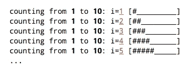

# 用 C++构建反应式终端接口

> 原文：<https://medium.com/hackernoon/building-reactive-terminal-interfaces-in-c-d392ce34e649>

## TL；速度三角形定位法(dead reckoning)

使用函数式编程技术，我们可以很容易地用 C++中的动态组件构建漂亮的终端。RxTerm 是一个 C++库，为实现这个概念提供了一些必要的构建模块。

我们在《T4》中应用了同样的想法。这是结果:

# 动机

假设我们想要构建一个基于文本的应用程序，当控制台的状态改变时，它会更新控制台。Curl 就是一个很好的例子，它提供了一个实时的下载进度条。在你的终端上试试这个:

这些接口是使用 [ANSI 转义码](https://en.wikipedia.org/wiki/ANSI_escape_code)实现的。这些是有副作用的不可见字符，例如擦除字符和移动光标。

我们可以使用这些转义码来创建实时文本界面。一个简单的实现可能会像这样更新进度条:

到目前为止还不错，但如果我们有更复杂的情况呢？理想情况下，我们会利用一个为我们解决这些问题的库。我们应该只需要指定终端输出应该是什么样子，库函数会计算出要打印的字符。

因此，在高层次上，我们需要三样东西:

1.跟踪控制台
2 先前状态的变量。用于呈现当前应用状态的功能
3。将控制台从前一状态转换到下一状态的功能

开发人员将会熟悉这种模式。这是一个聪明的策略，实际上可以应用于任何 I/O 设备！

此外，我们希望能够将可重用的 UI 组件用于进度条、列表等等。类似 HTML 的东西，但是更简单，将是理想的。组件可以是能够呈现到控制台输出的任何对象。

# 简单的 API 示例

为了了解我们要去哪里，让我们看一下 [RxTerm](https://github.com/LoopPerfect/rxterm) 中的一个例子。通过 RxTerm，我们可以使用组合将基本的终端组件变成更复杂的组件。如果应用程序状态改变，那么我们为终端计算一个新的视图，并替换当前可见的输出。

这个例子展示了我们如何设计一个名为`fancyCounter`的新组件，它像这样打印帧:

代码如下:

如你所见，界面非常高级。

# ANSI 转义码

让我们从基础开始。我们如何使用 ANSI 转义码来改变颜色和删除一行？

该功能以红色打印`Hello`,然后以默认颜色打印`World`。神奇的转义序列(`\e[31m`和`\e[0m`)修改终端显示字符的方式。

转义序列以`\e[`开始，后跟分号分隔的修饰符列表，以`m`结束。例如，`\e[3;31;42mTEXT`会在蓝色背景上用红色斜体打印`TEXT`。

我们也可以打印`\e[0m`将终端重置回默认状态。

你可以在 bash-hackers.org 找到一份完整的清单。

# 抽象终端状态

为了能够组合组件，我们需要控制台状态的高级表示。因为我们想要支持颜色，所以直观的表示是从坐标到像素的映射:

一旦我们有了组件的基本抽象，
我们就可以利用类型删除来维护值语义，并使继承成为实现细节:

现在，我们可以构建更高阶的组件，如`Text`对象:

你可以在这里找到实际的实现[。](https://github.com/LoopPerfect/rxterm/blob/master/rxterm/include/components/text.hpp)

# 执行状态转换

想象一下，我们想从这里开始过渡:

…对此:

最简单的方法是删除最近的 3 行并打印新行。我们可以通过打印`\e[2K\r\e[1A` ( `delete line`)来删除最新的一行；`move cursor to the start of the line`；`move cursor up one line`)。

更复杂的方法是计算差值并移动到目标位置，只编辑发生变化的终端像素。为了简单起见，我们将坚持第一种方法，并将移动部分合并到一个类中:

[的实际实现托管在 GitHub](https://github.com/LoopPerfect/rxterm/blob/master/rxterm/include/terminal.hpp) 上。

# 裁决

我们看到了编写一个反应式终端框架和管理状态转换是多么容易，而且没有太多麻烦！

你可以在我们在 GitHub 上的 [repo 中找到一些基本组件的实现。我们希望看到更多的人做漂亮的终端界面！](https://github.com/loopperfect/rxterm)

## 预告:带 RxCpp 的 FRP 样式组件

我们的下一篇文章将讨论如何利用 [RxCpp](https://github.com/Reactive-Extensions/RxCpp) 来编写具有复杂状态管理的高度并发的应用程序。

# 关于牛仔的更多信息

我们创造了 [Buckaroo](https://buckaroo.pm) 来使 C++代码重用更容易。在媒体上阅读更多关于[的信息:](/@buckaroo.pm/)

 [## 使用降压构建的 7 个理由

### Buck 是一个跨平台、跨语言构建系统，在脸书为大规模编译而设计。所有牛仔…

hackernoon.com](https://hackernoon.com/7-reasons-to-use-buck-build-5b44d7413585)  [## C++依赖管理的方法，或者我们为什么要建立 Buckaroo

### C++是一种不寻常的语言，因为它还没有一个占主导地位的包管理器(我们正在努力！).结果是…

hackernoon.com](https://hackernoon.com/approaches-to-c-dependency-management-or-why-we-built-buckaroo-26049d4646e7)  [## 我们将 C++库作为源代码发布的 6 个原因

### 编写 C++应用程序时，不可避免地会用到外部库。这是好事！代码重用…

hackernoon.com](https://hackernoon.com/6-reasons-why-we-distribute-c-libraries-as-source-code-2dc614d5ef1e)