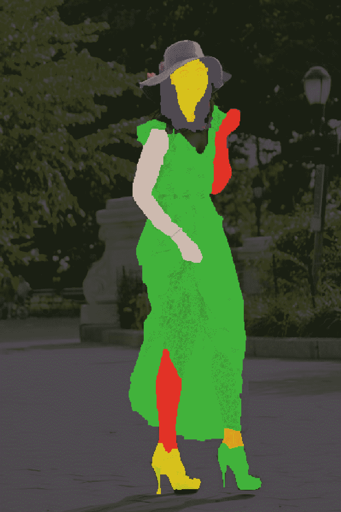
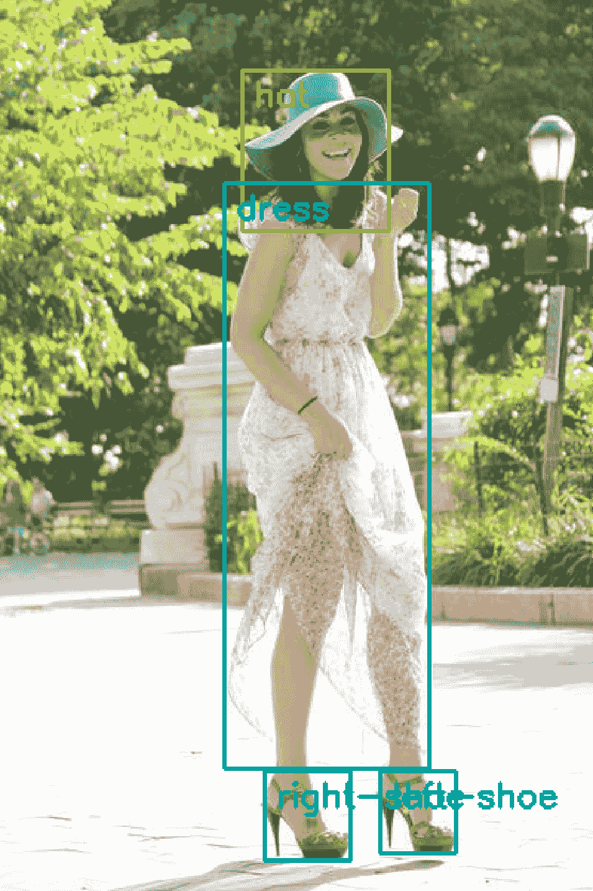

# 利用机器学习构建可扩展的视觉搜索

> 原文：<https://medium.com/hackernoon/building-scalable-visual-search-with-machine-learning-dd4ea38b4bfb>

电视上有个女演员穿了一套你必须穿的衣服。你是怎么找到它的？如果你知道一些细节，你可以在谷歌上搜索一个单词沙拉，然后希望有人已经在博客上写了它。像“布蕾克·莱弗利戛纳蓝色连衣裙”这样的搜索足够流行，但“苏在英国烘焙大赛上穿的那件可爱的蓝色夹克”是不可能的。您需要视觉搜索—在视觉媒体中搜索内容的能力。随着网络上大量的视频和图像内容，对有效的视觉搜索引擎的需求越来越大。

> **那么创建一个可视化搜索引擎是什么样子的呢？**

**视觉搜索管道和购物者体验**

典型的视觉搜索管道需要能够识别图像中的对象，并根据目录进行搜索以找到视觉上相似的项目。该系统需要对图像和视频中各种不同的视觉环境具有鲁棒性。在具有干净白色背景的高质量工作室图像中识别一双鞋是一项非常简单的任务，但是如果在视频场景的背景中，鞋子是背对着摄像机的人穿的，这项任务就变得困难得多(即使对人类来说也是如此)。

我们的视觉搜索管道也必须具有良好的伸缩性，并能在各种不同的部署架构上运行。它需要在 GPU 和 CPU 上都很快(以实现快速、经济高效的部署)。例如，如果我们希望让我们的视频变得可购买，我们需要能够实时准确地检测视频中的对象，以便快速提供可视化搜索结果。

如果我们要通过一个推荐视觉上相似产品的引擎来查看我们个性化购物体验的方式，对象检测是计算机视觉管道中的一个重要部分——在这里，人们可以从各种目录中找到相似的产品，无论是时装、家具、美容产品还是更多。在视觉搜索的情况下，创建有效的图像识别引擎需要两个主要组件——确定*对象在图像中的位置*(检测)，以及*它们是什么*(分类)。

**用于图像识别的深度学习**

近年来，深度学习已经成为解决这类问题的主要方法。用于图像识别的最新深度学习算法使用卷积神经网络(ConvNets ),用大量数据进行训练。ConvNets 由许多连接的计算单元组成，这些计算单元共同形成一个强大的网络，通过直接从人类标记的图像中学习来识别物体。它们的特殊之处在于，它们学习从数据中识别对象，而以前的算法需要许多步骤和特定领域的试探法。

**整幅图像分类**

图像分类是将单个标签分配给图像的过程。例如，下面的图像可能被标记为“女人”、“夏天”、“沙发”等。进行这种分类的算法训练起来既快又简单，但是不能检测一个以上的对象，或者对象在哪里。为图像分类而训练的神经网络通常将图像作为输入，并产生从一组可能的标签中选择的单个标签作为输出。对于视觉搜索来说，我们需要知道场景中所有物体的信息以及它们的位置。

[https://goo.gl/4DA9wf](https://goo.gl/4DA9wf)

**像素分类**

语义分割是根据类别标记图像中每个像素的过程。例如，在下图中，构成鞋子的所有像素可能都被标记为“鞋子”。尽管这是比整个图像分类丰富得多的输出，但通常希望分别识别图像中对象的多个实例。例如，在下图中，我们希望每只鞋都有一个标签:“鞋 _1”和“鞋 _2”。这可以通过一种称为实例分割的语义分割网络来实现。这是一种很好的方法，但是像素分割算法计算量太大，并且需要难以创建的密集标注的训练数据。这可能是实现这种方法的障碍。

**物体定位**

对象定位是为场景中的每个对象预测边界框的过程。在下图中，相关对象很好地包含在预测的边界框中。这通常比仅预测图像级标签的方法慢，但是比对每个像素进行预测快得多，并且仍然完成寻找和标记所有对象的一般任务。有几种流行的方法来进行这种类型的对象检测。一种方法是在图像上滑动一个小窗口，在该窗口内处理每个区域。如果窗口包含对象的概率很高，网络将该窗口称为边界框。另一种类似的方法试图使用某种预处理试探法来缩小可能的测试窗口。这些方法产生了合理的结果，但是它们很慢，因为每个单独的窗口都必须被当作单独的图像来处理。一种替代方法是使用整个图像来进行预测，但是除了对象类别之外，还让网络预测大小和位置。这种方法要求训练数据具有每个图像中每个对象的类别和框信息，但是比必须评估多个窗口以生成对象位置的网络运行得快得多。这种方法非常适合于视觉搜索管道中的第一步；它足够强大，可以在图像中找到并分类多个对象，并且足够快，可以快速处理视频帧。

Object localization

**建立一条能够做出更智能预测的管道**

ConvNets 已被证明在狭窄的、定义明确的任务中是有效的。然而，它们需要大量的数据，并且不能适应检测需求的变化。这些模型中的大多数都忽略了人类用来识别对象的大量隐式上下文信息。例如，如果您在视频的背景中看到雪，您会认为该场景中的任何人都更有可能穿着外套和靴子，而不是泳衣。利用这些关系，我们可以提高准确检测对象的能力，并提高管道的性能，因为它允许我们根据从数据中收集的信息缩小搜索范围。

在 Mad Street Den，我们不断开发利用这些关系的拓扑，以便提供一个计算机视觉管道，在不需要大量训练数据的情况下做出更智能、更明智的预测。

~ [将谢宁](https://www.linkedin.com/in/william-shainin-0a949575/)

Will 是 Mad Street Den 的计算机视觉和机器学习工程师