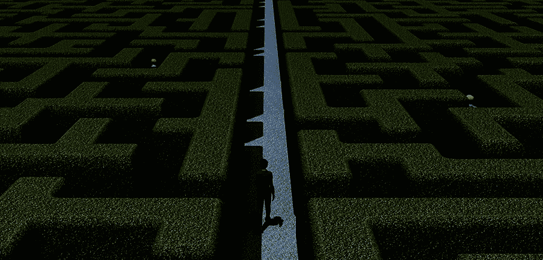

# 建立共识很难

> 原文：<https://medium.com/hackernoon/building-shared-understanding-is-hard-4a8866be3e14>

我们上周达成一致。现在我们不是了。怎么回事？
正确无误。建立共识很难。转瞬即逝。你必须坚持下去。

**为什么 Confluence 中的入职文档会过期？**
因为建立共同的理解是困难的。这需要努力。如果我们不能及时更新它们，也许它们并不重要。你在乎吗？

我们真的需要另一场白板会议吗？
是的。建立共识很难。这需要时间。

**为什么我们要不断重温任务目标？**
因为建立共同的理解很难。尤其是在我们收集新知识和信息的时候。

**为什么他们没有通读我的 Slack 消息？** 因为懈怠是一种水龙带。建立共识很难。出去走走，想清楚。或者提倡团队协议来阅读和评论重要的时差消息。

**团队超级忙。但是我们似乎什么都做不了！**
正确。因为重要的事情需要共同的理解。建立共同的理解是困难的。当我们回避艰苦的工作时，我们最终会做不那么重要的工作。

我一个人可以完成这么多工作。人们只会拖累我。肯定有这样的时候。但是如果一个五人团队作为一个团队运作(而不是五个团队各一个)，那么你必须建立共同的理解。这很难。

**我们能每天在 Slack 里写我们的站立更新吗？**
谈话很重要。建立共同的理解需要节奏，增加新的信息，并确认我们的理解。你能在空闲时做那件事吗？试试看…

这些胶粘物是怎么回事？我们能回去工作了吗？确定。只要确保你是因为正确的原因离开会议，而不是因为建立共识很难。

我无法与人沟通。没错。建立共识很难。

没有人理解我。
我能理解。很难。开始尝试建造桥梁。建立共识。

**为什么那个【分享神器】还不够？**
_ _ _ _ _ _ _ 是硬的。你可能需要更多的艺术品。或者工件上更多的配对，一旦你建立了共同的理解，并在代码和可用的产品中捕获了这种共同的理解，就把它们扔掉。

但是，建立共识是很难的。

**…**
硬

# 所以…..干活吧！