# 构建基于表单的小型 JS 应用程序:使用 ES6 的一步一步

> 原文：<https://medium.com/hackernoon/building-small-form-based-js-apps-step-by-step-with-es6-54a73fb8609>

在下面的文章中，我将概述我在学习如何使用 [ES6](http://hackernoon.com/tagged/ES6) 构建基于表单的 JS 应用程序时使用的笔记。这个特殊的例子是一个“配方箱”(h/t [熨斗学校](https://medium.com/u/973c5cbfb09b?source=post_page-----54a73fb8609--------------------------------)为优秀的，深入的审查会议，这是基于！).

## 开始前的注意事项

请记住:在构建每个函数时，都要在函数体中包含一个 console.log(某个东西),以确保所有的东西都是相互关联的！我构建程序时的控制台日志记录是我作为开发人员学到的最好的事情之一。当我刚开始的时候，这似乎没什么用，但随着工作和生活经验的增加，我越来越意识到一丝不苟的重要性。在厨房工作的人有 *mise en place* 。作家使用提纲和笔记。程序员会边走边调试(无论是使用调试器、控制台日志、TDD 还是任何其他工具，关键是你正在做*某事*。)

## 从 HTML 开始

制作第一部分的 HTML 模型(静态),这将是用户将与之交互的第一个屏幕:


在有一个 [javascript](http://hackernoon.com/tagged/javascript) 文件之前，不会有任何交互性，所以我们将从连接页面开始。

将 JavaScript 文件链接到[文档](https://hackernoon.com/tagged/document)，并确保当页面刷新时，您会看到控制台中正在执行的代码。确保在 HTML 中包含<脚本 src = " index . js "></脚本>。请记住，底部的脚本 src 可以访问来自它上面的源的所有信息，但是上面的脚本不能访问下面的内容。经常出现在脑海中，至少目前是在应用程序中

## 启动 index.js

添加一个带有“DOMContentLoaded”的事件侦听器。请记住，javascript 的所有代码体最终都将驻留在这个函数中。这里还可以使用其他函数，比如 window.onload()

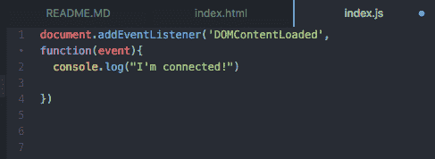

## 开始将事件处理程序绑定到 HTML

首先，创建一个连接到表单的简单事件处理程序。从提交时触发的事件开始。当您提交表单时，控制台记录一些内容，以查看事件处理程序是否在工作。

记住，JavaScript 处理事件的方式是通过父节点和子节点。每当我们触发一个事件，这个事件就会向上冒泡，通过孩子和父母到达最上面的父母，然后再降下来。这是什么意思？这意味着被单击的元素的所有父元素(或者附加了某种事件处理程序)都将接收到该单击事件。这允许事件委托。

注意:如果突然有多个事件发生，或者一个事件触发了太多或不正确的响应，那么您的事件处理程序就有问题了

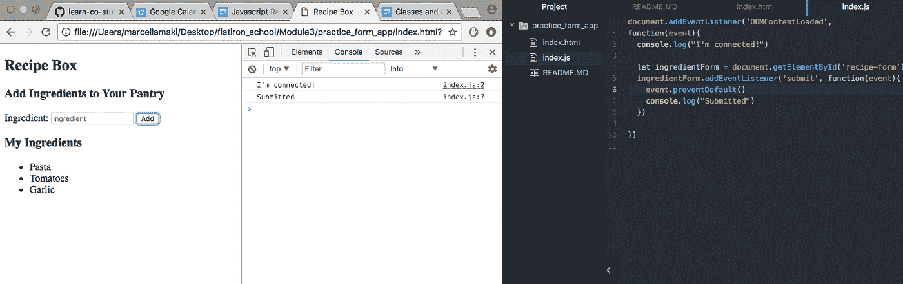

现在，在提交表单时，向控制台写入配料的名称(或者表单的任何输入)。

这确保了事件处理程序正常工作并在正确的时间被触发。这意味着您可以获取表单的值并将其写入控制台。确保它是来自表单输入字段的值(它不同于来自事件监听器的表单 id 值！)然后在它被记录到控制台后清除该值。

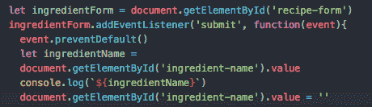

## 呈现到页面

因为已经测试了连接，并且您可以确定信息是正确的，所以我们希望动态地生成一个行项目，并在页面提交时将它附加到 HTML 表单中的无序列表中。

首先，我们将采用不跟踪成分的方式。没有对象等等。第一步是让它出现在页面上。

通过创建所需类型的元素来制作新的配料。在本例中，这是一个

*   。

然后将新实例设置为该。将新成分添加到元素类型中。

本质上，以上是三个步骤:您已经创建了元素，您有了值，现在将值附加到元素上。

然后，从您创建的 HTML 中找到 UL，并在该 index.html 文件上添加一个 id 标记。然后，使用 getElementByID()，将刚刚创建的带有值的新元素添加到这个 UL 中。

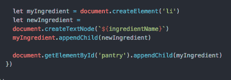

## 重构为一个独立的函数

现在，我们将把它分离到它自己的函数中，并把那个函数作为参数传入顶部的事件监听器

记住不要调用函数，只是把它作为一个参数来引用。(这是 JavaScript 最棒的地方之一——引用传递非常有用！)

这是以一种无状态的方式解决问题——我们添加了一个 LI 元素，然后这个元素基本上不再可访问。但是，如果我们想要跟踪这一点，我们将不得不添加一些东西来跟踪状态和上下文——我们想要维护状态和运行时，以获得我们有多少成分的某种上下文…

这里是无状态方式:

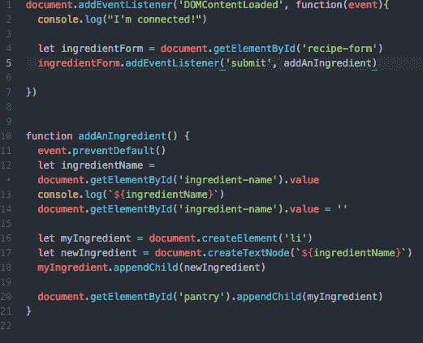

如果我想要一个成分列表，我们如何表示一种成分呢？我们本质上只需要知道一种成分最简单的形式。那是什么？带有名称属性和字符串的 javascript 对象。

## 关于数据结构的思考

我们如何做到这一点？您可以创建一个 JavaScript“类”来生成一个对象的实例，或者只创建一个对象！

对象和类的实例有什么区别？班级更像一个工厂。它可以使该类的许多对象反复遵循相同的规范。

或者，您可以使用数组来跟踪对象。

这个例子是关于什么是最简单的方法，我们可以访问、存储和处理数据的最简单的方法。其他更复杂的数据结构适用于更大的应用程序。

所以在这种情况下，创建一个关键字为“name”的对象，并将所有这些对象存储在一个数组中。因此，首先将数组赋给一个常量。

## 关于 let 与 const 的一个注记

我们如何确定 let 或 const？这取决于重新分配。每当我们说 var x =时，那就是赋值。所以如果我们改变它，改变它的指向，我们应该用 LET。如果它永远不会改变，那么我们可以使用 CONST。

## 考虑状态

我们还将创建一个新的函数，将*状态*考虑在内。切记始终要防止默认()。删除对先前函数(addAnIngredient)的引用，并用我们现在正在创建的新函数替换它:

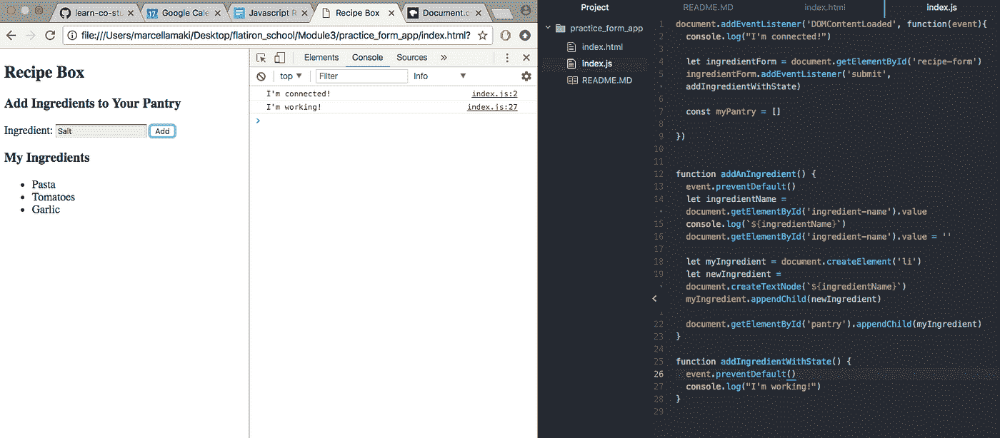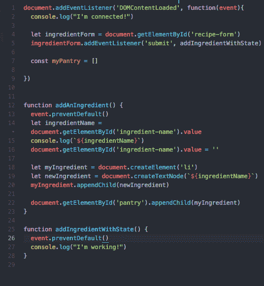

然后，在对象上工作。这个新函数应该创建一个新函数，有一个名称，我们应该将对象记录到控制台。创建一个新对象，添加 name 属性，并将其设置为输入值。

下面是使用对象的新重构函数:

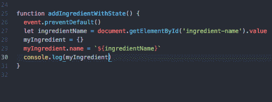

下面是该函数使用 Chrome 开发工具打印到控制台的对象示例。

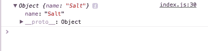

现在，每次添加元素时，它只是创建一个对象。但是，一个新元素产生了，另一个就被抛弃了。这可不好！所以，现在，当每个对象被创建时，将它添加到数组中。让函数控制台在每次更新时记录整个数组，以确保对象添加正确。

概述:

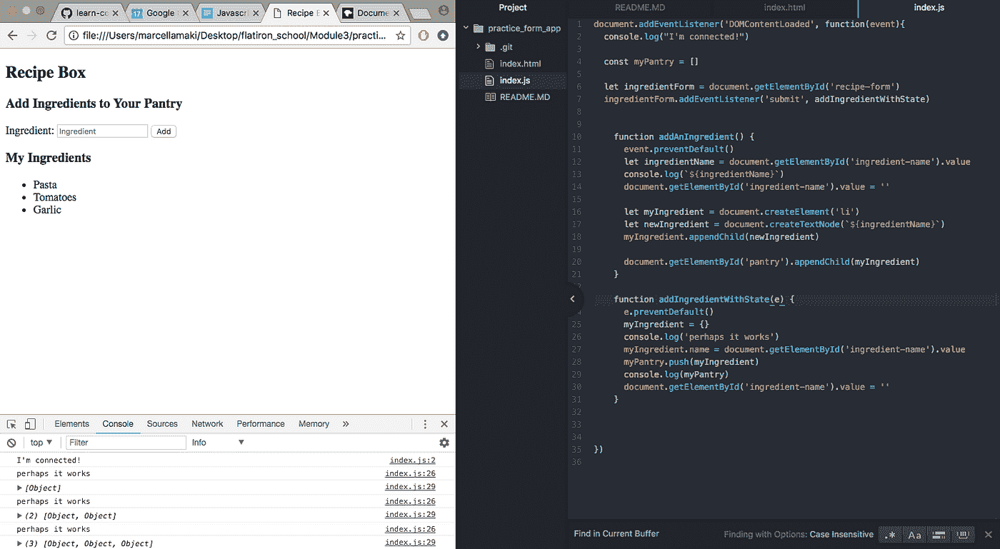

## 用新函数追加到 HTML 中

现在，有一个 JS 版本的 ingredients，但是需要有一个

*   附加到 HTML 中，以便对象在页面上呈现为文本。为此，迭代该数组并生成一个字符串，该字符串表示同一个函数中的所有*   。

然后，在 index.html 文件中找到文本应该出现的 div 并替换其内容。为什么要替换？它的效率稍低，如果数组变得很大，效率可能会变得非常低，但通过每次重新渲染，更容易获得单一的真实来源，或一个管理我们状态的变量。

## 怎么写

*   标签总是围绕着通过的插值，然后连接。整个字符串被传递到内部 HTML，然后 HTML 将它作为 HTML 文件读取。

那会是什么样子呢？

```
"<li>Salt</li><li>Pepper</li><li>Onions</li><li>Butter</li><li>Stock</li>"
```

然后，这个字符串被传递到 index.html 文件，在那里它就像任何其他 HTML 一样被读取。它是如何通过的？将 div 的 innerHTML(如上所述)设置为该字符串的值。

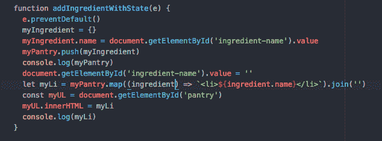

## 更多重构！

这是后退一步重构代码的时候了，因为这个大函数正在执行许多不同类型的活动:

—创建对象

—将对象添加到集合中

—渲染一些东西

这是三种不同类型的功能！让最基本的版本运行起来(就像上面所有的一样)，然后我们就可以担心责任分离了——为什么这是一个更简单的方法呢？所有必要的代码都在这里，做正确的事情——现在把它分开是非常简单的。

## 向表单添加其他元素

现在，继续从储藏室中选择配料，将它们添加到食谱中(复选框)，并向食谱中添加注释(一个大的文本字段)以制作完整的食谱！

从一个静态模型开始，以确保复选框正常工作，一个描述步骤或注释的文本区域，以及一个保存食谱。这些都应该放在配料容器下面的一个 div 中，您可以将它看作是应用程序的一个独立部分。

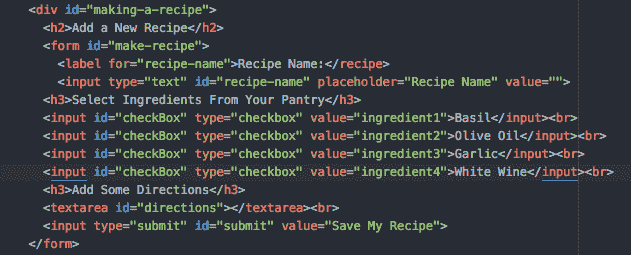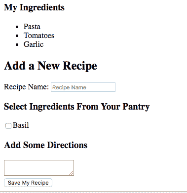

现在已经模拟好了，迭代数组，将成分添加到复选框列表中，然后确定它们是否被选中。

如何用代码做到这一点？。checked()返回一个布尔值！

首先，动态生成复选框 HTML 字符串。

和以前一样，生成这些复选框只需要一个函数，该函数返回一长串带有适当 html 标签的文本(来自所有配料数组)。

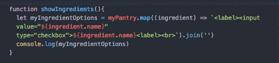

现在将这个函数的结果传递给 HTML。添加配料时，使列表*和*成为复选框条目。

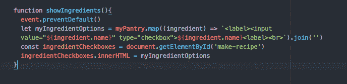

现在，遍历数组，找到所有选中的复选框，并找到匹配的成分(与选中的复选框相关联)

在这个实例中使用的一个好的 CSS 选择器是 document . query select all(" input[type = ' checkbox ']")来选择所有的复选框。

注意:这不是一个数组！它看起来像一个数组。它是一个*节点列表*——所有匹配查询选择器的元素。我们可以在这里使用 forEach()，但是我们必须做一些不同的事情。

对于每一个→我们希望*传入一个回调函数*，查看复选框是否被选中，找到匹配的配料，并将匹配的配料对象的名称添加到一个数组中。

见下文，使用匿名箭头功能(在这个例子中是 ES6 的许多可爱的额外津贴之一！)

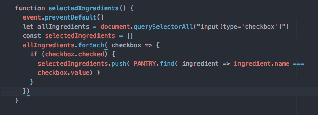

将其与一个带有三个键的 JavaScript 对象放在一起:名称、描述和成分(成分是这个最近函数的返回值)。

所有这些都来自输入字段，它允许我们返回一个表示食谱的对象——您可能想要一个食谱或食谱的对象数组。

同样，如前所述，迭代数组以生成 HTML 来生成菜谱。Set container.innerHTML =数组中的字符串。

这将一个食谱添加到食谱集合中！