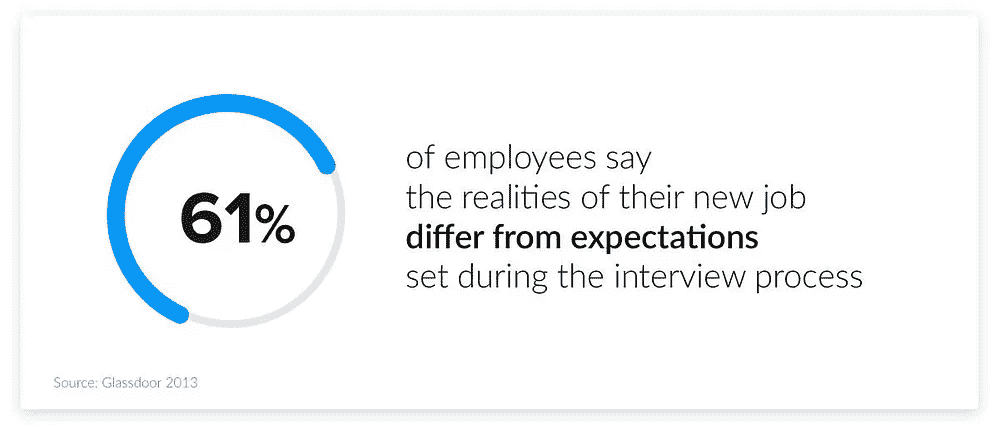
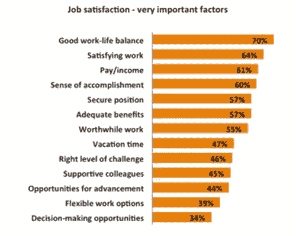
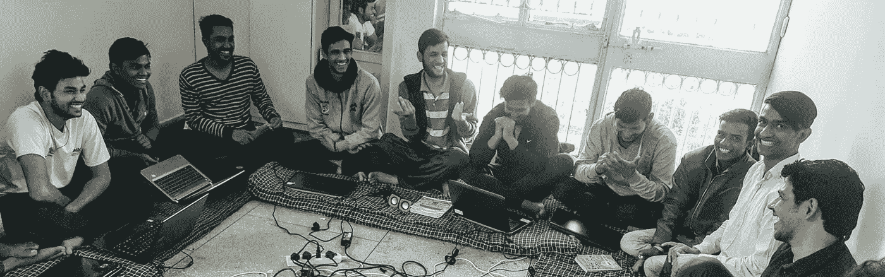
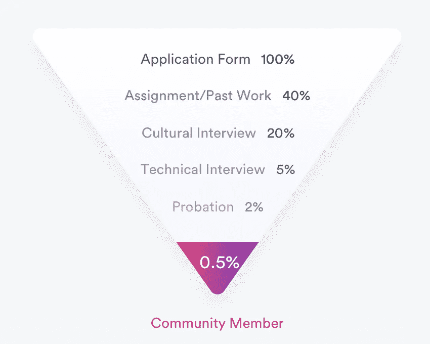
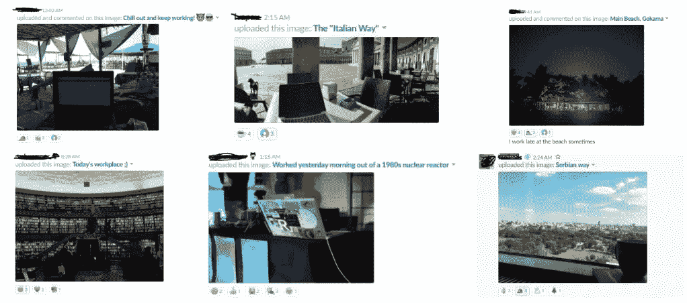
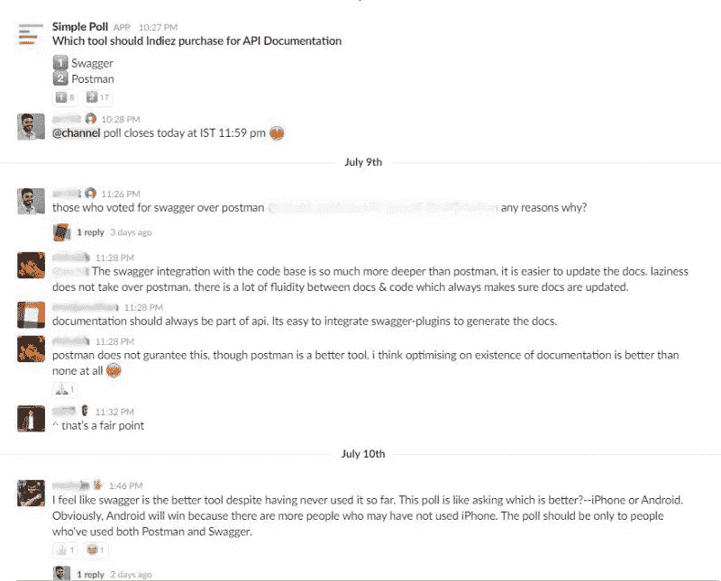
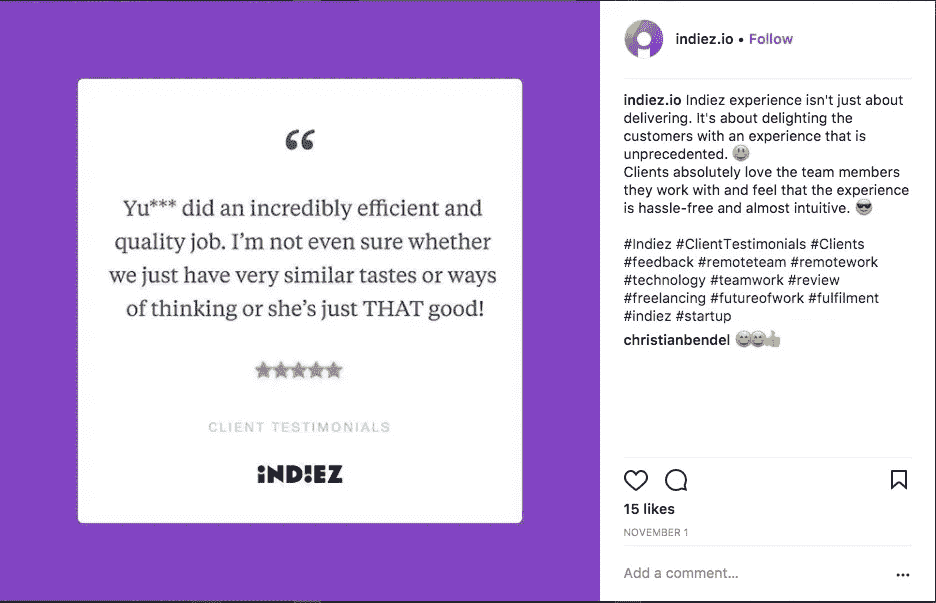
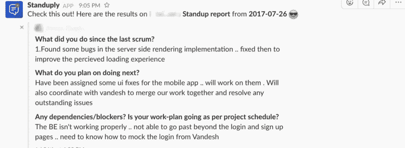
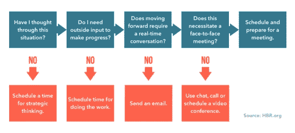

# 建立世界上第一家无员工远程公司

> 原文：<https://medium.com/hackernoon/building-worlds-first-no-employee-remote-company-c6278cf09e85>

## 我们从打造近乎完美的工作体验中学到的东西。

听到你的老板抱怨你迟到了 10 分钟，而你花了一个小时才到达办公室…

一直看着窗外，渴望一次旅行或度假。或者因为“工作”而远离家人…

没有得到你期望的成长，与你不钦佩或不尊敬的人一起工作…

感觉糟透了。

对大多数人来说，工作糟透了。他们对自己的工作不满意。

> 当工作没有给你带来满足感时，你的整个生活开始变得糟糕！句号。

考虑到这一点，我真的很惊讶地看到，90%的公司没有致力于给员工提供良好的工作体验。

我只有一句话要对他们说——“你的公司会完蛋。”

你公司的[文化](https://hackernoon.com/tagged/culture)和价值观将定义你员工的体验。如果员工开心，公司很有可能会做得很好，甚至会超越职责范围去做一些不寻常的事情。

对我们人类来说，文化和价值观变得越来越重要。

**对今天的工人来说，自由和成就感具有最高的价值。**

Credits : contactpoint.ca

我们带着一个使命开始了[**Indiez**](http://www.indiez.io?utm_source=Blog&utm_medium=medium_top_inline_link&utm_term=fulfilling_work_experience)**“为所有人争取自由和实现”。**

当 Abhishek,[Indiez](http://www.indiez.io?utm_source=Blog&utm_medium=medium_top_inline_link&utm_term=fulfilling_work_experience)的高级成员辞职去追求他的梦想，通过他的 [NGO Navgurukul](http://www.navgurukul.org) 教贫困儿童如何编程时，这让我们相信我们的使命对这个世界是重要的。

An ongoing session at Navgurukul

我可以给你讲 100 个这样的故事！

我们每个月收到 1000 份申请，却没有在营销上花一分钱。这仅仅是因为我们夜以继日地工作，为我们的会员提供非凡的工作体验。

我们在搭建一个平台，这些人都不是我们的员工。但是，我们仍然投入巨资给他们一个非凡的体验。

为什么？

因为自由职业是个婊子！很难开始。你会想念那些办公室通讯。你会怀念归属感的。令人惊讶的是，没有一个自由职业平台致力于“体验”。它们都是为了给你找份工作。

下面是我们在 Indiez 做的几件事，让我们的会员体验到惊喜

# 1.给他们自由和自主权

每一个自尊和上进的人都在寻求选择、自主和自由！

在 Indiez，所有成员都对他们从事的工作高度负责，因为这是我们雇用他们时最看重的价值。

我们通过四种方式给予社区成员他们寻求并应得的自由。我们无法控制—

*   **当他们工作的时候(时间)** —我们有一个唯结果论的工作环境，他们可以随时自由工作。
*   **他们是如何工作的(技术)** —我们的成员自己想出如何完成要求的主要任务。
*   **与谁一起工作(团队)** —我们为我们的成员提供了一定程度的选择，让他们可以选择在各种项目中与谁一起工作。他们很乐意将他们网络中最优秀的人推荐给 Indiez。
*   **他们做什么(任务)** —Indiez 成员不会被强制分配任何项目。他们自己挑选他们想做的和真正感兴趣的项目。

> “Indiez 为我带来了两个世界的精华。我可以按照自己的时间表远程完成自己选择的项目，而没有传统自由职业者在销售和营销方面的麻烦。”— Indiez 社区成员

# 2.让他们和最好的人一起工作

我们的社区由全球顶尖的 0.1%人才组成。我们建立了严格的社区招聘流程，确保他们最终只与最优秀的人才合作。

伟大的人喜欢和伟大的人一起工作。当你把门槛设得很高时，你就自然而然地确保了只有顶尖的专业人士才能进入——这就形成了一个积极的反馈循环，从而确保了社区不断变得更好。

社区成员发现最令人兴奋的是他们与拥有不同经验和技能的全球成员的互动。

当他们从事不同的项目时，他们会接触到新的人。这确保了他们不会感到停滞不前。

> “和类似的人一起工作了 10 年后，我觉得自己已经达到了某种程度的增长上限。在我与 Indiez 的第一个项目之后，我决定辞职，开始成长和自由的新篇章。”— Indiez 社区成员*，前 500 强初创公司、前 Oyo、前 Tushk*

# 3.让他们为自己的生活方式感到自豪

无论是经营一个非政府组织，花时间学习一种全新的技能，还是边工作边环游世界，我们都确保 Indiez 社区成员能够过上他们梦想的生活！

我们进一步发展了在任何地方工作的概念，引入了工作来给我们的团队带来新的热情。他们一边工作，一边去一些最好的地方旅游。多棒啊。

与其他自由职业模式不同，在 Indiez，会员可以与其他会员建立有意义的联系，帮助他们讨论和克服与自由职业相关的挑战。

我们的社区成员告诉我们，他们不认为他们的工作是与焦虑状态相关的生活的一个独立实体。其实是他们乐于随身携带的一部分。

这是他们身份的一部分，他们以此为荣。

“I don’t think Kudle Beach has seen something like this ever before.😃” — Archit as he shares updates from Indiez’s recent workation in Gokarna.⠀

在我们的 Slack 频道上，他们高兴地贴出他们来自世界各地的工作站照片。这和被困在办公室隔间的感觉完全相反。这才是让我们真正快乐的！

> “感谢 Indiez，我可以环游世界，同时不会错过发展我的职业生涯。已经访问了 40 多个国家/地区\ m/”—Indiez 社区成员，前谷歌软件工程师

# 3.给他们一个非凡的成长环境

成长对 Indiez 的每个人都非常重要。牢记这一点，我们策划了一个快节奏的学习和成长环境。我们有一些最有趣的社区聚会，在 Indiez 大学的会议以及投票和讨论。

A discussion on tool purchase for API documentation

Indiez 大学是一项倡议，它使成员能够与希望向他们学习的其他人分享他们的专业知识。他们主持会议来教育其他人如何使用 JIRA、Confluence、Browserstack 和其他有价值的技能。

这使得向你的同龄人学习变得非常容易，最棒的是，如果你需要任何进一步的帮助或建议，他们随时都可以为你服务。

这确保了会员有机会体验非凡的成长经历！

# 4.给他们一种信任感

我们社区的成员用粉笔画出自己的时间表，并承诺遵守。每天，他们都意识到自己肩负的责任，这给了他们一种内在的动力。

当出现问题时，他们不会坐以待毙，等着别人来制定解决方案。因为致力于一项任务意味着他们不仅要处理遇到的任何障碍/挑战，还要克服它们。

对他们来说，这不仅仅是为了赚钱。他们真的热爱他们的工作！

从第一天起，我们就招募能给社区带来这种能量的人。然后，我们完全信任他们的能力。

这就是我们能够在没有任何时间选择或时间跟踪的情况下交付时间紧迫的项目的原因。

例如，我们的团队仅用一周时间就为 Aditya Birla Finance 的 CXO 开发了一个自然语言驱动的 BI [工具](https://hackernoon.com/tagged/tool)。如果由产品经理、UX 设计师、视觉设计师、数据科学家和全栈开发人员组成的 5 人团队没有高度的积极性来取得巨大的成功，这是不可能的！

# 5.不是“痛苦”的常规细微检查！

尽管我们向社区成员保证了自主权，但我们有一些常规机制来确保一切都符合预期。我们通过—

1.  **单口相声**和*即兴签到*以了解团队的最新动态。
2.  **定期反馈循环**以便在开发过程的早期做出必要的修正。
3.  每两周安排一次回顾，以了解在之前的项目中哪些地方可以做得更好。

同样，我们确保他们的宝贵时间不会花在没有任何价值的会议上。

协作软件开发商 Atlassian 进行的一项研究表明，技术员工平均每月花 30 多个小时参加会议，其中 50%以上的时间被证明是无效的。真是浪费！

我们的团队价值观建立在重视团队成员的时间的基础上。会议应该只在绝对必要的时候举行。有时候，你所需要的只是一个每日的 SCRUM。

在 Indiez，因为我们有远程工作设置，所以我们非常重视会议期间的同步时间。我们通过一个 scrum-bot Standuply 来自动化日常的站立，该 Standuply 在会议*之前异步地从团队成员那里收集所有的更新*并且将其发布到团队频道。每个人都会在开会前阅读这些数据，这样就不会浪费宝贵的时间。

# 6.同样庆祝失败和成功

为了确保 100%的成功和有保证的交付，我们付出了很多。有时候事情会出错，尽管我们尽了最大努力，我们还是搞砸了！

但是我们对失败有一个非常实际的态度。我们学得很快，并确保我们的治疗是一次积极的学习经历。甚至我们的客户也喜欢这种态度。

我们在每个项目结束时进行回顾，帮助我们总结成功和失败。我们同样庆祝他们两个，记录我们的学习，并继续进行下一个项目。😃

我们相信，应用这些简单的策略将帮助你为你的团队创造一个令人满意的工作体验。

# 在 Indiez，我们总是在寻找超级棒的人才。

向 Indiez 申请加入远程工作文化，在这里我们保证你的自由和成就感，你帮助我们实现令人惊叹的结果。请继续，我们的 [**填写我们的申请表**](http://apply.indiez.io/index.html?utm_source=Blog&utm_medium=medium_bottom_applyinline_link&utm_campaign=fulfilling_work_experience) 。

在 Indiez，我们努力管理来自谷歌、脸书、优步、Spotify、Booking.com 等公司的 1%顶尖科技人才。

加入 100 多位与 [Indiez](http://www.indiez.io?utm_source=Blog&utm_medium=medium_bottom_inline_link&utm_term=fulfilling_work_experience) 一起打造成功产品的了不起的创始人。

## [在这里了解我们更多— Indiez.io](http://www.indiez.io?utm_source=Blog&utm_medium=medium_bottom_inline_link&utm_campaign=developer_productivity_hacks)