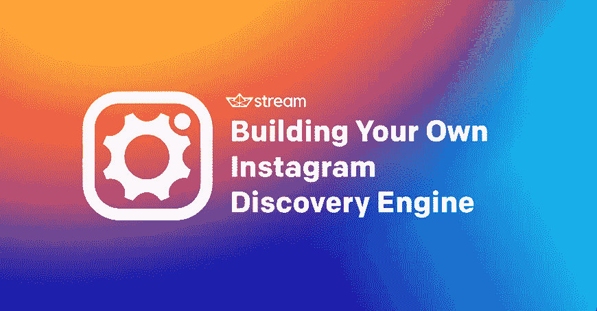
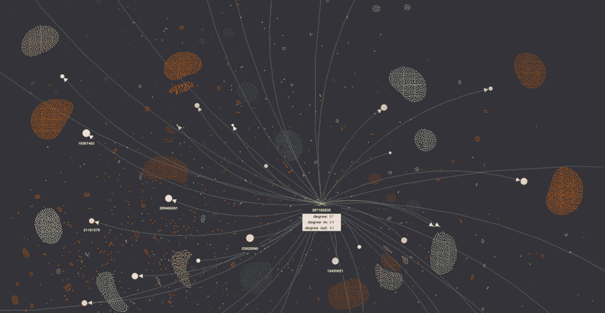
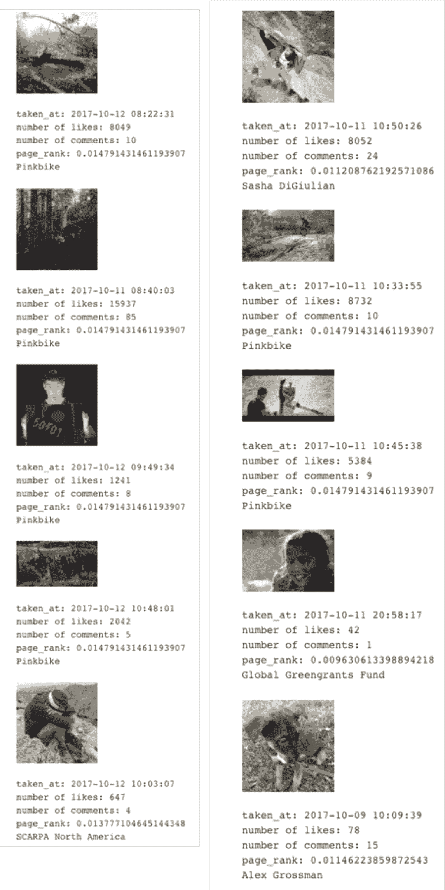
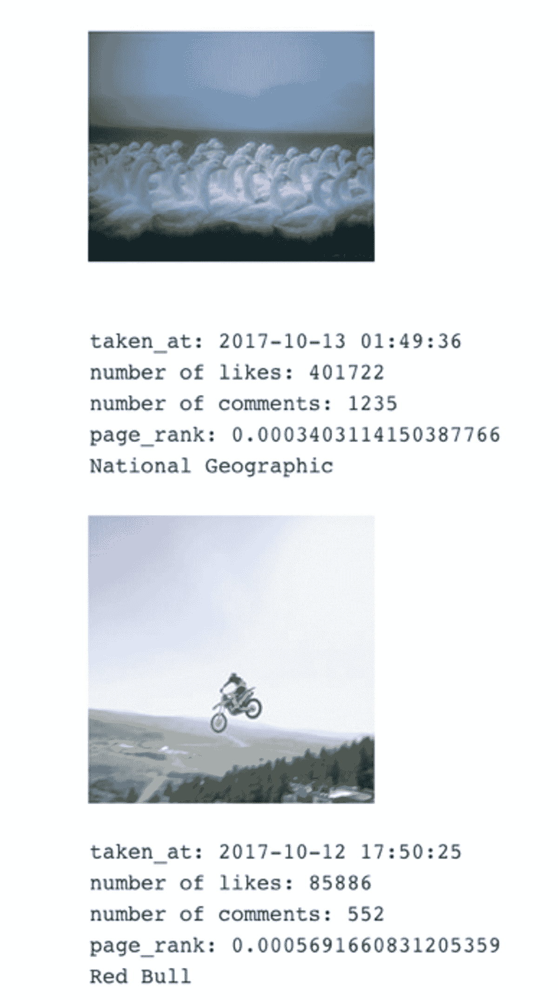
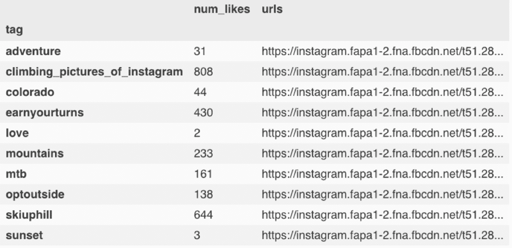
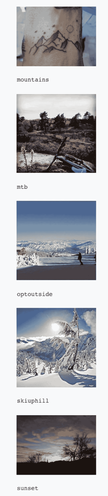

# 构建你自己的 Instagram 发现引擎:一步一步的教程

> 原文：<https://medium.com/hackernoon/building-your-own-instagram-discovery-engine-a-step-by-step-tutorial-49f374455636>

Instagram 的“探索”部分显示符合你兴趣的内容，这不是很棒吗？当你打开应用程序时，显示的内容和推荐几乎总是与你特定的喜好、兴趣、关系等相关。虽然认为我们是 Instagram 宇宙的中心可能很有趣，但现实是，个性化的相关内容也是每天为 4 亿其他人专门策划的。Instagram 有 4 亿活跃用户，每天发布 8000 万张照片，它是如何决定在你的探索版块上放什么的？让我们*探索*Instagram 用来确定你的 insta gram 时间线和探索部分中帖子分数的关键因素。

在我们进入实质之前，Instagram 使用了一些功能来决定提供什么内容:

*   **时机**:帖子越新，分数越高。
*   **参与度**:可能由点赞、评论和/或浏览的数量决定。如果用户更频繁地使用某些标签，例如滑雪板，则该用户将会看到更多滑雪板的图像。
*   **以前的互动:**您过去与该用户互动的频率。你与某些用户接触得越多，表明他们的帖子与你的相关性有多高。
*   **亲和力:**你和这个人是什么关系。朋友的朋友，你还没联系上的朋友，还是你不认识的人？

现在，让我们使用这些功能来构建我们自己的 Instagram 发现引擎。为了从 Instagram 中查询数据，我将使用由 Pasha Lev 编写的非常酷但非官方的 [Instagram API](https://github.com/LevPasha/Instagram-API-python) 。对于 Mac 用户来说，下面的内容应该可以让你开始使用。所有其他库都是 pip 可安装的，所有 Python 代码都在一个 [Jupyter 笔记本](http://jupyter.org/)中运行。

# 步骤 1:设置 Jupyter 笔记本和依赖项

要启动并运行，请在终端中运行以下命令:

然后在您的终端中运行 jupyter notebook，它将在您的默认浏览器中打开。我还建议**在继续之前验证您的 Instagram 电话号码**。这将防止一些意外的重定向。

现在说点好的。让我们从找到我的社交网络和一点图表分析开始。

如果一切顺利，您应该会看到“T16 登录成功！”回应。

我们现在可以通过找到我关注的每个人以及他们关注的每个人来建立一个真正的社交网络。关于社交网络分析和个性化页面排名的快速介绍，请看这篇博客文章。

在进入代码之前，让我们看一下我自己的个人资料，看看我们要分析什么。

如你所见，我关注了 42 个人，他们被认为是我的直接关系网，这并不算多。如果我们开始研究二级连接，这个数字会迅速增长。在我的例子中，如果我们看二级连接，节点的数量达到 24，000 以上。在步骤 2 中可以看到一个很好的可视化效果。

酷，现在让我们把它放到一个格式良好的熊猫数据框架中。

# 步骤 2:网络可视化(可选)

虽然为了构建自己的发现引擎，可视化你的网络并不是必要的，但它非常有趣，并且可能有助于理解个人网页排名。我将使用我最喜欢的图形可视化库之一， [Graphistry](https://github.com/graphistry/pygraphistry) (有时间可以看看)。然而，如果你不想等待 API 密匙(尽管我得到了当天的回复)，还有很多其他好的库，比如 [Lightning](http://lightning-viz.org/) 和 [NetworkX](https://networkx.github.io/documentation/stable/index.html) 。

对于这个示例，我将显示 to src_id 和 dst_id，以便给我的朋友一点隐私，尽管显示用户名很有趣(下面的代码将会这样做)。第一个图形只显示来源于我并使用 Graphistry 中的内置工具过滤的边。

第二张图显示了我所有的扩展网络。

是不是很酷？你已经可以看到一些有趣的特征，比如几个外部质心，以及它们如何与我的社交网络的其余部分进行交互。

# 第三步:从社交网络中寻找热门图片

现在是时候从每个人那里抓取最近的图片，并根据它们与我的相关程度进行评级了。由于大约有 24，000 个节点，下载所有数据可能需要一段时间。

让我们只对我直接跟踪的 44 个人进行一次快速试运行，以确保我们在正确的轨道上。

根据我认为可能决定 Instagram 帖子相对分数的因素，我们需要获取我关注的人的所有最近照片的**、喜欢数、**和**拍摄时间**(在这个例子中，我认为最近相当于一周，并删除了早于一周的照片)。掌握**我已经“喜欢”了那个用户的帖子**多少次，以及**如何将那个人**与我联系起来，这也很有用。除了“如何连接”之外，用户对我来说是一个简单的总和。为了计算“连接”部分，我们将使用个性化的 pagerank。一旦我们收集了这些信息，我们就可以定义一个重要性指标，比如:

好了，现在我们有了定义，让我们看看它是如何工作的！我为即将出现的大块代码道歉，但是你不要担心…在最后有一张我的新小狗的照片！

这给了我:

这实际上看起来非常类似于我的个人时间表——酷！现在我们知道我们正在做一些事情，让我们开始探索部分。

# 步骤 4:扩大用户群

我们可以采取和之前一样的方法，通过计算朋友的朋友的每张照片的相对分数。要做到这一点，我们将从我们计算的第一个社交图开始…但它有超过 24K 个节点，我懒得等待所有的数据。取而代之的是，让我们抓取我“喜欢”的帖子的朋友的朋友的照片。这会将节点数量减少到 1500 个以上，根据您的网速，这是喝咖啡休息的最佳时间。

为了处理扩展的用户群，需要对上面的代码做一些小的调整，但是大部分代码是相同的。

结果显示了很多来自国家地理和红牛的图片，我现在还不太明白，但是可能现在就要开始了！

# 步骤 5:基于兴趣的分析

利益还没有被考虑在内。Instagram 的一个优点是它有丰富的#标签来描述照片。让我们看看是否可以通过使用我“喜欢”的照片和我被标记的照片的标签来发现我的兴趣。虽然 Instagram 最有可能使用点击数据和“喜欢”数据，但我们无法获得点击数据，所以我们将只关注喜欢。

这给出了:

现在，让我们为每个标签抓取最受欢迎的图片:

现在我们有了每个标签提要中最受欢迎的图片，我们可以显示它们了。

现在让我们结合这两种技术。

# 第六步:把所有东西放在一起

你可能已经注意到我正在将所有收集到的图像数据保存到 **top_graph_img** 和 **images_top_tags** 中。让我们用一种相当简单的技术将它们结合起来，随机抽样:

那还不算太寒酸！我个人觉得其中一些照片很酷，但它肯定可以做得更好。

**改进发现引擎的方法:**

*   通过访问整个社交图，我们可以[用节点间的权重进行类似的分析](http://citeseerx.ist.psu.edu/viewdoc/download?doi=10.1.1.454.5022&rep=rep1&type=pdf)，权重由喜欢和评论的数量决定。
*   将点击数据与“喜欢”数据结合起来，利用隐性反馈和参与度指标的[优势](https://media.netflix.com/en/company-blog/goodbye-stars-hello-thumbs)。这对于降低没有太多喜欢的点击诱饵风格的帖子的等级，以及显示不经常“喜欢”的用户的兴趣非常有用。
*   使用卷积神经网络计算图像特征。移除最终的密集层，然后根据这些特征计算并显示与用户喜欢的图像相似的图像。整合脸书的社交网络，显示您联系的人的图像。
*   用[矩阵分解](https://getstream.io/blog/factorization-machines-recommendation-systems/)看看能不能推荐内容。您甚至可以使用图像特征和标签来构建混合技术的特征向量。
*   使用自然语言处理(NLP)和聚类技术来寻找相似的标签([，甚至是带有表情符号的标签！](https://engineering.instagram.com/emojineering-part-1-machine-learning-for-emoji-trendsmachine-learning-for-emoji-trends-7f5f9cb979ad))。这提供了标签(自行车与骑自行车)和相似性度量(自然与山)的标准化

这绝不是一个详尽的列表，所以如果你有任何其他想法，请让我知道！

有关发现引擎的更多信息，请查看我们的[个性化页面](https://getstream.io/personalization/)或[安排演示](https://getstream.io/demo/)以了解更多关于 Stream 的个性化订阅。

快乐大厦！

> 这是由 GetStream.io 的数据科学家 Balazs Horanyi 领导的 GetStream.io 团队的合作，原博文可在[https://getstream . io/blog/building-insta gram-discovery-engine-step-step-tutorial/](https://getstream.io/blog/building-instagram-discovery-engine-step-step-tutorial/)找到。