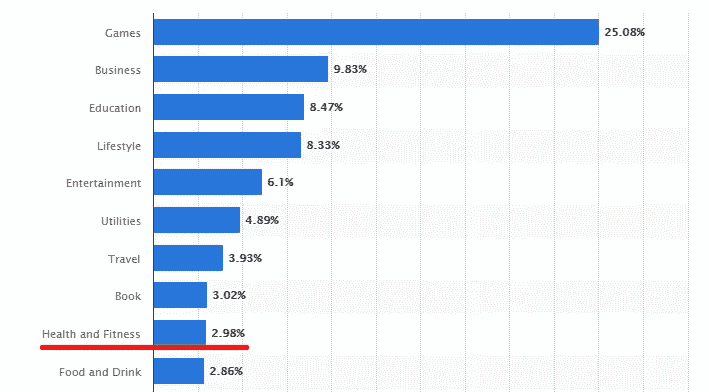
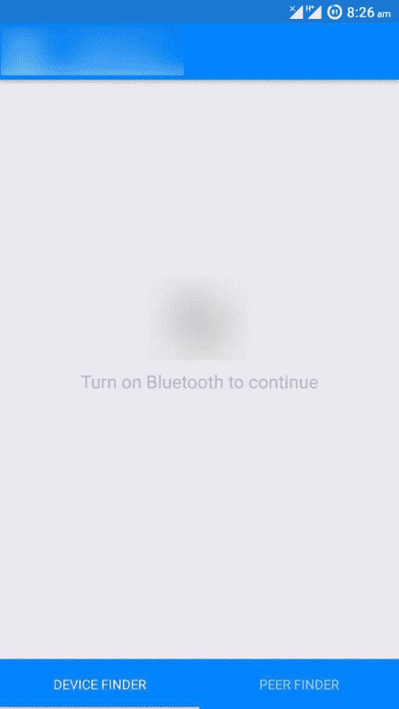
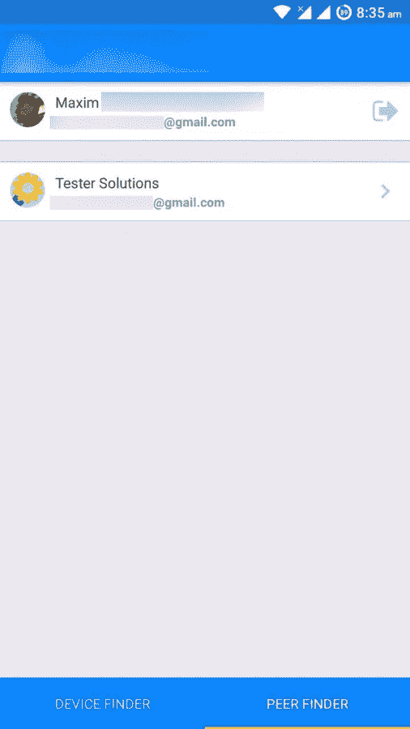
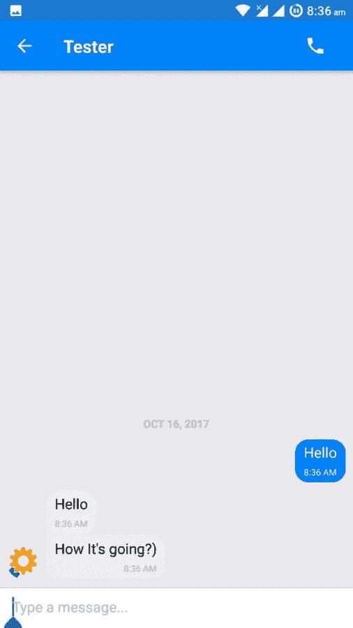
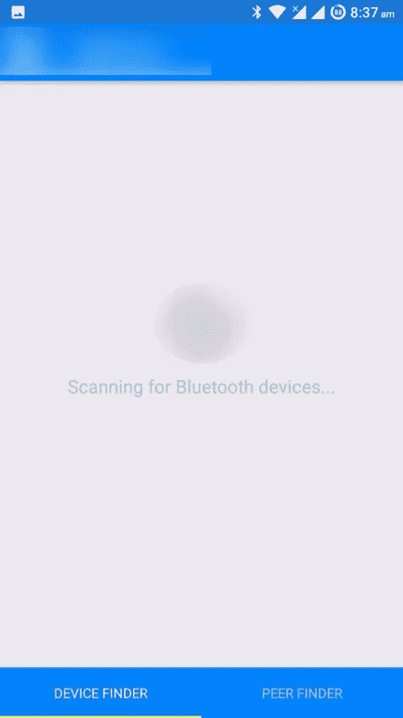
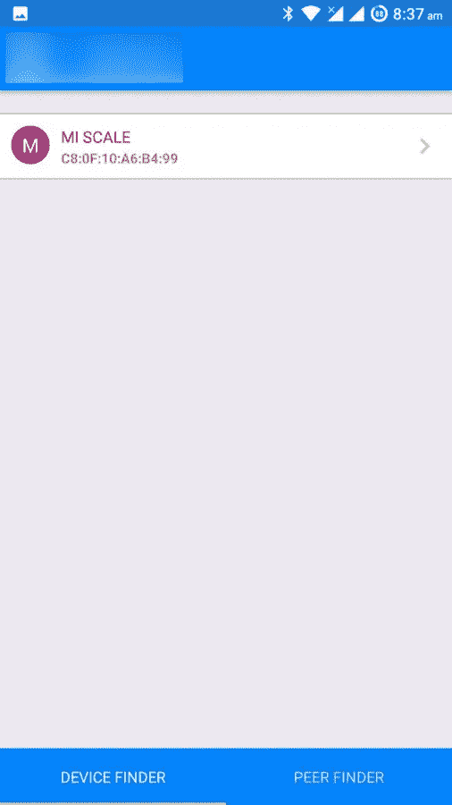
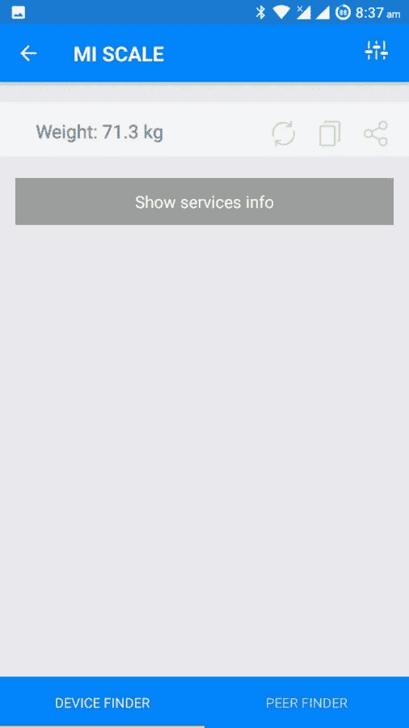

# 使用 React Native 构建:我们如何创建实时医疗移动应用程序

> 原文：<https://medium.com/hackernoon/built-with-react-native-how-we-created-real-time-mobile-medical-app-ad5b90d94374>


House M.D.

如今的移动/网络应用市场不仅包括随机游戏和娱乐应用。面向利基市场的实时和实时聊天应用程序的开发，尤其是为公司内部使用而创建的产品，有一个特殊的目的，就是简化分支机构员工的工作，并利用其功能创造新的机会。

在本文中，我们将讨论:

*   如何创建护理协调 React 基于本机的移动应用程序(以及 React 用于音频和视频通话的本机实时聊天)
*   以及我们如何成功构建了一个，除了与医疗设备的蓝牙集成之外，我们还包括了哪些功能。

# 医疗保健移动应用开发的重要性

在这里，我们想为您提供一些统计数据，说明医疗保健和护理协调移动应用类别在其他应用类别中所占的位置。

对于 iOS:



**来源:**[*【Statista.com】*](https://www.statista.com/statistics/270291/popular-categories-in-the-app-store/)

对于 Android:


**来源:**[*Statista.com*](https://www.statista.com/statistics/200855/favourite-smartphone-app-categories-by-share-of-smartphone-users/)

正如所见，iOS 版医疗保健移动应用在 App Store 下载量最高的产品中排名前十。截至 Google play，娱乐应用的丰富在很大程度上让医疗移动应用略微落后。

护理协调和医疗保健移动应用程序可能成为医生和患者应用程序不可分割的一部分。这使得医务工作者能够在彼此之间和他们的患者之间进行实时通信，并有机会远程进行通信。

这种解决方案旨在提供关于患者健康的所有必要信息。病人健康的每一个变化都可以被跟踪和调查。这就是医疗保健移动应用程序开发和在医疗中使用移动设备的巨大优势。

特殊集成是医疗保健移动应用程序开发的必备条件。例如，这包括蓝牙与临床工具的集成，如体重计或其他各种旨在提供患者关键健康记录(数据)的设备。

**阅读还:** [*医生预约 App 开发:这就是你的用户需要的*](https://jssolutionsdev.com/blog/doctor-booking-app/)

# 使用 React Native 构建的医疗移动应用

JSSolutions 团队有经验的另一个 React 本地开发案例。我们帮助创建了一个护理协调移动应用程序，该应用程序可以在医务人员之间以及医生和患者之间进行聊天和音频信息以及视频通话。除此之外，客户还要求使用 React Native 和 WebRTC 开发蓝牙与体重秤的集成。同样的事情也计划在其他追踪病人健康数据的设备上进行，比如血压测量设备和其他设备。

**我们正在扩展 React 原生展示列表**

我们的客户和我们都同意 React 本地应用程序开发。为什么？以下是我们通过规划这款医疗移动应用程序获得的优势列表，该应用程序将由 React Native 构建:

*   使用 [*React 原生蓝牙低能量库*](https://github.com/Polidea/react-native-ble-plx) 轻松集成 app 与蓝牙；
*   React 本地实时聊天功能开发和整个应用程序的快速流程。
*   UX 友好、清新、稳健、朴素的本土外观和感觉；

**感兴趣的话:**[*React 原生开发的利与弊:商业观点*](https://jssolutionsdev.com/blog/benefits-and-drawbacks-of-react-native-business-point-of-view-2/) 。

# WebRTC 和 React 本地实时聊天应用程序创建

为了通过聊天实现实时视频/音频通信，我们实现了 [*WebRTC*](https://codelabs.developers.google.com/codelabs/webrtc-web/#0) 技术。关于它的优点:

*   能够在实时模式下通过安全的点对点音频/视频连接启动应用。
*   WebRTC 实时通信技术是 [*开源的*](https://github.com/webrtc) 技术解决方案，这使得它的实现和对该技术的贡献更加容易
*   要启动和运行实时音频视频聊天、信息传递、文件共享/传输、屏幕共享、网络摄像头、麦克风接入，无需为您的浏览器安装内部或外部插件或任何其他工具

提到的所有解决方案都是开源的。使用它们安全吗？

这种医疗实时聊天应用的开发需要实现 AAA 级安全措施。不过，没有理由担心，WebRTC 技术通过使用 [*数据报传输层安全(DTLS)*](https://www.google.com.ua/url?sa=t&rct=j&q=&esrc=s&source=web&cd=1&cad=rja&uact=8&ved=0ahUKEwi8r-Dlp_fWAhWFO5oKHdhlCIYQFggqMAA&url=https%3A%2F%2Fen.wikipedia.org%2Fwiki%2FDatagram_Transport_Layer_Security&usg=AOvVaw08WasKi3ylwYlWEZ_ogkb_) ，基于 [*传输层安全(TLS)*](https://www.google.com.ua/url?sa=t&rct=j&q=&esrc=s&source=web&cd=13&cad=rja&uact=8&ved=0ahUKEwiWsNDqp_fWAhXnJJoKHbDTDHoQFgh8MAw&url=https%3A%2F%2Fen.wikipedia.org%2Fwiki%2FTransport_Layer_Security&usg=AOvVaw1U98wDShFEjomx9eHFb2t1) 方法来自动加密信息，以避免任何类型的数据泄漏。此外，WebRTC 允许在对等体之间的通信中获得最大的好处，比如说，“第三方”服务器可以解码传输的数据。

作为额外的安全措施，您还可以将该技术与个人/身份验证解决方案相结合，如 [*OAuth*](https://oauth.net/) 。

现在，真正的肉(以代码的形式)

在我们其他 [*React Native app 开发案例*](https://jssolutionsdev.com/technologies/react-native-development/) 中，这个实时通信项目显得比较特殊。下面我们将尝试通过代码来解释“为什么”。

我们处理的第一件事是获得本地流的方法，并进一步将数据(视频/音频)传输到远程对话者的设备。

为了实现这一点，我们使用 webRTC 技术创建了以下方法:

```
static getLocalStream(isFront, callback) { 
   let videoSourceId;// on android, you don't have to specify sourceId manually, just                     use facingMode 
// uncomment it if you want to specify 
if (Platform.OS === 'ios') {            
  MediaStreamTrack.getSources(sourceInfos => {       
   console.log('sourceInfos: ', sourceInfos); for (let i = 0; i < sourceInfos.length; i += 1) { 
  const sourceInfo = sourceInfos[i];if (sourceInfo.kind === 'video' && sourceInfo.facing === (isFront ? 
'front' : 'back')) { 
  videoSourceId = sourceInfo.id; 
   } 
  } 
 }); 
}

getUserMedia({ 
   audio: true, 
   video: { 
     mandatory: { 
       minWidth: 640, 
       minHeight: 360, 
       minFrameRate: 30, 
}, 
facingMode: (isFront ? 'user' : 'environment'), 
optional: (videoSourceId ? [{ sourceId: videoSourceId }] : []), 
  }, 
 }, (stream) => { 
     callback(stream); 
 }, logError); 
}
```

鉴于实时通信功能(如应用内消息(视频/音频))是开发需求之一，以下是实现安全和私密点对点连接的方法:

```
createPC(socketId, isOffer) { 
  const pc = new RTCPeerConnection(configuration);const dataChannel = pc.createDataChannel('text');    
dataChannel.onmessage = event => { 
 const msg = JSON.parse(event.data); this.dispatch(newIncomingMessage(msg)); 
}; 
dataChannel.onopen = () => {     
 this.dispatch(connectionEstablished()); 
}; 
pc.textDataChannel = dataChannel;this.pcPeers[socketId] = pc;pc.onicecandidate = event => { 
  if (event.candidate) { 
   this.socket.emit('exchange', { to: socketId, candidate:     
event.candidate }); 
  } 
};const createOffer = () => { 
 pc.createOffer(desc => { 
  pc.setLocalDescription(desc, () => {    this.socket.emit('exchange', { to: socketId, sdp: pc.localDescription }); 
  }, logError); 
 }, logError); 
};pc.onnegotiationneeded = () => { 
 if (isOffer) { 
  createOffer(); 
 } 
};pc.oniceconnectionstatechange = event => { 
 if (event.target.iceConnectionState === 'completed') {  
  setTimeout(() => { 
   this.getStats(); 
  }, 1000); 
 } 
}; return pc; 
}
```

通过受 WebRTC 协议保护的文本通道发送消息的方法:

```
sendMessage(message) { 
  const stringifiedMessage = JSON.stringify(message);for (const key in this.pcPeers) { 
const pc = this.pcPeers[key]; pc.textDataChannel.send(stringifiedMessage); 
 } 
}
```

如上所述，React Native healthcare 移动应用开发的另一项重要任务是通过蓝牙将体重秤与应用集成。我们已经创造了整合。但是在这个过程中，我们需要转换不同重量的物品。这种情况下该怎么办？

以下算法说明了如何转换从重量秤接收的重量信息(物品)(中国单位转换为千克):

```
function getWeightFromScale(charValue, callback) { 
 const charHexValue = base64ToHex(charValue);const weightBytes = charHexValue.split(' ');// scales stabilized 
if (weightBytes[0] === '22') { 
  callback(); 
}const hexWeight = weightBytes[1] + weightBytes[2];const data = hexWeight.match(/../g);const buf = new ArrayBuffer(4); 
const view = new DataView(buf);data.forEach((b, i) => { 
 view.setUint8(i, parseInt(b, 16)); 
});const num = view.getInt32(0, 1);// convert to kilograms from chineese units 
 return num / 200; 
}
```

# 结果

将 React 原生 app 开发+ WebRTC 技术结合用于医疗保健移动产品的结果是什么？说完了，让我们来看看:



**Start screen**



**Peers view. List of users who’re online**



**Chat window where you can also hold calls**



***Searching for Bluetooth devices (Bluetooth is on)***



***React Native Bluetooth integration module in action. Detected weight scales to which you can connect via Bluetooth***



***Now that we’ve chosen the detected weight scales, we can take our weight measurements. We get the instant result. Data received can be shared between doctor and patient who are online or copied and sent in a separate message.***

## *总结*

现在为这项出色的工作而沾沾自喜还为时过早，因为 React 针对医学的本地实时聊天项目仍在进行中，并承诺为其用户带来更多令人愉快的惊喜，稍后你就会知道这一点；)

*原载于 2017 年 10 月 19 日*[*【apiko.com】*](https://apiko.com/blog/built-with-react-native-how-to-create-real-time-communication-functionality-for-the-mobile-medical-app/)*。*