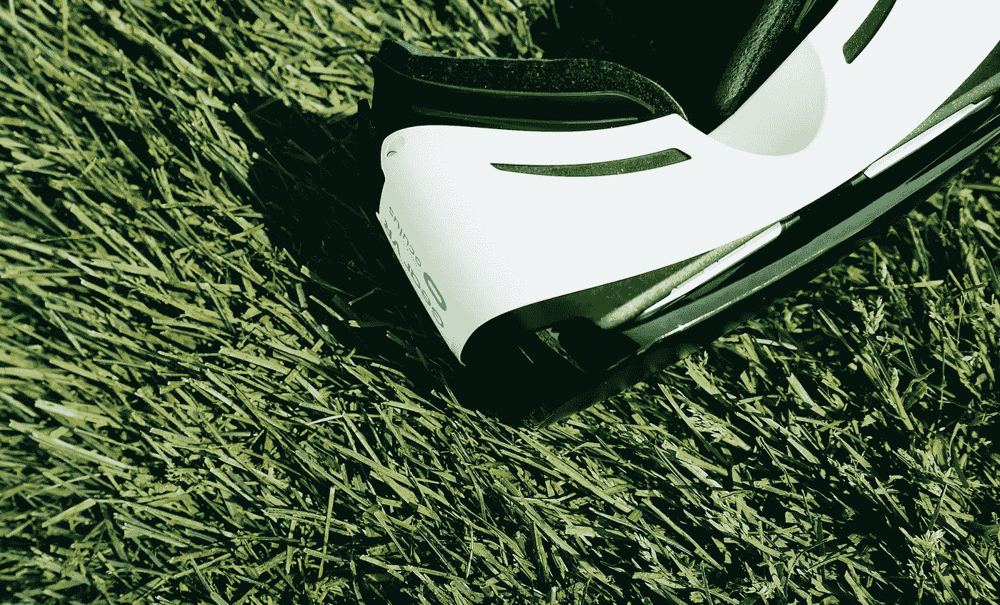

# 买一张 VR & AR 炒作专列的票？技术专家变得真实。

> 原文：<https://medium.com/hackernoon/buying-a-ticket-for-the-vr-ar-hype-train-a-technologist-gets-real-3c5966b89bab>

*这篇博客最初发表在***的镜头上，由创意技术专家塞缪尔·施奈德-赫尔德撰写。**

*VR 和 AR 是未来，或者说他们是这么说的。像“ [2016 年将是为虚拟现实](http://adage.com/article/digitalnext/2016-year-sets-stage-vr/302050/)搭建舞台的一年”和“[VR 如何在 2017 年开始成为我们的现实](https://www.forbes.com/sites/lionelchok/2016/12/19/how-vr-is-starting-to-become-our-reality-in-2017/#5a98cc4137fe)”这样的标题接管了超饱和的博客世界，似乎 VR 和 ar 是唯一值得投资的技术。但是，作为一名虚拟和增强现实创意技术专家，我不断告诉客户和同事质疑这种情绪。*

*我每天都在从事一些世界上最具前瞻性的 VR 和 AR 项目，并全心全意地相信这些技术在改变、整合或创造新的体验和记忆方面的力量。同时，我的工作也是批判性地思考技术以及什么样的新工具最适合满足客户的目标。*

*VR 纠结于两件事:分享和分发。既然数字广告的生死取决于社交，那么许多品牌面临的问题是，我们如何分享前沿的 VR 和 AR 体验？困难在于这些经历本来就不可分享。虚拟现实通过仅为你和你的眼睛创造一种幻觉来劫持你对世界的感知。除非通过其他渠道拓宽虚拟现实体验，例如 Youtube 上的挑逗视频，否则如果你想与朋友分享，他们必须像你一样是虚拟现实极客。*

*因此，如果你是一名数字战略家或品牌经理，正在努力探索如何使用这些工具，我建议你停下来，喘口气，先看看这篇文章。也许对于这项工作来说，最好的工具完全是另一种技术。*

***下一件大事——社交虚拟现实整合***

*目前，品牌只对创造自己的虚拟现实体验感兴趣，而不是探索围绕虚拟现实宣传的机会。品牌创建自己的一次性 VR 或 AR 体验，希望创造一个新的品牌认知渠道，就像创建一个完整的品牌社交网络或社区。这在社交媒体广告的早期非常流行，但现在你在这些社交网络内做广告，而不是试图取代它们。AR 和 VR 也会出现同样的情况。*

*例如，当脸书正在开发他们的实验性虚拟现实社交平台空间时，已经有了像[娱乐室](https://www.againstgrav.com/rec-room/)和 [Altspace](https://altvr.com/) 这样的社交平台，用户可以虚拟地加入其他人，聊天，玩游戏，创造东西。如果你执意为你的品牌创建 VR & AR 内容，这是值得关注的趋势。VR 的社交迭代将有一个为你讲述品牌故事而设计的基础设施。这将比创建自己的应用程序更便宜也更容易，你可以在脸书的 AR 工作室看到这一点的开端。与我们目前致力于为现有平台创建内容的方式类似，我们将以这种方式交付 VR & AR。*

***VR 独有的体验& AR***

*不可否认的是，VR & AR 可以创造独特的体验，表达其他任何技术都无法实现的创意。因此，如果你下定决心要创造一个虚拟现实或增强现实的体验，那么一定要发挥媒体的优势。*

*以这个混合现实案例为例: [ASM: Into the Wild](https://www.mediamonks.com/vr-ar/work/artscience-museum-into-the-wild) ，这是迄今为止世界上最大的混合现实体验。使用 AR 标记在你的桌子上放置微小的虚拟物体或角色已经有很长时间了，但这是不同的。利用谷歌的 Tango 技术，一座博物馆被扩建成了一片活的雨林。墙壁被改造成了树木，走廊被改造成了森林小径，客人们拿到了平板电脑，他们可以四处走动，与濒危动物互动，这是他们在现实生活中无法做到的。AR 的魔力不仅仅是将虚拟动物带到你的餐桌上，而是带到你的整个环境中。*

*或者可能是我最喜欢的例子，谷歌地球 VR。想象一下，整个地球都在你的指尖上，一会儿灵巧地飞过曼哈顿中城的摩天大楼，一会儿平静地坐在珠穆朗玛峰的山顶。从卫星图像和 3D 摄影测量中获取数据，谷歌地球虚拟现实中的环境是雄伟的，是所有虚拟现实中最具存在感的。没有什么比虚拟地站在你的公寓外面抬头看着你的窗户，知道你实际上是在里面，穿着虚拟现实设备更令人兴奋的了。此外，这种体验真的会让你对虚拟现实的未来感到兴奋。如果这是现在的样子和感觉，10 年后会是什么样子？*

***未来***

*但是其他对现实生活很有用的虚拟现实体验呢？在汽车行业，你可以让潜在客户进行不可能的试驾，同时在相同的体验中改变功能和测试。*

*或者，想想 VR 如何为培训技术领域的新专业人士提供一个令人惊叹的工具。*

*如果你可以在踏入一个场景之前，通过各种可能的场景来训练自己成为一名风力涡轮机技术员，那会怎么样？或者，想象一下学习一门语言。将学习法语的人放在巴黎的咖啡馆里，他们只能通过正确地发音各种短语来体验这种体验，以此来模拟语言沉浸感会有多大用处？*

*或者博物馆！想象一下，去 MOMA，通过 AR 平板电脑看到杰森·布拉克热情地向他的一幅画布上泼墨！*

*可能性是无穷无尽的，但这并不意味着每种可能性都适合你的品牌。所以，在你花光你(或你客户)的钱之前，问问你自己。为什么要打造 VR 或者 AR 体验？这些技术真的能为你的品牌提供比其他技术更好的东西吗？还是你的想法只是一个噱头？如果你正在寻找接触或参与，那么也许要等一段时间。随着 VR & AR 市场的成熟，讲述你的品牌故事的渠道也会随之成熟。*

******

> *[黑客中午](http://bit.ly/Hackernoon)是黑客如何开始他们的下午。我们是 [@AMI](http://bit.ly/atAMIatAMI) 家庭的一员。我们现在[接受投稿](http://bit.ly/hackernoonsubmission)，并乐意[讨论广告&赞助](mailto:partners@amipublications.com)机会。*
> 
> *如果你喜欢这个故事，我们推荐你阅读我们的[最新科技故事](http://bit.ly/hackernoonlatestt)和[趋势科技故事](https://hackernoon.com/trending)。直到下一次，不要把世界的现实想当然！*

**