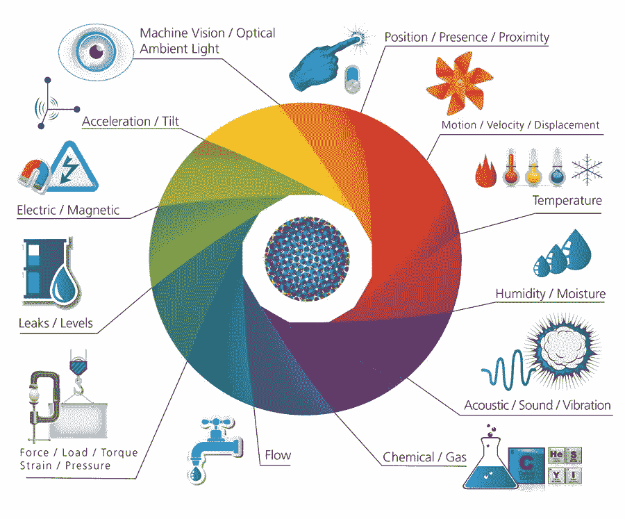
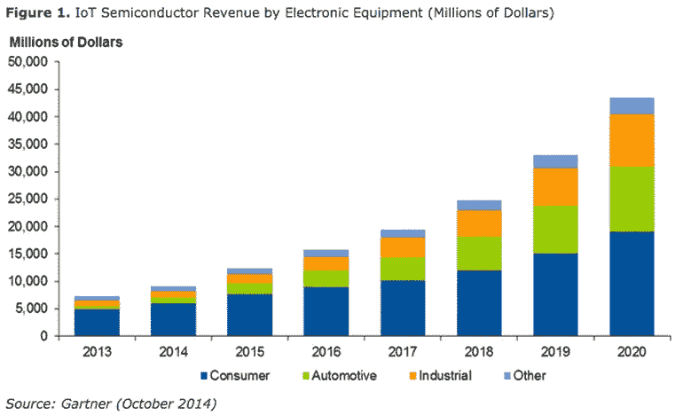
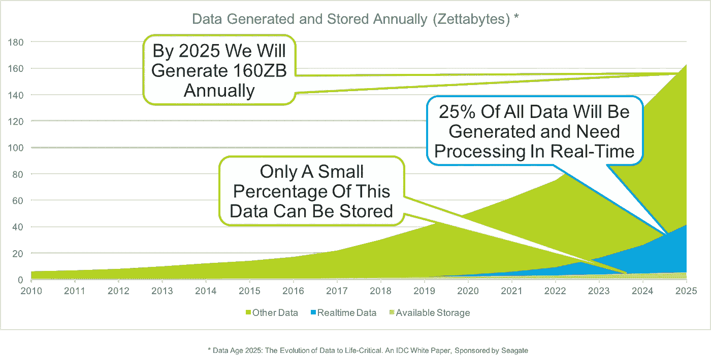

# 到 2020 年，50%的托管 API 预计将是事件驱动的

> 原文：<https://medium.com/hackernoon/by-2020-50-of-managed-apis-projected-to-be-event-driven-88f7041ea6d8>

## 受大数据、物联网和消费者期望的推动，事件驱动的实时 API 激增

根据 Gartner 的 Mark O'Neill 和 Paolo Malinverno 的说法，到 2020 年，50%的托管 API 将支持事件驱动的 IT([2017 年报告](https://www.gartner.com/doc/3660318))。这些事件驱动的 API 不一定会取代 RESTful 请求-响应架构，但会成为扩展组织功能和整体性能的必要补充。

在另一份 [2017 年物联网报告](http://www.gartner.com/newsroom/id/3598917)中，Gartner 预测“84 亿台联网设备，比 2016 年增长 31%，到 2020 年将达到 204 亿台。到 2017 年，终端基础设施和服务的总支出将达到近 2 万亿美元。”

那么，是什么推动了这种进化呢？“实时”正在成为现代技术堆栈中无所不在的力量。随着消费者要求更快的体验和更即时的数据交易，公司越来越多地投资于加速这些交易的产品基础设施。尽管我们已经看到 API 成为经济和技术的必需品，但它们通常基于请求-响应风格的交互，这限制了它们在实时领域的范围和有效性。

# 请求-响应与事件驱动的 API

其核心是，请求-响应是一种消息交换模式，其中请求者向回复者系统发送请求消息。replier 系统接收并处理请求，如果一切顺利，它将返回一条消息作为响应。虽然这种交换格式对于更结构化的请求很有效，但是它将集成限制在那些预期的系统清楚地知道自己想从对方那里得到什么的地方。因此，这些请求-响应风格的 API 必须遵循来自调用服务的交互脚本。

在事件驱动的架构中，应用程序基于事件驱动的交互，平等地集成多种服务和产品。这些交互由事件发射器、事件消费者和事件通道驱动，由此事件本身通常是产生、发布、传播、检测或消费的重大“状态变化”。这种架构模式支持软件组件和服务之间的松散耦合。这样做的好处是事件发射器不需要知道消费者的状态，消费者是谁，或者事件将如何处理(如果有的话)。这是一种通过持久流推送数据的机制。

# 1950 亿美元的物联网市场

根据[reports 和](http://www.reportsnreports.com/reports/944711-internet-of-things-iot-market-shares-strategies-and-forecasts-worldwide-2017-to-2023.html)的分析师预测，物联网驱动设备的激增和“智能化”预计将在 2023 年达到超过 1950 亿美元的市场价值。从 2016 年的 160 亿美元市场开始，这一增长主要是由越来越普遍的智能家居、移动和交通设备制造以及捕获数据和增强通信基础设施的需求推动的。

设备变得越智能，就需要越多的数据来做出复杂的实时决策。传感器和外部数据收集工具正在成为物联网行业增长的重要催化剂。测量地理空间接近度、加速度、温度和运动的传感器和执行器的精度将把行业领先者与落后者区分开来。

[*后景*](http://postscapes.com/what-exactly-is-the-internet-of-things-infographic/)

[Gartner](http://www.gartner.com/newsroom/id/3598917) 对半导体等实际核心组件进行了更深入的研究，预测到 2020 年，物联网驱动的半导体市场将达到 450 亿美元，其中消费物联网将占据最大份额，汽车行业(包括自动驾驶汽车)位居第二。

# 数据和商业智能

真正互联的技术生态系统的目标也将反映数据和商业智能的平等增长。互联的事物越多，公司就越需要收集数据、推送远程更新和控制现场设备。因此，远程通信需要可靠，数据需要准确，从大数据中提取有意义信息的能力变得至关重要。

在 Seagate 的 2015 年报告[中，到 2025 年，在总共 160 Zettabytes 的数据中，25%的数据将需要实时处理和生成。](http://www.seagate.com/files/www-content/our-story/trends/files/Seagate-WP-DataAge2025-March-2017.pdf)

# 事件驱动的 API 机制

如果您想了解 realtime 背后的 web 基础设施，那么让我们探索一下它的一些基本组件。更全面的分析可以在[实时 API 基础设施入门](https://realtimeapi.io/getting-started-with-building-realtime-api-infrastructure/)中找到。

实时就是推送数据。在[数据推送](https://techterms.com/definition/push)模式中，数据被推送到用户的设备，而不是由用户拉取(请求)。例如，现代推送电子邮件允许用户接收电子邮件消息，而不必手动检查。类似地，我们可以从更连续的意义上研究数据推送，即数据被连续广播。任何可以使用特定频道或频率的人都可以接收数据并决定如何处理。

**HTTP 流媒体**

[HTTP 流](https://realtimeapi.io/hub/http-streaming/)为即时和持续的数据推送提供了一个长期的连接。您已经熟悉了 HTTP 和 WebSockets 的性能。客户端向服务器发送请求，服务器无限期地保持响应开放。此连接将保持打开状态，直到客户端关闭它或服务器端事件发生。如果没有新的数据要推送，应用程序将发送一系列保持活动的标记，这样连接就不会关闭。

**Websockets**

WebSockets 为客户端和服务器之间的消息交换提供了一个长期的连接。对于全双工通信，消息可以向任一方向流动。这种双向连接是通过 WebSocket 握手建立的。就像在 HTTP 流和 HTTP 长轮询中一样，客户端首先向服务器发送一个常规的 HTTP 请求。如果服务器同意该连接，HTTP 连接将被替换为 WebSocket 连接。

**Webhooks**

Webhooks 是一种在服务器之间发送数据的简单方式。不需要长期的连接。当有数据要推送时，发送者向接收者发出 HTTP 请求。WebHook 注册或“挂钩”到回调 URL，并会在事件发生时通知您。您预先注册这个 URL，当事件发生时，服务器向回调 URL 发送一个带有事件对象的 HTTP POST 请求。该事件对象包含将被推送到回调 URL 的新数据。如果你想收到关于某些主题的通知，你可以使用一个 WebHook。它还可以用于在用户更改或更新其个人资料时通知您。

**HTTP 长轮询**

[HTTP 长轮询](https://realtimeapi.io/hub/http-long-polling/)为即时数据推送提供了一个长期连接。这是最容易使用的机制，也是最容易变得可靠的机制。这项技术为即时数据推送提供了一个长期的连接。服务器保持请求打开，直到出现新数据或超时。大多数在 30 到 120 秒后发送超时，这取决于 API 是如何设置的。在客户端收到响应(无论是来自新数据还是超时)后，客户端将发送另一个请求，并不断重复。

*当然，这背后还有基础设施。*

[**实时 API 基础设施**](https://realtimeapi.io/hub/realtime-api-iaas-overview/) —实时 API 基础设施特别允许开发人员将实时数据推送构建到他们现有的 API 中。通常，您不需要修改现有的 API 契约，因为串流服务器将充当代理。代理设计允许这些服务很好地适应 API 栈。这意味着它可以从 REST API 继承其他功能，比如身份验证、日志记录、节流等。它可以与 API 管理系统相结合。在 WebSocket 消息作为 HTTP 请求被代理出去的情况下，消息可能被后端无状态地处理。来自单个连接的消息甚至可以跨一组后端实例进行负载平衡。

[**实时应用基础设施**](https://realtimeapi.io/hub/realtime-app-iaas-overview/) —实时应用基础设施向浏览器和客户端发送数据。它通常使用 [pub/sub](https://realtimeapi.io/hub/publishsubscribe-pattern/) 消息传递、 [webhooks](https://realtimeapi.io/hub/webhooks/) 和/或[web sockets](https://realtimeapi.io/faq/what-is-a-websocket/)——并且独立于应用程序或服务的主 API。

# 主要外卖

物联网、大数据和消费者预期正在推动事件驱动/实时 API 的激增。未来几年，工程师面临的最大挑战之一将是大规模构建可伸缩、容错的事件驱动架构。这就是为什么我们看到公司在 2017 年花费超过 2 万亿美元来支持事件驱动的端点和基础设施。

虽然 RESTful 架构仍然是必要的，但对于组织来说，理解和规划事件驱动的系统是很重要的——这增加了实时 API 基础设施复杂性的新维度。