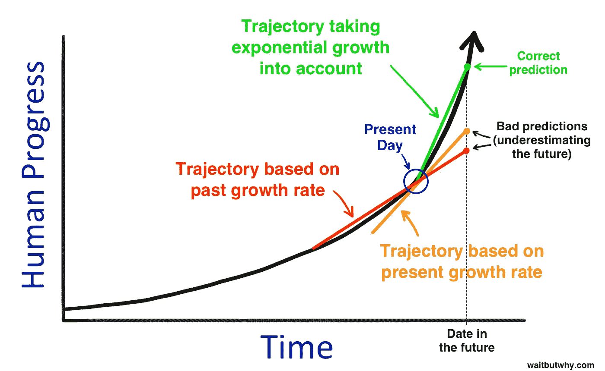
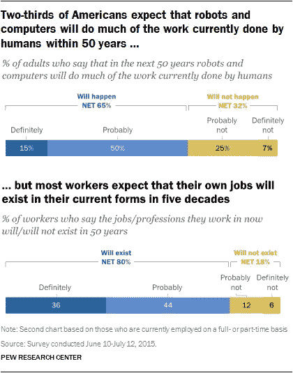
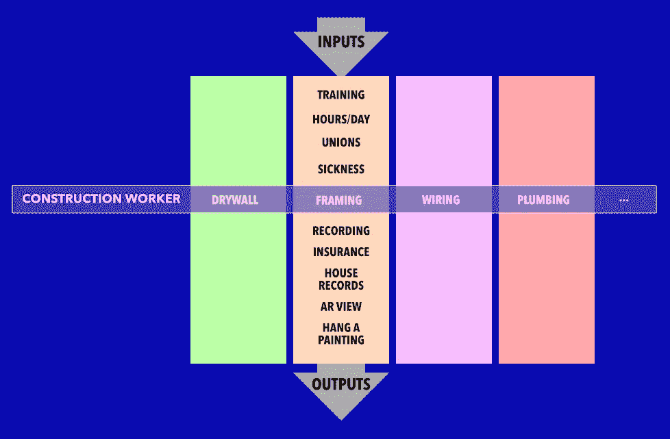

# 千刀万剐

> 原文：<https://medium.com/hackernoon/by-a-thousand-cuts-a772ff1130f8>

最近有很多关于机器人和人工智能是否会取代我们工作的争论。我认为他们会的，但不是以我们认为的方式，这种差异很重要。

## 我们会失业吗？

今天围绕自动化和就业的争论是这样的:

*   **我们会失业，因为**机器人可以比人类更好地做[工作，而](https://www.engadget.com/2009/09/30/video-abb-flexpicker-replaces-human-pancake-pickers-with-amazin/)[算法可以比人类](https://www.technologyreview.com/s/535446/googles-ai-masters-space-invaders-but-it-still-stinks-at-pac-man/)更好地推理。因此，他们会抢走我们的工作。考虑证据 A 和 B:

Pancake time.

I am so glad this wasn’t around when I was eleven.

*   不，我们仍然会有工作，因为所有这一切以前都发生过(例如，轧棉机)，从历史上看，新技术创造的工作机会比它们消耗的多。事物的自动化只是杰文斯悖论的最新例子:更高的效率意味着更多的新用途意味着更多的消费。
*   **是的，但这次不同。**工业革命是用蒸汽代替肌肉；这是关于用电代替神经元。机器无法自我升级；算法可以，奇点近了。[蒂姆·厄本对此解释得非常好:](http://waitbutwhy.com/2015/01/artificial-intelligence-revolution-1.html)

Compounding is the most powerful force in the universe.

*   **不能，因为**机器专用且狭窄。人类是多面手。所以机器实际上会增强我们的能力，让我们做得更好。

## 工作会改变

因此，我们来到了这场辩论的现状，即，“工作的性质将会改变。”凯文·凯利已经雄辩地描述了后生产力经济。他看到了未来，但认为当机器人和算法做的事情廉价而丰富时，我们将重新定义工作。

与此同时，皮尤研究中心(Pew Research Center)指出，有多少工作将被机器取代，而我们有多少人对此感到担忧，这两者之间存在巨大的脱节。

Head. In. The. Sand.

## 未来是好是坏？

就我个人而言，我对自动化相对乐观，只要我们做到以下几点:

1.  避免数据和算法集中在少数强者手中，就像资本集中在 0.01%的人手中一样。
2.  改变我们衡量一个社会有多好的标准，让它更少地关注生产率(GDP)，更多地关注创造力或生活质量。
3.  帮助人们重新定义他们认为的“好”职业，强调艺术、开放式科学等等。
4.  找到一种方法，确保仅仅因为算法描绘了一条“最优”路径，我们就不会被迫选择它，因为这意味着少走的路只对那些可以忽略最优的人开放。

所以，是的，我一点也不担心。

## 千刀万剐

无论如何，那些认为就业将持续的人最常见的反对意见之一是，机器可以做好一些事情，但不是所有的事情。主流媒体在这里给我们造成了伤害:每一个关于最新人工智能突破的新闻故事都倾向于隐藏它的专业性。AlphaGo 在 Jeopardy 上的表现就像沃森在驾驶汽车上的表现一样糟糕，就像特斯拉在下围棋上的表现一样糟糕。

[海因莱茵有句名言](https://en.wikipedia.org/wiki/Competent_man)，“专精是为了昆虫。”这很棒，直到你玩过星际争霸。

This is how you use a swarm of narrow-minded insects to overthrow humans.

我要带着这个去某个地方。

## 总承包商和指甲机器人

想象一下，例如，你是一个有才华的多面手建筑工人。你擅长很多事情——从框架和木材，到电线，到管道，到干墙，到油漆。“当然，”你想，“机器可以执行任务。我喜欢这样！圆锯、钻孔机和钉枪改变了我的工作，我比以前更忙了！”

现在，假设有人推出了一台非常专注的机器，一台擅长在工作现场制作 2x4s 框架的机器。你可能会认为你在比赛你钉钉子的技术有多好。但你不是。**你实际上是在和*竞争，在与取景*相关的整套任务中，它能有多好。**

如果我做一个机器人，可以通过锤击 2x4s 来框墙，我大概不会就此止步。我可能会添加一些形式的记录和分析，这样我就知道钉子放在哪里，木头在哪里。这反过来将被提供给银行(用于成本分析)；对保险公司(证明合规)；给房主(作为三维数字蓝图的一种形式)；诸如此类。

当你这样想的时候，你会意识到建筑工人不是在和一个钉钉子和拿木板的机器人竞争。这名工人正在与一个机器人竞争，这个机器人可以让房主在五年后戴上 AR 护目镜，并看到所有的托梁在哪里，这样房主就可以在没有螺柱探测器的情况下完美地悬挂一幅画。

Generalist humans are only competing with a small part of their replacements’ advantages.

换句话说，五年后我们不知道一个建筑机器人是用来挂画的，但它是。很难与这种变化竞争。

软件也有类似的故事。数字会计师、律师或诊断技师不仅仅擅长审查记录；它有意想不到的好处——集体基线、证据链记录、可视化等。软件比硬件消耗工作的速度更快，因为软件可以快速、无限地自我升级。越来越好了。硬件仍然需要更新。

就机器人和算法而言，这可以归结为:人类不擅长记笔记；机器别无选择，只能这样做；一旦被分析，笔记的价值远远超出了任务本身。

请注意，我们甚至还没有深入劳动力的供应方面。机器人和算法不会请病假，不需要睡觉，不会变得注意力不集中，不会在工业事故中成为丑陋的头条新闻。保险、建筑等等的涓滴效应是巨大的。

我认为我们今天拥有的工作——我们告诉像皮尤这样的人，我们相信 50 年后还会存在的工作——将比我们预期的更快消失。但是我们没有注意到，因为这些工作不会死于大规模的通才死亡。相反，他们会被千刀万剐而死。

> [黑客中午](http://bit.ly/Hackernoon)是黑客如何开始他们的下午。我们是 [@AMI](http://bit.ly/atAMIatAMI) 家庭的一员。我们现在[接受投稿](http://bit.ly/hackernoonsubmission)，并乐意[讨论广告&赞助](mailto:partners@amipublications.com)机会。
> 
> 如果你喜欢这个故事，我们推荐你阅读我们的[最新科技故事](http://bit.ly/hackernoonlatestt)和[趋势科技故事](https://hackernoon.com/trending)。直到下一次，不要把世界的现实想当然！

