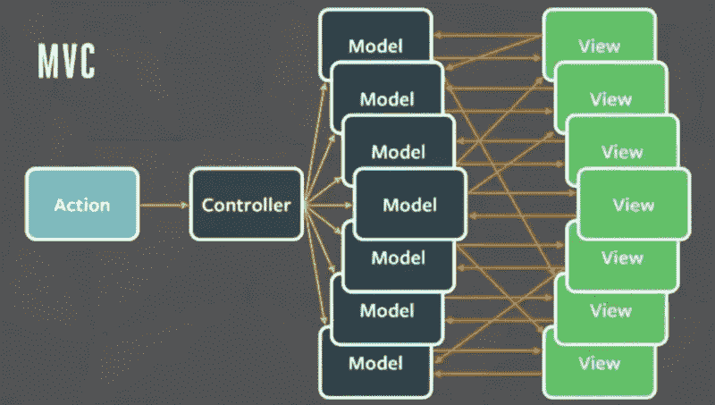
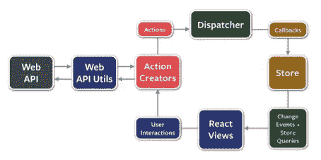

# 再见 2k16，再见 Angular

> 原文：<https://medium.com/hackernoon/bye-2k16-and-bye-angular-ca627861839>


是的，我们度过了一段美好的时光，有一小段时间我认为 Angular 是最好的，但大约在 3 月左右，我开始学习 React，它混淆了，它挑战了(或改变了)我对软件的看法，但当我开始理解它时，我认为 Angular 已经结束了，并了解了为什么 React js 赢得了开发社区的心，为什么它将在可预见的未来继续存在。以下是我和 Angular 关系结束的原因。

1.  组件架构
2.  JSX
3.  单向数据流
4.  虚拟 DOM
5.  流量
6.  函数式编程

**组件架构:**

作为前端设备的状态。随着 Angular 2 仅转换为组件，it 看到了组件架构是一种发展方向。为什么你应该在你的应用中只使用无状态组件，这有很多好处。看看这个

```
var ButtonApp = React.createClass({
    render: function(){
        return (
            <input type="submit" />
        );
    }
});
```

这是 React 中组件的一个例子，看看理解这里发生的事情有多容易，但是如果你不得不在 Angular 中做同样的事情，你将不得不制定一个指令，尽管 Angular 团队在指令的可用性方面做了出色的工作，但他们也使学习、阅读和维护指令变得非常复杂。

```
angular.module('foo').directive('bar', ['$rootScope', function ($rootScope) {
  return {
   restrict: 'E',
   replace: true,
   templateUrl: 'path of my button's template',
//or if you have a simple template
   template:'<input type="submit" />',
   controller : function ($rootScope,$scope) {

   },
   link: function (scope, elements, attrs) {

   }
  };
 }]);
```

很明显，我需要知道一个完全不同的 API，以便用 Angular 制作一个组件，而这个 API 有如此多的选项，以至于大多数时候你会忘记自己真正想做什么，因为你会迷失在指令所创造的复杂性中。

如果你想用组件做出有用的东西

任何一个对 [JavaScript](https://hackernoon.com/tagged/javascript) 有一些基础知识的[程序员](https://hackernoon.com/tagged/programmer)都能够理解这里发生了什么，但是如果你看看 Angular 中的等价代码，你可能需要先学习几十个其他概念或语法，这样你才能理解它。

组件的优势很少:

1.  很容易知道一个组件是如何渲染的，只要看看渲染函数就知道了
2.  它确保可读性，并使可维护性更容易。
3.  这很容易测试。
4.  您可以构建可重用的组件，使我们能够与您的本地客户端共享代码。

# **JSX:**

JSX 是一种内联标记，看起来像 HTML，并被转换成 JavaScript。

这非常困难，因为就我所写的代码而言，我们将 Javascript、CSS 和 HTML 保存在不同的文件中，要理解这一点非常困难，我需要从我看到的多个教程和视频中获得更多的说服力，但现在我想知道“为什么我以前不使用它”。

看一下这个片段:

1.  你拥有 JavaScript 的全部能力来描述你的 UI——循环、函数、范围、组合、模块——而不是模板语言。
2.  JSX 事件处理程序不像 HTML。JSX 事件 get **自动将**委托给**根 React 节点**。实际上，它更进一步。它在根节点上设置了一个**单一事件处理程序**，处理**你的所有事件。**这是什么意思？通常，当您将事件侦听器直接附加到用户与之交互的元素时，最终可能会在内存中为单个页面存储许多事件侦听器。React 会自动创建一个监听器，这样你就再也不用考虑事件委托了。这对于像无限滚动这样的事情来说真的很棒，因为你不必担心无限增长的内存消耗(内存泄漏)。
3.  将 HTML 和 JS 保存在同一个文件中有一个很大的优势，你可以看到一个单独的组件，你可以看到它将如何呈现，它将如何表现以及它的样式，这是**关注点分离**做得对。

# 单向数据流

数据绑定对于小例子非常有效。然而，随着应用程序的增长，你可能会面临这些问题。

## 声明依赖关系会很快引入循环

最常见的问题是不得不应对你状态变化的副作用



The mess MVC creates

在这个场景中，**你能预测当*一个*变化发生在*单个*模型上时**会发生什么变化吗？当任何依赖关系改变时，很难**推理出可以完全任意顺序执行的代码。**

**视图的作用是什么？将数据呈现给用户。视图模型的作用是什么？将数据呈现给用户。有什么区别？没有！**

> ***模板分离技术，而不是关注点~皮特·亨特***

**这正是我每天在工作中面临的问题，我们的整个 web 应用程序都是用 Angular 1.x 编写的，这个问题的解决方案需要我们，**

# **虚拟 DOM**

**这大概就是为什么大部分开发者如此被吸引反应的原因。React 在内存中管理自己的 DOM。大多数 web 应用程序遭受的最昂贵的操作是改变 DOM。React 的方法是维护 DOM 的虚拟表示，这允许它计算 DOM 中的差异，以便它只改变 DOM 中实际需要更新的部分。这是一个巨大的好处！**

**React 可以区分两个 DOM 树，并发现它需要执行的最小操作集。这意味着两件事:**

1.  **如果带有文本的输入被重新呈现，并且 React 期望它具有该内容，那么它**不会接触**该输入。不再有国家损失！**
2.  **区分虚拟 DOM 一点也不昂贵，所以我们可以随心所欲地区分它。当它准备好真正改变 DOM 时，它将只执行最少的操作。不再有缓慢的布局抖动！**

**对于不知道 Angular 如何发生这种情况的人，让我告诉你，**

**Digest cycle 是 Angular 中数据绑定的魔酱，它的工作方式是这样的，**

**每当浏览器事件或某个 AJAX 请求(可能有很多情况下会被调用)触发 digest cycle 时，所有绑定到 view 或任何其他 watches 或任何附加到 scope(另一个角度术语)的函数的变量都将被重新评估，不仅针对该组件，还针对整个应用程序(是的！！)**

**总之，它导致了太多的函数调用和 DOM 操作，从而转化为神经过敏的体验。(如果你有一个对棱角和前端很有经验的人，那么只有你能逃脱这个)。**

**所以，如果你用 React 消化循环的话所有的问题噗**没了**！**

****

# **流量**

**Flux 是脸书的**模式**，用于关注单向数据流的 React 应用。通量的基本概念是一切都朝一个方向发生。动作的结果是数据流入。动作触发存储(数据模型)更新，然后触发 change 事件，导致 React 视图在需要时更新。随着应用程序中数据的变化，这种循环会不断重复。**

****

**优势:**

1.  **存储和动作只是纯粹的函数。它们很容易单独测试。**
2.  **轻松交易。调度程序拥有状态，**有权将应用程序恢复到任何先前的状态**，而无需程序员实现类似 *serialize()* 或 *deserialize()* 的东西。这与热重装相结合，使[非常强大的开发工具](https://github.com/gaearon/redux-devtools)**
3.  **您可以在商店级别订阅更改，但是**dispatcher 也可以为需要更细粒度更新的高级用户提供类似光标的功能**。**

**在 React 中维护状态不仅简单，而且更有效，可读性更好，至于如何在 Angular 中做同样的事情，我花了一段时间才弄明白，它仍然没有这样有效。**

# **函数式编程**

**作为一名程序员，我应该知道函数式编程非常有用，尽管我仍然怀疑函数式编程在后端/API 上的可用性，但在前端，我可以这么说**

> **“我遇到的 50%的问题都是因为没有使用纯函数或变异状态”**

**优点是:**

*   **通过应用程序简化数据流。**
*   **删除了对数据的防御性复制的要求。**
*   **通过数据变化检测进行优化。**
*   **通过[记忆增强性能](https://wiki.haskell.org/Memoization)**

**那么为什么有些人害怕不变性呢？**

**因为他们认为总是创造一个新的国家是缓慢的**但是**他们不知道的是**

> **为了避免昂贵的克隆，只存储与先前数据结构的差异，而交集在它们之间共享。这种策略被称为结构共享。**

**更多信息请点击[。](https://www.youtube.com/watch?v=I7IdS-PbEgI)**

****TLDR；****

**我和 Angular 度过的时光很美好，但那不会回来了，虽然我会在工作中继续 Angular，但那只是因为我不喜欢重写，否则我就不干了。React 及其引入的方法学起初听起来可能很可怕(非常规)，但它是值得的，因为 React 方法提供的优势很难忽视，如果你正在从一些新的东西开始，让 2016 年过去，使用 [React](https://www.google.co.in/url?sa=t&rct=j&q=&esrc=s&source=web&cd=1&cad=rja&uact=8&ved=0ahUKEwivgrvQqubQAhXJU7wKHXivDn0QFggmMAA&url=https%3A%2F%2Ffacebook.github.io%2Freact%2F&usg=AFQjCNHa_1d2VQ9XLEwLkZFQYYmqt39aoQ) 。**

****觉得这个帖子有用？请点击下面的❤按钮！:)****

**干杯，**

**沙希瓦特·巴特，**

**软件工程。[网格](https://gridle.io)**

**[](http://bit.ly/HackernoonFB)****[](https://goo.gl/k7XYbx)****[](https://goo.gl/4ofytp)**

> **[黑客中午](http://bit.ly/Hackernoon)是黑客如何开始他们的下午。我们是阿妹家庭的一员。我们现在[接受投稿](http://bit.ly/hackernoonsubmission)并乐意[讨论广告&赞助](mailto:partners@amipublications.com)的机会。**
> 
> **如果你喜欢这个故事，我们推荐你阅读我们的[最新科技故事](http://bit.ly/hackernoonlatestt)和[趋势科技故事](https://hackernoon.com/trending)。直到下一次，不要把世界的现实想当然！**

****