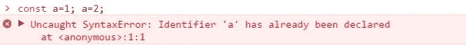
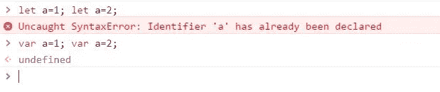

# 拜拜 Var！ES6 中的 Let 和 Const

> 原文：<https://medium.com/hackernoon/bye-bye-var-let-and-const-in-es6-afd91704f0ee>

JavaScript [ES6](https://hackernoon.com/tagged/es6) 有多种功能可以帮助程序员更快、更高效地编写代码。今天让我们来看看两个特殊的函数，*让*和*保持不变。*

在变量声明期间，使用 *let* 和 *const* 作为 *var* 函数的替代。与*变量*不同， *let* 和 *const* 是块范围的。与 *var* 相比， *let* 和 *const* 拥有*和*的另一个不同之处在于，当 *var* 在声明前被访问时会给出一个*未定义的*错误，而 *let* 和 *const* 如果在声明前被访问，则会给出一个 *ReferenceError* 。

const does not allow reassignment

该误差是由于 TDZ 或时间死区造成的。TDZ 从声明了 *let* 的块的开始处开始，并在用户代码中再次遇到 *let* 时结束。

TDZ 非常有用，因为它有助于避免变量在声明之前被改变时出现的错误。

虽然 *let* 和 *const* 相似，但它们并不完全相同。 *let* 和 *const* 的主要区别在于 *const* 变量需要使用初始化器声明，否则会产生错误。

let will prevent mistakes of trying to redeclare an already declareed variable

同样，使用相同名称声明变量将会引发错误。这有助于修复当变量被重新赋值时丢失引用的错误。

Let 和 Const 已经在许多代码库中取代了 Var，它们是 ES6 的附加特性，可以改进代码。

> [黑客中午](http://bit.ly/Hackernoon)是黑客如何开始他们的下午。我们是 [@AMI](http://bit.ly/atAMIatAMI) 家庭的一员。我们现在[接受投稿](http://bit.ly/hackernoonsubmission)并乐意[讨论广告&赞助](mailto:partners@amipublications.com)机会。
> 
> 要了解更多信息，[请阅读我们的“关于”页面](https://goo.gl/4ofytp) , [喜欢/在脸书给我们发消息](http://bit.ly/HackernoonFB)，或者简单地，[发推文/DM @HackerNoon。](https://goo.gl/k7XYbx)
> 
> 如果你喜欢这个故事，我们推荐你阅读我们的[最新科技故事](http://bit.ly/hackernoonlatestt)和[趋势科技故事](https://hackernoon.com/trending)。直到下一次，不要把世界的现实想当然！