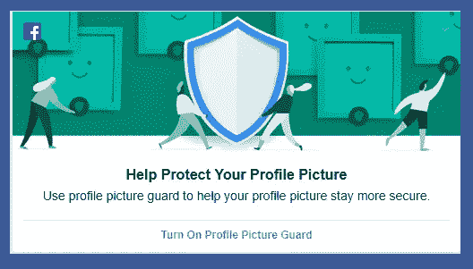
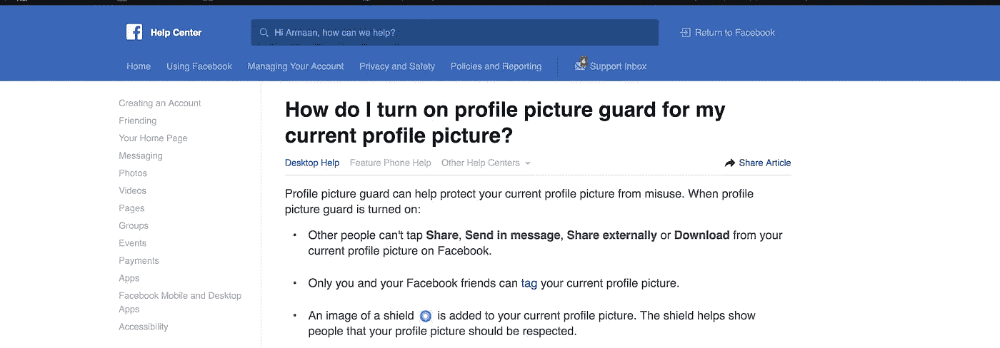
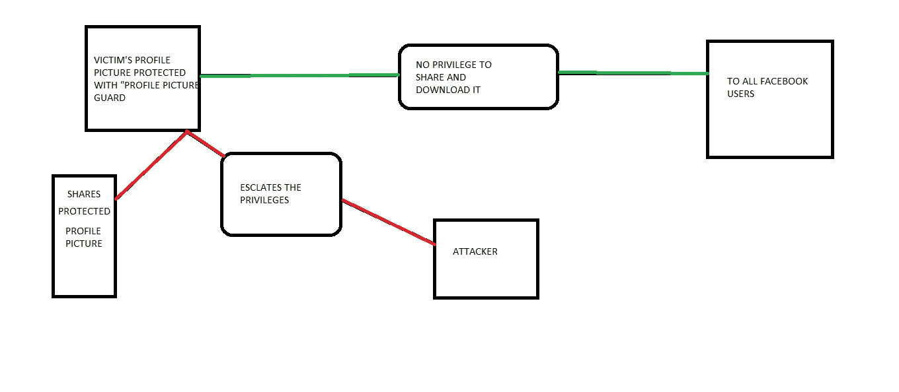
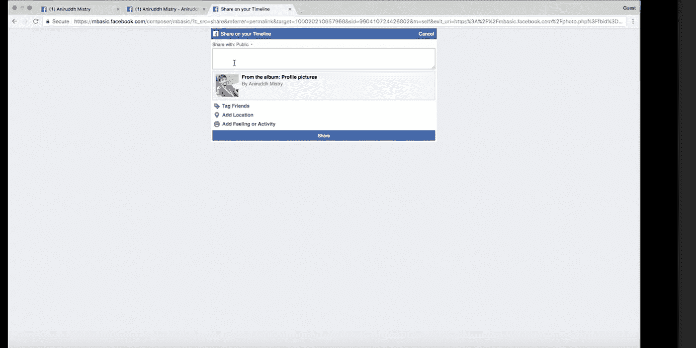
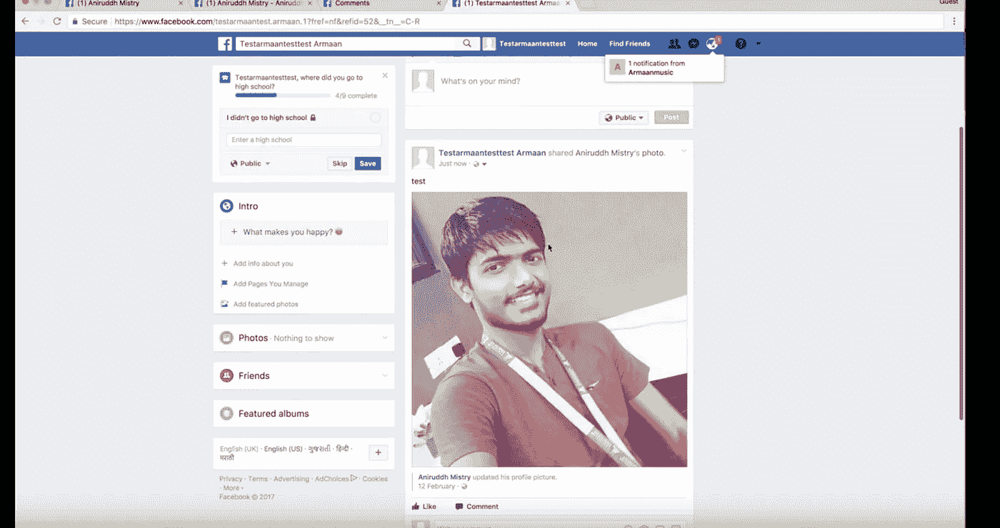

# 绕过脸书个人资料图片警卫安全。

> 原文：<https://medium.com/hackernoon/bypassing-facebook-profile-picture-guard-security-f0676550f089>

脸书最近推出了个人资料图片保护，它可以保护你的个人资料图片，也可以防止你的个人资料图片被滥用。

这是个人资料图片保护的策略，如果您使用个人资料图片保护，它将如何保护个人资料图片。

正如你在上面看到的，它提到了

没有人能
1)下载照片
2)发送信息
3)分享它

但有些我如何能够绕过这种保护，并能够分享个人资料图片保护的照片。

这是我攻击的思维导图，我是如何绕过保护的。

这是我的一个朋友的个人资料图片，受到 facebook 个人资料图片保护

您会注意到，照片中没有共享和下载选项，因此任何用户都不能直接共享此个人资料照片。

但是，正如您在 URL 栏中看到的，有一个**fbid**参数，它有一些值。

现在，fbid 包含了受个人资料图片保护的个人资料照片的 id 值。

所以回到最基本的。

facebook graph api 在 3 件事情上起作用

1.  节点(事物)
2.  边缘(事物的关系)
3.  字段(事物的价值)

在这个场景中，api 没有验证(授权)两个节点之间的关系，

现在哪些节点？

用户和个人资料图片保护保护照片。

h[ttps://m . Facebook . com/composer/MBA sic/？c _ src = share&referrer = permalink&target = % 7b tacker _ USER _ ID % 7D&sid = % 7BVICTIM _ PROFILE _ PICTURE _ ID % 7D&m = self&exit _ uri = https % 3A % 2F % 2fm basic . Facebook . com % 2f photo . PHP % 3 ffbid % 3D % 7BVICTIM _ PROFILE _ PICTURE _ ID % 7D % 26 set % 3da . 125151660865930](https://m.facebook.com/composer/mbasic/?c_src=share&referrer=permalink&target=%7BATTACKER_USER_ID%7D&sid=%7BVICTIM_PROFILE_PICTURE_ID%7D&m=self&exit_uri=https%3A%2F%2Fmbasic.facebook.com%2Fphoto.php%3Ffbid%3D%7BVICTIM_PROFILE_PICTURE_ID%7D%26set%3Da.125151660865930.11576.%7BATTACKER_USER_ID%7D%26type%3D1%26theater&cwevent=composer_entry&av=%7BATTACKER_USER_ID%7D&view_overview&ref_component=mbasic_photo_permalink_actionbar&ref_page=%2Fwap%2Fphoto.php&refid=13)

我刚刚生成了我的个人资料图片的共享链接，并用受害者的个人资料 id 替换了我的照片 id &它允许我共享我的受害者的个人资料图片保护照片，这是我不被允许的。

我已经向 facebook 报告了这个问题，但他们说个人资料图片是公开的&与个人资料图片相关的 bug 没有资格获得奖励。(悲伤的部分)

感谢阅读，

我希望你们会喜欢它。

祝你愉快。