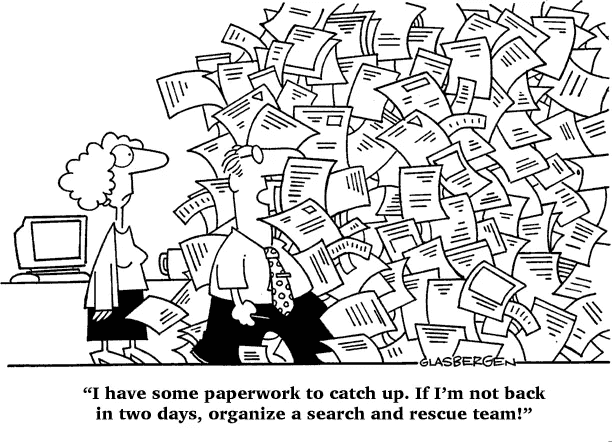
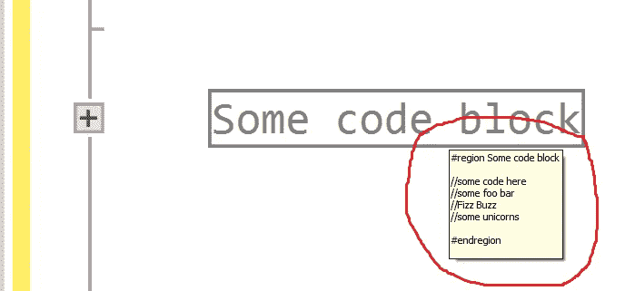
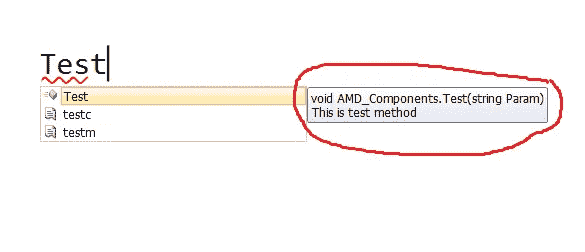
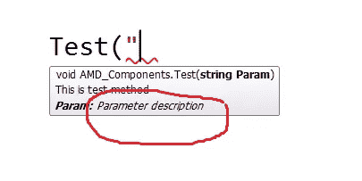
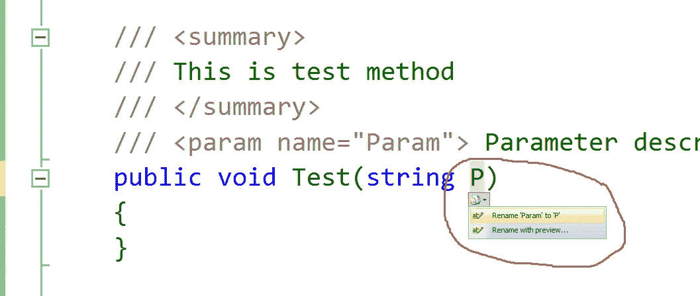

# C#代码文档

> 原文：<https://medium.com/hackernoon/c-code-documentation-8910bc173d7b>



[credit](http://www.webpal.net/blog/tag/document-management-2/)

代码[文档](https://hackernoon.com/tagged/documentation)的黄金法则:

> 尝试记录[为什么](http://stackoverflow.com/a/4929769)(代码设计决策)和避免什么(代码设计描述)。

为了跟上项目日益增长的复杂性，记录[编码](https://hackernoon.com/tagged/coding)决策是非常重要的。这是最佳实践之一。

Visual studio 为代码文档提供了一些优雅的方式来保持代码的可理解性。它还可以理解对硬代码所做的更改。

# 单行或多行注释

*   简短(或详细)的功能描述

```
//single line comment
```

这些是用 little 描述功能所必需的。

```
/*
multiple
line
comments
*/
```

避开他们。建议避免写关于代码的文章。最终产品应该是代码，而不是他们的长篇大论。

# 可折叠区域

*   功能块概述

```
#**region** Some code block //some code here
    	//some foo bar
    	//Fizz Buzz
    	//some unicorns

#**endregion**
```

区域是可折叠的。只需将鼠标悬停在塌陷区域上方，便可一览无余。



[礼貌](http://imgur.com/)

# 摘要

*   函数或属性的摘要

```
**///** **<summary>**
**///** Summary description for the function or property goes here
**///** **</summary>**
```



[礼遇](http://imgur.com/)

*   函数参数概要

```
**///** **<param name="TestParameter">**Summary description for the parameter goes here **</param>**
```



[礼遇](http://imgur.com/)

在更改参数名称后，Visual studio 会更改此节。



[礼遇](http://imgur.com/)

*   归还物品汇总

```
**///<returns>**Summary description for the function result goes here**</returns>**
```

一个简单的例子:

```
**///** **<summary>**
**///** Main class of the project
**///** **</summary>**
**class** **Program**
{
        **///** **<summary>**
        **///** Main entry point of the program
        **///** **</summary>**
        **///** **<param name="args">**Command line args**</param>**
        **static** **void** **Main**(**string**[] args)
        {
            //Do stuff
        }
}
```