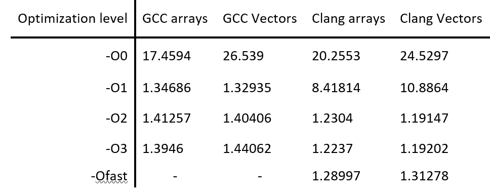
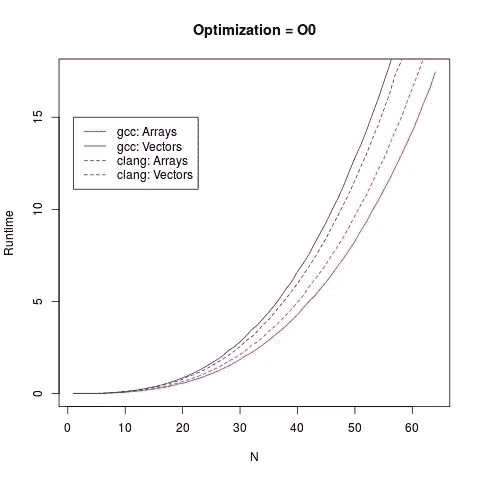
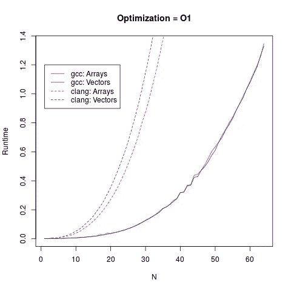
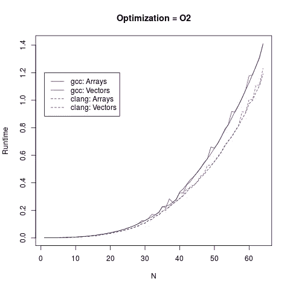
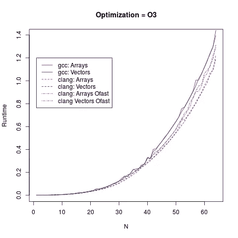

# C++研究:数组与向量

> 原文：<https://medium.com/hackernoon/c-investigation-arrays-vs-vectors-e9ba864468b6>

# 这些职位的目标

这些帖子的目的是学习更多关于现代 C++的知识，看看我一直认为理所当然的一些传统智慧。我将从构建一个矩阵库开始，并看看它会如何发展。这第一篇文章将是关于挑战一些传统的智慧，并着眼于一个潜在的实现选择。下一篇文章我将介绍如何使用一些现代 C++并向库中添加概念。

# 想法概述

矩阵库需要做的一件事是表示不同大小的矩阵。在这种情况下，最理想的是让 matrix 对象得到一个动态大小的容器的支持。理想情况下，这个容器具有快速的访问时间，这意味着像链表这样的容器不适合这个场景。在常见的数据结构中，数组和哈希表都符合这个标准，它们的访问时间都是 O(1)。因为可以将矩阵中的每一项映射到一个唯一的索引(它的位置)，所以数组类型的数据结构对于底层容器是有意义的。

编程中的一个常见建议是使用标准库。然而，C++的标准库经常因为过于通用而受到审查，并且由于这种通用性，经常会被手工制作的解决方案击败。让我们看看对于一个基本的矩阵实现，在堆上使用一个指向数组的指针和标准库的 vector 类型之间是否有任何区别。

# 代码

这两个矩阵的代码可以在这里的[和下面的](https://raw.githubusercontent.com/DanielJSnyder/ExploringCppMatrices/master/ArrVec/Matrix.hpp)看到

```
#ifndef __MATRIX2D_HPP__
#define __MATRIX2D_HPP__#include <vector>
template <typename T>
class MatrixVec2D
{
 std::vector<T> mat;
 std::size_t rows;
 std::size_t cols;
 std::size_t rcToIdx(std::size_t r, std::size_t c) const
 {
 	return cols * r + c;
 }public:
 MatrixVec2D<T>(std::size_t r, std::size_t c) : 
	mat(r*c, 0),
	rows(r),
	cols(c)
 {
 } MatrixVec2D<T>(const MatrixVec2D<T> & m): 
	mat(m.mat), 
	rows(m.rows), 
	cols(m.cols)
 {
 } std::size_t getNumRows() const
 {
 	return rows;
 }
 std::size_t getNumCols() const
 {
 	return cols;
 } const T& at(std::size_t row, std::size_t col) const
 {
 	return mat[rcToIdx(row, col)];
 } T& at(std::size_t row, std::size_t col)
 {
 	return mat[rcToIdx(row, col)];
 }
};template <typename T>
class MatrixArr2D
{
 T * mat;
 std::size_t rows;
 std::size_t cols; std::size_t rcToIdx(std::size_t r, std::size_t c) const
 {
 	return cols * r + c;
 }public:
 MatrixArr2D<T>(std::size_t r, std::size_t c): 
	mat(new T[r*c]), 
	rows(r), 
	cols(c)
 {
 	for(auto i = 0; i < r*c; ++i)
 	{
 		mat[i] = 0;
 	}
 }

MatrixArr2D<T>(const MatrixArr2D<T> & m): 
	mat(new T[m.rows * m.cols]), 
	rows(m.rows), 
	cols(m.cols)
 {
 	for(auto i = 0; i < rows*cols; ++i)
 	{
 		mat[i] = m.mat[i];
 	}
 }

~MatrixArr2D()
 {
 	delete [] mat;
 }

 std::size_t getNumRows() const
 {
 	return rows;
 } std::size_t getNumCols() const
 {
 	return cols;
 } const T& at(std::size_t row, std::size_t col) const
 {
 	return mat[rcToIdx(row, col)];
 } T& at(std::size_t row, std::size_t col)
 {
 	return mat[rcToIdx(row, col)];
 }
};
#endif
```

这两种实现的主要区别在于底层容器。MatrixVec2D 使用标准库中的向量来存储数据，而 MatrixArr2D 使用动态分配的数组。因为向量通常是用动态分配的数组实现的，所以在执行元素访问时，向量实现应该像另一个间接层一样。通过消除这一间接层并使用动态分配的数组，预计 MatrixArr2D 应该比 MatrixVec2D 更快地进行访问。

# 测试框架

当测试这两个实现时，测试应该与底层实现无关。实现这一点的两种方法是通过都从派生的抽象基类或模板化函数。为了不用担心调用虚方法的开销，我们选择了模板函数方法。

为了测试，编写了一个乘法函数，如下所示。这对于方阵使用 O(n)次访问，其中 n 是列长度。使用 rand()用随机数填充两个矩阵，然后将两个矩阵相乘。

```
template <template <class S> class T, typename S>
T<S> mult(const T<S>& A, const T<S>& B)
{
  assert(A.getNumCols() == B.getNumRows());
  T<S> result(A.getNumRows(), B.getNumCols());
  for(std::size_t r = 0; r < result.getNumRows(); ++r)
  {
    for(std::size_t c = 0; c < result.getNumCols(); ++c)
    {
      S sum = 0;
      for(std::size_t m = 0; m < A.getNumCols(); ++m)
      {
        sum += A.at(r,m) * B.at(m,c);
      }
      result.at(r,c) = sum;
    }
  }
  return result;
}
```

# 结果

结果总结在最后的图表中，可以在下表中看到。



Table summarizing the results of the programs for n=64

这些结果是在没有应用优化时预测的，但是在更高的优化级别，两者之间的差异变得可以忽略，并且在除了端点之外的点上，向量实现比数组实现更快。这表明在更高的优化级别(-对于 GCC 为 O1，对于 Clang 为-O2)，编译器能够以某种方式优化掉向量导致的额外间接级别。

另一个值得注意的有趣的事情是，对于整个测试，clang 的-Ofast 优化级别的性能比-O3 优化级别的性能差。这强化了剖析的想法，不要总是相信更多的优化会使代码更快。

# 结论

由于在较高的优化级别上，数组支持的矩阵和矢量支持的矩阵之间没有有意义的区别，因此在这种实现中使用原始数组没有什么好处。与原始指针相比，标准库提供的向量不容易出现与内存相关的错误，如泄漏。此外，vector 类提供了对许多标准库算法的访问，这些算法可能对扩展 matrix 类有用。

如果您看到任何您不同意或觉得可以改进的地方，请随时给我发消息！

# 附录:测试硬件

这些测试是在使用 linux-windows 子系统的微软 surface book 上进行的。适用于 ubuntu 14.04 的 GCC 版本 6.2。Clang 版本 3.8.0。英特尔 i5–6300 u @ 2.40 GHz 2.50 GHz，8GB 内存

# 附录:结果图表



Resuls for no optimzations and first level of optimizations



Results for higher levels of optimizations

[](http://bit.ly/HackernoonFB)[](https://goo.gl/k7XYbx)[](https://goo.gl/4ofytp)

> [黑客中午](http://bit.ly/Hackernoon)是黑客如何开始他们的下午。我们是 [@AMI](http://bit.ly/atAMIatAMI) 家庭的一员。我们现在[接受投稿](http://bit.ly/hackernoonsubmission)，并乐意[讨论广告&赞助](mailto:partners@amipublications.com)机会。
> 
> 如果你喜欢这个故事，我们推荐你阅读我们的[最新科技故事](http://bit.ly/hackernoonlatestt)和[趋势科技故事](https://hackernoon.com/trending)。直到下一次，不要把世界的现实想当然！

