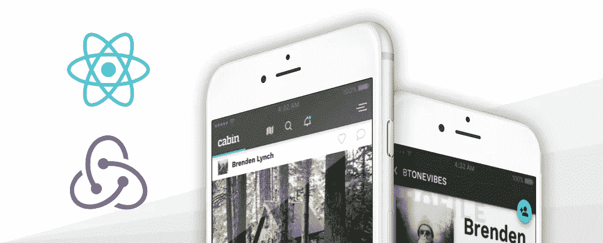

# Cabin —一个全功能的 React & Redux 示例应用程序(更新)

> 原文：<https://medium.com/hackernoon/cabin-a-fully-functional-react-redux-example-app-updated-acc6389eeee8>

去年， [Stream](https://getstream.io/) 着手构建一个全功能的应用程序，以展示如何利用 [React](https://facebook.github.io/react/) 和 [Redux](http://redux.js.org/) 构建实时社交应用程序，这些应用程序利用 Stream 强大的 API 来构建可扩展的新闻提要和活动流。于是， [Cabin](http://cabin.getstream.io/) ，一款功能齐全的 Instagram 式应用诞生了。

自成立以来，Cabin 已经成为 GitHub 上的一个流行回购，并成为许多正在学习如何创建现代应用程序的开发人员的首选参考。考虑到这一点，我们继续迭代和改进 Cabin，无论是作为一个教程工具还是作为一个整体应用程序。

截至今天，我很高兴地宣布，Cabin 已经更新到支持 Node.js 的最新版本(目前在 [v8.4.0](https://nodejs.org/en/download/current/) )。与此同时，我们还更新了 React.js(到 v15.6.1)和许多其他 npm 模块，清理了源代码，并对代码库进行了许多更改，以使其与最新的 [ES6](http://es6-features.org/) 标准保持同步。此外，我们已经更新了所有关于 Cabin 的博客文章，所以作为开发者，你可以很容易地使用我们最新的变化。

Cabin 的[演示网站](http://cabin.getstream.io/)也已更新，以反映应用程序的最新变化。源代码可以在 Cabin 的 Stream [GitHub](https://github.com/GetStream/stream-react-example) 资源库中找到，所有博客帖子可以在下面各自的链接中找到:

1.  [反应&还原](https://getstream.io/blog/cabin-react-redux-example-app-react/)
2.  [Redux](https://getstream.io/blog/cabin-react-redux-example-app-redux/)
3.  [流](https://getstream.io/blog/cabin-react-redux-example-app-stream/)
4.  [Imgix](https://getstream.io/blog/cabin-react-redux-example-app-imgix/)
5.  [敏锐](https://getstream.io/blog/cabin-react-redux-example-app-keen/)
6.  [阿尔戈利亚](https://getstream.io/blog/cabin-react-redux-example-app-algolia/)

如果您有任何建议、评论或补充，请在下面发帖或在 GitHub 上提交 PR(我们支持开源，绝对喜欢看到来自社区的贡献)。

如果你是流媒体新手，并且对我们的托管、可扩展的 feed 技术感兴趣，请看看我们在流媒体网站上的 [5 分钟教程，看看事情是如何运作的！](https://getstream.io/get_started)