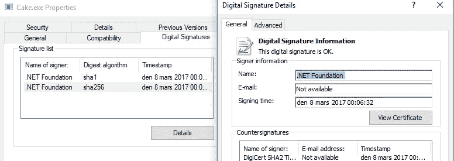

# 蛋糕 v0.18.0 发布

> 原文：<https://medium.com/hackernoon/cake-v0-18-0-released-4a7740dca3cf>

发布于 2017 年 3 月 7 日星期二类别[发布说明](http://cakebuild.net/blog/release-notes)作者 [devlead](http://cakebuild.net/blog/author/devlead)

Cake 0 . 18 . 0 版本已经发布。

这个版本的 Cake 增加了许多新功能，也修复了一些错误，但是，最重要的是，有一些突破性的变化。

微小的突破性变化涉及旧的过时的 DNU 别名已被删除，WiXHeat 有一个不正确的签名已被纠正。

更大的突破性变化是，在这个版本中，插件必须至少以蛋糕为目标。核心版本 0.16.2 或更高版本，针对旧版本的加载项将中止脚本执行。许多外接程序已经更新，许多尚未升级的外接程序已经准备好了拉取请求。如果您使用的任何加载项受此影响，请在该加载项库中提出问题。我们试图联系所有的作者，但是在数百个插件中，我们肯定漏掉了一两个。我们建议您将您的构建版本绑定到您正在使用的 Cake 版本，这样您可以降低由于破坏性更改而导致构建失败的风险。相反，您可以进行受控升级，慢慢来解决任何问题。

更值得注意的新功能包括 MSBuild / Visual Studio 2017 支持和从 NuGet 加载脚本的支持。

我们还很高兴地宣布，从这个版本开始，所有官方的 Cake 二进制文件都将使用. NET Foundation 证书进行签名，这不是强命名，所以它不会以任何方式影响加载项，只是确保二进制文件的真实性。

值得注意的是，在不久的将来，我们将更新并统一 Roslyn scripting 的最新稳定版本——这意味着 Mono scripting engine 将被删除，我们仍将在 Mono 上运行，但我们将需要比今天更新的 Mono 版本。这将为 Cake 带来很多好处，因为我们将能够支持最新的 C#特性，并减少维护负担和维护多个脚本引擎的错误过程。

如果您在这个最新版本中遇到任何问题，请告诉我们。

再一次，蛋糕团队被我们社区成员的贡献所淹没。简单来说…谢谢！

捐款来自:

这个版本中包含的所有细节可以在下面看到。

作为这次发布的一部分，我们关闭了 [59 期](https://github.com/cake-build/cake/issues?milestone=29&state=closed)。

**突破性变化**

*   [**#1396**](https://github.com/cake-build/cake/issues/1396) 删除过时的 DNU 别名
*   [**#1276**](https://github.com/cake-build/cake/issues/1276)

**特色**

*   [**#1518**](https://github.com/cake-build/cake/issues/1518) 添加 MSBuild 2017 的“构建工具”路径到 MSBuildResolver
*   [**#1492**](https://github.com/cake-build/cake/issues/1492) 添加巧克力别名
*   [**#1481**](https://github.com/cake-build/cake/issues/1481) 增加对 NuGet Init 和 Add 命令的支持
*   [**# 1466**](https://github.com/cake-build/cake/issues/1466)NUnitSettings 没有 X86 属性
*   [**#1416**](https://github.com/cake-build/cake/issues/1416) 增强团队合作提供商
*   [**#1399**](https://github.com/cake-build/cake/issues/1399) 支持 TF 构建命令
*   [**#1381**](https://github.com/cake-build/cake/issues/1381) 提供在创建 AssemblyInfo 时添加自定义属性的能力
*   [**#1377**](https://github.com/cake-build/cake/issues/1377) 支持使用 Chocolatey 卸载软件包
*   [**#1374**](https://github.com/cake-build/cake/issues/1374) 提供为 xunit 报表指定名称的能力
*   [**# 1369**](https://github.com/cake-build/cake/issues/1369)MSBuild 支持 Visual Studio 2017(又名“15”)
*   [**#1352**](https://github.com/cake-build/cake/issues/1352) 添加对在程序集级别导入名称空间的支持
*   [**#1301**](https://github.com/cake-build/cake/issues/1301) 添加点覆盖合并
*   [**#1249**](https://github.com/cake-build/cake/issues/1249) 允许模块监听脚本生命周期事件
*   [**#1166**](https://github.com/cake-build/cake/issues/1166) 支持别名方法的可选参数
*   [**#1053**](https://github.com/cake-build/cake/issues/1053) 支持下载。蛋糕脚本指令
*   [**#887**](https://github.com/cake-build/cake/issues/887) 扩展符号命令
*   [**# 600**](https://github.com/cake-build/cake/issues/600)parse assemblyinfo 不起作用。动词

**bug**

*   [**#1483**](https://github.com/cake-build/cake/issues/1483) 蛋糕的 project.json 中重复的 depedencies 引用。测试. XUnit
*   [**#1448**](https://github.com/cake-build/cake/issues/1448) 蛋糕。测试包依赖于 xunit.core 包
*   [**#1441**](https://github.com/cake-build/cake/issues/1441) 可选参数 codegen 不变
*   [**# 1427**](https://github.com/cake-build/cake/issues/1427)XBuildRunner # gettoolexecutablename 返回错误的可执行文件
*   [**#1426**](https://github.com/cake-build/cake/issues/1426) 引用预处理程序指令中的空格在路径中抛出非法字符
*   [**# 1389**](https://github.com/cake-build/cake/issues/1389)# load path 中的空格会导致路径错误中出现非法字符。
*   [**#1386**](https://github.com/cake-build/cake/issues/1386) 为 BuildSystem 添加 CakeNamespaceImport 别名
*   [**#1363**](https://github.com/cake-build/cake/issues/1363) 加热设置。OutputGroup 不可用
*   [**#1349**](https://github.com/cake-build/cake/issues/1349)
*   [**#1342**](https://github.com/cake-build/cake/issues/1342) 错误:目录包含@字符时出现未知标记。
*   [**#1260**](https://github.com/cake-build/cake/issues/1260) 使用保留名称作为参数名称会导致解析器失败

**改进**

*   在签署多个文件时，signtool.exe 应该只被调用一次
*   [**# 1510**](https://github.com/cake-build/cake/issues/1510)VS 2017 的枚举 NuGetMSBuildVersion 上缺少 MSBuild15
*   [**#1504**](https://github.com/cake-build/cake/issues/1504) 为 IEnumerable 添加 ChocoPush 别名
*   [**#1503**](https://github.com/cake-build/cake/issues/1503) 为 IEnumerable 添加 ChocoPack 别名
*   在安装工具和附件上使用-NoCache
*   在单声道上运行时，无法正确检测到 Mac OSX
*   [**# 1463**](https://github.com/cake-build/cake/issues/1463)n 获取 mac 上的刀具定位器系统路径需要更新
*   [**#1455**](https://github.com/cake-build/cake/issues/1455) 当字符串中有花括号时，日志记录抛出异常
*   [**#1439**](https://github.com/cake-build/cake/issues/1439) 复制目录—缺少日志信息
*   [**#1438**](https://github.com/cake-build/cake/issues/1438) 如果需要，教 XmlPeek 静音警告
*   [**#1424**](https://github.com/cake-build/cake/issues/1424) 单元测试中的 Http 调用
*   [**#1403**](https://github.com/cake-build/cake/issues/1403) 添加可选 Go。用于获取历史记录的 CD 服务器 URL 参数
*   [**#1379**](https://github.com/cake-build/cake/issues/1379) 向 ProcessRunner 添加 RedirectStandardError
*   [**#1344**](https://github.com/cake-build/cake/issues/1344) Cake 的默认工具/插件/模块路径并没有看起来那么默认。
*   [**# 1338**](https://github.com/cake-build/cake/issues/1338)argument exception 有非法字符信息
*   [**#1293**](https://github.com/cake-build/cake/issues/1293) 添加验证加载项的机制
*   [**#670**](https://github.com/cake-build/cake/issues/670) 支持 XUnit 的 x86。exe 运行程序
*   [**#568**](https://github.com/cake-build/cake/issues/568) 添加 Gitter 和 Twitter 通知

**文献**

*   [**#1501**](https://github.com/cake-build/cake/issues/1501) 下载文档中的文件打字错误
*   [**# 1495**](https://github.com/cake-build/cake/issues/1495)sign tool 文档中的错别字
*   [**#1489**](https://github.com/cake-build/cake/pull/1489)
*   [**#1472**](https://github.com/cake-build/cake/issues/1472) 修正 GitLink 别名类别的问题
*   [**#1434**](https://github.com/cake-build/cake/pull/1434) 修复 DotNetCoreTest 的注释示例
*   [**#1388**](https://github.com/cake-build/cake/pull/1388) 修复 InnoSetupAliases 中的文档注释
*   [**#1373**](https://github.com/cake-build/cake/pull/1373) 修复注释中的错别字
*   [**#1372**](https://github.com/cake-build/cake/pull/1372) 修正拼写错误。

*原载于*[*cakebuild.net*](http://cakebuild.net/blog/2017/03/cake-v0.18.0-released)*。*

> [黑客中午](http://bit.ly/Hackernoon)是黑客如何开始他们的下午。我们是 [@AMI](http://bit.ly/atAMIatAMI) 家庭的一员。我们现在[接受投稿](http://bit.ly/hackernoonsubmission)，并乐意[讨论广告&赞助](mailto:partners@amipublications.com)机会。
> 
> 如果你喜欢这个故事，我们推荐你阅读我们的[最新科技故事](http://bit.ly/hackernoonlatestt)和[趋势科技故事](https://hackernoon.com/trending)。直到下一次，不要把世界的现实想当然！

