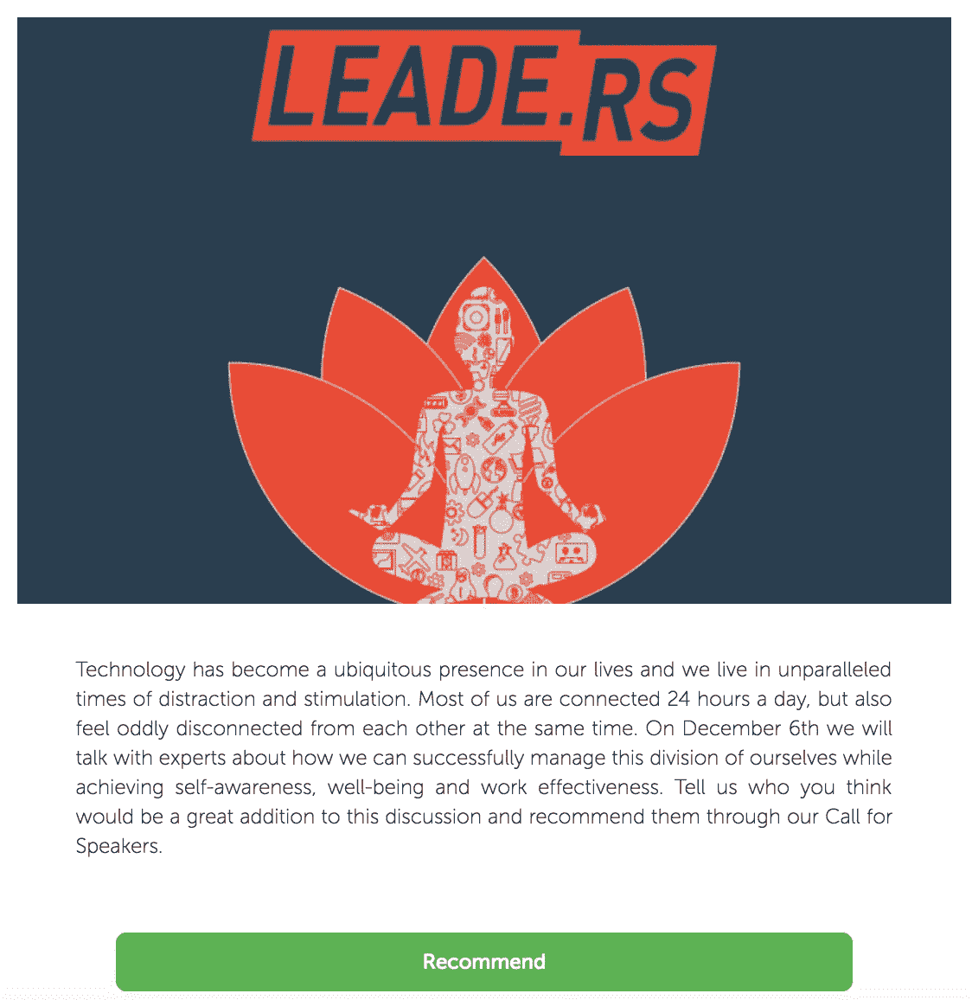
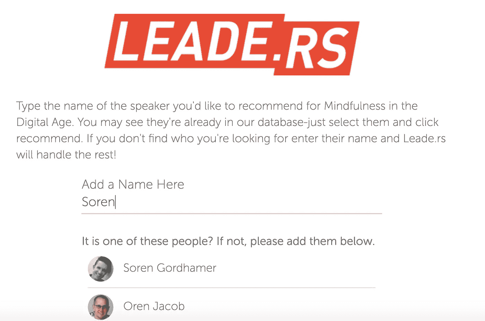
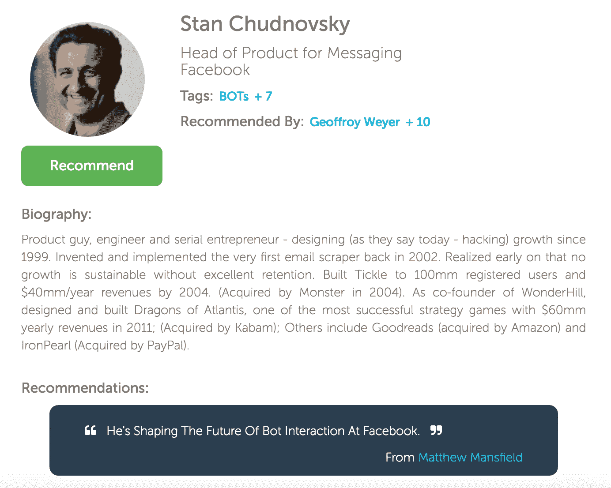
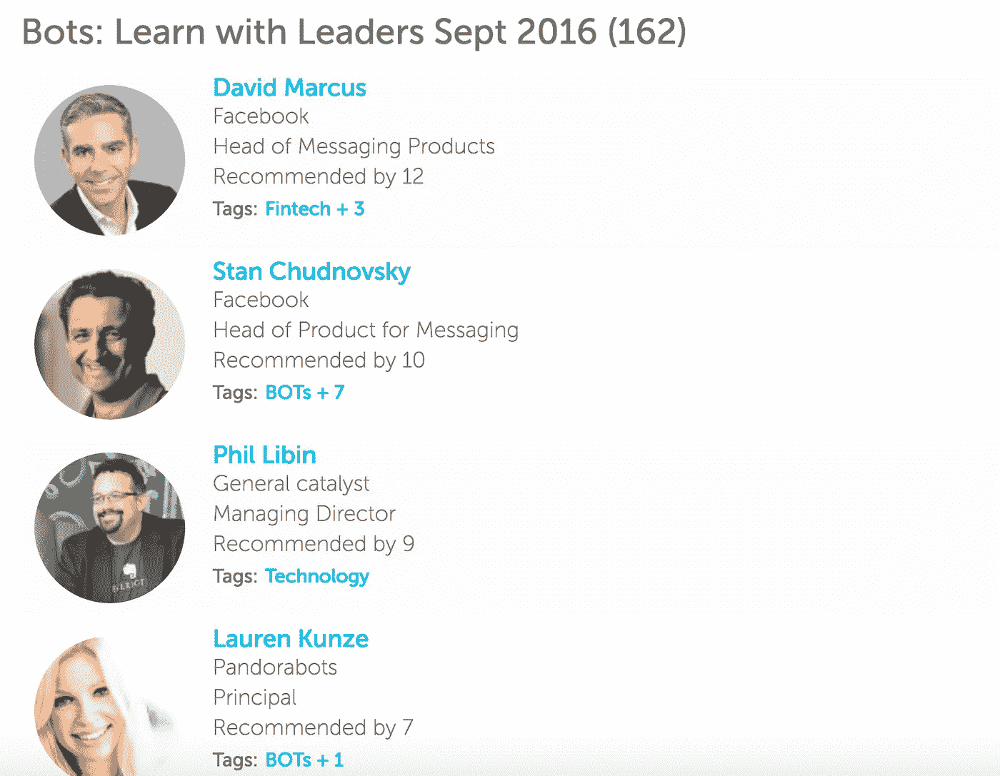

# 征集演讲者——我们的第一款 Leade.rs 产品

> 原文：<https://medium.com/hackernoon/call-for-speakers-our-first-leade-rs-product-d26e506f2492>

如果你组织一个活动，这可能是有趣的。我们在自己的一些领先活动中成功地使用了它，一些活动组织者喜欢它，所以我们将其作为任何活动都可以使用的联合品牌产品。

你的活动需要优秀的演讲者。为什么不问问你的社区和过去的参与者？

这是一种 Kickstarter，一种众包的扬声器。

1.  建立一个由 Leade.rs 支持的联合品牌“号召演讲者”网站

给我们发个 logo 和文字就行了。我们会为你安排的。这里是[我们即将到来的](https://mindfulness.leade.rs/)[正念和冥想](https://www.eventbrite.com/e/mindfulness-in-the-digital-age-tickets-27617409415)活动的样子。

recommend a speaker screen for our Mindfulness event

2.通过电子邮件向你的社区和过去的参与者发送你自己的“号召演讲者”链接，并在社交网络上分享。

他们可以键入任何他们想推荐的演讲者的名字——看到这里，我添加了 Soren Gordhamer。如果我们知道发言者，我们将显示它，否则任何新的名字都可以添加。

3.我们会搜索并整理每一个被推荐的名字。

我们的策展团队将研究每一个名字，并把他们添加到你的推荐发言人数据库中，附上他们的完整简历和有用的链接(LinkedIn 简历、他们的演讲视频等)。).如果有其他用户推荐该演讲者，它会显示在她的个人资料下。

见下文——11 人推荐 Stan Chudnovsky 参加我们的机器人活动。

4.我们将为您(和您的社区)提供一份完整的推荐发言人名单，按推荐人数排序。

查看我们之前的机器人事件的运行情况；我们收到了 160 多条建议。

如果你感兴趣，现在就给我发电子邮件:loic at leade.rs 我很乐意将你加入我们的“扬声器电话”产品测试人员名单。

接下来:
-一个简单的仪表盘，显示所有推荐的演讲者，还有一个工具，帮助你通过 Leade.rs
邀请他们-一个演讲者应用程序，帮助他们管理他们的演讲请求
-一个仪表盘，帮助你管理你的演讲者

如果你想了解我如何建立领导，请订阅我的简讯[http://leade.rs/loicnewsletter](http://leade.rs/loicnewsletter)

> [黑客中午](http://bit.ly/Hackernoon)是黑客如何开始他们的下午。我们是 [@AMI](http://bit.ly/atAMIatAMI) 家庭的一员。我们现在[接受投稿](http://bit.ly/hackernoonsubmission)，并乐意[讨论广告&赞助](mailto:partners@amipublications.com)机会。
> 
> 如果你喜欢这个故事，我们推荐你阅读我们的[最新科技故事](http://bit.ly/hackernoonlatestt)和[趋势科技故事](https://hackernoon.com/trending)。直到下一次，不要把世界的现实想当然！

