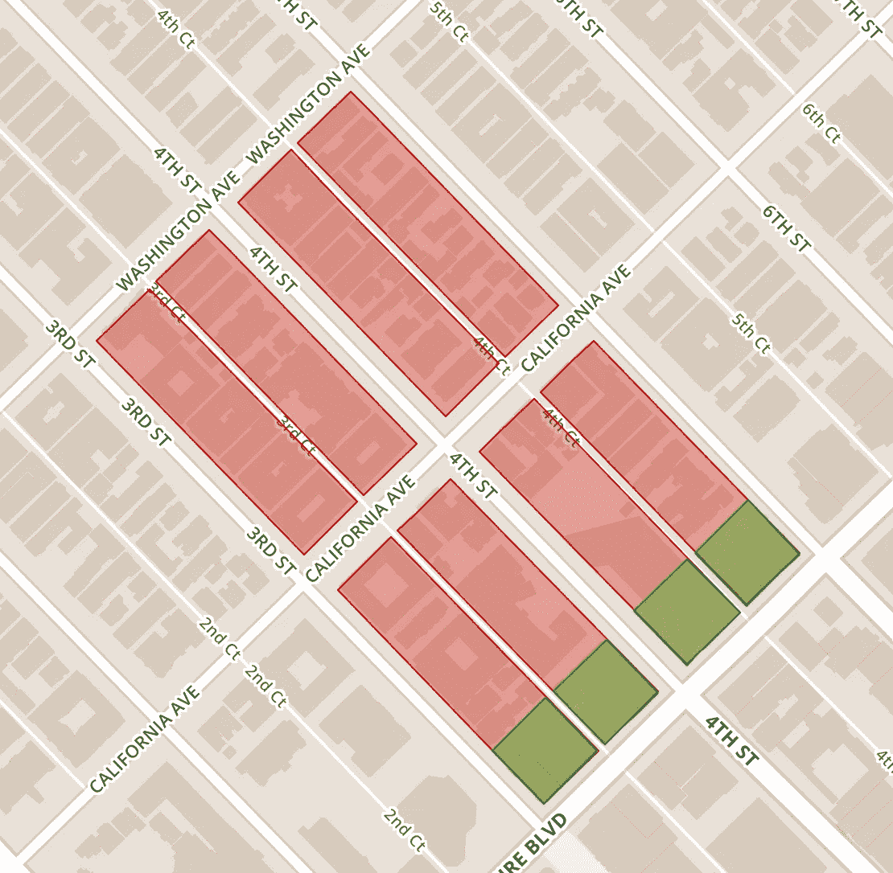

# 从 Elixir 调用 Python:erl port vs Thrift

> 原文：<https://medium.com/hackernoon/calling-python-from-elixir-erlport-vs-thrift-be75073b6536>

学习和使用 Elixir 是我最愉快的[编程](https://hackernoon.com/tagged/programming)经历之一，它有一个很棒的社区和许多很棒的工具。到目前为止，我遇到的唯一问题是社区中的一些图书馆不存在或者还没有完全开发出来。

最近，当我需要处理一些大型 GeoJSON 文件时，我遇到了这个问题，这些文件定义了街区和城市区域的纬度/经度边界。数据用多边形表示，我需要找出哪些街区属于商业区。这需要检测两个多边形之间的交点，这是一个很难解决的问题。



city blocks in red, commercial zones layered on top in green

我在 Elixir 中找不到任何库来帮助我做这件事，但是有一个 Python 库， [Shapely](https://pypi.python.org/pypi/Shapely) ，它正好可以满足我的需要。我找到了两个将它集成到我的项目中的选项，ErlPort 和 Apache Thrift。

为了说明我是如何使用这两个文件的，我将通过一个简单的例子来说明这两个文件，一个定义块，一个定义区域。我假设非商业区域已经被过滤掉了，我们只是试图找到与任何区域相交的区块。这些文件的格式如下:

对于这些例子，我创建了一个新的 mix 项目，PythonCalls。代码和 GeoJSON 文件可从这里获得:[https://github.com/chiragtoor/python_calls](https://github.com/chiragtoor/python_calls)

## 使用 ErlPort

首先，我们可以使用 [Poison](https://github.com/devinus/poison) 提取块和区域信息，记住我们的示例文件非常小，因此我们可以将它们完全读入内存:

使用这些私有辅助函数，我们可以通过模式匹配获得区块和区域的经纬度坐标:

现在我们需要一些 Python 代码，这些代码将接受这些坐标，并使用 Shapely 的多边形来检测交叉点:

通过 ErlPort 连接这两部分非常简单，我们需要将它添加到我们的 deps 中:

```
 {:erlport, git: “https://github.com/hdima/erlport.git"}
```

现在只需启动一个 Python 实例，并使用它来调用我们的 Python 函数，因为我们的块和区域仅由列表和浮点组成，我们传递给 Python 的数据被 ErlPort 自动转换为 Python 的等效数据:

有了这个，我们的 Elixir 和 Python 片段就连接起来了，我们可以很容易地使用 Shapely 来区分哪些区块进入了商业区。

## 使用 Apache Thrift

多亏了 Pinterest 的 Riffed 库，使用 Thrift 变得非常容易。这里我将展示一个快速设置，更多关于节俭的细节请参考[项目网页](https://thrift.apache.org/)。

通过 Thrift，我们将在 Python 中建立一个单独的服务，该服务将通过一个 Elixir 客户端调用。Riffed Github repo 中的[入门指南](https://github.com/pinterest/riffed/blob/master/doc/GettingStarted.md)涵盖了如何很好地设置 Riffed，所以假设已经完成，我们需要定义一个 Thrift 接口文件。这定义了我们将构建的服务和将使用的数据结构:

我们需要能够以某种方式表达我们的块和区域，所以我们对每一对经纬度坐标都有一个点结构，对块/区域的所有点都有一个边界结构。该服务只需要一个函数，它将接受一个块和区域，并告诉我们它们是否相交。我们需要运行 Thrift，以便在这个接口之上构建我们的 Python 服务。

```
thrift -gen py -out python/ ./thrift/geoservice.thrift
```

这需要我们定义的接口，并将几个文件输出到 mix 项目根目录下的一个名为“python”的目录中。我们将使用这些生成的文件来实现我们的服务:

现在，我们需要使用 Riffed 为我们的 Python 服务设置一个 Elixir 客户端，这也将为我们提供在 Thrift 文件中指定的数据结构的 Elixir 结构:

运行我们的 Python 服务后，我们可以使用与之前相同的设置，并通过我们的客户端进行调用:

我们正在使用 GeoJSON 数据为每个块和区域创建边界结构，这些数据将在我们的服务调用期间由生成的 Thrift 代码接收并在 Elixir 和 Python 数据结构之间转换。

## 比较这两种方法

建立这两种方法都不太难，但是我以前用过 Thrift，所以对它的概念和用法很熟悉。使用 Thrift 方法，可以清楚地定义 Elixir 和 Python 之间的接口，但是 ErlPort 方法使用的代码要少得多(特别是当您计算 Thrift 生成的文件时)。对于这种简单的情况，我会选择 ErlPort，节俭有点过头了。

然而，在某些情况下，我会选择节俭的方法:

1.  使用 ErlPort 传递复杂的定制数据结构似乎并不简单，您必须定义自己的编码和解码，而使用 Thrift，接口中定义的数据结构会在语言之间自动处理。
2.  ErlPort Python 实例不能同时处理多个调用，并且它们使用 OS 进程，因此您需要非常小心地生成多个实例。通过 Thrift，您可以将服务转移到另一台机器上，甚至可以设置线程服务器类型来处理多个请求，这是一个现成的选项。
3.  根据你想连接的语言，Thrift 有许多选择，而 ErlPort 只有 Python 或 Ruby。

因此，对于像 GeoJSON 这样的简单方法，我会选择 ErlPort，但对于任何复杂的方法，我认为节俭会更好。

项目回购实例:【https://github.com/chiragtoor/python_calls 

[](http://bit.ly/HackernoonFB)[](https://goo.gl/k7XYbx)[](https://goo.gl/4ofytp)

> [黑客中午](http://bit.ly/Hackernoon)是黑客如何开始他们的下午。我们是 [@AMI](http://bit.ly/atAMIatAMI) 家庭的一员。我们现在[接受投稿](http://bit.ly/hackernoonsubmission)并乐意[讨论广告&赞助](mailto:partners@amipublications.com)机会。
> 
> 如果你喜欢这个故事，我们推荐你阅读我们的[最新科技故事](http://bit.ly/hackernoonlatestt)和[趋势科技故事](https://hackernoon.com/trending)。直到下一次，不要把世界的现实想当然！

