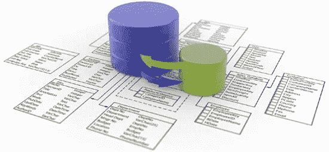

# 用 PostgreSQL 和 Knex.js 进行" camelCase" < = > "snake_case "转换

> 原文：<https://medium.com/hackernoon/camelcase-snake-case-conversion-with-postgresql-and-knex-js-956357872fe4>



如果您正在构建一个 [GraphQL 数据 API](https://github.com/kriasoft/nodejs-api-starter) ，您很可能希望按照 [GraphQL 规范](http://facebook.github.io/graphql/)的建议，为 GraphQL 模式中的所有字段使用**小写字母**名称。但是，很可能您的数据库使用了不同的约定。例如，在使用 PostgreSQL 的情况下，要使用的实际命名约定是 **snake_case** (请在下面的评论中询问原因)。让我们来看看这个问题的几个解决方案。

# 解决方案 1

你可以为 [Node.js](https://hackernoon.com/tagged/node-js) 使用 ORM 工具，比如 Sequelize、Bookshelf、Objection.js 或其他。它们中的大多数都能够将字段名转换成另一种格式。但是，那个解决方案听起来很无聊，我们就跳过它吧:)

# 解决方案 2

将 *snake_case* 字段转换为类型的`resolve()`方法中 GraphQL 级别的 *camelCase* 。这里有一个例子:

这种方法相当罗嗦，但至少没有“魔法”，一切看起来清晰明了。不利的一面是，您最终将在数据访问代码中混合使用大小写。

# 解决方案 3

让我们看看如何使用 [Knex.js](http://knexjs.org/) 自动处理这种转换，Knex.js 是 Node.js 非常流行的通用数据库客户端。

通常，您将从创建导出 Knex 客户机的单例实例的`db.js`文件开始:

[https://gist.github.com/koistya/10a09698e823a66e48463d4016b47850](https://gist.github.com/koistya/10a09698e823a66e48463d4016b47850)

因此，您可以在您的数据模型中使用它，就像这样(`models/User.js`):

[https://gist.github.com/koistya/dd53966e233a8199f91ad3e185130bdd](https://gist.github.com/koistya/dd53966e233a8199f91ad3e185130bdd)

执行`User.find()`方法将生成以下 SQL 查询:

```
SELECT "id", "email", "is_admin" FROM "users"
```

…并且，将解析为一个包含一组 snake_case 字段的对象数组(哎哟！).这很容易通过调整数据模型类中的字段(列)名称列表来解决(参见第 3 行):

[https://gist.github.com/koistya/72bb734a0ad617f692b259d72d8ad011](https://gist.github.com/koistya/72bb734a0ad617f692b259d72d8ad011)

现在由`.find()`方法生成的 SQL 查询将变成:

```
SELECT "id", "email", "is_admin" as "isAdmin" FROM "users"
```

执行该方法将返回一个形状完美的 JavaScript 对象数组。更有趣的是，如何确保可以使用带有`.where()`和`.update()`输入的 camelCase 属性？幸运的是，通过重写 Knex 的`wrapdIdentifier(value)`和`wrapsAsIdentifier(value)`方法也应该很容易调整:

[https://gist.github.com/koistya/28c9da83c0eeeb5be5795d583459c162](https://gist.github.com/koistya/28c9da83c0eeeb5be5795d583459c162)

就是这样！现在可以做`User.find({ isAdmin: true })`、`User.update({ firstName: 'Bill' }).where({ id: 123 })`等事情了。

**顺便说一下**，如果你想玩 GraphQL、PostgreSQL 和 Knex，最简单的开始方式是安装 [Docker](https://www.docker.com/) ，最新版本的 [Yarn](https://yarnpkg.com/) ，然后运行`**yarn create data-api**`——这将创建初始项目结构，包括所有的核心构建模块和开发工具。编码快乐！

[](http://bit.ly/HackernoonFB)[](https://goo.gl/k7XYbx)[](https://goo.gl/4ofytp)

> [黑客中午](http://bit.ly/Hackernoon)是黑客们下午的开始。我们是这个家庭的一员。我们现在[接受投稿](http://bit.ly/hackernoonsubmission)并乐意[讨论广告&赞助](mailto:partners@amipublications.com)机会。
> 
> 如果你喜欢这个故事，我们推荐你阅读我们的[最新科技故事](http://bit.ly/hackernoonlatestt)和[趋势科技故事](https://hackernoon.com/trending)。直到下一次，不要把世界的现实想当然！

