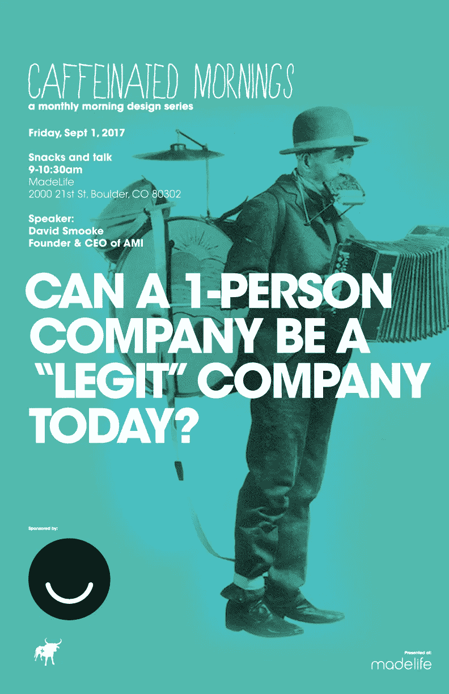

# 如今，一个人的公司能成为“合法的”媒体公司吗？

> 原文：<https://medium.com/hackernoon/can-a-1-person-company-be-a-legit-media-company-today-bd3272c5a92d>

## 含咖啡因的早晨展示:

## 博尔德 2017 年 9 月 1 日。在此注册。

嗨，我将于本周五(9/1)上午 9 点在博尔德的 [MadeLife 咖啡馆](https://madelife.com/)介绍[阿美族起源的故事](https://hackernoon.com/the-ami-origin-story-f386ef84c79c)，随后是炉边聊天和观众提问

[这个演讲](http://caffeinatedmornings.com/event/david_smooke/)是[杰伊·费拉凯恩](http://angrybovine.com/)为创意专业人士准备的每月系列[含咖啡因的早晨](http://caffeinatedmornings.com/)的一部分。这项免费活动由 [Ello](https://ello.co/) 赞助。

我将分享创造了 [14，000+撰稿人](http://www.prweb.com/releases/13000/contributor-network/prweb14365902.htm)、 [400，000+订户](http://www.prweb.com/releases/365000/subscribers/prweb14373494.htm)和 [10，000，000+月阅读分钟数](https://hackernoon.com/10-000-000-monthly-minutes-reading-ami-sites-e75185793aa6)的里程碑、技术和日常生活，以及建立[一家由一名全职员工组成的自举媒体公司](http://amipublications.com)所带来的错误、困难和挑战。

希望在那里遇见你:-)

 [## 即将举行的活动" "大卫·斯穆克

### 编辑描述

caffeinatedmornings.com](http://caffeinatedmornings.com/event/david_smooke/)