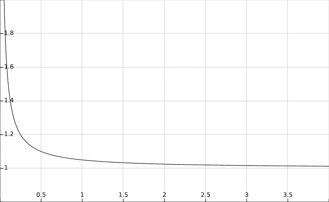
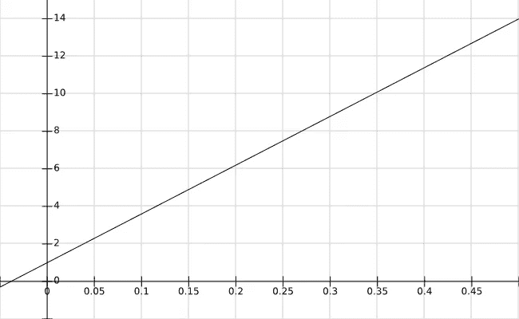
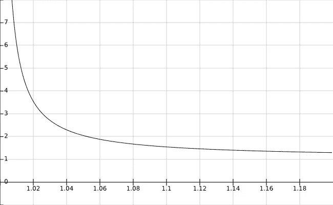

# 区块链能比其市值更安全吗？

> 原文：<https://medium.com/hackernoon/can-a-blockchain-be-more-secure-than-its-market-cap-289222e53ef3>

## 股份存款如何影响采矿利润

# 股份存款的成本和风险

在区块链的股权证明中，利益相关者通常需要缴纳一笔股权保证金才能成为矿工，也称为验证者(只需要暂时拥有硬币来创建区块的系统容易受到无风险攻击，这里不考虑)。他们必须在协议规定的一定时间内锁定资金。因此，保证金涉及到许多必须由验证者承担的成本和风险:

*   *资金锁定(流动性)成本:*在锁定期内，验证人不能以其他方式使用或投资其股份。
*   *稀释:*如果加密货币是通货膨胀的，随着系统发行新的硬币，存款受到稀释。
*   *汇率下跌:*存款锁定时可能贬值。
*   *计算工作、存储和带宽*:验证者必须拥有适当的硬件来运行网络节点，并且需要支付电费和互联网连接费用，即使不需要像工作证明中那样执行繁重的计算。
*   *押金丢失或系统处罚:*系统故障和针对验证者节点的 DDoS 攻击可能会导致处罚，或者在最坏的情况下导致押金全部丢失。

# 硬币排放及其对矿业盈利能力的影响

为了激励采矿，开采区块的回报必须补偿采矿者承担的所有成本和风险，并最终提供预期的净收益。利润越高，越多的股份将被用于采矿(边际成本=边际收入)，激起验证者之间的竞争。这是可取的，因为它使 51%的攻击成本更高。**为了获得最大的安全性，最大化采矿的整体盈利能力至关重要。**

在现有的区块链中，奖励要么来自交易费，要么来自新铸造的硬币。现在让我们集中讨论后者。随着新硬币的发行，货币的价值不断被稀释，因为市场资本分散到越来越多的货币单位。在下文中，我们将分析这如何影响矿工的股份存款。

## 本地加密货币的股份存款

想象一个区块链，其应用 5%的年硬币发行率，即，支付总货币供应量的 5%作为新铸造的硬币给验证机，与它们在系统本地的加密货币中的存款成比例。此外，让我们假设货币的市值在一整年内保持不变。由于货币单位的价值是由市场资本总额(以美元或另一种法定货币表示)除以流通中的硬币数量给出的，所以每个持有所有硬币但没有成为验证者的所有者到年底将得到其原始投资的 95.24% (= 1/1.05*100)。请注意，4.76%的价值损失是通货膨胀的结果，并不取决于有效验证者的数量或用于采矿的股份总数。另一方面，验证者存款的实际价值将在很大程度上取决于这些因素。例如，如果 10%的股份参与采矿，验证人将从其股份存款中获得 50% (= 0.05/0.1)的名义利息。然而，如果我们看看他的投资在年底的实际价值，增长只有 42.29% (= 1.5/1.05*100)，因为矿工和任何其他利益相关者一样受到通货膨胀的影响。

如果 *f* 是正在积极开采的股份比例， *p* 是硬币发行率，那么一年后(假设市值稳定)验证者总余额的真实值可以用 b(f，p)= (1+p/f)/(1+p)来表示。

对于 p=0.05，平衡函数b(f，0.05)的曲线图看起来是这样的(f 在 x 轴上):

我们清楚地看到，随着积极采矿股份的比例接近 100%，余额下降到 1，即实际投资回报下降到 0。原因在于，在市值稳定的情况下，所有回报必须来自与采矿无关的日益减少的股份。

为了计算为了获得一定的实际回报而可以存放的股份的总分数，我们需要做的就是为 f 解方程 b(f，p)，因此 f = p/(b*p+b-1)。如果验证者愿意存放股份，只要他们的实际回报率至少为 4% (b = 1.04)，f 将等于 0.543，也就是说，在我们的例子中，54.3%的股份将用于采矿。

因此，货币的市值将为系统能够有效支付给其验证者的价值设定上限。不管名义上的硬币排放计划如何，这个限制都存在，这意味着具有高期望的潜在矿工将被小的利润率所阻止。除此之外，最高存款额受到货币供应总量的限制。显然，总的股份存款不能超过可用的股份数量！因此，在任何情况下，拥有相当于该货币市值一半的资金的对手都可以获得压倒多数的权力。实际上，他需要的资本要少得多，因为所有硬币中只有一小部分会一直用于采矿。因此，在个人选择模型中，股权系统对 51%攻击者的财务安全性证明(即，我们排除共谋和贿赂)将基本上是其市场价值和积极开采股权比例的函数。

我们能做得更好吗？

## 外国加密货币的股份存款

如果我们要求验证者用其他加密货币而不是系统的本地货币来存放他们的股份会怎么样？如果外国加密货币基于允许有意义的智能合约的平台，则可以创建一个锁定存款金额的合约，并在接收到由本地系统签署的解锁交易时释放它们。后者将在最小锁定期后发布解锁交易，前提是矿工按照本地加密货币的规则行事。

通过使用外汇存款，我们可以首先取消存款金额的理论限制。存款总额现在可以超过本币的市值。但是，通货膨胀的硬币发行计划导致的股份存款贬值怎么办？

一年后验证器的最终余额的真实值现在由公式 b(f，p)= 1+p/f 给出，其中 f 是总存款的市场价值(以外国加密货币计)和本地加密货币的资本化之间的分数。

平衡函数仍然依赖于积极开采的部分，并且渐近地接近于 1。但与本地加密货币的股权存款相反，即使总债券股权超过该货币的市值，也会有正收益。

我们可以再次求解 f = p/(b-1)的平衡方程，计算出 b=1.04(最小期末余额)，p=0.05(硬币发行率)，这样我们得到 f=1.25。换句话说，125%的股份将用于采矿，这是我们在之前的例子(54.3%)中使用本地加密货币作为保证金的两倍多。**正如我们所看到的，当股份存款以外国加密货币进行时，安全存款的价值可能会超过本地加密货币的市值**。**在这种情况下，获得多数控制权的成本不会超过加密货币总价值的 51%。**

## 外汇股份存款的优势

为了说明外汇股份存款相对于本地加密货币存款的安全优势，我们可以计算 f_foreign(p，b)/f_native(p，b) = (b*p+b-1)/(b-1)并分别绘制变量 p 和 b 的函数。

对于 b = 1.04 和 x 轴上的 p，我们得到以下曲线:

我们看到，外汇股权存款相对于本币存款的优势随着硬币发行率的增加而增加(因为本币存款的稀释变得更高)。

另一方面，我们可以将 p 固定在 0.05，并在 x 轴上绘制在锁定期结束时的预期余额的函数:

该图告诉我们，随着预期实际回报降低，外汇股权存款的优势越来越大。

那么，外汇股份存款总是比本币存款更受欢迎吗？

不会。如果外国加密货币本身具有通货膨胀性，则股份存款将受到稀释，这取决于外国加密货币的发行方案，前提是它们不用于铸造外汇加密货币。在这种情况下，利益相关者必须将其纳入他们的回报预期。幸运的是，这一问题可以通过押注非通胀加密货币或与法定货币挂钩的稳定货币来缓解。此外，如果存放的加密货币是通过工作证明挖掘出来的，除了通过执行计算工作之外，没有内在的可能性来说明通货膨胀。因此，无论如何都无法开采(盈利)的该货币的利益相关者将通过成为本地加密货币的验证者而变得更好。

使用外国加密货币进行股权存款还有另外两个值得注意的后果，我们尚未确定:

1.  一些人认为，为了证明利害关系，存款的实际价值也受到威胁，这阻止了验证者对网络造成损害，因为这将使他们的赌注资金贬值。例如，这应该可以防止攻击者试图贿赂涉众进行恶意活动。随着外国加密货币的股份存款，这种保护不再适用。然而，即使本国货币被用于赌注，少数利益相关者的行为是否会对汇率产生关键影响仍不清楚。如果大多数或更多的利益相关者必须同意对价格产生负面影响，那么每个个体行为者仍然有贡献的个人动机(即接受贿赂)，而不管该群体的行为作为一个整体可能产生的后果，从而导致公地悲剧。
2.  另一方面，如果企图攻击或其声明对本地加密货币的价格施加了下行压力，攻击者购买多数控制权所需的股份数量会变得更便宜。外国加密货币的股份存款却不是这样，其价值不受攻击的影响。不过需要注意的是，奖励仍然是以被攻击系统的本地加密货币支付的，因此它们的实际价值实际上会受到影响。从短期来看，这应该不会有太大的影响，因为由于锁定期，利益相关者不能同时提取他们的存款。如果威胁持续更长时间，总存款量将逐渐减少，并再次接近 MR=MC。

## 结论

通过押注外国加密货币，我们可以消除由于本币的通胀排放计划而产生的*稀释成本*，前提是押注的货币本身不具有通胀性。如果稳定的货币用于债券，我们还可以减轻*汇率风险*。

你可能会问，我们是否可以做得更好，并消除资本锁定(流动性)成本。这将在本系列的第 2 部分中讨论。敬请期待！