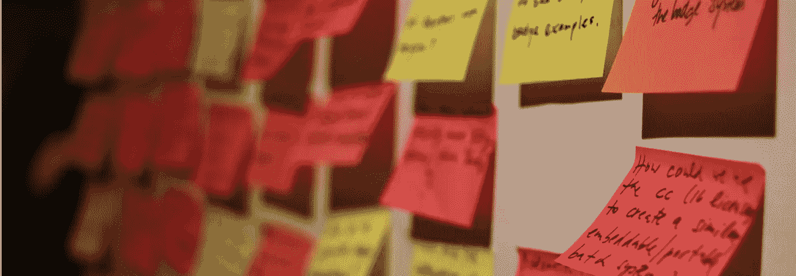
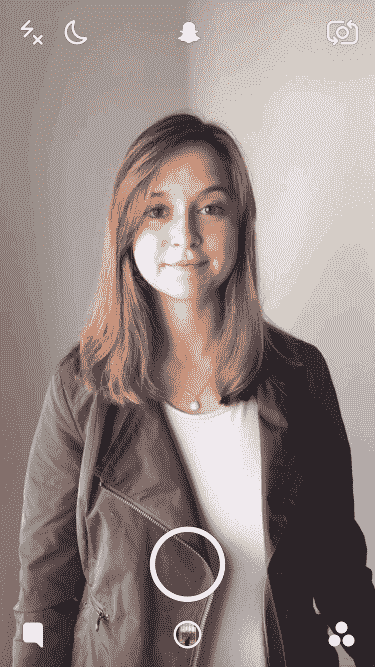
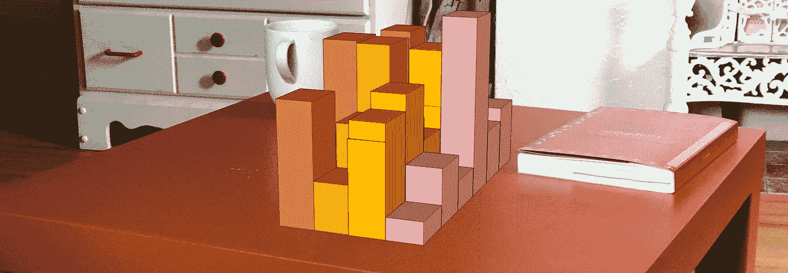
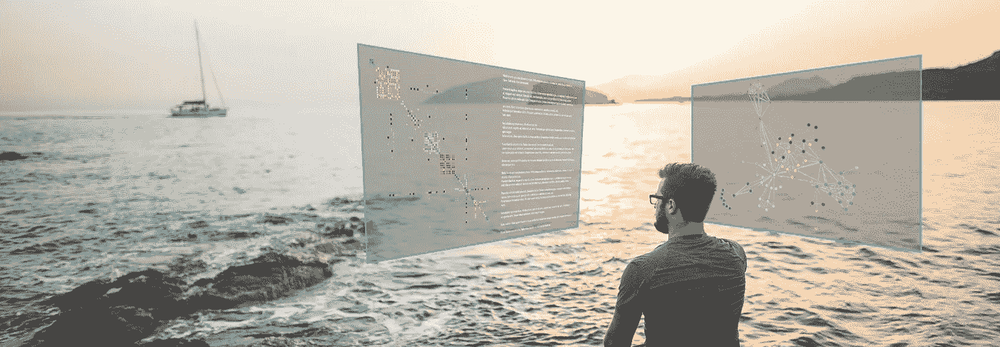
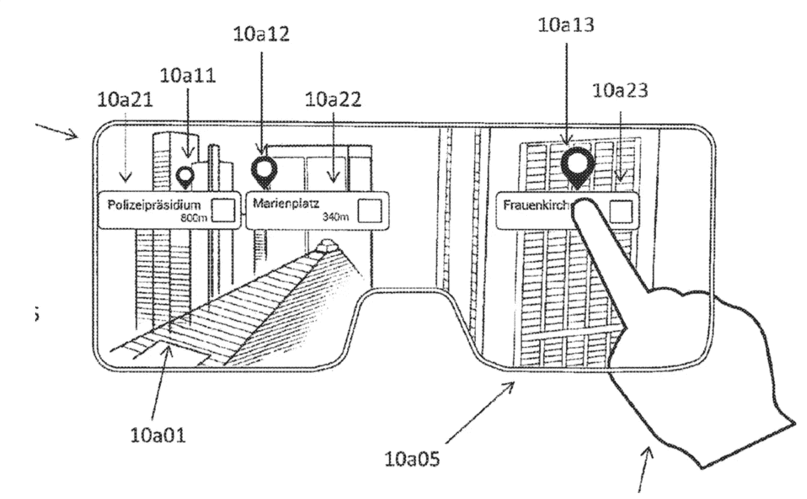
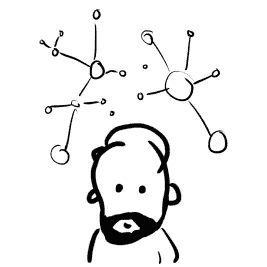

# 增强现实能否解决移动可视化？

> 原文：<https://medium.com/hackernoon/can-augmented-reality-solve-mobile-visualization-f06c008f8f84>

(这是第一部分。在这里阅读 [*关于创建无声增强现实的第 2 部分。*](https://hackernoon.com/silent-augmented-reality-f0f7614cab32)

**

*Photo by [Samuel Huron](https://flic.kr/p/8QRZrk)*

*自从第一代 iPhone 问世以来，移动设备上的数据可视化似乎很有前途:非常强大的便携式计算机！创新的触摸交互！高度本地化的内容！存在数百种移动设备的可视化，既有应用程序，也有日常新闻内容的一部分。但是有一个主要问题是移动可视化无法解决的:*

> *空间总是不够。*

*为了便于携带，移动显示器必须很小，而且还有手指挡路。通常对于数据可视化，更多的屏幕空间意味着更好的分析:数据可以以更高的分辨率显示，揭示更小的关系和部分数据。还可以并排显示多个图表，并具有协调的视图，快速地从一个镜头到另一个镜头来回切换数据。*

*这就是把你的图表贴在便利贴上或贴在两张并排的海报上的区别。*

*我认为增强现实(AR)可以解决这个问题。*

**

*[Snapchat Lenses](https://support.snapchat.com/en-US/a/lenses1)*

*在过去三十多年里，AR 主要是一个研究方向，但现在正慢慢进入技术主流。AR 用虚拟信息覆盖现实，虚拟信息似乎是环境的一部分(取决于你的公司隶属关系，这种原理也可以称为混合现实)。想想看:带有面部追踪功能的 Snapchat 镜头，微软的 HoloLens 让你可以在沙发桌上玩《我的世界》，或者苹果最近的 ARKit。*

*当 AR 最初被提出时，耳机通常体积庞大，分辨率低，刷新率低。头部运动和屏幕内容之间的碰撞使你很难保持现实世界中真实虚拟元素的幻觉，甚至可能导致网络疾病。*

*智能手机的生产和[技术的改进](https://hackernoon.com/tagged/technology)导致更好的组件价格更低，这两者都彻底改变了虚拟现实(参见 Oculus)和增强现实——因为它们都建立在类似的技术上(小型、高分辨率便携式显示器、头部跟踪等)。*

*因此，虽然我们目前的 AR 主要基于窥视孔隐喻(你正在通过手机查看面部过滤器或神奇宝贝)，但[未来](https://hackernoon.com/tagged/future)AR——我们对本文感兴趣的一种——应该只与耳机一起工作——希望是非侵入性的眼镜——让你的手可以自由地与(增强)现实进行交互。*

*那么，这种未来的 AR 如何解决移动可视化屏幕空间的缺乏呢？*

*通过增强你的现实，AR 同时将屏幕放在任何地方和任何地方。屏幕变成了完全虚拟的——拥有所有的优势。屏幕空间的不足不再存在，因为这些虚拟屏幕可能会占据你的整个视野(甚至更远)。*

*此外，就像其他移动设备一样，AR 设备知道你在世界的什么地方(多亏了地理定位),但更重要的是:你当前正在看什么和在哪里！将其与自动物体识别结合起来，datavis 就有了各种各样引人入胜的应用。*

*更具体地说，我可以看到这些未来增强现实可视化的三个有前途的方向:*

# *情境个人视觉化*

*移动可视化的承诺之一就是创造个性化的数据体验。各种应用程序利用你的位置，例如，在你当前位置的地图上居中(谷歌地图)，显示你周围的餐馆(Yelp)或跟踪你的跑步路线(Runkeeper)。*

*AR 可视化有可能变得更加个性化:了解你的偏好和目标，它可以在正确的时间显示正确的数据。但更有趣的是，每样东西都可以*放在*正确的位置:*

**

*Photo by [Osman Rana](https://unsplash.com/@osmanrana) ([Unsplash](https://unsplash.com/photos/HOtPD7Z_74s)), augmented by the author*

*增强现实可视化成为你环境的一部分，给现实世界的物体(和[人](https://creators.vice.com/en_us/article/78epxb/artist-kickstarts-augmented-reality-video-series))增加相关信息，放在合适的位置。可视化不再是显示在发光小盒子中的图像，而是世界的增强纹理。*

*想象一下，你试图在暴风雪中穿越波士顿。你的应用程序确切地知道你想去哪里，并能从互联网的相关信息中提取信息。它还知道你现在正在看着一辆公交车，并帮助你做决定:我应该上车还是坐优步？我必须快点吗？我必须在哪里转车？需要多长时间？这场雪会结束吗？*

*所有这些信息都在您需要的地方，并且完全保密，没有人能看到您看到的内容。这是个人形象化的终极表现。*

*如果我们做得对，我喜欢将这种发展视为一种赋权形式(如果我们做得不对:参见[的](http://km.cx/)[作品](https://vimeo.com/166807261)或各种反乌托邦科幻小说)。*

*同样，AR vis 可以显示与你相关的数据，但可能不是与所有人相关。*

**

*Photo by [Flako](https://flic.kr/p/9Mcxq), augmented by the author*

*你可能在超市的过道里徘徊，被大量的信息轰炸。近年来的包装设计并不一定朝着让营养信息更容易获取的方向发展。我珍惜我花在盯着小字标签上的时间，这是行业和管理部门几个月激烈讨论的结果。*

*虽然有免费的[营养信息数据库](https://ndb.nal.usda.gov/ndb/)，但在搜索框中键入产品名称，选择正确的，检查信息，并为货架上每个闪亮的盒子重复这些听起来……毫无吸引力。*

*如果机器可以帮助你做到这一点，在谈到营养(以及饮食限制)时接受你自己的偏好，并显示一个简单的热图，为你指出正确的产品，会怎么样？一旦过滤完成，你仍然可以仔细检查最终候选人，做出你自己的、更加明智的决定。每个人都有自己的自定义热图，因为在虚拟世界中有足够的空间来放置它。*

*所有这些项目的共同点是，它们主要是数据访问的接口。这些信息通常在互联网上的某个地方，但只能通过文本搜索或模糊的 API 调用来访问。AR 基于摄像头的物体识别的美妙之处在于，整个世界都成为了这些数据的接口:只要看着某样东西就能接收到更多的信息。*

*可以说，就像我们自古以来访问信息的方式一样。*

# *3D 可视化*

*你没听错，我也跨越了这条线:我认为 3D 可视化可能会更有用，甚至随着增强现实成为主流。*

*由于大量糟糕的 3D Excel 图表和明目张胆的营销欺骗，3D 可视化在 datavis 社区中被回避。但是，如果你看看它们背后的感知科学，它们可能实际上并不那么可怕(见[罗伯特·科萨拉在他的博客](https://eagereyes.org/blog/2016/3d-bar-charts-considered-not-that-harmful)上的伟大讨论)。当然，它们会受到遮挡和视角扭曲的影响，但是额外的空间维度可能会弥补这一点。尤其是当我们将它们与现实世界中 AR 最重要的特征——情境性相结合时。*

*想象一下，你面前的咖啡桌上有一个可怕的 3D 条形图。有遮挡(前栏遮挡后栏)和扭曲(后栏看起来相对较小)。*

**

*A 3D visualization of me dragging boxes in SketchUp*

*但在 AR 中，3D vis 的主要问题——它的虚拟性——不那么明显。抽象的条形成为你的环境的一部分——很明显，后面的条形看起来比它们实际上要小(将它们与旁边的实体书进行比较)。类似地，通过在桌子周围移动可以很容易地解决遮挡问题，就像在现实世界中一样。额外的立体声提示(在 2D 的照片中很难显示)使虚拟酒吧看起来比实际更真实。*

*这遵循了[具身认知](https://en.wikipedia.org/wiki/Embodied_cognition)的理念，该理论假设我们的认知与我们的身体存在的联系比表面上看起来要紧密得多。有了 AR，你仍然可以利用自己的身体来探索作为环境一部分的数据。这与虚拟现实形成对比，在虚拟现实中，你完全与你的环境和身体隔绝——这可能会非常令人迷惑。*

*零星的研究表明，AR 3D vis 是一个有前途的方向([韦尔和米切尔在 2005 年创造了一个高效的 3D 节点图](http://dl.acm.org/citation.cfm?id=1080411)，还有一个关于[沉浸式分析的系列研讨会](http://immersiveanalytics.net/))，但我认为 AR 工具包的扩散将在不久的将来带来更多的结果。*

*是的，将会有一种趋势，将第一个 AR 应用程序塞满华丽的 3D 东西。就像第一批新 3D 电影坚持总是向观众扔虚拟物体一样。但这最终会平息，并使 3D 成为数据可视化工具包中的一种可行方法。*

# *到处都是浮动屏幕*

*最后，AR 解决了移动 Vis 空间永远不够的困境，只需让您根据需要创建任意大小和形状的显示器。在你周围自由浮动，仍然是 2D，但是你需要多大就有多大。*

**

*Just some light network analysis for the holidays. Photo by [Aidan Meyer](https://unsplash.com/photos/IjBeth_piMY?utm_source=unsplash&utm_medium=referral&utm_content=creditCopyText), augmented by the author.*

*由于全 AR 设备的物理屏幕就在你的鼻子上，它们可以在你的环境中创建无限数量的任意大小的虚拟屏幕。头部跟踪可以让你在它们之间切换，就像你在物理屏幕上一样:只需转动你的头。*

*当谈到分辨率时，这些虚拟屏幕很有趣——因为它们只是模拟，所以它们的分辨率可以根据您的需要进行精细调整。AR 耳机的物理分辨率总是保持不变，但当虚拟屏幕只有一部分可见时(因为你站在一个虚拟屏幕附近)，完整的物理分辨率会映射到虚拟屏幕的这一部分。这种方法很有效，因为我们的眼睛无法看到无限清晰的东西。我们通常在我们的环境周围移动，靠近以进行深入检查。虚拟屏幕也是如此——虽然从远处看，它们的分辨率可能相对较低，但你可以移动到你喜欢的距离，以查看无限精细的细节。*

*在这个方向上有一些想法——Isenberg 等人描述了“[混合图像可视化](https://petra.isenberg.cc/publications/papers/Isenberg_2013_HIV.pdf)”，在不同的观看距离显示不同类型的可视化。同样，静态的[胖字体](http://fatfonts.org/)通过符号和亮度对多层值进行编码，针对不同的观看距离呈现不同的面貌。当然，高度详细的基于纸张的可视化本质上允许在概览或详细级别访问数据。*

*这些虚拟 2D 屏幕也是一项伟大的过渡技术，直到所有的遗留应用程序都被映射到 AR 环境(如果曾经发生过的话)。你可以把它们想象成虚拟显示器，和普通的物理显示器一样，只是即时、免费和 100%环保。*

*另一个优势是，尤其是在公共场合可视化敏感数据时——无论是个人数据还是商业数据——它们对其他所有人都是完全不可见的。在 AR 中不存在“[肩膀冲浪](https://en.wikipedia.org/wiki/Shoulder_surfing_(computer_security))的问题，所以没有人能看到你的虚拟屏幕上有什么，即使它可能会填满你的整个视野。*

# *闭嘴，拿走我的钱*

*那么，我们还要多久才能开始研究增强现实可视化？*

*ARKit 等工具的发布将使强大的 AR 应用在未来几年变得更加普遍。对苹果来说，另一个好的副作用是，一旦显示技术变得足够成熟(特别薄)，他们可以发布自己的一套 AR 眼镜(他们的专利指向)，他们就已经有了一个充满 AR 兼容应用的应用商店。*

**

*From an Apple patent on AR tech (source: [The Verge](https://www.theverge.com/2017/7/27/16049906/apple-augmented-reality-glasses-patent-application))*

*微软的[全息透镜](http://www.microsoft.com/en-us/hololens)已经上市了，虽然不太便携，也不傻，但是当你戴上它的时候，几乎是不可思议的。谷歌有[白日梦](https://vr.google.com/daydream/)和[探戈](https://developers.google.com/tango/)，这可能是增强现实的一个强大组合。我们将会看到哪一个科技巨头将会第一个把增强现实带入主流。*

*但无论如何:智能手机是一种过渡技术——我们实际上正在朝着一个没有屏幕的世界前进，在这个世界里，一切都是屏幕。在这个世界上，所有你想让数据可视化的屏幕空间都可以立即使用。*

**(这是第 1 部分。在这里阅读* [*第 2 部分关于创建无声增强现实。*](https://hackernoon.com/silent-augmented-reality-f0f7614cab32)(T12)*

**如果你喜欢这篇文章，请❤/👏*还是分享吧！对于更像这样的情况，* [*在中上跟随我*](/@dominikus) *或* [*在推特上跟随我*](https://twitter.com/dominikus) *进行一般性数据播报。***

## *笔记*

*诚然，肩部冲浪*或许*会让某人尴尬地站在你身后，看不清你高分辨率眼镜里面的东西。所有的战利品都是应得的。*

## *关于我*

**

*Me, datavis-ing AF*

**我是 Dr. Dominikus Baur，一位屡获殊荣的 datavis 设计师和开发人员。您可以在我的网站上找到* [*我最引以为豪的项目*](https://do.minik.us/#projects) *以及更多:*[*https://do . minik . us*](https://do.minik.us)*。**

**你有一个迷人的项目要做吗？你想把这些想法变成现实吗？* [*让我知道*](mailto:do@minik.us) *！**