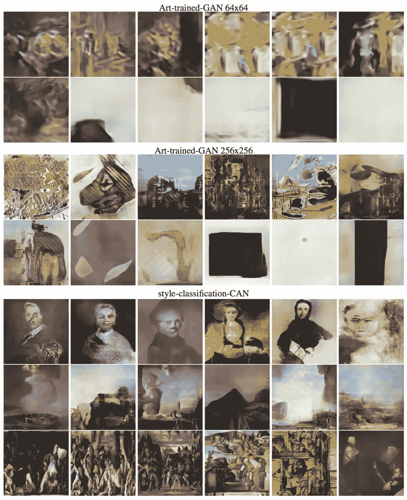
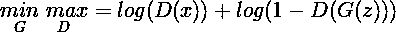
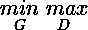
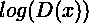
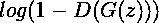
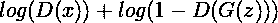
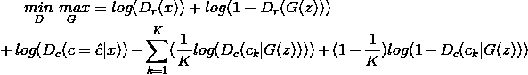
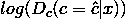
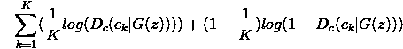

# CAN(创造性对抗网络)-解释

> 原文：<https://medium.com/hackernoon/can-creative-adversarial-network-explained-1e31aea1dfe8>

很显然，GANs(生成敌对网络)在创造有趣的内容方面非常成功，这些内容相当抽象，很难按程序创建。这篇名为 [CAN](https://hackernoon.com/tagged/can) (创造性，而非生成性，对抗性网络)的论文探讨了机器生成*创造性*内容的可能性。

原文可以在[这里](https://arxiv.org/abs/1706.07068)找到

*本文* ***假设熟悉*** *与* ***神经网络*** *，以及它们的本质方面，包括* ***损失函数*** *和* ***卷积。***

Figure 1.0

# 这篇文章的结构

我将尽可能遵循论文的结构。我将添加我自己的比特来帮助更好地理解材料。

# GAN 概述

GAN 的由两个竞争的神经网络组成，即**发生器**和**鉴别器**。顾名思义，生成器负责从一些输入中生成数据(这些输入可以是噪声，甚至是一些其他数据)。然后，鉴别器负责分析该数据，并**鉴别**该数据是真实的(如果它来自我们的数据集)还是虚假的(如果它来自**生成器** ) **。**形式上可以看做是**生成器**和**鉴别器**像一样玩的一个 minimax 游戏所以:

Equation 1.0

# 放松点！

如果上面的等式对你来说太复杂，你并不孤单。我将一步一步地研究这个等式，并解释每个分量的含义。

Equation 1.1

这是 [**极小极大方程式**](https://en.wikipedia.org/wiki/Minimax) **的符号。**G 和 D 下标分别代表**G**generator 和 **D** iscriminator。生成器的工作是 **Mini** mise 等式 1.0 的值，而鉴别器的工作是**Max**mise 它。他们都无休止地相互竞争(直到我们决定停止)。

Equation 1.2

当给定输入 *x* ( *x* 是来自真实数据集的数据)时，鉴别器对它认为是真实的数据的输出。

Equation 1.3

这将计算鉴别器对来自生成器的输入做了什么。 ***D(G(z))*** 表示**鉴别器** **认为**是**真实**的**数据**。do*1-D(G(z))*表示鉴别器认为不真实的数据。 ***G(z)*** 表示生成器生成的数据。

综上所述，鉴别者的工作就是评估

Equation 1.4

尽可能大，而生成器的工作是通过最大化的值使等式 1.4 的值尽可能小

Equation 1.5

更详细的解释可以在[http://wiki . UBC . ca/Course:CPSC 522/Generative _ Adversarial _ Networks](http://wiki.ubc.ca/Course:CPSC522/Generative_Adversarial_Networks)找到

## 直观定义

生成器将尝试修改自己，以使鉴别器将自己的创建作为真实的传递，而鉴别器将修改自己，以便能够继续辨别差异。

# 但这不就是单纯的模仿吗？

是的，它是！请注意，生成器的目的是欺骗鉴别器，使其认为生成的数据尽可能与真实数据相匹配。那么最好的方法是什么呢？使它的输出看起来非常像真实的数据！

如果你想让你的[网络](https://hackernoon.com/tagged/network)有创意，这是一个问题。你的生成器不会学习创建新的内容，但是它会试图让输出看起来像真实的数据。

# 解决方案？创造性对抗网络

作者提出了一种改进的 GAN 来产生创造性内容。他们建议向**发生器**发送**附加信号**以**防止**产生与现有内容过于相似的内容。他们是怎么做到的？他们修改了等式 1.4 中的原始 GAN 损失函数。

## CAN 的直观解释

在最初的 GAN 中，生成器根据鉴别器的输出修改其权重，以确定它生成的内容是否能够欺骗鉴别器。CAN 以两种方式对此进行扩展:

1.  鉴别器不仅会鉴别它认为数据是真是假，而且**另外**还会**和** **对艺术品所属的**时间段****时间段**进行分类。**
2.  **生成器将接收来自鉴别器的关于时间周期的附加信息，并将该度量与来自鉴别器的真实/虚假输入一起使用。**

## **这样做有什么意义？**

**甘最初的问题是他们不愿意探索新的工作。他们的目标就是让他们的数据看起来像来自真实的数据集。**

**通过使用对数据所属时间段进行分类的**附加指标**(以及置信度)，生成器现在可以获得关于其创建与某个时间段有多相似的反馈。**

**现在，生成器不仅要使其数据看起来类似于数据集，还要确保它看起来不会太类似于单个类别。这将允许它防止创建具有非常具体的特征的艺术品。**

**新的损失函数是:**

****

**Equation 2.0**

## **真的很简单！**

**第一行和原始方程完全一样。注意，下标 r 表示鉴别器的真/假输出，下标 c 是鉴别器分类的输出。
第二行是促进创造性的修饰。我会一步步解释。**

****

**Equation 2.1**

**这是正确获取输入图像类别的鉴别器。鉴别器将尝试最大化这个值。我们希望鉴别器能够正确地对图像进行分类。**

****

**Equation 2.2**

**这看起来可能很复杂，但这只是多标签交叉熵损失 T4。注意，这里的 K 表示类的数量。你可以在这里找到关于损失[的详细信息。这与**分类器**用作损失函数的损失相同。发电机将尝试最小化该值，以最大化等式 2.0。](http://christopher5106.github.io/deep/learning/2016/09/16/about-loss-functions-multinomial-logistic-logarithm-cross-entropy-square-errors-euclidian-absolute-frobenius-hinge.html)**

## ***方程式 2.2 的直观解释***

**等式 2.2 的工作方式是，如果其中一个类得分的值接近 1 或 0，则整个等式的值接近-无穷大。当鉴别器完全不确定输入属于哪一类时，即求和中的每一项都具有相同的值时，等式 2.2 可以采用的最大可能值(更大的值是生成器想要的)。**这是有意义的**因为不可能正确地将输入图像分类到现有的类别中，所以这意味着它是它自己的新类别。**

# **结论**

**本文讨论了一个损失函数，该函数推动 GAN 根据所给内容探索新内容。这是通过修改损失函数以允许探索来实现的。**

# **附言**

**这是我的第一个技术职位。欢迎批评和改进建议，并非常感谢。**

**如果你从我的文章中学到了一些有用的东西，请点击❤.与他人分享它让我知道我是有帮助的。**

************

> **[黑客中午](http://bit.ly/Hackernoon)是黑客如何开始他们的下午。我们是 [@AMI](http://bit.ly/atAMIatAMI) 家庭的一员。我们现在[接受投稿](http://bit.ly/hackernoonsubmission)，并乐意[讨论广告&赞助](mailto:partners@amipublications.com)机会。**
> 
> **如果你喜欢这个故事，我们推荐你阅读我们的[最新科技故事](http://bit.ly/hackernoonlatestt)和[趋势科技故事](https://hackernoon.com/trending)。直到下一次，不要把世界的现实想当然！**

****