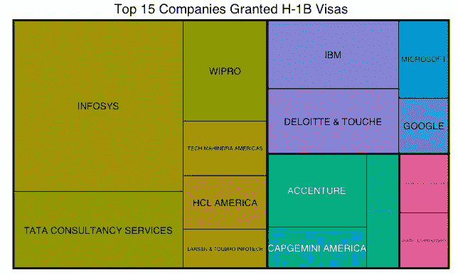
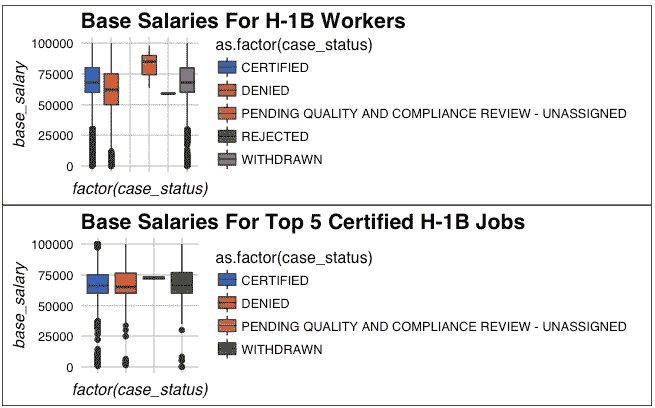

# 数据能帮助你申请 H-1B 签证吗？

> 原文：<https://medium.com/hackernoon/can-data-help-your-h-1b-visa-application-8e065257c42>

*原贴于:*[*【https://www.datacamp.com/community/blog/data-h1b-visa】*](https://www.datacamp.com/community/blog/data-h1b-visa)

如果你想获得 H-1B 签证，你应该在 3 月份通过位于纽约市的印度外包公司获得签证认证，雇佣程序员分析师，支付超过 75，000 美元的基本工资。或者至少，这是对来自 [h1bdata.info](http://h1bdata.info/) 的数据的分析所表明的。

在当选总统唐纳德·川普的竞选活动中，非法移民是中心问题，废除 H-1B 签证的声音和对 H-1B 签证改革程度的猜测越来越强烈，不仅在美国，在印度也是如此。距离唐纳德·川普就任美国第 45 任总统还有 15 天，现在是时候看看过去几年已经认证的 H-1B 签证了。

第一个发现是，获得签证的前 15 家公司大多是外包公司。尤其是总部设在印度的公司，如 InfoSys、Tata Consultancy Services 和 Wipro，占据了大部分份额:

其他印度外包公司，如 Tech Mahindra Americas，总部设在其他国家的公司，如埃森哲，总部设在美国的外包公司，如 Cognizant Tech Solutions，或其他总部设在美国的公司，如德勤，通常较少依赖 H1-B 员工。

这与其他消息来源非常一致，即如果 H-1B 改革通过，外包公司将是第一个接受更严格审查的公司。这些公司显然是所谓的“低垂的果实”:它们充分利用了当前的 H-1B 政策。然而，即使实施任何改革，仍然会对总部设在美国的其他 6 家公司产生影响。

但是，这不是外包与其他公司的问题，这 15 家拥有 H-1B 认证工人的公司表明，技术行业将受到影响:这些是信息技术或技术公司的名称。

抛开对行业的影响不谈，数据还显示，该州人口越多，需要 H-1B 签证的工作机会就越多:大多数申请人位于加利福尼亚州、新泽西州、纽约州和得克萨斯州。分析中突出的城市是纽约、休斯顿、亚特兰大、芝加哥和圣何塞。这些州认证最多的工作机会是程序员分析师。接下来是持有 H-1B 签证的软件工程师、计算机程序员、系统分析师和软件开发人员。

有一个问题是 H-1B 是否是一个廉价劳动力项目。数据显示，事实上，被拒绝的 H1B 申请的薪水更低。此外，75，000 美元以上的工资有更好的机会获得认证。乍一看，这似乎不一定适用于上面提到的工作:

很明显，超过 75，000 美元的基本工资对大多数 1B 员工来说是无效的:中位数大约在 60，000 美元以上。将这些工资与可以在 PayScale 等网站上找到的工资相比，这并没有给人一种廉价项目的初步印象。这是需要在进一步分析中解决的问题。

h1bdata.info 数据还表明，三月是 H1B 应用获得认证的高峰。这意味着大部分人在一月份前已经申请了签证。但是，一般来说，申请人不必担心你的 H-1B 申请获得认证:在我们的数据集捕捉到的所有申请中，只有 5.13%没有获得认证。这个比例看起来很高，考虑到这个签证是给特殊职业的工人的(如上所述)，以及[的要求](https://www.uscis.gov/eir/visa-guide/h-1b-specialty-occupation/understanding-h-1b-requirements)，也许确实如此。这肯定是要重新考虑的事情，因为[保护和增加美国就业法案](http://economictimes.indiatimes.com/articleshow/56348677.cms?utm_source=contentofinterest&utm_medium=text&utm_campaign=cppst)似乎证明了取消硕士学位豁免的提议。

下图总结了上述调查结果。它显示了前五名 H-1B 工作的认证签证。不同的颜色表示签证的起始年份，圆圈表示基本工资:

*可以在* [*原帖*](https://www.datacamp.com/community/blog/data-h1b-visa) *中找到传单图。*

研究数据有助于你的 H-1B 应用程序可能会有所帮助，但只是在一定程度上。目前，我们只知道这一点:我们不确定川普和他的政府将如何打击 H-1B 签证，但上面已经给出了一个好主意:外包公司可能是 H-1B 计划改革的第一批解决对象，从更高的层面上说，人口更多的州的科技行业是第一个感受到影响的。此外，对候选人的要求可能会变得更加严格。

你想自己分析数据吗？Ted Kwartler 将通过一系列 R 教程来指导您完成它！敬请期待！

*最初发表于*[T5【www.datacamp.com】](http://www.datacamp.com/community/blog/data-h1b-visa)*。*

> [黑客中午](http://bit.ly/Hackernoon)是黑客如何开始他们的下午。我们是阿妹家庭的一员。我们现在[接受投稿](http://bit.ly/hackernoonsubmission)并乐意[讨论广告&赞助](mailto:partners@amipublications.com)机会。
> 
> 如果你喜欢这个故事，我们推荐你阅读我们的[最新科技故事](http://bit.ly/hackernoonlatestt)和[趋势科技故事](https://hackernoon.com/trending)。直到下一次，不要把世界的现实想当然！

