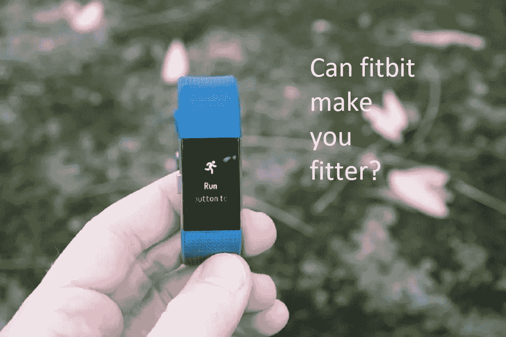
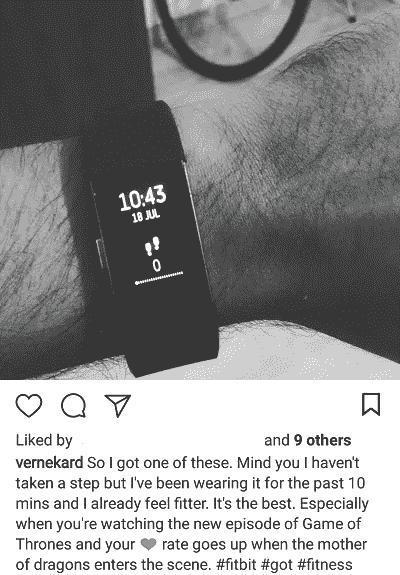
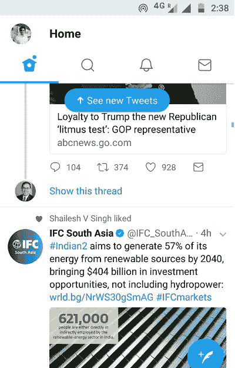
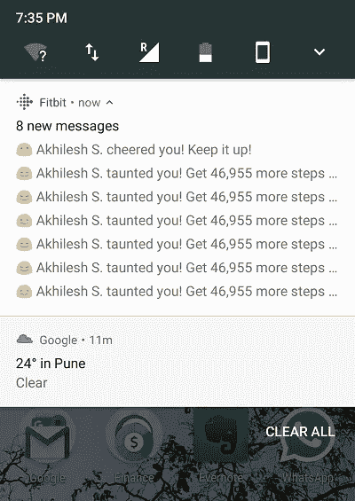
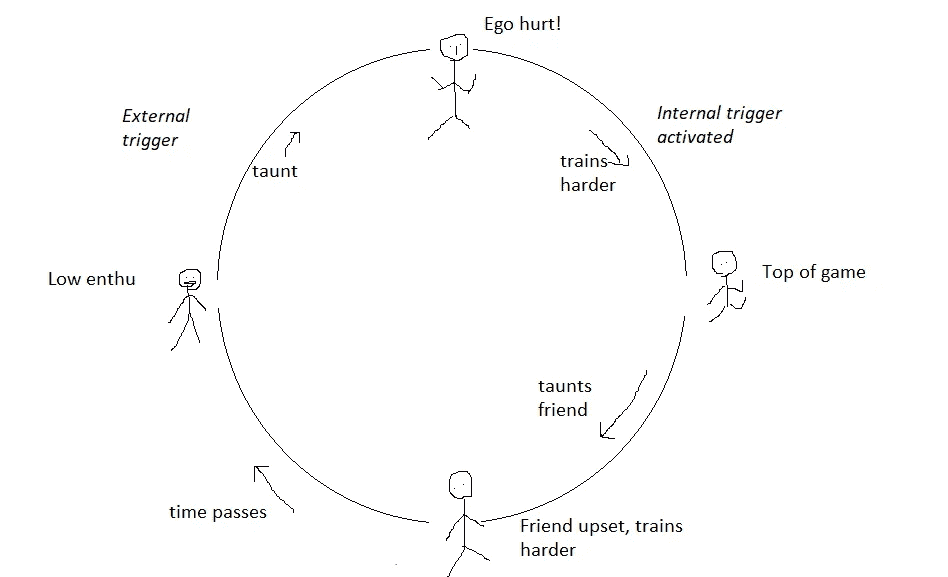

# fitbit 真的能让你变得更健美吗？

> 原文：<https://medium.com/hackernoon/can-fitbit-really-make-you-fitter-99f7da6f0a8e>

Image courtesy: [https://www.dcrainmaker.com/2016/11/fitbit-charge2-review.html](https://www.dcrainmaker.com/2016/11/fitbit-charge2-review.html)

看情况。

年中，一场健身运动吸引了我，我最终决定给自己买一个 fitbit。

软件能够改变你的健身习惯吗？我内心的怪胎说是的，我内心的现实主义者知道改变习惯并不容易。

It makes you feel fitter!

当我第一次安装这个应用程序时，我自己对健身的需求非常高。我已经很久没有参加运动了，我刚刚开始跑步。我想监控我的心率、睡眠周期、步数等等。接下来的几天，我验证了我的步骤，调整了我的睡眠&总体上非常活跃。

Theinterest graph — when trying a new product

One of those odd days when i completed 10,000 steps. Yay!

然而，我的热情慢慢消退了。我平均每天走 4000 步。我不再关心我的睡眠周期。

当我们决定使用一个产品时，有两种类型的触发器——外部触发器和内部触发器。外部触发可以是推送通知、电子邮件消息、强制将您带回产品的重定向广告。内部触发因素——是你头脑中的一个想法，促使你使用产品。例如——使用“拉动刷新”动画——使用产品时的新推文——在您的脑海中植入了查看 twitter 上“新推文”的持续需求。

An idea is planted with ‘see new tweets’

在健身的情况下:
-内部触发——我自己需要变得更健康
-外部触发——app 发送更新这个小时多走/完成 200 步。

由于我的内部触发器不再工作，我需要一个外部触发器。

# 数据本身没有多大价值。除非它能改变习惯

一些最成功的互联网产品迎合了七宗罪之一——骄傲、贪婪、欲望、嫉妒、暴食、愤怒和懒惰

fitbit 的罪恶是骄傲和嫉妒的结合。

我们很羡慕朋友做的步数比我们多。我们为获胜而自豪。Fitbit 利用这些情绪让你变得更加活跃——如果你的朋友在每周的步骤中落后于你，它可以让他们“嘲讽”你。

Taunt — A classic combination of envy and pride.

这是外部触发与内部触发的结合。外部诱因是你的朋友让你紧张。为了避免你的朋友嘲笑，你变得更健康的动力已经增长，这完成了一个 virtuos 循环。

Internal & external triggers combine to give you a sustained enthusiasm & fitness over time

这就是网络的美妙之处。在前面的例子中，如果你失去了动力，你就出局了。然而，在这种情况下，只要只有一个朋友是热情的，这个群体就会保持活跃&因此是健康的。

所以我又回到了订婚圈。随意散步，晚饭后跑步，步行去上班。所有这些都是为了让我和其他 3 个朋友登上排行榜的榜首！

# fitbit 能让你更健康吗？

当然可以。但是就像健身房一样，如果你想让它运转起来，你需要一群朋友来竞争并鼓励你。

附言:

几个其他注意事项:

1.  fitbit 睡眠追踪真的很不错。这是深度睡眠，快速眼动睡眠和浅睡眠的测量方法。
2.  虽然主屏幕很棒，但这款应用还有很多可以改进的地方——好友添加不是预先设置的，所以很多人错过了与朋友竞争的机会，从活动图中消失了。挑战屏幕有很多内容，但没有清晰的 cta。账户标签做得很差——它是一个像 Nike 应用程序一样显示你的累积统计数据和徽章的好地方，但现在它只是一个美化的设置页面。此外，我不会下载另一个应用程序来学习如何训练。
3.  关于 fitbit 的非常好的评测可以在这里找到—[https://www . dcrainmaker . com/2016/11/fitbit-charge 2-review . html](https://www.dcrainmaker.com/2016/11/fitbit-charge2-review.html)

# 如果你喜欢我的文章，请多次点击鼓掌按钮。

At Comic Con, 2 years ago!

*你可以在* [*Twitter*](http://www.twitter.com/vernekard) *或者* [*Linkedin*](http://www.linkedin.com/vernekard) 上关注我