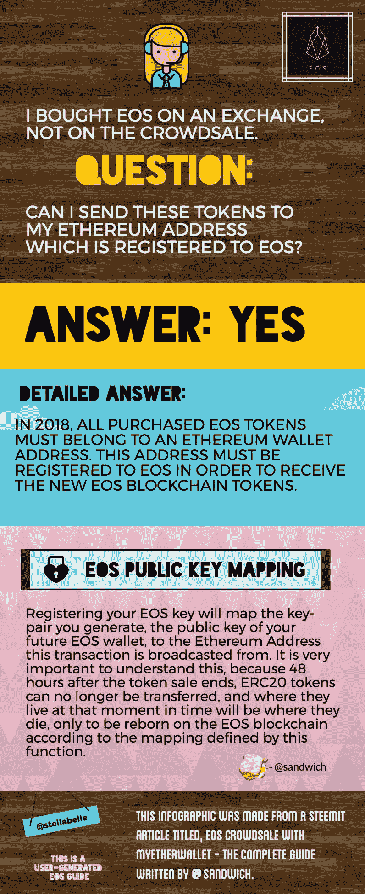

# 我可以把我在交易所购买的 EOS 发送到我注册了 EOS 的以太坊地址吗？

> 原文：<https://medium.com/hackernoon/can-i-send-my-eos-i-bought-on-an-exchange-to-my-ethereum-address-which-is-registered-to-eos-c001e287a0e0>

EOS infographic

许多人都在问这个确切的问题，在网上搜索了几天后，我找不到答案。所以我去了 EOS 电报室，有几个人帮助了我。谢谢模糊！

这张信息图是基于我收到的答案以及 Steemit 网站上一篇精彩的 EOS 指南，作者是[Sandwich](https://medium.com/u/2c23383cdd61?source=post_page-----c001e287a0e0--------------------------------):[https://Steemit . com/EOS/@ Sandwich/contributing-to-EOS-token-sale-with-my ether wallet-and-contract-inner-workings](https://steemit.com/eos/@sandwich/contributing-to-eos-token-sale-with-myetherwallet-and-contract-inner-workings)

就解释 EOS 公钥映射如何工作而言，该指南是最好的，截止日期是 2018 年 6 月 3 日。

围绕 EOS 令牌的[公钥映射有很多困惑，这是理所当然的。大多数人不明白这是怎么回事。在花了整整几天的时间解开这些东西之后，我想我知道如何用一种清晰的方式来解释它。这主要适用于使用 MyEtherWallet 的人。EOS 设置了他们自己的方法，很容易与](https://nadejde.github.io/eos-token-sale/) [Chrome 和 MetaMask](https://eos.io/) 一起使用。然而，并不是每个人都使用 Chrome，因此人们需要了解与 MyEtherWallet 相关的步骤。

## 这是:

EOS 区块链还没有上市，但它将在 2018 年 6 月(这是目标日期)之后上市。这些新的 EOS 令牌将具有特定的功能，并且这些功能将仅在未来的 EOS 区块链上启用。为了获得这些将在未来存在的新的 EOS 区块链令牌，您需要用 EOS 的公钥注册您的以太坊钱包地址。因此，您现在拥有的所有 EOS 都需要放在您向 EOS 注册的那个以太坊钱包中。

你可以这样想:你装着 EOS 代币的以太坊钱包就像一栋房子，有地址。你把你的 EOS 代币放在这房子里。但是未来的 EOS 区块链不知道这房子在哪里。您必须向 EOS 注册您的以太坊钱包地址，以便您可以获得驻留在未来 EOS 区块链上的新 EOS 令牌。

以后拍摄所有 EOS 令牌所有权的快照时，只要你注册了，你持有 EOS 的以太坊钱包就会被包含在这个快照中。当这个快照被拍摄，你将能够要求真正的生活 EOS 区块链令牌。但是只有那些向 EOS 注册了令牌的人才能获得这些新的 EOS 区块链令牌。

因此，已经建立了一个页面，以便为未来的 EOS 区块链生成您的公钥-私钥对。创建它的人说:

> 这将为 EOS 链生成一个私钥和公钥对。密码不是我的。它来自 EOS 团队构建的代码。不同之处在于，它可以在任何不依赖 web3 的浏览器中工作。它可以在任何浏览器中工作，你不需要任何插件。我还删除了除密钥生成位之外的所有内容。

转到这里为 EOS 生成您的公钥-私钥对:[https://nadejde.github.io/eos-token-sale/](https://nadejde.github.io/eos-token-sale/)

就我个人而言，如果我在运行 EOS，我会在拍摄快照的前几天设立一个技术帮助热线，因为我打赌会有相当多的人不明白需要发生什么以及为什么。这些东西相当复杂，因为我们在谈论未来的事件，几乎没有人理解的新技术和目前不存在的区块链的快照。

我很期待 EOS 创造的东西，因为在以太坊上创建智能合约可能是一项意外发生的昂贵努力。我的一个朋友通过众筹购买了价值 35 美元的 EOS，结果在这个过程中不小心花了 12 美元的 ETH 汽油费。ETH 燃气费自动设置得太高，我的朋友不知道她可以手动调整这个数额。