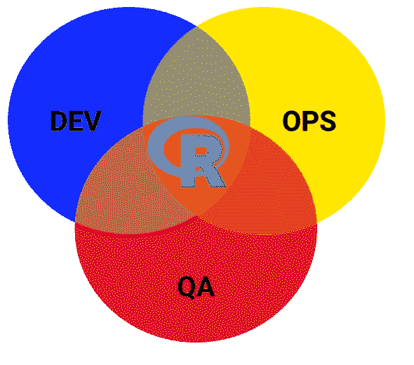

# 我可以在生产中使用 R 吗？

> 原文：<https://medium.com/hackernoon/can-i-use-r-on-production-e1cc4173513e>

*我运行 R 进行生产数据处理的经验*

# 使用 R 的动机

在我当前项目的开始阶段(与此同时，我正在为[数据科学](https://hackernoon.com/tagged/data-science)练习 R 语言，并在一组 [Kagglers](http://www.kaggle.com) 】上使用它)，我决定尝试用 R 语言来处理一些数据处理任务。

虽然最初的挑战是创建一些 ETL 作业(从 Microsoft SQL Server、CSV 和 JSON 文件中提取数据，运行一些清理和转换，并将其推回到 [Google](https://hackernoon.com/tagged/google) Cloud SQL 数据库实例),但我们也看到了其他可能性，例如对数据执行一些探索性分析，并在此基础上创建一些简单的报告。

考虑到这一点，R 和它的生态系统[工具](https://hackernoon.com/tagged/tools)如 [R Markdown](http://rmarkdown.rstudio.com/) 和 [R Shiny](https://shiny.rstudio.com/) 似乎对挑战非常有价值。

# 开局好

所以“我可以在[生产](https://hackernoon.com/tagged/production)上使用 R 吗？”。这是一种关于解释型语言的常见问题(Python 是 R 的自然替代品，另一种语言也是同类批评的目标)。

这个问题的答案很大程度上依赖于您对将要开发的解释型语言的处理。

如果你对这种编程语言的经验仅限于编写 ***脚本*** ，没有日志、没有错误处理、没有单元测试、没有版本控制或 DevOps 实践的基础…那么答案是否定的。你不应该将这种“代码”投入生产。

但是 R(就像 Python 一样)既可以用于 ***脚本*** 开发(您编写用来验证想法或“非实时”数据分析的简单代码)，也可以用于创建更健壮的 ***应用程序*** 。

这篇文章并不打算成为一个教程，但是我已经把我用来编写一些 R 应用程序的一些 R 包(和指南)放在了一起:

*   [日志](http://logging.r-forge.r-project.org/):R 的日志框架
*   [optparse](https://cran.r-project.org/web/packages/optparse/index.html) :处理命令行参数，非常好用。
*   坚持一个代码指南(我正在遵循谷歌的一个:(【https://google.github.io/styleguide/Rguide.xml】)除了节点#1，在同一个 git repos 上，你可以找到几乎所有语言的谷歌风格指南。
*   坚持一致的“工作目录”(例如，在你的项目的根目录下)
*   项目组织:【http://nicercode.github.io/blog/2013-04-05-projects/ 
*   单元测试:[https://cran . R-project . org/web/packages/RUnit/vignettes/RUnit . pdf](https://cran.r-project.org/web/packages/RUnit/vignettes/RUnit.pdf)(还有其他 R 的单元测试框架，但是这个对我来说非常好，我肯定也会看看[https://cran.r-project.org/web/packages/testthat/index.html](https://cran.r-project.org/web/packages/testthat/index.html)

在发布 R 应用程序来处理日常数据之前，您确实应该将这些(类似的)包和标准放在适当的位置。

# 一路上的调度和调优

在编写了数据处理脚本应用程序的一些流程后，您需要让它以某种方式运行。

因为我们完全控制了生产(谷歌云)环境。我们决定使用众所周知的 DevOps **Jenkins** (不是开发人员用来编译系统其他部分的同一个实例，而是一个专用的生产机器)来调度我们的 ETL。

在我们的云环境场景中，Jenkins 的一个很好的特性(除了易于使用的调度和历史控制台)，是我们可以决定在哪里运行特定的作业。默认是在 jenkins(主)机器上运行。但是你可以很容易地设置它在一个更健壮的从机上运行(连接到主服务器的节点)，我们可以使用简单的 [**gcloud**](https://cloud.google.com/compute/docs/gcloud-compute/) 命令按需启动和停止。这给了我们很大的灵活性，并允许我们节省一些基础设施成本(边节点#2:在 Google Compute Engine 上，一个实例的最小费用是 10 分钟，而不是像 AWS 中那样一个完整的小时)。

如果您已经为 R 代码提供了日志记录(如上所述)，那么如果您有一个 Java 作业，那么您应该可以获得相同级别的执行/历史信息。

几周之后，随着处理的流、表和文本文件的数量开始增加(达到每天 30 GB 左右)，我们不得不开始做一些调整，以保持我们的作业快速运行。

这些是真正提升应用程序性能的关键变化:

1.  使用 data.table 代替 data.frames(它们要快得多)，也使用 data.table 特定的方法来读写文件——fread 和 fwrite，只需检查 [docs](https://cran.r-project.org/web/packages/data.table/data.table.pdf) 。
2.  更改您的 SQL 连接层，以便在数据库中批量插入数据，在每个 execute 语句中发送一个值列表(查看这篇 [stackoverflow 帖子](http://stackoverflow.com/questions/6889065/inserting-multiple-rows-in-mysql)中的示例)。
3.  在一些涉及不同 JSON 解析库的测试之后， [jsonlite](https://cran.r-project.org/web/packages/jsonlite/index.html) 已经很好地满足了我们的需求(比 rjson 更快)。

# 结论

r 在生产环境中工作得很好，正如您所期望的 Python 一样。这实际上是一个工程工作的问题，以确保您正在推动应用程序，而不是幼稚的脚本，来处理真实的用户数据。

在本文中，我不打算讨论“R vs Python ”,但是当然，语言的决定应该在很大程度上取决于项目挑战和你的团队的技能，但是我希望至少给你另一个选择:d。

> [黑客中午](http://bit.ly/Hackernoon)是黑客如何开始他们的下午。我们是 [@AMI](http://bit.ly/atAMIatAMI) 家庭的一员。我们现在[接受投稿](http://bit.ly/hackernoonsubmission)并乐意[讨论广告&赞助](mailto:partners@amipublications.com)机会。
> 
> 如果你喜欢这个故事，我们推荐你阅读我们的[最新科技故事](http://bit.ly/hackernoonlatestt)和[趋势科技故事](https://hackernoon.com/trending)。直到下一次，不要把世界的现实想当然！

